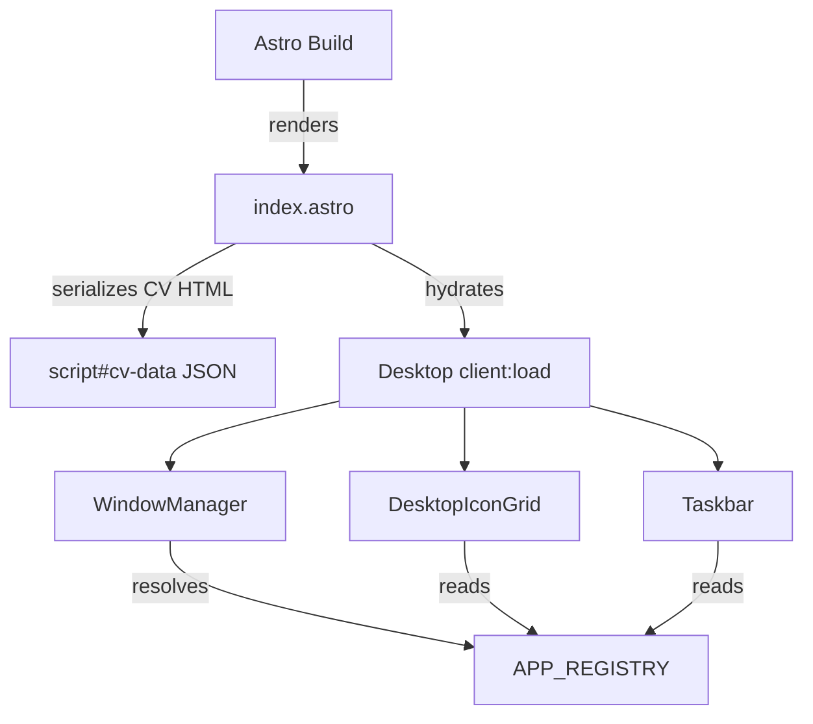

# Knowledge Base & Learning System — Implementation Plan

> **For agentic workers:** REQUIRED SUB-SKILL: Use superpowers:subagent-driven-development (recommended) or superpowers:executing-plans to implement this plan task-by-task. Steps use checkbox (`- [ ]`) syntax for tracking.

**Goal:** Build a comprehensive learning system for the platform — interactive architecture explorer, deep-reading articles, and a desktop Library app — that grows with every new feature.

**Architecture:** New Astro content collection (`knowledge`) with rich frontmatter → static `/learn/*` routes with a reading-optimized layout → two new desktop apps (Library + Architecture Explorer) registered via the standard `registerApp()` pattern → process integration into feature development workflow.

**Tech Stack:** Astro content collections, SolidJS (explorer + library apps), rehype-mermaid + mermaid (diagram rendering), 98.css (desktop apps), vanilla CSS (learn layout).

**Spec:** `docs/features/knowledge-base.md`

**Content Authorship:** The human developer wants to be involved in writing knowledge articles. Two modes:
- **Collaborative mode (default for architecture docs):** Have a conversation about the concepts — explain, ask questions, discuss — then distill into a markdown doc together. Do NOT silently generate architecture articles.
- **Fast mode (for technology/feature docs):** Generate comprehensive drafts. The developer reviews and edits. Use this when the developer says "just draft it" or for factual/reference content.
- **Always ask** before writing content for Task 11 (initial articles). For seed content in Task 3, generate drafts since they're needed to test the infrastructure.

**Codebase Orientation:** Before starting implementation, read these files to understand existing patterns:
- `AGENTS.md` — project rules, non-discoverable conventions
- `src/components/desktop/apps/app-manifest.ts` — how apps are registered (follow this exact pattern)
- `src/components/desktop/apps/BrowserApp.tsx` — reference toolbar + iframe pattern for LibraryApp
- `src/components/desktop/apps/ExplorerApp.tsx` — reference toolbar pattern
- `src/content.config.ts` — existing content collection pattern to follow
- `src/pages/index.astro` — how CV data is serialized (follow for knowledge-index)

**Linter/TypeScript Strictness:** This project enforces strict rules that will bite you:
- `useExplicitType: "error"` (biome nursery) — every function needs an explicit return type
- `verbatimModuleSyntax: true` — use `import type { X }` for type-only imports
- `noPropertyAccessFromIndexSignature: true` — use bracket notation on `Record<string, X>` types
- `noImplicitBoolean: "error"` — write `disabled={true}` not just `disabled`
- Always run `pnpm verify` (biome check + astro check + vitest) before committing

**Spec vs Plan Schema Difference (intentional):** The spec uses `.optional()` for array frontmatter fields. The plan uses `.default([])` instead — this is a deliberate improvement that avoids `undefined` checks everywhere. Do NOT "fix" this to match the spec.

---

## File Map

### New Files

```
src/content/knowledge/                          ← new content collection
├── architecture/
│   ├── overview.md                             ← seed content
│   ├── window-manager.md                       ← seed content
│   └── app-registry.md                         ← seed content
├── concepts/
│   └── fine-grained-reactivity.md              ← seed content
└── technologies/
    └── solidjs.md                              ← seed content

src/content.config.ts                           ← MODIFY: add knowledge collection

src/layouts/LearnLayout.astro                   ← new reading-optimized layout
src/styles/learn.css                            ← new learn page styles

src/pages/learn/
├── index.astro                                 ← knowledge index page
└── [...slug].astro                             ← dynamic article pages

src/components/desktop/apps/library/
├── LibraryApp.tsx                              ← iframe browser + toolbar
├── LibraryToolbar.tsx                          ← address bar, nav, new tab
├── LibraryTreeView.tsx                         ← 98.css tree index
└── styles/
    └── library-app.css

src/components/desktop/apps/architecture-explorer/
├── ArchitectureExplorer.tsx                    ← main app component
├── architecture-data.ts                        ← nodes, edges, layers
├── ExplorerCanvas.tsx                          ← SVG rendering + pan/zoom
├── ExplorerNode.tsx                            ← clickable SVG node
├── ExplorerEdge.tsx                            ← animated SVG edge
├── ExplorerPanel.tsx                           ← slide-in detail panel
├── LayerToggle.tsx                             ← edge type visibility
└── styles/
    └── architecture-explorer.css

src/components/desktop/apps/app-manifest.ts     ← MODIFY: add 2 registrations

public/icons/library_icon.png                   ← new 32×32 pixel-art icon
public/icons/blueprint_icon.png                 ← new 32×32 pixel-art icon

astro.config.mjs                                ← MODIFY: add rehype-mermaid config

docs/feature-development.md                     ← MODIFY: add Knowledge Entries section
AGENTS.md                                       ← MODIFY: add knowledgebase rules
```

---

## Phase 1: Content Foundation

### Task 1: Install Dependencies

**Files:**
- Modify: `package.json`
- Modify: `astro.config.mjs`

- [ ] **Step 1: Install mermaid packages**

```bash
pnpm add rehype-mermaid mermaid
```

`rehype-mermaid` processes mermaid code blocks in markdown. With `strategy: 'pre-mermaid'` it outputs `<pre class="mermaid">` elements that the `mermaid` client library renders. No Playwright dependency needed.

- [ ] **Step 2: Configure rehype-mermaid in Astro config**

In `astro.config.mjs`, add the rehype plugin to markdown config:

```javascript
// @ts-check

import node from '@astrojs/node';
import solidJs from '@astrojs/solid-js';
import rehypeMermaid from 'rehype-mermaid';
import { defineConfig } from 'astro/config';

export default defineConfig({
  adapter: node({ mode: 'standalone' }),
  integrations: [solidJs()],
  markdown: {
    rehypePlugins: [
      [rehypeMermaid, { strategy: 'pre-mermaid' }],
    ],
  },
});
```

- [ ] **Step 3: Verify build still works**

```bash
pnpm build
```

Expected: Build succeeds. No existing pages affected since no markdown currently contains mermaid blocks.

- [ ] **Step 4: Commit**

```bash
git add package.json pnpm-lock.yaml astro.config.mjs
git commit -m "feat(knowledge): install rehype-mermaid and mermaid dependencies"
```

---

### Task 2: Add Knowledge Content Collection Schema

**Files:**
- Modify: `src/content.config.ts`

- [ ] **Step 1: Add the knowledge collection to content config**

The existing file defines only the `cv` collection. Add `knowledge` alongside it. Follow the exact same pattern — `glob` loader + Zod schema:

```typescript
import { defineCollection, z } from 'astro:content';
import { glob } from 'astro/loaders';

const cv = defineCollection({
  loader: glob({ pattern: '**/*.md', base: './src/content/cv' }),
  schema: z.object({
    title: z.string(),
    order: z.number(),
  }),
});

const knowledge = defineCollection({
  loader: glob({ pattern: '**/*.md', base: './src/content/knowledge' }),
  schema: z.object({
    title: z.string(),
    category: z.enum(['architecture', 'concept', 'technology', 'feature']),
    summary: z.string(),
    difficulty: z.enum(['beginner', 'intermediate', 'advanced']).optional(),
    relatedConcepts: z.array(z.string()).default([]),
    relatedFiles: z.array(z.string()).default([]),
    technologies: z.array(z.string()).default([]),
    externalReferences: z
      .array(
        z.object({
          title: z.string(),
          url: z.string(),
          type: z.enum(['article', 'video', 'docs', 'talk', 'repo']),
        }),
      )
      .default([]),
    diagramRef: z.string().optional(),
    order: z.number().optional(),
    dateAdded: z.date().optional(),
    lastUpdated: z.date().optional(),
  }),
});

export const collections: Record<string, ReturnType<typeof defineCollection>> = { cv, knowledge };
```

Key details:
- Array fields use `.default([])` not `.optional()` — avoids `undefined` checks everywhere, arrays are always present.
- `category` is an enum — validated at build time.
- `relatedConcepts` stores slugs (e.g., `fine-grained-reactivity`) — these will be validated manually by convention (not by Zod, since cross-collection references aren't natively supported).

- [ ] **Step 2: Verify typecheck passes**

```bash
pnpm typecheck
```

Expected: No new errors. The collection exists but has no content yet — that's fine, glob returns empty.

- [ ] **Step 3: Commit**

```bash
git add src/content.config.ts
git commit -m "feat(knowledge): add knowledge content collection schema"
```

---

### Task 3: Create Seed Content (3 Architecture Docs)

**Files:**
- Create: `src/content/knowledge/architecture/overview.md`
- Create: `src/content/knowledge/architecture/window-manager.md`
- Create: `src/content/knowledge/architecture/app-registry.md`

These are the first three articles. They should be real, useful content — not placeholders. Each doc follows the frontmatter schema from Task 2.

- [ ] **Step 1: Create the directories**

```bash
mkdir -p src/content/knowledge/architecture src/content/knowledge/concepts src/content/knowledge/technologies src/content/knowledge/features
```

- [ ] **Step 2: Create `architecture/overview.md`**

This is the "Big Picture" article — the first thing to read. Should cover:
- The three-layer architecture (Astro static shell → SolidJS island → App Registry)
- How data flows from Markdown through build time to client-side rendering
- Why a single SolidJS island (not multiple)
- The role of 98.css vs custom CSS
- A Mermaid diagram showing the high-level architecture

Frontmatter:

```yaml
---
title: "The Big Picture"
category: architecture
summary: "How Astro, SolidJS, 98.css, and the app registry work together to create a Win95 desktop in the browser."
difficulty: beginner
relatedConcepts:
  - fine-grained-reactivity
  - islands-architecture
technologies:
  - solidjs
  - astro
  - 98css
diagramRef: "overview"
order: 1
dateAdded: 2026-04-20
---
```

Content should be ~1000-1500 words. Include a mermaid diagram:

````markdown

````

- [ ] **Step 3: Create `architecture/window-manager.md`**

Covers: WindowState interface, drag via pointer events + capture, z-index stacking, cascade positioning, maximize/restore, mobile responsive behavior.

Frontmatter:

```yaml
---
title: "How Windows Work"
category: architecture
summary: "The window manager — drag, resize, focus, z-index stacking, and the pointer event model that makes it all work."
difficulty: intermediate
relatedConcepts:
  - pointer-events-and-capture
  - compositor-pattern
  - fine-grained-reactivity
relatedFiles:
  - src/components/desktop/Window.tsx
  - src/components/desktop/TitleBar.tsx
  - src/components/desktop/store/desktop-store.ts
  - src/components/desktop/store/types.ts
technologies:
  - solidjs
diagramRef: "window-manager"
order: 2
dateAdded: 2026-04-20
---
```

- [ ] **Step 4: Create `architecture/app-registry.md`**

Covers: AppRegistryEntry interface, registerApp() function, how desktop icons/start menu/terminal all read from the registry, the lazy() + Suspense pattern, how to add a new app.

Frontmatter:

```yaml
---
title: "The Registry Pattern"
category: architecture
summary: "How registerApp() makes one function call wire an app into the desktop, start menu, terminal, and window manager."
difficulty: beginner
relatedConcepts:
  - inversion-of-control
  - lazy-loading-and-code-splitting
relatedFiles:
  - src/components/desktop/apps/registry.ts
  - src/components/desktop/apps/app-manifest.ts
  - src/components/desktop/WindowManager.tsx
  - src/components/desktop/DesktopIconGrid.tsx
  - src/components/desktop/StartMenu.tsx
technologies:
  - solidjs
diagramRef: "app-registry"
order: 3
dateAdded: 2026-04-20
---
```

- [ ] **Step 5: Verify build with new content**

```bash
pnpm build
```

Expected: Build succeeds. Content collection picks up the new files and validates frontmatter.

- [ ] **Step 6: Commit**

```bash
git add src/content/knowledge/
git commit -m "feat(knowledge): add seed architecture docs (overview, window-manager, app-registry)"
```

---

### Task 4: Create the Learn Layout

**Files:**
- Create: `src/layouts/LearnLayout.astro`
- Create: `src/styles/learn.css`

The reading layout is intentionally separate from `BaseLayout.astro`. No 98.css, no CRT frame. Clean, modern, readable — but retro-flavored.

- [ ] **Step 1: Create `src/styles/learn.css`**

Styles for the learn layout. Key requirements:
- Sidebar (fixed left, ~250px) with category navigation
- Main content area (flexible, max-width ~800px for readability)
- Responsive — sidebar collapses to hamburger on mobile
- Typography: good line-height (1.7), readable font size (16-18px), max-width for line length
- Code blocks with monospace font and subtle background
- Retro flavor: teal accent color (#008080, matches desktop bg), subtle pixelated font for headings optionally

```css
/* Learn layout — reading-optimized, NOT 98.css */

*,
*::before,
*::after {
  box-sizing: border-box;
}

:root {
  --learn-bg: #fafaf8;
  --learn-text: #1a1a1a;
  --learn-heading: #000080;
  --learn-accent: #008080;
  --learn-sidebar-bg: #f0f0ec;
  --learn-sidebar-width: 260px;
  --learn-code-bg: #f5f5f0;
  --learn-border: #d0d0c8;
  --learn-link: #0000cc;
  --learn-max-content: 780px;
}

html, body {
  margin: 0;
  padding: 0;
  background: var(--learn-bg);
  color: var(--learn-text);
  font-family: Georgia, 'Times New Roman', serif;
  font-size: 17px;
  line-height: 1.7;
}

/* Top nav bar */
.learn-nav {
  position: sticky;
  top: 0;
  z-index: 100;
  display: flex;
  align-items: center;
  justify-content: space-between;
  padding: 8px 24px;
  background: var(--learn-accent);
  color: #fff;
  font-family: Arial, Helvetica, sans-serif;
  font-size: 14px;
  border-bottom: 2px solid #006060;
}

.learn-nav a {
  color: #fff;
  text-decoration: none;
}

.learn-nav a:hover {
  text-decoration: underline;
}

.learn-nav__title {
  font-weight: 700;
  font-size: 16px;
}

/* Page layout */
.learn-page {
  display: flex;
  min-height: calc(100vh - 42px);
}

/* Sidebar */
.learn-sidebar {
  position: sticky;
  top: 42px;
  width: var(--learn-sidebar-width);
  height: calc(100vh - 42px);
  overflow-y: auto;
  padding: 20px 16px;
  background: var(--learn-sidebar-bg);
  border-right: 1px solid var(--learn-border);
  flex-shrink: 0;
  font-family: Arial, Helvetica, sans-serif;
  font-size: 14px;
}

.learn-sidebar h3 {
  font-size: 12px;
  text-transform: uppercase;
  letter-spacing: 0.05em;
  color: #666;
  margin: 20px 0 8px;
}

.learn-sidebar h3:first-child {
  margin-top: 0;
}

.learn-sidebar ul {
  list-style: none;
  margin: 0;
  padding: 0;
}

.learn-sidebar li {
  margin: 2px 0;
}

.learn-sidebar a {
  display: block;
  padding: 4px 8px;
  color: var(--learn-text);
  text-decoration: none;
  border-radius: 3px;
}

.learn-sidebar a:hover {
  background: #e0e0d8;
}

.learn-sidebar a.active {
  background: var(--learn-accent);
  color: #fff;
}

/* Main content */
.learn-content {
  flex: 1;
  max-width: var(--learn-max-content);
  margin: 0 auto;
  padding: 40px 32px;
}

.learn-content h1 {
  font-size: 32px;
  color: var(--learn-heading);
  margin: 0 0 8px;
  line-height: 1.2;
}

.learn-content__summary {
  font-size: 18px;
  color: #555;
  font-style: italic;
  margin: 0 0 32px;
  padding-bottom: 20px;
  border-bottom: 1px solid var(--learn-border);
}

.learn-content h2 {
  font-size: 24px;
  color: var(--learn-heading);
  margin: 40px 0 12px;
  padding-bottom: 4px;
  border-bottom: 1px solid var(--learn-border);
}

.learn-content h3 {
  font-size: 20px;
  color: var(--learn-text);
  margin: 28px 0 8px;
}

.learn-content a {
  color: var(--learn-link);
}

.learn-content code {
  font-family: 'Courier New', Courier, monospace;
  font-size: 15px;
  background: var(--learn-code-bg);
  padding: 2px 5px;
  border-radius: 3px;
}

.learn-content pre {
  background: #2d2d2d;
  color: #f8f8f2;
  padding: 16px 20px;
  border-radius: 4px;
  overflow-x: auto;
  font-size: 14px;
  line-height: 1.5;
  margin: 16px 0;
}

.learn-content pre code {
  background: none;
  padding: 0;
  font-size: 14px;
  color: inherit;
}

/* Mermaid diagrams — rendered client-side */
.learn-content pre.mermaid {
  background: #fff;
  text-align: center;
  padding: 20px;
  border: 1px solid var(--learn-border);
}

/* Difficulty badge */
.learn-badge {
  display: inline-block;
  padding: 2px 8px;
  border-radius: 3px;
  font-family: Arial, Helvetica, sans-serif;
  font-size: 12px;
  font-weight: 600;
  text-transform: uppercase;
  letter-spacing: 0.03em;
}

.learn-badge--beginner { background: #d4edda; color: #155724; }
.learn-badge--intermediate { background: #fff3cd; color: #856404; }
.learn-badge--advanced { background: #f8d7da; color: #721c24; }

/* Related section */
.learn-related {
  margin-top: 48px;
  padding-top: 24px;
  border-top: 2px solid var(--learn-border);
  font-family: Arial, Helvetica, sans-serif;
  font-size: 15px;
}

.learn-related h2 {
  font-size: 18px;
  border-bottom: none;
  margin: 0 0 12px;
}

.learn-related ul {
  padding-left: 20px;
}

.learn-related li {
  margin: 4px 0;
}

/* External references */
.learn-external {
  margin-top: 24px;
}

.learn-external__item {
  display: flex;
  align-items: center;
  gap: 8px;
  margin: 6px 0;
}

.learn-external__type {
  font-size: 12px;
  font-weight: 600;
  text-transform: uppercase;
  color: #666;
  min-width: 50px;
}

/* Mobile responsive */
@media (max-width: 768px) {
  .learn-sidebar {
    display: none;
  }

  .learn-content {
    padding: 24px 16px;
  }

  .learn-content h1 {
    font-size: 26px;
  }
}
```

- [ ] **Step 2: Create `src/layouts/LearnLayout.astro`**

```astro
---
interface Props {
  title: string;
  description?: string;
}

const { title, description = 'Knowledge Base — Retro CV Platform' } = Astro.props;
---

<!doctype html>
<html lang="en">
  <head>
    <meta charset="utf-8" />
    <meta name="viewport" content="width=device-width, initial-scale=1" />
    <meta name="description" content={description} />
    <link rel="icon" type="image/svg+xml" href="/favicon.svg" />
    <title>{title} — Knowledge Base</title>
  </head>
  <body>
    <nav class="learn-nav">
      <a href="/learn" class="learn-nav__title">📚 Knowledge Base</a>
      <a href="/">← Back to Desktop</a>
    </nav>
    <slot />
  </body>
</html>

<style is:global>
  @import '../styles/learn.css';
</style>

<script>
  // Initialize Mermaid for client-side diagram rendering
  import mermaid from 'mermaid';
  mermaid.initialize({
    startOnLoad: true,
    theme: 'neutral',
    securityLevel: 'loose',
  });
</script>
```

Key details:
- No 98.css import — clean layout.
- Mermaid init script: `rehype-mermaid` with `strategy: 'pre-mermaid'` outputs `<pre class="mermaid">` blocks. The client-side mermaid library picks them up via `startOnLoad: true`.
- This layout is only used by `/learn/*` routes — doesn't affect the desktop.

- [ ] **Step 3: Verify build**

```bash
pnpm build
```

Expected: Build succeeds. Layout exists but no pages use it yet.

- [ ] **Step 4: Commit**

```bash
git add src/layouts/LearnLayout.astro src/styles/learn.css
git commit -m "feat(knowledge): add reading-optimized learn layout with mermaid support"
```

---

### Task 5: Create Learn Routes

**Files:**
- Create: `src/pages/learn/index.astro`
- Create: `src/pages/learn/[...slug].astro`

- [ ] **Step 1: Create the index page `src/pages/learn/index.astro`**

```astro
---
import { getCollection } from 'astro:content';
import LearnLayout from '../../layouts/LearnLayout.astro';

export const prerender = true;

interface KnowledgeEntry {
  id: string;
  data: {
    title: string;
    category: string;
    summary: string;
    difficulty?: string;
    order?: number;
  };
}

const entries = (await getCollection('knowledge')) as KnowledgeEntry[];

const categories: Record<string, KnowledgeEntry[]> = {};
for (const entry of entries) {
  const cat = entry.data.category;
  if (!categories[cat]) {
    categories[cat] = [];
  }
  categories[cat].push(entry);
}

// Sort each category by order, then title
for (const cat of Object.keys(categories)) {
  categories[cat].sort((a, b) => (a.data.order ?? 99) - (b.data.order ?? 99));
}

const categoryOrder = ['architecture', 'concept', 'technology', 'feature'];
const categoryLabels: Record<string, string> = {
  architecture: '🏗️ Architecture',
  concept: '💡 Concepts',
  technology: '🔧 Technologies',
  feature: '✨ Features',
};

const startHere = [
  'architecture/overview',
  'technologies/solidjs',
  'architecture/window-manager',
  'architecture/app-registry',
];
---

<LearnLayout title="Knowledge Base">
  <div class="learn-page">
    <aside class="learn-sidebar">
      <h3>Categories</h3>
      <ul>
        {categoryOrder.map((cat) => (
          <li><a href={`#${cat}`}>{categoryLabels[cat]}</a></li>
        ))}
      </ul>
    </aside>

    <main class="learn-content">
      <h1>Knowledge Base</h1>
      <p class="learn-content__summary">
        Everything about how this platform works — the architecture, the technologies, the patterns, and the decisions behind them.
      </p>

      <h2>🚀 Start Here</h2>
      <p>Recommended reading order to understand the system top-to-bottom:</p>
      <ol>
        {startHere.map((slug, i) => {
          const entry = entries.find((e) => e.id === slug);
          return entry ? (
            <li>
              <a href={`/learn/${entry.id}`}>{entry.data.title}</a>
              {' — '}<em>{entry.data.summary}</em>
            </li>
          ) : null;
        })}
      </ol>

      {categoryOrder.map((cat) => {
        const items = categories[cat];
        if (!items?.length) return null;
        return (
          <>
            <h2 id={cat}>{categoryLabels[cat]}</h2>
            <ul>
              {items.map((entry) => (
                <li>
                  <a href={`/learn/${entry.id}`}>{entry.data.title}</a>
                  {entry.data.difficulty && (
                    <span class={`learn-badge learn-badge--${entry.data.difficulty}`}>
                      {entry.data.difficulty}
                    </span>
                  )}
                  <br />
                  <em>{entry.data.summary}</em>
                </li>
              ))}
            </ul>
          </>
        );
      })}
    </main>
  </div>
</LearnLayout>
```

- [ ] **Step 2: Create the article page `src/pages/learn/[...slug].astro`**

This is a catch-all route that renders any knowledge entry by its full slug (e.g., `architecture/overview`).

```astro
---
import { getCollection } from 'astro:content';
import LearnLayout from '../../layouts/LearnLayout.astro';

export const prerender = true;

interface KnowledgeEntry {
  id: string;
  data: {
    title: string;
    category: string;
    summary: string;
    difficulty?: string;
    relatedConcepts: string[];
    relatedFiles: string[];
    technologies: string[];
    externalReferences: Array<{ title: string; url: string; type: string }>;
    order?: number;
  };
  rendered?: { html: string };
  body?: string;
}

export async function getStaticPaths() {
  const entries = await getCollection('knowledge');
  return entries.map((entry) => ({
    params: { slug: entry.id },
    props: { entry },
  }));
}

const { entry } = Astro.props as { entry: KnowledgeEntry };

const allEntries = (await getCollection('knowledge')) as KnowledgeEntry[];

// Build sidebar navigation grouped by category
const categories: Record<string, KnowledgeEntry[]> = {};
for (const e of allEntries) {
  const cat = e.data.category;
  if (!categories[cat]) {
    categories[cat] = [];
  }
  categories[cat].push(e);
}
for (const cat of Object.keys(categories)) {
  categories[cat].sort((a, b) => (a.data.order ?? 99) - (b.data.order ?? 99));
}

const categoryOrder = ['architecture', 'concept', 'technology', 'feature'];
const categoryLabels: Record<string, string> = {
  architecture: 'Architecture',
  concept: 'Concepts',
  technology: 'Technologies',
  feature: 'Features',
};

const typeIcons: Record<string, string> = {
  article: '📄',
  video: '🎥',
  docs: '📚',
  talk: '🎤',
  repo: '💻',
};

// Resolve related concepts to actual entries
const relatedEntries = entry.data.relatedConcepts
  .map((slug: string) => allEntries.find((e) => e.id === slug || e.id.endsWith(`/${slug}`)))
  .filter((e): e is KnowledgeEntry => e !== undefined);

const html = entry.rendered?.html ?? entry.body ?? '';
---

<LearnLayout title={entry.data.title}>
  <div class="learn-page">
    <aside class="learn-sidebar">
      {categoryOrder.map((cat) => {
        const items = categories[cat];
        if (!items?.length) return null;
        return (
          <>
            <h3>{categoryLabels[cat]}</h3>
            <ul>
              {items.map((e) => (
                <li>
                  <a
                    href={`/learn/${e.id}`}
                    class={e.id === entry.id ? 'active' : ''}
                  >
                    {e.data.title}
                  </a>
                </li>
              ))}
            </ul>
          </>
        );
      })}
    </aside>

    <main class="learn-content">
      <h1>{entry.data.title}</h1>
      {entry.data.difficulty && (
        <span class={`learn-badge learn-badge--${entry.data.difficulty}`}>
          {entry.data.difficulty}
        </span>
      )}
      <p class="learn-content__summary">{entry.data.summary}</p>

      <article set:html={html} />

      <section class="learn-related">
        {relatedEntries.length > 0 && (
          <>
            <h2>📎 Related Concepts</h2>
            <ul>
              {relatedEntries.map((e) => (
                <li><a href={`/learn/${e.id}`}>{e.data.title}</a> — {e.data.summary}</li>
              ))}
            </ul>
          </>
        )}

        {entry.data.relatedFiles.length > 0 && (
          <>
            <h2>📁 Source Files</h2>
            <ul>
              {entry.data.relatedFiles.map((f: string) => (
                <li><code>{f}</code></li>
              ))}
            </ul>
          </>
        )}

        {entry.data.externalReferences.length > 0 && (
          <div class="learn-external">
            <h2>🔗 External References</h2>
            {entry.data.externalReferences.map((ref) => (
              <div class="learn-external__item">
                <span class="learn-external__type">{typeIcons[ref.type] ?? '📄'} {ref.type}</span>
                <a href={ref.url} target="_blank" rel="noopener noreferrer">{ref.title}</a>
              </div>
            ))}
          </div>
        )}
      </section>
    </main>
  </div>
</LearnLayout>
```

- [ ] **Step 3: Run the dev server and verify pages render**

```bash
pnpm dev
```

Visit:
- `http://localhost:4321/learn` — should show index with seed articles
- `http://localhost:4321/learn/architecture/overview` — should render the article with sidebar, related links, and mermaid diagram

- [ ] **Step 4: Run full verification**

```bash
pnpm verify
```

Expected: lint + typecheck + tests all pass.

- [ ] **Step 5: Commit**

```bash
git add src/pages/learn/
git commit -m "feat(knowledge): add /learn index and article routes"
```

---

## Phase 2: Desktop Integration — Library App

### Task 6: Create Pixel-Art Icons

**Files:**
- Create: `public/icons/library_icon.png`
- Create: `public/icons/blueprint_icon.png`

- [ ] **Step 1: Create library icon (32×32)**

A pixel-art book or help icon — retro Win95 style. Should be 32×32 PNG with transparent background and the chunky pixel aesthetic matching the existing icons (browser_icon.png, folder_icon.png, etc.). Think: Win95 Help book (yellow pages with question mark) or a small bookshelf.

Approach options (in preference order):
1. **Download a retro icon** from a free Win95 icon pack (e.g., [win95icons.com](https://win95icons.com), [iconarchive.com](https://iconarchive.com)) and save as 32×32 PNG
2. **Generate with an image tool** if available in the environment
3. **Create a simple placeholder** using ImageMagick: `convert -size 32x32 xc:transparent -fill '#c0c000' -draw 'rectangle 4,4 28,28' -fill '#000080' -draw 'rectangle 6,6 26,26' public/icons/library_icon.png` (a rough book shape — replace later with proper pixel art)

The desktop grid renders icons at 48×48 via CSS `image-rendering: pixelated`, so 32×32 source is fine.

- [ ] **Step 2: Create architecture explorer icon (32×32)**

A pixel-art blueprint or circuit/map icon. Think: Win95 Network Neighborhood or a blueprint grid. Save to `public/icons/blueprint_icon.png`.

- [ ] **Step 3: Verify icons display correctly**

Temporarily add to an existing page or check via browser at `/icons/library_icon.png`. Should be pixelated, clean, and match the style of existing icons.

- [ ] **Step 4: Commit**

```bash
git add public/icons/library_icon.png public/icons/blueprint_icon.png
git commit -m "feat(knowledge): add pixel-art icons for library and architecture explorer"
```

---

### Task 7: Build the Library App

**Files:**
- Create: `src/components/desktop/apps/library/LibraryApp.tsx`
- Create: `src/components/desktop/apps/library/LibraryToolbar.tsx`
- Create: `src/components/desktop/apps/library/LibraryTreeView.tsx`
- Create: `src/components/desktop/apps/library/styles/library-app.css`
- Modify: `src/components/desktop/apps/app-manifest.ts`

- [ ] **Step 1: Create `library-app.css`**

```css
/* LibraryApp — embedded browser for /learn/* content */

.library-app {
  display: flex;
  flex-direction: column;
  height: 100%;
  margin: -8px;
}

/* Toolbar */
.library-toolbar {
  background-color: #c0c0c0;
  padding: 2px 4px;
  border-bottom: 1px solid #808080;
  flex-shrink: 0;
}

.library-toolbar__buttons {
  display: flex;
  gap: 2px;
  margin-bottom: 2px;
}

.library-toolbar__buttons button {
  font-size: 12px;
  min-width: 50px;
  min-height: 22px;
  padding: 1px 6px;
}

.library-toolbar__address {
  display: flex;
  align-items: center;
  gap: 4px;
}

.library-toolbar__label {
  font-size: 13px;
  flex-shrink: 0;
}

.library-toolbar__input {
  flex: 1;
  font-size: 13px;
  height: 22px;
}

/* Iframe viewport */
.library-viewport {
  flex: 1;
  border: 2px inset;
  overflow: hidden;
}

.library-viewport iframe {
  width: 100%;
  height: 100%;
  border: none;
}

/* Tree view mode */
.library-tree {
  flex: 1;
  overflow: auto;
  background: #fff;
  border: 2px inset;
  padding: 8px;
}

.library-tree ul {
  list-style: none;
  padding-left: 16px;
  margin: 0;
}

.library-tree > ul {
  padding-left: 0;
}

.library-tree__category {
  font-weight: 700;
  font-size: 13px;
  margin: 8px 0 4px;
  cursor: default;
}

.library-tree__category::before {
  content: '📁 ';
}

.library-tree__item {
  font-size: 13px;
  padding: 2px 4px;
  cursor: pointer;
}

.library-tree__item:hover {
  background: #000080;
  color: #fff;
}

.library-tree__item::before {
  content: '📄 ';
}
```

- [ ] **Step 2: Create `LibraryToolbar.tsx`**

Reuses the same toolbar pattern as BrowserApp and ExplorerApp.

```typescript
import type { JSX } from 'solid-js';

interface LibraryToolbarProps {
  url: string;
  onBack: () => void;
  onForward: () => void;
  onReload: () => void;
  onToggleIndex: () => void;
  onNewTab: () => void;
  canGoBack: boolean;
  canGoForward: boolean;
}

export function LibraryToolbar(props: LibraryToolbarProps): JSX.Element {
  return (
    <div class="library-toolbar">
      <div class="library-toolbar__buttons">
        <button type="button" disabled={!props.canGoBack} onClick={props.onBack}>
          ← Back
        </button>
        <button type="button" disabled={!props.canGoForward} onClick={props.onForward}>
          → Fwd
        </button>
        <button type="button" onClick={props.onReload}>
          ↻ Reload
        </button>
        <button type="button" onClick={props.onToggleIndex}>
          📖 Index
        </button>
        <button type="button" onClick={props.onNewTab}>
          🔗 New Tab
        </button>
      </div>
      <div class="library-toolbar__address">
        <span class="library-toolbar__label">Address</span>
        <input
          type="text"
          value={props.url}
          readOnly={true}
          class="library-toolbar__input"
        />
      </div>
    </div>
  );
}
```

- [ ] **Step 3: Create `LibraryTreeView.tsx`**

A tree-view of all knowledge entries, organized by category. This data is serialized at build time (like CV data) and read client-side.

For the tree view, we need the knowledge index available client-side. The simplest approach: serialize it to a JSON script tag in `index.astro` (same pattern as CV data), or hardcode a known set for now and refine later.

Most practical approach: the LibraryApp fetches `/learn/` and extracts links from the HTML, OR we serialize a knowledge index alongside the CV data. Let's go with the second approach — add a `<script type="application/json" id="knowledge-index">` to `index.astro`.

```typescript
import { For, type JSX } from 'solid-js';

export interface KnowledgeIndexEntry {
  id: string;
  title: string;
  category: string;
  summary: string;
}

interface LibraryTreeViewProps {
  entries: KnowledgeIndexEntry[];
  onSelect: (slug: string) => void;
}

const CATEGORY_LABELS: Record<string, string> = {
  architecture: 'Architecture',
  concept: 'Concepts',
  technology: 'Technologies',
  feature: 'Features',
};

const CATEGORY_ORDER = ['architecture', 'concept', 'technology', 'feature'];

export function LibraryTreeView(props: LibraryTreeViewProps): JSX.Element {
  const grouped = (): Record<string, KnowledgeIndexEntry[]> => {
    const groups: Record<string, KnowledgeIndexEntry[]> = {};
    for (const entry of props.entries) {
      const cat = entry.category;
      if (!groups[cat]) {
        groups[cat] = [];
      }
      groups[cat].push(entry);
    }
    return groups;
  };

  return (
    <div class="library-tree">
      <For each={CATEGORY_ORDER}>
        {(cat: string) => {
          const items = grouped()[cat];
          if (!items?.length) return null;
          return (
            <>
              <div class="library-tree__category">
                {CATEGORY_LABELS[cat] ?? cat}
              </div>
              <ul>
                <For each={items}>
                  {(entry: KnowledgeIndexEntry) => (
                    <li
                      class="library-tree__item"
                      onClick={() => props.onSelect(entry.id)}
                      onKeyDown={(e: KeyboardEvent) => {
                        if (e.key === 'Enter') props.onSelect(entry.id);
                      }}
                      role="button"
                      tabIndex={0}
                    >
                      {entry.title}
                    </li>
                  )}
                </For>
              </ul>
            </>
          );
        }}
      </For>
    </div>
  );
}
```

- [ ] **Step 4: Create `LibraryApp.tsx`**

The main component. Two modes: iframe browser and tree-view index. Reads initial URL from `appProps.initialUrl` (set by Architecture Explorer when opening a specific article).

```typescript
import { createSignal, type JSX, Show } from 'solid-js';
import type { KnowledgeIndexEntry } from './LibraryTreeView';
import { LibraryToolbar } from './LibraryToolbar';
import { LibraryTreeView } from './LibraryTreeView';
import './styles/library-app.css';

function loadKnowledgeIndex(): KnowledgeIndexEntry[] {
  const el = document.getElementById('knowledge-index');
  if (!el?.textContent) return [];
  try {
    return JSON.parse(el.textContent) as KnowledgeIndexEntry[];
  } catch {
    return [];
  }
}

interface LibraryAppProps {
  initialUrl?: string;
}

export function LibraryApp(props: LibraryAppProps): JSX.Element {
  const defaultUrl = props.initialUrl ?? '/learn';
  const [currentUrl, setCurrentUrl] = createSignal(defaultUrl);
  const [showIndex, setShowIndex] = createSignal(false);
  const [history, setHistory] = createSignal<string[]>([defaultUrl]);
  const [historyIndex, setHistoryIndex] = createSignal(0);

  const entries = loadKnowledgeIndex();

  let iframeRef: HTMLIFrameElement | undefined;

  const navigateTo = (url: string): void => {
    const newHistory = [...history().slice(0, historyIndex() + 1), url];
    setHistory(newHistory);
    setHistoryIndex(newHistory.length - 1);
    setCurrentUrl(url);
    setShowIndex(false);
  };

  const handleBack = (): void => {
    if (historyIndex() > 0) {
      const newIndex = historyIndex() - 1;
      setHistoryIndex(newIndex);
      const url = history()[newIndex];
      if (url) setCurrentUrl(url);
    }
  };

  const handleForward = (): void => {
    if (historyIndex() < history().length - 1) {
      const newIndex = historyIndex() + 1;
      setHistoryIndex(newIndex);
      const url = history()[newIndex];
      if (url) setCurrentUrl(url);
    }
  };

  const handleReload = (): void => {
    if (iframeRef) {
      iframeRef.src = currentUrl();
    }
  };

  const handleNewTab = (): void => {
    window.open(currentUrl(), '_blank');
  };

  const handleTreeSelect = (slug: string): void => {
    navigateTo(`/learn/${slug}`);
  };

  return (
    <div class="library-app">
      <LibraryToolbar
        url={currentUrl()}
        onBack={handleBack}
        onForward={handleForward}
        onReload={handleReload}
        onToggleIndex={() => setShowIndex((v) => !v)}
        onNewTab={handleNewTab}
        canGoBack={historyIndex() > 0}
        canGoForward={historyIndex() < history().length - 1}
      />

      <Show when={showIndex()} fallback={
        <div class="library-viewport">
          <iframe
            ref={iframeRef}
            src={currentUrl()}
            title="Knowledge Base"
          />
        </div>
      }>
        <LibraryTreeView entries={entries} onSelect={handleTreeSelect} />
      </Show>

      <div class="status-bar">
        <p class="status-bar-field">Document: Done</p>
      </div>
    </div>
  );
}
```

- [ ] **Step 5: Serialize knowledge index in `index.astro`**

Add a `<script type="application/json" id="knowledge-index">` tag to `src/pages/index.astro`, right next to the existing `cv-data` tag. This makes the knowledge index available client-side for the LibraryTreeView.

In `src/pages/index.astro`, after the existing cv-data serialization, add:

```astro
---
// ... existing imports ...
import { getCollection } from 'astro:content';

// ... existing CV logic ...

// Knowledge index for Library app tree view
interface KnowledgeEntry {
  id: string;
  data: { title: string; category: string; summary: string };
}
const knowledgeEntries = ((await getCollection('knowledge')) as KnowledgeEntry[]).map((entry) => ({
  id: entry.id,
  title: entry.data.title,
  category: entry.data.category,
  summary: entry.data.summary,
}));
---
```

And in the body, after the existing `cv-data` script tag:

```html
<script is:inline type="application/json" id="knowledge-index" set:html={JSON.stringify(knowledgeEntries)} />
```

- [ ] **Step 6: Register the Library app in `app-manifest.ts`**

Add to `src/components/desktop/apps/app-manifest.ts`:

```typescript
import { lazy } from 'solid-js';

const LibraryApp = lazy(() =>
  import('./library/LibraryApp').then((m) => ({ default: m.LibraryApp }))
);

registerApp({
  id: 'library',
  title: 'Knowledge Base',
  icon: '/icons/library_icon.png',
  component: LibraryApp,
  desktop: true,
  startMenu: true,
  startMenuCategory: 'Programs',
  singleton: true,
  defaultSize: { width: 700, height: 500 },
});
```

- [ ] **Step 7: Implement mobile bypass for Library app**

On mobile, opening the Library app should navigate directly to `/learn/` instead of opening an iframe-in-a-window (which is awkward on small screens).

In `LibraryApp.tsx`, add a mobile check at the top of the component:

```typescript
import { useDesktop } from '../../store/context';

export function LibraryApp(props: LibraryAppProps): JSX.Element {
  const [state] = useDesktop();

  // On mobile, bypass the iframe and open /learn directly
  if (state.isMobile) {
    window.location.href = props.initialUrl ?? '/learn';
    return <div style={{ padding: '16px' }}>Redirecting to Knowledge Base...</div>;
  }

  // ... rest of component
}
```

Alternative approach: handle this in the `openWindow` action itself — if `isMobile && appId === 'library'`, open URL in new tab instead. But keeping it in the component is simpler and doesn't pollute the platform.

- [ ] **Step 8: Run dev server and test**

```bash
pnpm dev
```

Verify:
- Library icon appears on desktop
- Double-click opens the Library window with iframe showing `/learn`
- "Index" button toggles to tree view
- Clicking a tree item navigates the iframe
- "New Tab" opens in actual browser tab
- Back/Forward navigation works

- [ ] **Step 9: Run full verification**

```bash
pnpm verify
```

Expected: All pass.

- [ ] **Step 10: Commit**

```bash
git add src/components/desktop/apps/library/ src/components/desktop/apps/app-manifest.ts src/pages/index.astro
git commit -m "feat(knowledge): add Library desktop app with iframe browser and tree view"
```

---

## Phase 3: Architecture Explorer

### Task 8: Define Architecture Data

**Files:**
- Create: `src/components/desktop/apps/architecture-explorer/architecture-data.ts`

This is the data model for the interactive diagram. Every node, edge, and layer of the system.

- [ ] **Step 1: Create the data file**

Define all nodes representing the current system. Position coordinates are in an SVG viewBox of roughly 1000×700. The layout groups nodes into layers matching the architecture:

```typescript
export interface ArchNode {
  id: string;
  label: string;
  category: 'astro' | 'solidjs' | 'registry' | 'app' | 'css' | 'infrastructure';
  x: number;
  y: number;
  width: number;
  height: number;
  description: string;
  knowledgeSlug?: string;
  sourceFiles?: string[];
  children?: string[];
}

export interface ArchEdge {
  from: string;
  to: string;
  label?: string;
  type: 'data-flow' | 'dependency' | 'renders' | 'lazy-load';
}

export interface ArchLayer {
  id: string;
  label: string;
  edgeType: ArchEdge['type'];
  color: string;
  defaultVisible: boolean;
}

export const LAYERS: ArchLayer[] = [
  { id: 'data-flow', label: 'Data Flow', edgeType: 'data-flow', color: '#e74c3c', defaultVisible: true },
  { id: 'dependency', label: 'Dependencies', edgeType: 'dependency', color: '#3498db', defaultVisible: true },
  { id: 'renders', label: 'Renders', edgeType: 'renders', color: '#2ecc71', defaultVisible: false },
  { id: 'lazy-load', label: 'Lazy Loading', edgeType: 'lazy-load', color: '#f39c12', defaultVisible: false },
];

export const NODES: ArchNode[] = [
  // Astro layer (top)
  {
    id: 'content-collections',
    label: 'Content Collections',
    category: 'astro',
    x: 50, y: 30, width: 150, height: 50,
    description: 'Markdown CV files validated by Zod schema at build time.',
    knowledgeSlug: 'architecture/overview',
    sourceFiles: ['src/content.config.ts', 'src/content/cv/'],
  },
  {
    id: 'index-astro',
    label: 'index.astro',
    category: 'astro',
    x: 250, y: 30, width: 130, height: 50,
    description: 'The main page. Renders CV HTML at build time, hydrates Desktop island.',
    knowledgeSlug: 'architecture/overview',
    sourceFiles: ['src/pages/index.astro'],
  },
  {
    id: 'cv-json',
    label: '<script#cv-data>',
    category: 'astro',
    x: 430, y: 30, width: 150, height: 50,
    description: 'Pre-rendered CV HTML serialized as JSON. Zero runtime Markdown processing.',
    knowledgeSlug: 'architecture/overview',
  },
  {
    id: 'api-contact',
    label: '/api/contact',
    category: 'astro',
    x: 650, y: 30, width: 130, height: 50,
    description: 'SSR endpoint. Sends email via Resend. Uses process.env for secrets.',
    knowledgeSlug: 'architecture/overview',
    sourceFiles: ['src/pages/api/contact.ts'],
  },
  {
    id: 'learn-routes',
    label: '/learn/*',
    category: 'astro',
    x: 830, y: 30, width: 120, height: 50,
    description: 'Static knowledge base pages rendered from content collection.',
    knowledgeSlug: 'architecture/overview',
    sourceFiles: ['src/pages/learn/'],
  },

  // SolidJS island layer (middle)
  {
    id: 'desktop',
    label: 'Desktop',
    category: 'solidjs',
    x: 100, y: 150, width: 120, height: 50,
    description: 'Root SolidJS component. Single island. Provides DesktopContext.',
    knowledgeSlug: 'architecture/overview',
    sourceFiles: ['src/components/desktop/Desktop.tsx'],
  },
  {
    id: 'desktop-icon-grid',
    label: 'DesktopIconGrid',
    category: 'solidjs',
    x: 50, y: 240, width: 150, height: 45,
    description: 'Renders desktop icons from APP_REGISTRY. Handles icon drag.',
    sourceFiles: ['src/components/desktop/DesktopIconGrid.tsx'],
  },
  {
    id: 'window-manager',
    label: 'WindowManager',
    category: 'solidjs',
    x: 250, y: 240, width: 150, height: 45,
    description: 'Renders all open windows. Resolves app components from registry.',
    knowledgeSlug: 'architecture/window-manager',
    sourceFiles: ['src/components/desktop/WindowManager.tsx'],
  },
  {
    id: 'window',
    label: 'Window',
    category: 'solidjs',
    x: 270, y: 310, width: 110, height: 45,
    description: 'Generic draggable window. Pointer events, z-index, resize handles.',
    knowledgeSlug: 'architecture/window-manager',
    sourceFiles: ['src/components/desktop/Window.tsx'],
  },
  {
    id: 'taskbar',
    label: 'Taskbar',
    category: 'solidjs',
    x: 450, y: 240, width: 110, height: 45,
    description: 'Fixed bottom bar. Start menu + task buttons for open windows.',
    sourceFiles: ['src/components/desktop/Taskbar.tsx'],
  },
  {
    id: 'desktop-store',
    label: 'DesktopStore',
    category: 'solidjs',
    x: 250, y: 150, width: 140, height: 50,
    description: 'Single createStore: windows, windowOrder, nextZIndex, isMobile.',
    knowledgeSlug: 'architecture/overview',
    sourceFiles: ['src/components/desktop/store/desktop-store.ts'],
  },

  // Registry
  {
    id: 'app-registry',
    label: 'APP_REGISTRY',
    category: 'registry',
    x: 620, y: 200, width: 140, height: 50,
    description: 'Central registry. registerApp() → app appears everywhere automatically.',
    knowledgeSlug: 'architecture/app-registry',
    sourceFiles: ['src/components/desktop/apps/registry.ts', 'src/components/desktop/apps/app-manifest.ts'],
  },

  // Apps layer (bottom)
  {
    id: 'browser-app',
    label: 'BrowserApp',
    category: 'app',
    x: 50, y: 430, width: 120, height: 45,
    description: 'CV viewer. Reads pre-rendered HTML from JSON script tag.',
    sourceFiles: ['src/components/desktop/apps/BrowserApp.tsx'],
  },
  {
    id: 'explorer-app',
    label: 'ExplorerApp',
    category: 'app',
    x: 190, y: 430, width: 120, height: 45,
    description: 'File browser. Download links to static PDF/DOCX.',
    sourceFiles: ['src/components/desktop/apps/ExplorerApp.tsx'],
  },
  {
    id: 'email-app',
    label: 'EmailApp',
    category: 'app',
    x: 330, y: 430, width: 110, height: 45,
    description: 'Contact form. Posts to /api/contact → Resend.',
    sourceFiles: ['src/components/desktop/apps/EmailApp.tsx'],
  },
  {
    id: 'terminal-app',
    label: 'TerminalApp',
    category: 'app',
    x: 460, y: 430, width: 120, height: 45,
    description: 'xterm.js terminal. Lazy-loaded (~300KB). Custom command handler.',
    sourceFiles: ['src/components/desktop/apps/TerminalApp.tsx'],
  },
  {
    id: 'snake-game',
    label: 'Snake',
    category: 'app',
    x: 600, y: 430, width: 100, height: 45,
    description: 'Canvas-based Snake game. Pure game engine + SolidJS wrapper.',
    sourceFiles: ['src/components/desktop/apps/games/Snake.tsx'],
  },
  {
    id: 'library-app',
    label: 'LibraryApp',
    category: 'app',
    x: 720, y: 430, width: 120, height: 45,
    description: 'Knowledge base reader. Iframe browser for /learn/* routes.',
    sourceFiles: ['src/components/desktop/apps/library/LibraryApp.tsx'],
  },
  {
    id: 'architecture-explorer-app',
    label: 'ArchExplorer',
    category: 'app',
    x: 860, y: 430, width: 120, height: 45,
    description: 'Interactive architecture diagram. SVG nodes, edges, layers.',
    sourceFiles: ['src/components/desktop/apps/architecture-explorer/ArchitectureExplorer.tsx'],
  },

  // CSS layer
  {
    id: 'css-98',
    label: '98.css',
    category: 'css',
    x: 50, y: 540, width: 100, height: 45,
    description: 'Win98 aesthetic. Buttons, windows, title bars, inputs — all from 98.css classes.',
    knowledgeSlug: 'architecture/overview',
  },
  {
    id: 'crt-frame',
    label: 'CRT Frame',
    category: 'css',
    x: 180, y: 540, width: 110, height: 45,
    description: 'Pure CSS CRT monitor. Glass effect, scanlines, vignette, chin with buttons.',
    sourceFiles: ['src/components/desktop/CrtMonitorFrame.tsx'],
  },
];

export const EDGES: ArchEdge[] = [
  // Data flow
  { from: 'content-collections', to: 'index-astro', label: 'renders', type: 'data-flow' },
  { from: 'index-astro', to: 'cv-json', label: 'serializes HTML', type: 'data-flow' },
  { from: 'cv-json', to: 'browser-app', label: 'reads JSON', type: 'data-flow' },
  { from: 'email-app', to: 'api-contact', label: 'POST', type: 'data-flow' },

  // Dependency / reads from
  { from: 'desktop', to: 'desktop-store', label: 'provides context', type: 'dependency' },
  { from: 'desktop-icon-grid', to: 'app-registry', label: 'reads icons', type: 'dependency' },
  { from: 'taskbar', to: 'app-registry', label: 'reads apps', type: 'dependency' },
  { from: 'window-manager', to: 'app-registry', label: 'resolves component', type: 'dependency' },
  { from: 'desktop-icon-grid', to: 'desktop-store', type: 'dependency' },
  { from: 'window-manager', to: 'desktop-store', type: 'dependency' },
  { from: 'taskbar', to: 'desktop-store', type: 'dependency' },

  // Renders
  { from: 'index-astro', to: 'desktop', label: 'client:load', type: 'renders' },
  { from: 'desktop', to: 'desktop-icon-grid', type: 'renders' },
  { from: 'desktop', to: 'window-manager', type: 'renders' },
  { from: 'desktop', to: 'taskbar', type: 'renders' },
  { from: 'window-manager', to: 'window', type: 'renders' },

  // Lazy load
  { from: 'app-registry', to: 'terminal-app', label: 'lazy()', type: 'lazy-load' },
  { from: 'app-registry', to: 'snake-game', label: 'lazy()', type: 'lazy-load' },
  { from: 'app-registry', to: 'library-app', label: 'lazy()', type: 'lazy-load' },
  { from: 'app-registry', to: 'architecture-explorer-app', label: 'lazy()', type: 'lazy-load' },
  { from: 'library-app', to: 'learn-routes', label: 'iframe', type: 'data-flow' },
];

// Category colors for node backgrounds
export const CATEGORY_COLORS: Record<string, string> = {
  astro: '#f0e6ff',
  solidjs: '#e6f3ff',
  registry: '#fff3e6',
  app: '#e6ffe6',
  css: '#ffe6e6',
  infrastructure: '#f0f0f0',
};

export const CATEGORY_BORDER_COLORS: Record<string, string> = {
  astro: '#9b59b6',
  solidjs: '#3498db',
  registry: '#e67e22',
  app: '#27ae60',
  css: '#e74c3c',
  infrastructure: '#95a5a6',
};
```

This is the full system graph. Node positions can be adjusted later — the important thing is that all relationships are captured.

- [ ] **Step 2: Commit**

```bash
git add src/components/desktop/apps/architecture-explorer/architecture-data.ts
git commit -m "feat(knowledge): define architecture explorer data model"
```

---

### Task 9: Build the Explorer Components

**Files:**
- Create: `src/components/desktop/apps/architecture-explorer/ExplorerNode.tsx`
- Create: `src/components/desktop/apps/architecture-explorer/ExplorerEdge.tsx`
- Create: `src/components/desktop/apps/architecture-explorer/ExplorerPanel.tsx`
- Create: `src/components/desktop/apps/architecture-explorer/LayerToggle.tsx`
- Create: `src/components/desktop/apps/architecture-explorer/ExplorerCanvas.tsx`
- Create: `src/components/desktop/apps/architecture-explorer/styles/architecture-explorer.css`

- [ ] **Step 1: Create `architecture-explorer.css`**

```css
/* Architecture Explorer — interactive SVG diagram */

.arch-explorer {
  display: flex;
  flex-direction: column;
  height: 100%;
  margin: -8px;
  background: #f8f8f6;
}

/* Toolbar with layer toggles */
.arch-explorer__toolbar {
  display: flex;
  align-items: center;
  gap: 12px;
  padding: 4px 8px;
  background: #c0c0c0;
  border-bottom: 1px solid #808080;
  flex-shrink: 0;
  font-size: 12px;
}

.arch-explorer__toolbar label {
  display: flex;
  align-items: center;
  gap: 4px;
  cursor: pointer;
}

.arch-explorer__toolbar input[type="checkbox"] {
  margin: 0;
}

/* SVG canvas container */
.arch-explorer__canvas {
  flex: 1;
  overflow: hidden;
  position: relative;
  cursor: grab;
}

.arch-explorer__canvas--dragging {
  cursor: grabbing;
}

.arch-explorer__canvas svg {
  width: 100%;
  height: 100%;
}

/* Detail panel — slides in from the right */
.arch-explorer__panel {
  position: absolute;
  top: 0;
  right: 0;
  width: 280px;
  height: 100%;
  background: #fff;
  border-left: 2px solid #808080;
  padding: 12px;
  overflow-y: auto;
  font-size: 13px;
  font-family: Arial, Helvetica, sans-serif;
  box-shadow: -2px 0 8px rgba(0, 0, 0, 0.1);
  z-index: 10;
}

.arch-explorer__panel h3 {
  margin: 0 0 8px;
  font-size: 15px;
  color: #000080;
}

.arch-explorer__panel p {
  margin: 0 0 12px;
  line-height: 1.5;
}

.arch-explorer__panel ul {
  margin: 4px 0;
  padding-left: 18px;
}

.arch-explorer__panel li {
  margin: 2px 0;
  font-size: 12px;
}

.arch-explorer__panel button {
  margin-top: 8px;
}

.arch-explorer__panel-close {
  position: absolute;
  top: 4px;
  right: 4px;
  background: none;
  border: none;
  font-size: 16px;
  cursor: pointer;
  padding: 2px 6px;
  color: #666;
}
```

- [ ] **Step 2: Create `ExplorerNode.tsx`**

Each node is an SVG `<g>` group with a rect and text. Clickable and hoverable.

```typescript
import type { JSX } from 'solid-js';
import { CATEGORY_BORDER_COLORS, CATEGORY_COLORS, type ArchNode } from './architecture-data';

interface ExplorerNodeProps {
  node: ArchNode;
  isSelected: boolean;
  isHighlighted: boolean;
  onSelect: (id: string) => void;
  onHover: (id: string | null) => void;
}

export function ExplorerNode(props: ExplorerNodeProps): JSX.Element {
  const fill = (): string => {
    if (props.isSelected) return '#fffde0';
    if (props.isHighlighted) return '#fff3e0';
    return CATEGORY_COLORS[props.node.category] ?? '#f0f0f0';
  };

  const stroke = (): string => {
    if (props.isSelected) return '#d4a017';
    return CATEGORY_BORDER_COLORS[props.node.category] ?? '#999';
  };

  const strokeWidth = (): number => {
    return props.isSelected || props.isHighlighted ? 2.5 : 1.5;
  };

  return (
    <g
      style={{ cursor: 'pointer' }}
      onClick={() => props.onSelect(props.node.id)}
      onMouseEnter={() => props.onHover(props.node.id)}
      onMouseLeave={() => props.onHover(null)}
    >
      <rect
        x={props.node.x}
        y={props.node.y}
        width={props.node.width}
        height={props.node.height}
        rx={4}
        ry={4}
        fill={fill()}
        stroke={stroke()}
        stroke-width={strokeWidth()}
      />
      <text
        x={props.node.x + props.node.width / 2}
        y={props.node.y + props.node.height / 2}
        text-anchor="middle"
        dominant-baseline="central"
        font-size="12"
        font-family="Arial, Helvetica, sans-serif"
        font-weight={props.isSelected ? '700' : '500'}
        fill="#1a1a1a"
      >
        {props.node.label}
      </text>
    </g>
  );
}
```

- [ ] **Step 3: Create `ExplorerEdge.tsx`**

SVG line connecting two nodes. Highlighted when either node is hovered.

```typescript
import type { JSX } from 'solid-js';
import { type ArchEdge, type ArchNode, LAYERS } from './architecture-data';

interface ExplorerEdgeProps {
  edge: ArchEdge;
  fromNode: ArchNode;
  toNode: ArchNode;
  isHighlighted: boolean;
  visibleLayers: Set<string>;
}

export function ExplorerEdge(props: ExplorerEdgeProps): JSX.Element | null {
  const layer = LAYERS.find((l) => l.edgeType === props.edge.type);
  if (!layer) return null;
  if (!props.visibleLayers.has(layer.id)) return null;

  const x1 = (): number => props.fromNode.x + props.fromNode.width / 2;
  const y1 = (): number => props.fromNode.y + props.fromNode.height;
  const x2 = (): number => props.toNode.x + props.toNode.width / 2;
  const y2 = (): number => props.toNode.y;

  const opacity = (): number => (props.isHighlighted ? 1 : 0.3);

  return (
    <g>
      <line
        x1={x1()}
        y1={y1()}
        x2={x2()}
        y2={y2()}
        stroke={layer.color}
        stroke-width={props.isHighlighted ? 2.5 : 1.5}
        stroke-dasharray={props.edge.type === 'lazy-load' ? '6,3' : 'none'}
        opacity={opacity()}
        marker-end="url(#arrowhead)"
      />
      {props.edge.label && props.isHighlighted && (
        <text
          x={(x1() + x2()) / 2}
          y={(y1() + y2()) / 2 - 6}
          text-anchor="middle"
          font-size="10"
          font-family="Arial, Helvetica, sans-serif"
          fill={layer.color}
        >
          {props.edge.label}
        </text>
      )}
    </g>
  );
}
```

- [ ] **Step 4: Create `ExplorerPanel.tsx`**

Slide-in detail panel when a node is selected.

```typescript
import type { JSX, Accessor } from 'solid-js';
import { Show } from 'solid-js';
import type { ArchNode } from './architecture-data';

interface ExplorerPanelProps {
  node: Accessor<ArchNode | null>;
  onClose: () => void;
  onOpenInLibrary: (slug: string) => void;
}

export function ExplorerPanel(props: ExplorerPanelProps): JSX.Element {
  return (
    <Show when={props.node()}>
      {(node) => (
        <div class="arch-explorer__panel">
          <button
            type="button"
            class="arch-explorer__panel-close"
            onClick={props.onClose}
            aria-label="Close panel"
          >
            ×
          </button>
          <h3>{node().label}</h3>
          <p>{node().description}</p>

          {node().sourceFiles && node().sourceFiles!.length > 0 && (
            <>
              <strong>Source files:</strong>
              <ul>
                {node().sourceFiles!.map((f: string) => (
                  <li><code>{f}</code></li>
                ))}
              </ul>
            </>
          )}

          {node().knowledgeSlug && (
            <button
              type="button"
              onClick={() => props.onOpenInLibrary(node().knowledgeSlug!)}
            >
              📖 Read Full Article
            </button>
          )}
        </div>
      )}
    </Show>
  );
}
```

- [ ] **Step 5: Create `LayerToggle.tsx`**

```typescript
import { For, type JSX } from 'solid-js';
import { type ArchLayer, LAYERS } from './architecture-data';

interface LayerToggleProps {
  visibleLayers: Set<string>;
  onToggle: (layerId: string) => void;
}

export function LayerToggle(props: LayerToggleProps): JSX.Element {
  return (
    <div class="arch-explorer__toolbar">
      <span><strong>Layers:</strong></span>
      <For each={LAYERS}>
        {(layer: ArchLayer) => (
          <label>
            <input
              type="checkbox"
              checked={props.visibleLayers.has(layer.id)}
              onChange={() => props.onToggle(layer.id)}
            />
            <span style={{ color: layer.color }}>●</span>
            {layer.label}
          </label>
        )}
      </For>
    </div>
  );
}
```

- [ ] **Step 6: Create `ExplorerCanvas.tsx`**

The main SVG canvas with pan/zoom support.

```typescript
import { createSignal, For, type JSX } from 'solid-js';
import { EDGES, NODES, type ArchNode, type ArchEdge } from './architecture-data';
import { ExplorerEdge } from './ExplorerEdge';
import { ExplorerNode } from './ExplorerNode';

interface ExplorerCanvasProps {
  selectedNodeId: string | null;
  hoveredNodeId: string | null;
  visibleLayers: Set<string>;
  onSelectNode: (id: string | null) => void;
  onHoverNode: (id: string | null) => void;
}

const VIEWBOX_W = 1000;
const VIEWBOX_H = 620;

export function ExplorerCanvas(props: ExplorerCanvasProps): JSX.Element {
  const [viewBox, setViewBox] = createSignal({ x: 0, y: 0, w: VIEWBOX_W, h: VIEWBOX_H });
  let isPanning = false;
  let panStartX = 0;
  let panStartY = 0;
  let panStartVB = { x: 0, y: 0 };

  const nodeMap = (): Map<string, ArchNode> => {
    const map = new Map<string, ArchNode>();
    for (const node of NODES) {
      map.set(node.id, node);
    }
    return map;
  };

  const connectedNodeIds = (): Set<string> => {
    const hovered = props.hoveredNodeId;
    if (!hovered) return new Set<string>();
    const ids = new Set<string>();
    ids.add(hovered);
    for (const edge of EDGES) {
      if (edge.from === hovered) ids.add(edge.to);
      if (edge.to === hovered) ids.add(edge.from);
    }
    return ids;
  };

  const isEdgeHighlighted = (edge: ArchEdge): boolean => {
    const hovered = props.hoveredNodeId;
    if (!hovered) return false;
    return edge.from === hovered || edge.to === hovered;
  };

  const handlePanStart = (e: PointerEvent): void => {
    // Only pan on background click (not on nodes)
    if ((e.target as SVGElement).tagName !== 'svg' &&
        (e.target as SVGElement).tagName !== 'rect' &&
        !(e.target as SVGElement).classList.contains('arch-bg')) return;
    isPanning = true;
    panStartX = e.clientX;
    panStartY = e.clientY;
    panStartVB = { ...viewBox() };
    (e.currentTarget as SVGElement).setPointerCapture(e.pointerId);
  };

  const handlePanMove = (e: PointerEvent): void => {
    if (!isPanning) return;
    const dx = (e.clientX - panStartX) * (viewBox().w / VIEWBOX_W);
    const dy = (e.clientY - panStartY) * (viewBox().h / VIEWBOX_H);
    setViewBox({ ...viewBox(), x: panStartVB.x - dx, y: panStartVB.y - dy });
  };

  const handlePanEnd = (e: PointerEvent): void => {
    isPanning = false;
    (e.currentTarget as SVGElement).releasePointerCapture(e.pointerId);
  };

  const handleWheel = (e: WheelEvent): void => {
    e.preventDefault();
    const scale = e.deltaY > 0 ? 1.1 : 0.9;
    const vb = viewBox();
    const newW = vb.w * scale;
    const newH = vb.h * scale;
    // Zoom centered on the current center
    setViewBox({
      x: vb.x + (vb.w - newW) / 2,
      y: vb.y + (vb.h - newH) / 2,
      w: newW,
      h: newH,
    });
  };

  const handleBgClick = (e: MouseEvent): void => {
    if ((e.target as SVGElement).classList.contains('arch-bg')) {
      props.onSelectNode(null);
    }
  };

  return (
    <div class="arch-explorer__canvas">
      <svg
        viewBox={`${viewBox().x} ${viewBox().y} ${viewBox().w} ${viewBox().h}`}
        onPointerDown={handlePanStart}
        onPointerMove={handlePanMove}
        onPointerUp={handlePanEnd}
        onWheel={handleWheel}
        onClick={handleBgClick}
      >
        <defs>
          <marker
            id="arrowhead"
            markerWidth="8"
            markerHeight="6"
            refX="8"
            refY="3"
            orient="auto"
          >
            <polygon points="0 0, 8 3, 0 6" fill="#666" />
          </marker>
        </defs>

        {/* Background */}
        <rect
          class="arch-bg"
          x={viewBox().x - 1000}
          y={viewBox().y - 1000}
          width={viewBox().w + 2000}
          height={viewBox().h + 2000}
          fill="#f8f8f6"
        />

        {/* Edges (behind nodes) */}
        <For each={EDGES}>
          {(edge: ArchEdge) => {
            const fromNode = nodeMap().get(edge.from);
            const toNode = nodeMap().get(edge.to);
            if (!fromNode || !toNode) return null;
            return (
              <ExplorerEdge
                edge={edge}
                fromNode={fromNode}
                toNode={toNode}
                isHighlighted={isEdgeHighlighted(edge)}
                visibleLayers={props.visibleLayers}
              />
            );
          }}
        </For>

        {/* Nodes */}
        <For each={NODES}>
          {(node: ArchNode) => (
            <ExplorerNode
              node={node}
              isSelected={props.selectedNodeId === node.id}
              isHighlighted={connectedNodeIds().has(node.id)}
              onSelect={props.onSelectNode}
              onHover={props.onHoverNode}
            />
          )}
        </For>
      </svg>
    </div>
  );
}
```

- [ ] **Step 7: Commit**

```bash
git add src/components/desktop/apps/architecture-explorer/
git commit -m "feat(knowledge): build architecture explorer components (nodes, edges, panel, canvas)"
```

---

### Task 10: Build the Main Explorer App and Register It

**Files:**
- Create: `src/components/desktop/apps/architecture-explorer/ArchitectureExplorer.tsx`
- Modify: `src/components/desktop/apps/app-manifest.ts`

- [ ] **Step 1: Create `ArchitectureExplorer.tsx`**

```typescript
import { createSignal, type JSX } from 'solid-js';
import { LAYERS, NODES, type ArchNode } from './architecture-data';
import { ExplorerCanvas } from './ExplorerCanvas';
import { ExplorerPanel } from './ExplorerPanel';
import { LayerToggle } from './LayerToggle';
import { useDesktop } from '../../store/context';
import './styles/architecture-explorer.css';

export function ArchitectureExplorer(): JSX.Element {
  const [, actions] = useDesktop();
  const [selectedNodeId, setSelectedNodeId] = createSignal<string | null>(null);
  const [hoveredNodeId, setHoveredNodeId] = createSignal<string | null>(null);
  const [visibleLayers, setVisibleLayers] = createSignal<Set<string>>(
    new Set(LAYERS.filter((l) => l.defaultVisible).map((l) => l.id)),
  );

  const selectedNode = (): ArchNode | null => {
    const id = selectedNodeId();
    if (!id) return null;
    return NODES.find((n) => n.id === id) ?? null;
  };

  const handleToggleLayer = (layerId: string): void => {
    setVisibleLayers((prev) => {
      const next = new Set(prev);
      if (next.has(layerId)) {
        next.delete(layerId);
      } else {
        next.add(layerId);
      }
      return next;
    });
  };

  const handleOpenInLibrary = (slug: string): void => {
    actions.openWindow('library', { initialUrl: `/learn/${slug}` });
  };

  return (
    <div class="arch-explorer">
      <LayerToggle
        visibleLayers={visibleLayers()}
        onToggle={handleToggleLayer}
      />
      <div style={{ position: 'relative', flex: '1', overflow: 'hidden' }}>
        <ExplorerCanvas
          selectedNodeId={selectedNodeId()}
          hoveredNodeId={hoveredNodeId()}
          visibleLayers={visibleLayers()}
          onSelectNode={setSelectedNodeId}
          onHoverNode={setHoveredNodeId}
        />
        <ExplorerPanel
          node={selectedNode}
          onClose={() => setSelectedNodeId(null)}
          onOpenInLibrary={handleOpenInLibrary}
        />
      </div>
    </div>
  );
}
```

- [ ] **Step 2: Register in `app-manifest.ts`**

Add to `src/components/desktop/apps/app-manifest.ts`:

```typescript
const ArchitectureExplorer = lazy(() =>
  import('./architecture-explorer/ArchitectureExplorer').then((m) => ({
    default: m.ArchitectureExplorer,
  }))
);

registerApp({
  id: 'architecture-explorer',
  title: 'Architecture Explorer',
  icon: '/icons/blueprint_icon.png',
  component: ArchitectureExplorer,
  desktop: true,
  startMenu: true,
  startMenuCategory: 'Programs',
  singleton: true,
  defaultSize: { width: 900, height: 600 },
});
```

- [ ] **Step 3: Run dev server and test**

```bash
pnpm dev
```

Verify:
- Architecture Explorer icon on desktop
- Double-click opens the explorer window
- Nodes render as colored rectangles with labels
- Hover a node → connected edges highlight
- Click a node → detail panel slides in
- Layer toggles show/hide edge types
- Pan by dragging background, zoom with scroll wheel
- "Read Full Article" button in panel opens Library app at the right URL

**Note — deferred explorer interactions:** The spec describes two additional interactions that are NOT implemented in this phase:
1. **Category group click highlighting** — clicking a category label to highlight all nodes in that group
2. **Zoom into subsystems** — clicking a node with `children` to expand into a sub-diagram

The `children` field is in the `ArchNode` interface to support this later. These will be added in a polish pass after the developer has used the explorer and knows what interactions feel missing.

- [ ] **Step 4: Run full verification**

```bash
pnpm verify
```

Expected: All pass.

- [ ] **Step 5: Commit**

```bash
git add src/components/desktop/apps/architecture-explorer/ArchitectureExplorer.tsx src/components/desktop/apps/app-manifest.ts
git commit -m "feat(knowledge): add Architecture Explorer app with registry integration"
```

---

## Phase 4: Complete Initial Content

### Task 11: Write Remaining Knowledge Articles

**Files:**
- Create: remaining files in `src/content/knowledge/`

This task is the bulk content creation. Use collaborative mode for architecture docs and fast-mode drafts for technology/feature docs per the spec.

- [ ] **Step 1: Architecture docs**

Create these files with full content (1000-2000 words each):

- `src/content/knowledge/architecture/state-management.md` — DesktopStore, createStore, produce, Context
- `src/content/knowledge/architecture/data-flow.md` — Markdown → content collections → JSON → client
- `src/content/knowledge/architecture/contact-system.md` — Resend, process.env vs import.meta.env

- [ ] **Step 2: Concept docs**

Create these files (800-1500 words each):

- `src/content/knowledge/concepts/fine-grained-reactivity.md`
- `src/content/knowledge/concepts/signals-vs-vdom.md`
- `src/content/knowledge/concepts/islands-architecture.md`
- `src/content/knowledge/concepts/pointer-events-and-capture.md`
- `src/content/knowledge/concepts/compositor-pattern.md`
- `src/content/knowledge/concepts/inversion-of-control.md`
- `src/content/knowledge/concepts/lazy-loading-and-code-splitting.md`

- [ ] **Step 3: Technology docs**

Create these files (600-1200 words each):

- `src/content/knowledge/technologies/solidjs.md`
- `src/content/knowledge/technologies/astro.md`
- `src/content/knowledge/technologies/98css.md`
- `src/content/knowledge/technologies/xterm.md`
- `src/content/knowledge/technologies/resend.md`

- [ ] **Step 4: Feature docs**

Create these files (500-1000 words each):

- `src/content/knowledge/features/cv-viewer.md`
- `src/content/knowledge/features/terminal.md`
- `src/content/knowledge/features/snake-game.md`
- `src/content/knowledge/features/crt-monitor-frame.md`

- [ ] **Step 5: Wire diagramRef values**

Ensure every article that corresponds to an Architecture Explorer node has the correct `diagramRef` in its frontmatter matching the node `id` in `architecture-data.ts`.

- [ ] **Step 6: Verify all related concepts resolve**

Check that every `relatedConcepts` slug in every article matches an actual article `id`. Build will validate frontmatter schema, but cross-references are validated manually:

```bash
grep -r "relatedConcepts:" src/content/knowledge/ | grep -oP "'[^']+'" | sort -u
```

Compare against:

```bash
ls src/content/knowledge/**/*.md | sed 's|src/content/knowledge/||;s|\.md||'
```

- [ ] **Step 7: Update "Start Here" path in index page**

Now that all content exists, update the `startHere` array in `src/pages/learn/index.astro` to include the full 10-item reading path from the spec:

```typescript
const startHere = [
  'architecture/overview',
  'technologies/astro',
  'technologies/solidjs',
  'architecture/data-flow',
  'architecture/state-management',
  'architecture/window-manager',
  'architecture/app-registry',
  'concepts/fine-grained-reactivity',
  'technologies/98css',
  'features/crt-monitor-frame',
];
```

- [ ] **Step 8: Build and verify**

```bash
pnpm verify
pnpm build
```

Expected: All pass. All `/learn/*` routes render. All sidebar links work.

- [ ] **Step 9: Commit**

```bash
git add src/content/knowledge/ src/pages/learn/index.astro
git commit -m "feat(knowledge): add complete initial knowledge base content (22 articles)"
```

---

## Phase 5: Process Integration

### Task 12: Update Feature Development Docs and AGENTS.md

**Files:**
- Modify: `docs/feature-development.md`
- Modify: `AGENTS.md`

- [ ] **Step 1: Update `docs/feature-development.md`**

Add "Knowledge Entries" to the Required Sections template (after "Implementation Plan"):

```markdown
## Knowledge Entries
<!-- What learning content does this feature need? -->

New entries to create:
- [ ] `architecture/<slug>.md` — ...
- [ ] `concepts/<slug>.md` — ...
- [ ] `technologies/<slug>.md` — ...

Existing entries to update:
- [ ] `architecture/overview.md` — ...

Architecture explorer updates:
- [ ] Add node(s): ...
- [ ] Add edge(s): ...
```

Add to Phase 3 (Finalize), after the existing checklist items:

```markdown
6. **Update knowledge base** — write/update knowledge entries listed in the feature doc. Update `architecture-data.ts` with new nodes and edges. Update `architecture/overview.md` if the feature changes the big picture.
7. **(Optional) Draft blog entry** — write a blog post about the feature, linking to relevant knowledge articles.
```

- [ ] **Step 2: Update `AGENTS.md`**

Add a new section under "Non-discoverable rules":

```markdown
### Knowledge base content collection
Learning content lives in `src/content/knowledge/` as Markdown with Zod-validated frontmatter (category, relatedConcepts, relatedFiles, technologies, externalReferences, diagramRef). Four categories: `architecture/`, `concepts/`, `technologies/`, `features/`. Every new feature must include knowledge entries in its feature doc. The Architecture Explorer data in `architecture-data.ts` must stay in sync with the actual system — update nodes/edges when adding apps or changing architecture.
```

- [ ] **Step 3: Verify**

```bash
pnpm verify
```

- [ ] **Step 4: Commit**

```bash
git add docs/feature-development.md AGENTS.md
git commit -m "docs: integrate knowledge base into feature development process"
```

---

### Task 13: Final Integration Test and Cleanup

- [ ] **Step 1: Full build and verify**

```bash
pnpm verify
pnpm build
```

- [ ] **Step 2: Test all flows end-to-end**

Run `pnpm preview` and verify:

1. Desktop loads with Library and Architecture Explorer icons
2. Architecture Explorer: nodes render, hover highlights edges, click shows panel, "Read Full Article" opens Library
3. Library app: iframe loads `/learn`, navigation works, tree view works, "New Tab" works
4. `/learn` index: all 22 articles listed, Start Here path correct
5. `/learn/architecture/overview`: renders with sidebar, mermaid diagram, related links, external refs
6. Mobile: `/learn/*` routes are responsive (sidebar hides)
7. Existing apps still work (CV browser, explorer, email, terminal, snake)

- [ ] **Step 3: Update feature doc status**

In `docs/features/knowledge-base.md`, set Status to `Complete` and check off all implementation plan steps.

- [ ] **Step 4: Final commit**

```bash
git add .
git commit -m "feat(knowledge): complete knowledge base and learning system"
```
