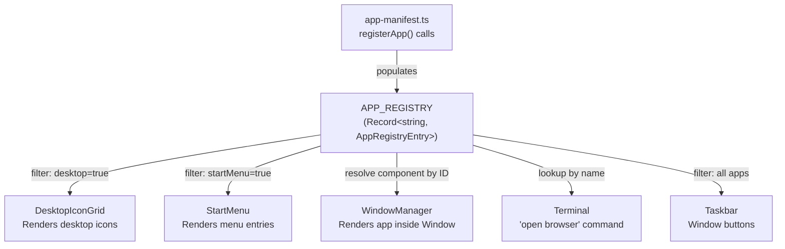
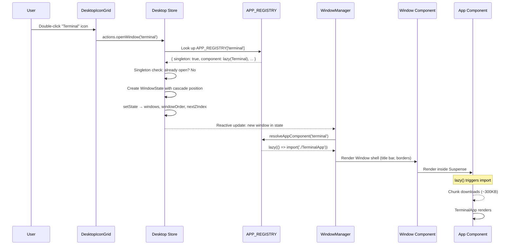

## Why Should I Care?

Adding a new app to this desktop takes exactly two steps: create a component and call `registerApp()`. That's it — the desktop icon appears, the start menu lists it, the terminal's `open` command works, and the window manager renders it. No other files change.

This zero-friction extensibility comes from the **registry pattern** — a classic technique used by VS Code (extensions), webpack (plugins), Express (middleware), and operating systems (device drivers). Understanding it teaches you the Open/Closed Principle in practice: the system is open for extension but closed for modification.

## The Problem: Shotgun Surgery

Imagine adding a new app without a registry. You'd need to:

1. Edit `DesktopIconGrid.tsx` to add the icon
2. Edit `StartMenu.tsx` to add the menu entry
3. Edit `WindowManager.tsx` to recognize the app ID and render the component
4. Edit the terminal command handler to support `open <app>`
5. Maybe edit `Taskbar.tsx` for special behavior

That's 4–5 files for every new app. Miss one and you get a broken experience — an icon that doesn't open, a menu entry that doesn't work, or a terminal command that fails. This is the **shotgun surgery** anti-pattern: a single change scattered across many files.

## The Solution: APP_REGISTRY

The entire app system reads from a single data structure in `src/components/desktop/apps/registry.ts`:

```typescript
export const APP_REGISTRY: Record<string, AppRegistryEntry> = {};

export function registerApp(entry: AppRegistryEntry): void {
  APP_REGISTRY[entry.id] = entry;
}

export function getDesktopApps(): AppRegistryEntry[] {
  return Object.values(APP_REGISTRY).filter((app) => app.desktop);
}

export function getStartMenuApps(): AppRegistryEntry[] {
  return Object.values(APP_REGISTRY).filter((app) => app.startMenu);
}
```

Every consumer reads from this map — no consumer imports any specific app:



## What Happens When You Double-Click an Icon

Here's the complete end-to-end sequence when a user opens an app:



## The AppRegistryEntry Interface

Every app is defined by a single object in `src/components/desktop/store/types.ts`:

```typescript
interface AppRegistryEntry {
  id: string;                    // Unique identifier ("browser", "terminal")
  title: string;                 // Display name ("View CV", "Terminal")
  icon: string;                  // Path to 32×32 pixel-art PNG
  component: Component | lazy;   // SolidJS component or lazy wrapper
  desktop: boolean;              // Show on desktop icon grid?
  startMenu: boolean;            // Show in start menu?
  startMenuCategory?: string;    // "Programs", "Games", etc.
  singleton: boolean;            // Only one instance allowed?
  defaultSize: { width; height };// Initial window dimensions
  minSize?: { width; height };   // Minimum resize dimensions
  resizable?: boolean;           // Can the window be resized? (default: true)
  captureKeyboard?: boolean;     // Capture keyboard when focused?
  desktopAlign?: 'left' | 'right'; // Icon grid alignment
  openMaximized?: boolean;       // Open maximized?
  defaultProps?: Record<...>;    // Props passed to the component
}
```

Key design choices:

- **`singleton: true`** means double-clicking the icon when the app is already open will focus the existing window and restore it if minimized. The CV viewer, terminal, and all current apps are singletons.
- **`captureKeyboard: true`** tells `Desktop.tsx` to stop handling global keyboard shortcuts (Escape to close start menu) when this app's window is focused. Used by the terminal and games that need all keyboard input.
- **`desktopAlign: 'right'`** places the icon on the right side of the desktop grid — used by the Knowledge Base and Architecture Explorer to visually separate them from the core apps.
- **`openMaximized: true`** makes the window fill the screen immediately on open — used by the Library and Architecture Explorer, which need more screen real estate.
- **`defaultProps`** are merged with any `extraProps` passed to `openWindow()`. This is how the Architecture Explorer can open the Library at a specific URL: `actions.openWindow('library', { initialUrl: '/learn/architecture/overview' })`.

## The app-manifest.ts File

All `registerApp()` calls live in one file: `src/components/desktop/apps/app-manifest.ts`. This file is imported by `Desktop.tsx` as a side effect:

```typescript
// Desktop.tsx
import './apps/app-manifest'; // Side effect: populates APP_REGISTRY
```

The module-level `registerApp()` calls execute immediately, populating the registry before any component renders. Heavy apps use `lazy()`:

```typescript
const TerminalApp = lazy(() =>
  import('./TerminalApp').then(m => ({ default: m.TerminalApp }))
);

registerApp({
  id: 'terminal',
  title: 'Terminal',
  component: TerminalApp,  // lazy-loaded — code splits here
  // ...
});
```

The registry doesn't care whether the component is lazy or not — it's just a `Component` type either way. `WindowManager` wraps every app in `<Suspense>`, so lazy apps automatically show a loading indicator.

## Comparison to Other Plugin Systems

The registry pattern appears everywhere in software:

| System | Registration | Discovery | Extension Point |
|---|---|---|---|
| **This project** | `registerApp()` | `APP_REGISTRY[id]` | Desktop icons, start menu, windows |
| **VS Code** | `package.json` contributes | Extension host API | Commands, views, languages, themes |
| **webpack** | `plugins: [new MyPlugin()]` | Compiler hooks | Build pipeline stages |
| **Express** | `app.use(middleware)` | Middleware chain | Request/response handling |
| **Spring** | `@Component` annotation | Dependency injection container | Services, repositories, controllers |

The common thread: a central registry that consumers iterate, decoupling the registration (what exists) from the consumption (what's rendered/invoked). The app never knows about the desktop; the desktop never knows about specific apps.

## The Open/Closed Principle

The registry is a textbook implementation of the **Open/Closed Principle** (the "O" in SOLID):

> Software entities should be open for extension but closed for modification.

- **Open for extension** — Add any app by calling `registerApp()`. No existing code changes.
- **Closed for modification** — `Desktop.tsx`, `WindowManager.tsx`, `Taskbar.tsx`, `StartMenu.tsx`, and `DesktopIconGrid.tsx` never change when apps are added or removed.

## Singleton vs Multi-Instance

All current apps are singletons (`singleton: true`). The `openWindow` action checks this:

```typescript
if (appEntry.singleton) {
  const existingId = state.windowOrder.find((id) => {
    const win = state.windows[id];
    return win?.app === appId;
  });
  if (existingId) {
    actions.focusWindow(existingId);
    if (existing?.isMinimized) {
      setState('windows', existingId, 'isMinimized', false);
    }
    return; // Don't open a new window
  }
}
```

Multi-instance apps (e.g., a notepad where you can open multiple documents) would set `singleton: false`. Each `openWindow` call would create a new window with a unique ID (`notepad-1`, `notepad-2`, etc.). The taskbar, window manager, and z-index stacking all handle multiple instances naturally — they iterate `windowOrder` without assuming uniqueness.

## How Would You Add a Settings App?

A walkthrough to demonstrate the pattern:

1. **Create the component:**
```typescript
// src/components/desktop/apps/SettingsApp.tsx
export function SettingsApp(): JSX.Element {
  return (
    <div class="window-body">
      <ul role="tablist">...</ul>
      <div role="tabpanel">Display settings...</div>
    </div>
  );
}
```

2. **Register it in app-manifest.ts:**
```typescript
import { SettingsApp } from './SettingsApp';

registerApp({
  id: 'settings',
  title: 'Settings',
  icon: '/icons/settings_icon.png',
  component: SettingsApp,
  desktop: false,          // Not on desktop — only in Start Menu
  startMenu: true,
  startMenuCategory: 'Settings',  // New category — appears automatically!
  singleton: true,
  defaultSize: { width: 400, height: 300 },
});
```

3. **Done.** The "Settings" category appears in the Start Menu automatically (the menu groups by `startMenuCategory`). The terminal's `open settings` command works. No other files change.

## Trade-offs

| Advantage | Disadvantage |
|---|---|
| Zero-friction app addition | All registrations in one manifest file (could grow large with 30+ apps) |
| Desktop components never change | No compile-time validation that an app ID exists — typos are runtime errors |
| Registry enables dynamic features (terminal `open`) | Side-effect imports require careful ordering |
| Lazy loading is transparent | The manifest file is the one place that technically violates "no other files change" |

For the current scale (8 apps), the manifest approach works perfectly. If the project grows to 20+ apps, switching to self-registering modules or Vite's `import.meta.glob()` for auto-discovery would be a natural evolution.
