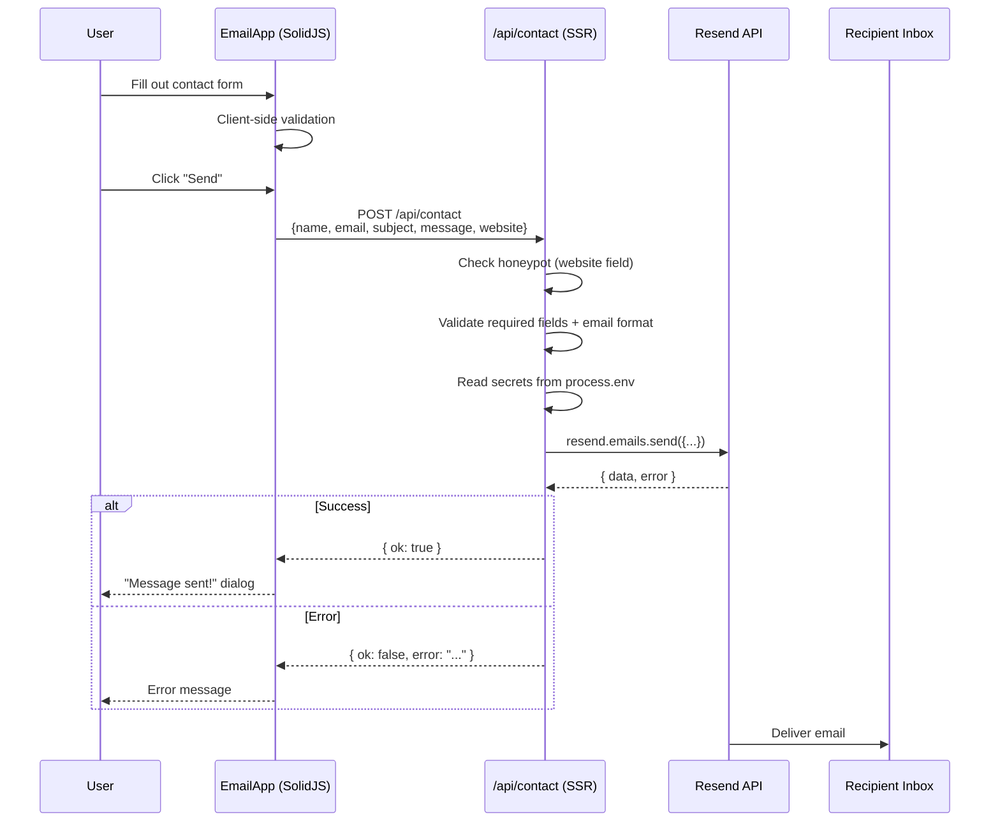
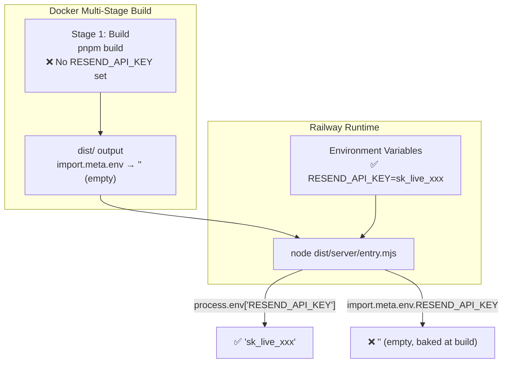

## Why Should I Care?

The contact system is the only server-side runtime code in the entire application. Everything else is static. Understanding why this one [endpoint](https://docs.astro.build/en/guides/endpoints/) needs SSR — and the `import.meta.env` landmine that nearly broke it — teaches you about the boundary between build-time and runtime in [Astro's hybrid rendering model](https://docs.astro.build/en/guides/on-demand-rendering/), and a [Vite environment variable behavior](https://vite.dev/guide/env-and-mode) that bites every project that deploys with runtime secrets.

## The Complete Request Flow



## Architecture: Three Components

### ContactApp — The Chooser

A simple dialog that offers two contact channels: "Email" or "Telegram." Clicking "Email" calls `actions.openWindow('email')`. Clicking "Telegram" opens a link in a new tab. This is a separate app from the email form because it's a lightweight entry point that doesn't need the form's validation logic.

### EmailApp — The Form

A SolidJS form with client-side validation: name, email (format check), subject, and message are required. A hidden `website` field acts as a honeypot (see below). On submit, it `POST`s to `/api/contact` and displays the response in a 98.css-styled dialog.

### /api/contact — The SSR Endpoint

The only server-side route in the application. Located at `src/pages/api/contact.ts`:

```typescript
export const prerender = false; // Opt out of static rendering

export const POST: APIRoute = async ({ request }) => {
  const body = await request.json();

  // 1. Honeypot check — silent success (fools bots)
  if (body.website) {
    return new Response(JSON.stringify({ ok: true }), { status: 200 });
  }

  // 2. Validate fields
  // 3. Read secrets from process.env
  // 4. Send via Resend SDK
  // 5. Return result
};
```

## The Honeypot Anti-Spam Pattern

The form includes a hidden field named `website`. Real users never see it (it's hidden with CSS), so it stays empty. Spam bots, which automatically fill every field, will populate it.

The endpoint checks: if `website` has a value, silently return `{ ok: true }`. The bot thinks the form submitted successfully. No email is sent. No CAPTCHA needed. No third-party anti-spam service.

```typescript
// In contact.ts
if (body.website) {
  return new Response(JSON.stringify({ ok: true }), { status: 200 });
}
```

This is a low-friction anti-spam technique. It won't stop sophisticated targeted attacks, but it eliminates automated form-filling bots, which account for the vast majority of contact form spam.

## The process.env Landmine

This is the most dangerous gotcha in the codebase. It's documented in AGENTS.md, in the contact code comments, and now here — because getting it wrong means your production contact form silently stops working.

### The Problem

[Vite](https://vite.dev/guide/env-and-mode) (Astro's build tool) performs a **string replacement** on `import.meta.env` at build time. It finds every occurrence of `import.meta.env.SOME_VAR` in your source code and replaces it with the literal value from the build environment:

```typescript
// Source code:
const key = import.meta.env.RESEND_API_KEY;

// After Vite build (if RESEND_API_KEY="sk_123" during build):
const key = "sk_123";  // Literal string baked in

// After Vite build (if RESEND_API_KEY is NOT SET during build):
const key = "";  // 💥 Empty string baked in forever
```

This affects **all** `import.meta.env` values, not just `PUBLIC_*` ones. In a Docker build or CI environment where secrets aren't available at build time, every `import.meta.env` reference becomes an empty string.

### The Fix

Server-side code must use `process.env['VAR_NAME']` — which reads the actual environment variable at runtime:

```typescript
// ✅ Correct: reads at runtime
const apiKey = process.env['RESEND_API_KEY'];
const toEmail = process.env['CONTACT_TO_EMAIL'];
const fromEmail = process.env['CONTACT_FROM_EMAIL'];
```

The bracket notation (`process.env['VAR_NAME']` not `process.env.VAR_NAME`) is required by TypeScript's `noPropertyAccessFromIndexSignature` setting.

### The Docker Build Diagram



### Client-Side: import.meta.env Is Fine

For `PUBLIC_*` variables used in client-side code, `import.meta.env` is the correct approach. These values are intentionally inlined:

```typescript
// In client-side component — ✅ correct
const telegram = import.meta.env.PUBLIC_TELEGRAM_USERNAME;
// Inlined at build time: const telegram = "dmitriy_lesyk";
```

`PUBLIC_*` vars must be set at build time (in Dockerfile as `ARG` + `ENV`, or in CI env).

## The Resend SDK Pattern

The [Resend SDK](https://resend.com/docs/sdks/node) has a non-standard error handling pattern that catches developers off guard:

```typescript
const resend = new Resend(apiKey);

// Resend returns { data, error } — it does NOT throw
const { error } = await resend.emails.send({
  from: `CV Contact <${fromEmail}>`,
  to: toEmail,
  replyTo: email,  // Reply goes to the person who filled out the form
  subject: `[CV Contact] ${subject}`,
  html: `<p><strong>From:</strong> ${name} (${email})</p><hr/>${message}`,
  text: `From: ${name} (${email})\n\n${plainText}`,
});

if (error) {
  console.error('[contact] Resend error:', JSON.stringify(error));
  return new Response(
    JSON.stringify({ ok: false, error: 'Failed to send email.' }),
    { status: 500 }
  );
}
```

**Do not** use `try/catch` for Resend API errors. The SDK signals failure through the return value, not exceptions. A `try/catch` around `resend.emails.send()` would silently ignore the error because no exception is thrown.

### Domain Matching

The `from` address domain must exactly match the verified Resend domain, enforced by [SPF authentication](https://www.cloudflare.com/learning/dns/dns-records/dns-spf-record/). If your domain is `lesyk.dev`, the from address must be `something@lesyk.dev`. Using a different domain (like `@gmail.com`) will cause a silent delivery failure.

## SSR vs Static: Why Only This Route

The `/api/contact` endpoint is the only route with `export const prerender = false`. Every other page (index, /learn/*, /cv-print) is prerendered to static HTML at build time.

Why can't the contact endpoint be static? Because it:

1. **Needs runtime secrets** — `RESEND_API_KEY` must be read from `process.env` at runtime
2. **Processes user input** — form data arrives in a POST request body
3. **Makes external API calls** — the Resend SDK sends HTTP requests

Astro's hybrid rendering model (default with the `@astrojs/node` adapter) is ideal: static by default, SSR only where needed. The contact endpoint opts into SSR with one line (`export const prerender = false`), and the rest of the site stays static.

## Rate Limiting Strategies

The current implementation doesn't include server-side rate limiting. For a personal CV site with low traffic, spam bots are the primary concern (handled by the honeypot). If traffic increases, options include:

| Strategy | Implementation | Tradeoff |
|---|---|---|
| **IP-based rate limiting** | Count requests per IP in memory or Redis | Doesn't survive server restart (memory) or needs external service (Redis) |
| **Token bucket** | Issue a time-limited token on page load, validate on submit | Adds a round-trip but works serverless |
| **Cloudflare/Railway WAF** | Configure rate limiting at the infrastructure level | Zero code changes, but requires platform support |
| **Turnstile/reCAPTCHA** | Add a challenge widget to the form | Effective but adds friction and a third-party dependency |

For the current scale, the honeypot is sufficient.

## Testing the Contact System

Because the contact endpoint makes a real API call to Resend, it's not covered by unit tests — there's no pure function to test in isolation. The endpoint's correctness is verified through:

1. **Type checking** — `astro check` validates the endpoint's TypeScript types, ensuring the `APIRoute` type is satisfied and `process.env` access is correct.
2. **Manual testing** — Filling out the form on `localhost:4321` and verifying the email arrives. Requires `RESEND_API_KEY` and other secrets in `.env`.
3. **Code review** — The endpoint is small enough (~50 lines) to verify by inspection. The critical paths (honeypot, validation, error handling) are each a few lines.

This is an acceptable trade-off for a single endpoint. If the project had multiple API routes, a test harness with mocked Resend would be worthwhile.

## Key Design Decisions

The contact system embodies several architectural choices that apply broadly:

**Minimal SSR surface.** Only one endpoint needs server-side rendering. Everything else stays static. This keeps the deployment simple — most of the site works even if the Node.js process crashes, because the static pages are served from disk.

**Fail silently for spam, loudly for errors.** The honeypot returns 200 to fool bots, but [Resend](https://resend.com/docs) errors return 500 with a user-visible message. The distinction matters: spam handling should be invisible (so bots can't adapt), but real errors should surface immediately so the user knows to retry or use Telegram instead.

**Secrets at the boundary.** Environment variables are read once at the top of the handler, validated, and passed to the SDK. This concentrates the `process.env` access in one place rather than scattering it throughout the function, making the landmine visible and auditable. If the project ever moves to a different deployment platform that handles secrets differently, only the top-of-handler code needs to change.
