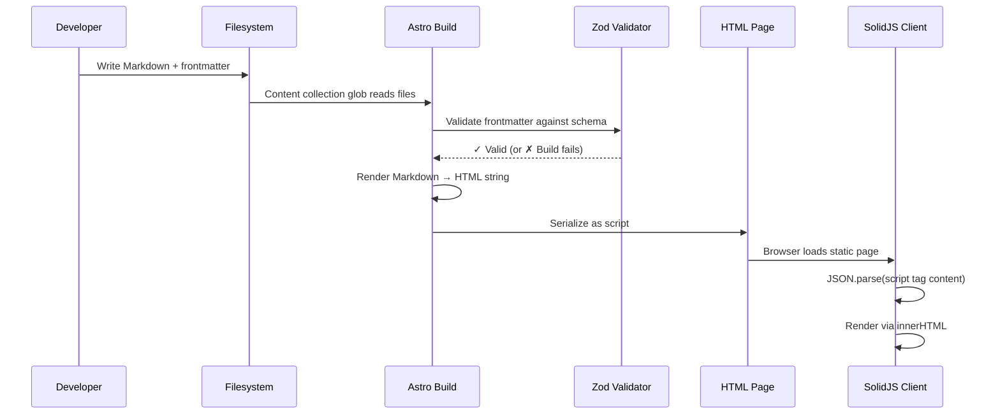
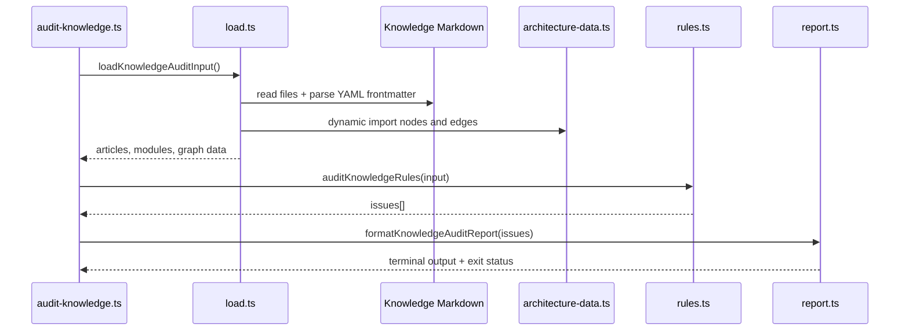

## Why Should I Care?

The most common question about this codebase is: "How does the CV content get from Markdown files into the Win95 browser window?" The answer reveals a design pattern that eliminates an entire class of problems — runtime Markdown parsing, client-side bundle bloat, XSS vulnerabilities from dynamic content, and loading-state complexity.

The same pipeline powers both the CV viewer and the knowledge base, so understanding it once explains two features. This is an instance of the [static-first architecture](https://docs.astro.build/en/basics/rendering/) that Astro promotes — do as much work as possible at build time, ship minimal JavaScript to the client.

## The Complete Pipeline

Content goes through four stages, each at a different time. No stage has access to the artifacts of a later stage — it's a strict forward pipeline:



### Stage 1: Authoring (Developer Time)

Markdown files with YAML frontmatter live in `src/content/cv/`:

```markdown
---
title: "Work Experience"
order: 2
---

## Senior Frontend Engineer — Acme Corp
*2022–Present*

Built the widget system using React and TypeScript...
```

Each CV section is a separate file with two required frontmatter fields: `title` (display name) and `order` (sequence in the rendered CV). This separation means sections are independently editable and reorderable without touching other content.

### Stage 2: Validation (Build Time)

Astro's [content collections](https://docs.astro.build/en/guides/content-collections/) validate every file against a [Zod schema](https://zod.dev/) defined in `src/content.config.ts`:

```typescript
const cv = defineCollection({
  loader: glob({ pattern: '**/*.md', base: './src/content/cv' }),
  schema: z.object({
    title: z.string(),
    order: z.number(),
  }),
});
```

If a file has a missing `title`, a non-numeric `order`, or unexpected fields, **the build fails**. This is a compile-time guarantee: if the build succeeds, every content file conforms to the schema. No runtime validation needed. No "undefined is not an object" errors when rendering.

### Stage 3: Rendering (Build Time)

In `src/pages/index.astro`, the collection is fetched, sorted by order, and each entry's Markdown is rendered to HTML:

```typescript
const cvSections = ((await getCollection('cv')) as CvEntry[]).sort(
  (a, b) => a.data.order - b.data.order,
);
const cvData = cvSections.map((section) => ({
  slug: section.id,
  title: section.data.title,
  html: section.rendered?.html ?? section.body ?? '',
}));
```

The resulting array of `{ slug, title, html }` objects is serialized into the page as a JSON script tag:

```html
<script type="application/json" id="cv-data">
  [{"slug":"summary","title":"Summary","html":"<p>Experienced...</p>"},
   {"slug":"experience","title":"Work Experience","html":"<h2>Senior..."}]
</script>
```

### Stage 4: Display (Client Time)

The `BrowserApp` component in `src/components/desktop/apps/BrowserApp.tsx` reads this JSON from the DOM:

```typescript
const [sections, setSections] = createSignal<CvSection[]>([]);
onMount(() => setSections(loadCvData()));

// loadCvData reads from the DOM:
function loadCvData(): CvSection[] {
  const el = document.getElementById('cv-data');
  return JSON.parse(el?.textContent ?? '[]');
}
```

Each section's HTML is rendered with `innerHTML`:

```tsx
{sections().map((section: CvSection) => (
  <div class="browser-section" innerHTML={section.html} />
))}
```

This is **zero runtime Markdown processing**. The client receives pre-rendered HTML. No Markdown parser in the bundle, no WASM module, no processing delay.

## innerHTML Security: Why It's Safe Here

Using [`innerHTML`](https://developer.mozilla.org/en-US/docs/Web/API/Element/innerHTML) is normally a red flag for [XSS (Cross-Site Scripting)](https://owasp.org/www-community/attacks/xss/). But in this project, it's safe because:

1. **The HTML is generated at build time** — Astro's Markdown renderer produces the HTML. No user input is involved.
2. **The source is the developer's own Markdown files** — committed to the repository, code-reviewed.
3. **The JSON is embedded in the page source** — it's not fetched from an API or user-submitted form.
4. **No interpolation** — the HTML is a string literal from the build, not a template with dynamic values.

If the CV content came from a CMS, user submissions, or an external API, `innerHTML` would be dangerous. Here, it's equivalent to writing the HTML directly in the template.

## The Knowledge Collection: Same Pattern, Different Output

The knowledge base follows the identical pipeline but produces **static routes** instead of a JSON blob:

```typescript
// src/content.config.ts
const knowledge = defineCollection({
  loader: glob({ pattern: '**/*.md', base: './src/content/knowledge' }),
  schema: z.object({
    title: z.string(),
    category: z.enum(['architecture', 'concept', 'technology', 'feature']),
    summary: z.string(),
    // ... additional fields for the richer knowledge schema
  }),
});
```

Astro's file-based routing renders each knowledge entry as a static HTML page:

```
/learn/architecture/overview  → src/content/knowledge/architecture/overview.md
/learn/concepts/signals-vs-vdom → src/content/knowledge/concepts/signals-vs-vdom.md
```

The `/learn/*` pages are fully static — no SolidJS island, no client-side hydration. They are pre-rendered HTML that works without JavaScript, then `LearnLayout.astro` adds two progressive enhancements: Mermaid diagram rendering and local mastery progress.

Additionally, `index.astro` serializes a knowledge index into the page for the Library app's tree view:

```typescript
const knowledgeEntries = ((await getCollection('knowledge')) as KnowledgeEntry[]).map((entry) => ({
  id: entry.id,
  title: entry.data.title,
  category: entry.data.category,
  summary: entry.data.summary,
}));
```

```html
<script type="application/json" id="knowledge-index">
  [{"id":"architecture/overview","title":"The Big Picture",...}]
</script>
```

### Audit-Time Data Flow

The knowledge audit follows the same static-first philosophy, but it runs before shipping instead of in the browser:



Astro's Zod schema validates the shape of one article at a time. The audit validates relationships across files: "does this prerequisite exist?", "does this module id exist?", "does this edge endpoint exist?", and "does this prerequisite graph contain a cycle?"

### Progress-Time Data Flow

Learning progress is intentionally client-local. Article content is static HTML, then the script in `LearnLayout.astro` imports `src/scripts/learn-progress.ts` and stores staged progress under the `kb-learning-progress` key in `localStorage`.

The data shape separates article visits from mastery:

```ts
type MasteryStage = 'read' | 'checked' | 'practiced' | 'mastered';
```

That means `/learn` can show "read", "checked", "practiced", and "mastered" counts per module without claiming that a page view equals understanding.

## What If We'd Used Runtime Markdown Parsing?

If the BrowserApp parsed Markdown at runtime, you'd need:

1. **A Markdown library** — `marked` (~7KB gzip), `markdown-it` (~12KB gzip), or `remark` ecosystem (~50KB+ with plugins). Added to every user's bundle.
2. **Processing time** — Parsing Markdown on the client takes 10-50ms depending on content length. Noticeable as a flash of unstyled content.
3. **Loading state** — The CV viewer would need a loading spinner while Markdown parses.
4. **Raw Markdown in page source** — Search engines would see unrendered Markdown instead of HTML.
5. **Security complexity** — The Markdown parser's HTML output would need sanitization to prevent XSS.

The build-time approach eliminates all of these: zero client-side dependencies, instant rendering, and the HTML is in the page source for crawlers.

## What If We'd Used a CMS?

A headless CMS (Contentful, Sanity, Strapi) would work but adds complexity:

| Concern | Content Collections | Headless CMS |
|---|---|---|
| **Content storage** | Git-tracked Markdown files | External database |
| **Schema validation** | Build-time Zod | CMS-defined schema |
| **Build dependency** | None (files are local) | API must be reachable during build |
| **Editing workflow** | Code editor → Git commit | CMS web interface |
| **Cost** | Free | Free tier + potential paid plan |
| **Version control** | Full Git history | CMS-specific versioning |
| **Offline editing** | Always works | Requires internet |

For a personal CV site with one author, Git-tracked Markdown files are simpler, faster, and more reliable than an external CMS. The tradeoff: no web-based editing interface.

## Key Takeaway

The data flow architecture follows a principle that applies far beyond this codebase: **push work to the earliest possible stage**. Validation at build time eliminates runtime errors. Rendering at build time eliminates client-side processing. Serializing as JSON at build time eliminates API calls. Each stage produces artifacts consumed by the next, creating a strict forward pipeline where errors surface as early as possible — when they're cheapest to fix.

This pattern appears in many production systems: static site generators pre-render HTML, CDNs cache at the edge, and compiled languages catch errors before deployment. The common thread is the same insight — every problem caught earlier is a problem the user never encounters. In this codebase, a Zod validation failure at build time means no one ever sees a broken CV section, a missing knowledge article title, or a malformed frontmatter field in production. The [fail-fast principle](https://www.martinfowler.com/ieeeSoftware/failFast.pdf) applies to content pipelines just as much as it applies to code — surfacing errors early reduces the blast radius of every mistake. When a Zod schema rejects a malformed frontmatter field during `pnpm build`, the developer sees the error immediately in their terminal, with the exact file and field that failed. Compare this to the alternative: a runtime error in production that only surfaces when a user navigates to that specific content section, possibly weeks after the bad commit was deployed.
