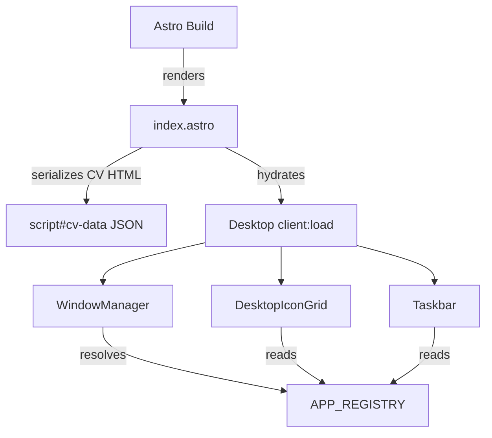

## Three-Layer Architecture

This platform is built as three distinct layers, each with a clear responsibility:

1. **Astro (Build Time)** — Static site generator. Renders HTML, processes Markdown content collections, serves static assets, and provides one SSR endpoint (`/api/contact`).
2. **SolidJS (Client Runtime)** — A single hydrated "island" component (`<Desktop />`) that owns all interactive state — windows, taskbar, icons, and the entire desktop experience.
3. **App Registry (Extensibility)** — A central registry where `registerApp()` wires an app into the desktop icons, start menu, terminal, and window manager with a single function call.



## Data Flow: Markdown to Screen

All CV content starts as Markdown files in `src/content/cv/`. At build time:

1. **Astro content collections** validate each file's frontmatter with a Zod schema (`title`, `order`).
2. **`index.astro`** fetches the collection, renders each section's Markdown to HTML, and serializes the result into a `<script type="application/json" id="cv-data">` tag.
3. **At runtime**, the `BrowserApp` component reads this JSON from the DOM — zero Markdown parsing on the client.

This means the entire CV is pre-rendered HTML. The client just displays it. There's no runtime Markdown processing, no WASM Markdown parsers, no build-time secrets leaking through `import.meta.env`.

## The Single-Island Architecture

There is exactly **one** SolidJS island in the entire site: `<Desktop client:load />` in `index.astro`. This is a deliberate architectural choice:

- **One store** — `DesktopStore` holds all state (windows, z-index, mobile detection) in a single `createStore`.
- **One context** — `DesktopProvider` wraps the island, making the store available to every component via `useDesktop()`.
- **No cross-island communication** — Because there's only one island, all components share reactive state naturally.

Multiple islands would mean separate SolidJS instances that can't share reactive context. By keeping everything in one island, any component can call `actions.openWindow('browser')` and the window manager responds immediately.

## CSS Strategy: 98.css + Layout-Only Custom CSS

The visual aesthetic comes from [98.css](https://jdan.github.io/98.css/), a CSS library that recreates the Windows 98 look using semantic class names:

- **Buttons** — `<button>` elements automatically get the 98-style raised look
- **Windows** — `.window`, `.title-bar`, `.title-bar-text`, `.title-bar-controls`
- **Inputs** — `<input>`, `<select>`, `<textarea>` get the sunken field style
- **Status bars** — `.status-bar`, `.status-bar-field`

Custom CSS is **only for layout** — positioning the desktop grid, fixing the taskbar to the bottom, translating windows with `transform: translate()`. If 98.css already styles an element, no custom CSS should override it.

## Component Hierarchy

```
Desktop (island root)
├── DesktopProvider (store context)
│   ├── CrtMonitorFrame (pure CSS CRT effect)
│   │   ├── DesktopIconGrid (reads APP_REGISTRY for icons)
│   │   ├── WindowManager (renders open windows)
│   │   │   └── Window × N (drag, resize, z-index)
│   │   │       └── [App Component from registry]
│   │   └── Taskbar (start menu + window buttons)
```

The `CrtMonitorFrame` is a pure CSS wrapper that adds the CRT monitor aesthetic — glass effect, scanlines, and a chin with power/brightness buttons. It wraps the entire desktop but adds zero interactive behavior.

## Key Files

| File | Role |
|---|---|
| `src/pages/index.astro` | Main page, serializes CV data, mounts Desktop island |
| `src/components/desktop/Desktop.tsx` | Island root, provides DesktopContext |
| `src/components/desktop/store/desktop-store.ts` | Central store: windows, z-index, mobile state |
| `src/components/desktop/apps/registry.ts` | `APP_REGISTRY` map + `registerApp()` function |
| `src/components/desktop/apps/app-manifest.ts` | All `registerApp()` calls — the single source of app definitions |
| `src/components/desktop/WindowManager.tsx` | Resolves app components from registry, renders windows |

## How to Add a New App

1. Create a component in `src/components/desktop/apps/`
2. Add a `registerApp()` call in `app-manifest.ts`
3. Done — the desktop icon, start menu entry, and window management all happen automatically

You never edit `Desktop.tsx`, `WindowManager.tsx`, `Taskbar.tsx`, or `StartMenu.tsx` to add an app. The registry is the single extensibility point.
