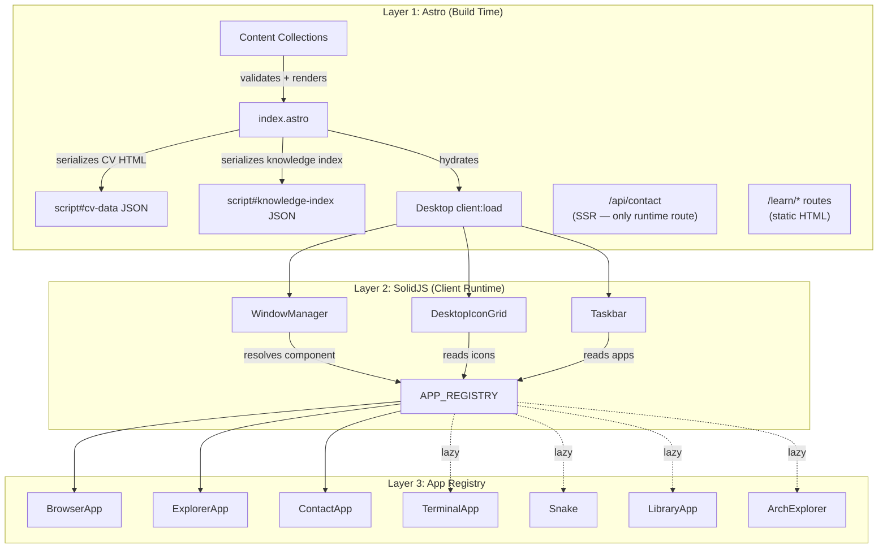
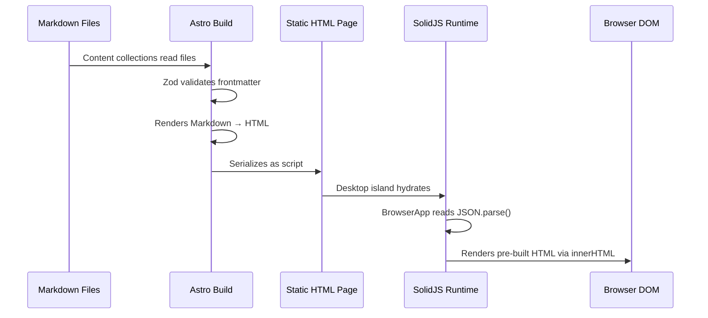
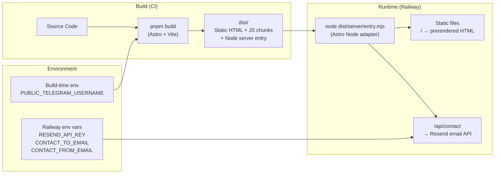

## Why Should I Care?

This platform looks like a toy — a nostalgic Windows 98 desktop in a browser. But under the surface, it's a carefully layered architecture that separates build-time content processing from client-side interactivity, uses a registry pattern for zero-friction extensibility, and achieves sub-35KB critical-path JavaScript despite having a window manager, terminal emulator, game engine, and knowledge base.

Understanding the big picture gives you a mental map for navigating the codebase. Every component, every file, every design decision connects back to this three-layer architecture.

## Three-Layer Architecture

This platform is built as three distinct layers, each with a clear responsibility:

1. **Astro (Build Time)** — Static site generator. Renders HTML, processes Markdown content collections, serves static assets, and provides one SSR endpoint (`/api/contact`).
2. **SolidJS (Client Runtime)** — A single hydrated "island" component (`<Desktop />`) that owns all interactive state — windows, taskbar, icons, and the entire desktop experience.
3. **App Registry (Extensibility)** — A central registry where `registerApp()` wires an app into the desktop icons, start menu, terminal, and window manager with a single function call.



## Data Flow: Build Time to Runtime

Content goes through a clear pipeline with zero runtime processing on the client:



The knowledge base follows the same pattern but renders to separate `/learn/*` static routes instead of a JSON blob. Both collections use the same Zod-validated content pipeline defined in `src/content.config.ts`.

## The Single-Island Architecture

There is exactly **one** SolidJS island in the entire site: `<Desktop client:load />` in `src/pages/index.astro`. This is a deliberate architectural choice:

- **One store** — `DesktopStore` in `src/components/desktop/store/desktop-store.ts` holds all state (windows, z-index, mobile detection) in a single `createStore`.
- **One context** — `DesktopProvider` in `src/components/desktop/store/context.tsx` wraps the island, making the store available to every component via `useDesktop()`.
- **No cross-island communication** — Because there's only one island, all components share reactive state naturally.

Multiple islands would mean separate SolidJS instances that can't share reactive context. By keeping everything in one island, any component can call `actions.openWindow('browser')` and the window manager responds immediately — no message passing, no event buses, no serialization.

### What If We'd Used Multiple Islands?

Imagine splitting the desktop into three islands: `<DesktopIcons client:load />`, `<WindowManager client:load />`, `<Taskbar client:load />`. Each would be a separate SolidJS instance with its own `createStore`. Now:

- Opening a window from an icon requires messaging from the Icons island to the WindowManager island
- The Taskbar needs to observe window state from the WindowManager island
- Singleton checks need cross-island coordination

You'd end up building a cross-island state synchronization layer — essentially reimplementing what one shared store gives you for free. The entire desktop is interactive; there's no static "gap" between islands that would justify splitting them.

### What If We'd Used React?

React would work, but with friction:

| Concern | SolidJS | React |
|---|---|---|
| Drag performance | Signal updates only the CSS transform | Re-renders entire component unless `React.memo` + `useMemo` everywhere |
| Bundle size | ~7KB gzip | ~40KB gzip (React + ReactDOM) |
| Component model | Functions run once (setup) | Functions run on every render |
| Store updates | `produce()` for nested mutations | Would need Zustand, Redux, or Immer |
| Astro integration | First-class `@astrojs/solid-js` | First-class `@astrojs/react` |

The window manager makes dozens of fine-grained updates per second during drag. SolidJS's signal-based reactivity means each update touches only the specific CSS `transform` value — no component tree re-rendering, no VDOM diff. React would require significant memoization effort to achieve the same performance.

## CSS Strategy: 98.css + Layout-Only Custom CSS

The visual aesthetic comes from [98.css](https://jdan.github.io/98.css/), a CSS library that recreates the Windows 98 look using semantic class names:

| Element | How to Use |
|---|---|
| Windows | `<div class="window">` with `.title-bar`, `.title-bar-text`, `.title-bar-controls` |
| Buttons | Plain `<button>` elements — automatically styled |
| Text inputs | Plain `<input type="text">` — sunken field style |
| Status bars | `<div class="status-bar">` with `.status-bar-field` |
| Trees | `<ul role="tree">` with tree-view styling |

**Custom CSS is only for layout** — positioning the desktop grid, fixing the taskbar to the bottom, translating windows with `transform: translate()`, and the CRT monitor frame effects. If 98.css already styles an element, no custom CSS should override it. This constraint keeps the visual system consistent and eliminates style conflicts.

## Component Hierarchy

```
Desktop (island root) — src/components/desktop/Desktop.tsx
├── DesktopProvider (store context) — store/context.tsx
│   ├── CrtMonitorFrame (pure CSS CRT effect) — CrtMonitorFrame.tsx
│   │   ├── DesktopIconGrid (reads APP_REGISTRY for icons)
│   │   ├── WindowManager (renders open windows)
│   │   │   └── Window × N (drag, resize, z-index)
│   │   │       └── <Suspense> → [App Component from registry]
│   │   └── Taskbar (start menu + window buttons)
│   │       ├── StartMenu (reads APP_REGISTRY for categories)
│   │       └── Clock
```

The `CrtMonitorFrame` is a pure CSS wrapper that adds the CRT monitor aesthetic — glass effect, scanlines, and a chin with power/brightness buttons. It wraps the entire desktop but adds zero interactive behavior. On mobile (<768px), it's hidden entirely.

## Deployment Architecture



The site deploys to Railway via a multi-stage Dockerfile (node:24-slim). The Astro Node adapter in standalone mode produces a single `entry.mjs` that serves both static files and the SSR contact endpoint. `PUBLIC_*` variables are inlined at build time by Vite; server secrets use `process.env` at runtime.

## Performance Budget

| Resource | Target Size | Loads When |
|---|---|---|
| 98.css | ~10KB gzip | Page load (critical) |
| SolidJS runtime | ~7KB gzip | Page load (critical) |
| Desktop + WindowManager + Taskbar | ~15-20KB gzip | Page load (critical) |
| **Total critical path** | **~35KB gzip** | **Immediately** |
| xterm.js (terminal) | ~300KB gzip | Terminal window opens |
| Game engines | ~20KB each | Game window opens |
| Mermaid (knowledge) | ~200KB | /learn/* pages only |

Heavy apps (terminal, games, library, architecture explorer) are behind `lazy()` + `<Suspense>` boundaries. The window shell renders instantly; the app content shows a loading indicator while its chunk downloads.

## How to Add a New App

1. Create a component in `src/components/desktop/apps/`
2. Add a `registerApp()` call in `src/components/desktop/apps/app-manifest.ts`
3. Add a 32×32 pixel-art icon to `public/icons/`
4. Done — the desktop icon, start menu entry, terminal `open` command, and window management all happen automatically

You never edit `Desktop.tsx`, `WindowManager.tsx`, `Taskbar.tsx`, or `StartMenu.tsx` to add an app. The registry is the single extensibility point. See the [App Registry article](/learn/architecture/app-registry) for the full pattern.

## Key Files

| File | Role |
|---|---|
| `src/pages/index.astro` | Main page, serializes CV + knowledge data, mounts Desktop island |
| `src/components/desktop/Desktop.tsx` | Island root, provides DesktopContext, keyboard handling |
| `src/components/desktop/store/desktop-store.ts` | Central store: windows, z-index, mobile state |
| `src/components/desktop/store/types.ts` | TypeScript interfaces: WindowState, AppRegistryEntry, DesktopState |
| `src/components/desktop/store/context.tsx` | SolidJS context provider + useDesktop() hook |
| `src/components/desktop/apps/registry.ts` | `APP_REGISTRY` map + helper functions |
| `src/components/desktop/apps/app-manifest.ts` | All `registerApp()` calls — the single source of app definitions |
| `src/components/desktop/WindowManager.tsx` | Resolves app components from registry, renders windows in `<Suspense>` |
| `src/components/desktop/Window.tsx` | Window chrome: drag, resize, z-index, maximize/minimize |
| `src/components/desktop/CrtMonitorFrame.tsx` | Pure CSS CRT monitor aesthetic wrapper |
| `src/content.config.ts` | Content collection schemas (cv + knowledge) |
| `src/pages/api/contact.ts` | SSR endpoint: Resend email API |
