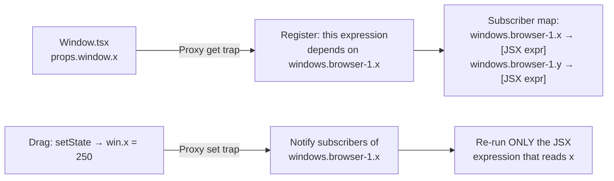

## Why Should I Care?

The desktop store is the single source of truth for every interactive element on screen — which windows are open, where they're positioned, which one is focused, whether the start menu is showing, and whether the viewport is mobile. Every component reads from this store, and every user action writes to it.

Understanding the store teaches you SolidJS's proxy-based reactivity in practice, why a single store beats per-window state management, and how the command pattern (actions as a public API) keeps mutations predictable.

## The Store Shape

All desktop state lives in one `createStore` call in `src/components/desktop/store/desktop-store.ts`:

```typescript
const [state, setState] = createStore<DesktopState>({
  windows: {},              // Record<string, WindowState> — all open windows
  windowOrder: [],          // string[] — creation order for taskbar
  nextZIndex: 10,           // Monotonic counter for z-stacking
  startMenuOpen: false,     // Is the start menu visible?
  selectedDesktopIcon: null, // Which icon is selected (blue highlight)?
  isMobile: false,          // Viewport < 768px?
});
```

This is intentionally flat. There's no per-app state, no UI state mixed with domain state, no derived computations stored here. The store holds the minimum data needed to render the desktop — everything else is derived in components.

## Proxy-Based Reactivity Deep Dive

SolidJS stores use [JavaScript Proxies](https://developer.mozilla.org/en-US/docs/Web/JavaScript/Reference/Global_Objects/Proxy) (see [JavaScript Proxies](/learn/concepts/javascript-proxies)) to track reads and writes at the property level. Here's what happens when a component reads window position:



When you write `state.windows['browser-1'].x`, the Proxy `get` trap fires three times:
1. `.windows` — registers a dependency on the `windows` property
2. `['browser-1']` — registers a dependency on that specific key
3. `.x` — registers a dependency on the `x` property of that window

SolidJS optimizes this: it tracks at the deepest level read. So the expression that reads `props.window.x` is subscribed to changes to that specific path, not to all of `windows` or all properties of `browser-1`.

## produce(): Immer-like Mutations

Nested state updates use [`produce()`](https://docs.solidjs.com/reference/store-utilities/produce) from `solid-js/store` — an API inspired by [Immer](https://immerjs.github.io/immer/) that lets you write mutable-looking code that produces immutable updates:

```typescript
// Opening a window — multiple nested changes in one batch
setState(produce((s) => {
  s.windows[id] = newWindow;      // Add new window
  s.windowOrder.push(id);         // Append to order
  s.nextZIndex += 1;              // Bump z-counter
  s.startMenuOpen = false;        // Close start menu
}));
```

Without `produce()`, you'd need verbose path-based updates:

```typescript
// Equivalent without produce — much more verbose
setState('windows', id, newWindow);
setState('windowOrder', state.windowOrder.length, id);
setState('nextZIndex', state.nextZIndex + 1);
setState('startMenuOpen', false);
```

`produce()` is cleaner for multi-property updates, and all changes within a single `produce` callback are batched — subscribers are notified once after all mutations, not once per mutation.

## Context Distribution

The store is created once and distributed via [SolidJS context](https://docs.solidjs.com/reference/component-apis/create-context) in `src/components/desktop/store/context.tsx`:

```typescript
const DesktopContext = createContext<[DesktopState, DesktopActions]>();

export function DesktopProvider(props: { children: JSX.Element }): JSX.Element {
  const store = createDesktopStore();
  return <DesktopContext.Provider value={store}>{props.children}</DesktopContext.Provider>;
}

export function useDesktop(): [DesktopState, DesktopActions] {
  const ctx = useContext(DesktopContext);
  if (!ctx) throw new Error('useDesktop must be used within a DesktopProvider');
  return ctx;
}
```

Any component calls `useDesktop()` to get `[state, actions]`. This is the only way to access desktop state — no global singletons, no prop drilling, no imports from the store module.

## Actions: The Command Pattern

The `DesktopActions` interface in `src/components/desktop/store/types.ts` defines every possible mutation as a named function:

```typescript
interface DesktopActions {
  openWindow: (appId: string, extraProps?: Record<string, unknown>) => void;
  closeWindow: (id: string) => void;
  focusWindow: (id: string) => void;
  minimizeWindow: (id: string) => void;
  maximizeWindow: (id: string) => void;
  updateWindowPosition: (id: string, x: number, y: number) => void;
  updateWindowSize: (id: string, width: number, height: number) => void;
  toggleStartMenu: () => void;
  closeStartMenu: () => void;
  selectDesktopIcon: (id: string | null) => void;
  isTopWindow: (id: string) => boolean;
  getTopWindowId: () => string | undefined;
}
```

This is the **command pattern**: mutations are expressed as named operations, not raw state changes. Components never call `setState` directly — they call `actions.focusWindow(id)`, which encapsulates the z-index logic, start menu closing, and any other side effects.

Benefits:
- **Encapsulation** — the z-index incrementing logic lives in `focusWindow`, not scattered across components
- **Discoverability** — the full API is defined in one TypeScript interface
- **Testability** — actions can be tested independently from rendering
- **Evolution** — adding logging, undo, or analytics means changing the action, not every callsite

## Comparison: Store Approaches

| Feature | SolidJS Store | Redux | Zustand | MobX |
|---|---|---|---|---|
| **Reactivity** | Proxy-based, automatic | Manual `useSelector` subscriptions | Manual `useStore` subscriptions | Observable decorators |
| **Mutations** | Direct mutation via `produce()` | Reducers (pure functions) | Direct mutation | Direct mutation |
| **Boilerplate** | Minimal (~200 lines for this store) | High (actions, reducers, types, selectors) | Low | Medium (decorators) |
| **DevTools** | Limited (no time-travel) | Excellent (Redux DevTools) | Good (via middleware) | Good (MobX DevTools) |
| **Bundle size** | 0 (built into SolidJS) | ~2KB + react-redux ~5KB | ~1KB | ~15KB |
| **Nested state** | First-class (path-based tracking) | Requires Immer or manual spreading | Direct mutation | First-class |

SolidJS stores have no extra dependencies — `createStore` and `produce` are part of `solid-js/store`. For this project's needs (fine-grained window position updates during drag), the proxy-based tracking is ideal.

## Which Components Re-render When?

This is the key insight: SolidJS's fine-grained tracking means updates are surgical.

| State Change | What Re-renders | What Doesn't |
|---|---|---|
| `updateWindowPosition('browser-1', x, y)` | Only browser-1's `transform` style | All other windows, taskbar, icons |
| `focusWindow('terminal-1')` | terminal-1's zIndex style + nextZIndex | Window positions, titles, sizes |
| `openWindow('snake')` | WindowManager's `<For>` list + taskbar buttons | Existing windows, desktop icons |
| `toggleStartMenu()` | Start menu visibility | All windows, desktop icons |
| `setState('isMobile', true)` | Every component that reads `isMobile` | Components that don't check mobile state |

This granularity is what makes the window manager feel responsive. During a drag at 60fps, only one CSS `transform` value changes per frame — not a component tree re-render.

## Why a Single Store, Not Per-Window Stores?

One store means:

1. **Atomic operations** — `openWindow` updates `windows`, `windowOrder`, and `nextZIndex` in one `produce()` call. With per-window stores, you'd need to coordinate across stores.
2. **No sync bugs** — The taskbar and window manager always agree on what's open, because they read from the same source.
3. **Simple singleton checks** — `openWindow` scans `windowOrder` to check if an app is already open. With per-window stores, you'd need a separate registry of open windows.
4. **Clean z-index management** — `nextZIndex` is a single counter. Per-window stores would each need their own z-index, requiring a coordination layer.

The tradeoff: all desktop logic lives in one ~200-line file. This is manageable for the current scope. If the store grew to 500+ lines, extracting domain-specific slices (window management, menu state, mobile detection) into separate modules that compose into a single store would be the natural evolution.

## Mobile Detection

The store watches `window.matchMedia('(max-width: 768px)')`:

```typescript
const mediaQuery = typeof window !== 'undefined'
  ? window.matchMedia(`(max-width: ${MOBILE_BREAKPOINT}px)`)
  : undefined;

// Initial value
setState('isMobile', mediaQuery?.matches ?? false);

// Reactive updates
if (mediaQuery) {
  const handleChange = (e: MediaQueryListEvent): void => {
    setState('isMobile', e.matches);
  };
  mediaQuery.addEventListener('change', handleChange);
  onCleanup(() => mediaQuery.removeEventListener('change', handleChange));
}
```

Components read `state.isMobile` and conditionally change behavior — the `Window` component hides resize handles, the `DesktopIconGrid` adjusts layout, and the `Taskbar` simplifies. Same components, different rendering based on one reactive boolean.

## Debugging the Store

Since there are no Redux-style DevTools, debugging the store uses browser DevTools:

1. **Breakpoints in actions** — Set a breakpoint in `updateWindowPosition` to trace drag updates
2. **Console logging** — Temporarily add `console.log(JSON.parse(JSON.stringify(state)))` to snapshot the store (use `JSON.parse(JSON.stringify())` to unwrap Proxies)
3. **Reactive debugging** — `createEffect(() => console.log('windows:', Object.keys(state.windows)))` logs whenever windows change
4. **Component DevTools** — SolidJS's browser extension shows the component tree and reactive dependencies

## Evolution: When the Store Outgrows One File

The current store is ~200 lines — well within the manageable range for a single module. But if the project added features like collaborative window state, persistent layout preferences across sessions, or undo/redo for window operations, the store would grow. The natural evolution path follows domain-driven separation:

1. **Extract action groups** — Window management, menu state, and mobile detection become separate modules that each export action creators.
2. **Compose into a single store** — The top-level store imports and combines actions from each module, maintaining the single-store architecture.
3. **Keep the context API** — Components still call `useDesktop()` and get `[state, actions]`. The internal reorganization is invisible to consumers.

This is the [Facade pattern](https://refactoring.guru/design-patterns/facade) applied to state management: the public API stays simple and stable while the implementation behind it can be restructured freely. The key insight is that consumers never depend on the store's internal organization — only on the `[state, actions]` tuple returned by `useDesktop()`.
