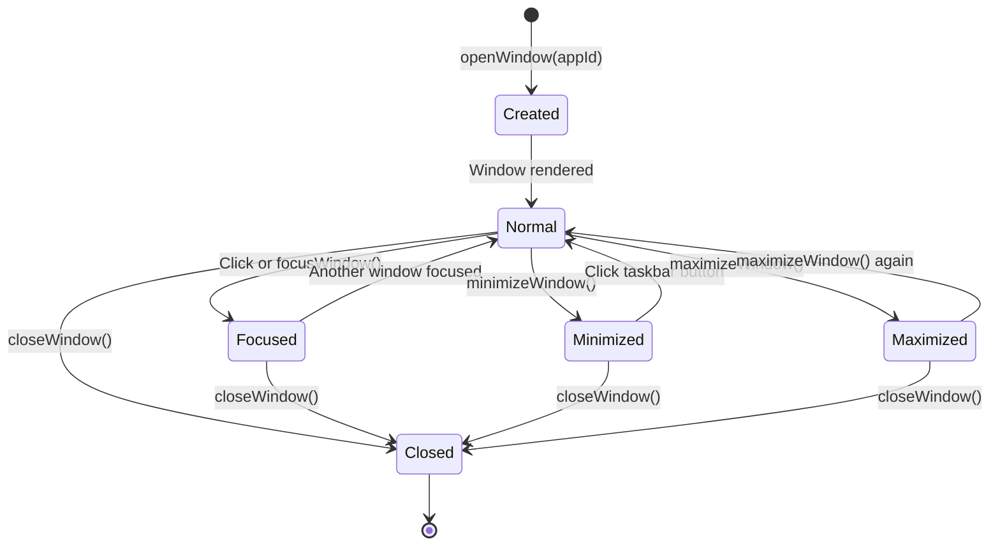

## Why Should I Care?

A window manager is the most complex interactive system on this desktop — it coordinates drag, resize, focus, z-index stacking, minimize/maximize, cascade positioning, and mobile adaptation, all while rendering at 60fps during drag operations. The architecture draws from the same concepts used in the [X Window System](https://en.wikipedia.org/wiki/X_Window_System). Understanding how it works teaches you about [pointer event](https://developer.mozilla.org/en-US/docs/Web/API/Pointer_events) handling, GPU-accelerated positioning, reactive state management, and the patterns that real operating system window managers use.

## The Window Lifecycle

Every window goes through a predictable lifecycle, driven entirely by store state:



The `WindowState` in `src/components/desktop/store/types.ts` encodes this:

```typescript
interface WindowState {
  id: string;            // Unique instance ID ("browser-1", "terminal-2")
  app: string;           // Registry key ("browser", "terminal")
  title: string;         // Title bar text
  icon?: string;         // Icon path
  x: number;             // Position via transform: translate()
  y: number;
  width: number;
  height: number;
  zIndex: number;        // Stacking order (monotonically increasing)
  isMinimized: boolean;
  isMaximized: boolean;
  prevBounds?: { x: number; y: number; width: number; height: number };
  appProps?: Record<string, unknown>;
}
```

The store holds `windows: Record<string, WindowState>` — a flat map keyed by window ID. This makes lookups O(1) and updates surgical: changing `windows['browser-1'].x` only notifies the specific JSX expression that reads that path.

## Drag: The Complete Sequence

Window dragging is the most performance-critical interaction on the desktop. Here's exactly how it works in `src/components/desktop/Window.tsx`:

```mermaid
sequenceDiagram
    participant User
    participant TitleBar as Title Bar (pointerdown)
    participant Window as Window.tsx
    participant Store as Desktop Store
    participant DOM as Browser DOM
    participant [GPU](https://developer.mozilla.org/en-US/docs/Web/CSS/will-change) as [Compositor](https://web.dev/articles/animations-guide) (GPU)

    User->>TitleBar: Press and hold
    TitleBar->>Window: pointerdown event
    Window->>Window: Check: not mobile, not maximized, left button
    Window->>TitleBar: setPointerCapture(pointerId)
    Window->>Window: Record drag offset (clientX - window.x)
    Window->>Window: Set willChange = 'transform'
    Window->>Store: focusWindow(id) → bump zIndex

    loop Every pointermove (up to 60fps)
        User->>TitleBar: Move pointer
        TitleBar->>Window: pointermove event (captured)
        Window->>Window: Compute new position with bounds clamping
        Window->>Store: updateWindowPosition(id, newX, newY)
        Store->>DOM: SolidJS updates style.transform
        DOM->>GPU: Compositor moves layer (no layout/paint)
    end

    User->>TitleBar: Release
    TitleBar->>Window: pointerup event
    Window->>TitleBar: releasePointerCapture(pointerId)
    Window->>Window: Set willChange = 'auto'
```

### Why Pointer Capture Is Critical

Without pointer capture, moving the mouse quickly can leave the title bar element. Pointer events would then fire on whatever element is under the cursor — an iframe, another window, or the desktop background. The window stops following the cursor.

[`setPointerCapture(e.pointerId)`](https://developer.mozilla.org/en-US/docs/Web/API/Element/setPointerCapture) locks all subsequent pointer events to the title bar element, regardless of where the pointer actually moves. This is the same technique used by native OS window managers.

### GPU-Accelerated Movement

Window position is applied via [`transform: translate(x, y)`](https://developer.mozilla.org/en-US/docs/Web/CSS/transform) — not CSS `left`/`top`:

```typescript
style={{
  transform: `translate(${props.window.x}px, ${props.window.y}px)`,
}}
```

This keeps the window on its own compositor layer, making movement GPU-accelerated with no [layout reflow](https://developer.chrome.com/docs/devtools/performance/rendering). The browser skips the Style → Layout → Paint stages and goes straight to Composite — moving a pre-painted bitmap.

The `will-change: transform` hint is applied only during active drag (promoting the window to its own GPU layer) and removed after (freeing GPU memory):

```typescript
// Drag start
windowEl.style.willChange = 'transform';
// Drag end
windowEl.style.willChange = 'auto';
```

### Bounds Clamping

During drag, the position is clamped to keep the window accessible:

```typescript
const maxX = (container?.clientWidth ?? window.innerWidth) - 100;
const maxY = (container?.clientHeight ?? window.innerHeight) - TASKBAR_HEIGHT - 20;
newX = Math.max(-props.window.width + 100, Math.min(newX, maxX));
newY = Math.max(0, Math.min(newY, maxY));
```

The window can be dragged partially off-screen (you can hide everything except the rightmost 100px), but can't be dragged below the taskbar or above the viewport. This matches classic Windows behavior — you can drag a window mostly off-screen, but there's always enough visible to grab it back.

## Resize: Eight-Direction Edge Detection

The `Window` component supports resizing from all four edges and four corners (8 directions). Each direction has an invisible 6px hit zone rendered as an absolutely-positioned `<div>`:

```typescript
type ResizeEdge = 'n' | 's' | 'e' | 'w' | 'ne' | 'nw' | 'se' | 'sw';
```

The resize flow mirrors drag:

1. **`pointerdown` on an edge** — Captures the pointer, records the starting edge and initial bounds (`{ x, y, w, h }`)
2. **`pointermove`** — Calculates new bounds based on which edge is active. For corner resizes, both axes update simultaneously.
3. **Minimum size enforcement** — Per-app `minSize` from the registry, or platform defaults of 200×150
4. **`pointerup`** — Releases capture

The critical detail: when resizing from the north or west edges, both **position and size** change simultaneously. Dragging the top edge up means the window gets taller *and* moves up:

```typescript
if (resizeEdge.includes('n')) {
  const newH = Math.max(minH, h - dy);
  y += h - newH;  // Position moves up as height increases
  h = newH;
}
```

Resize and drag are mutually exclusive — if you start resizing (pointer is on an edge zone), the drag handler doesn't activate.

## Z-Index Stacking

Every window gets a `zIndex` from a monotonically increasing counter (`nextZIndex` in the store). When you focus a window:

```typescript
focusWindow(id: string): void {
  setState(produce((s) => {
    const win = s.windows[id];
    if (win) {
      win.zIndex = s.nextZIndex;
    }
    s.nextZIndex += 1;
    s.startMenuOpen = false;
  }));
}
```

This is the simplest correct z-stacking algorithm: the most recently focused window always has the highest z-index. No sorting, no recalculation — just an ever-increasing number. The counter never wraps (JavaScript numbers are safe up to 2^53).

The `windowOrder` array tracks creation order separately — it's used by the taskbar to show windows in a stable order, regardless of focus history.

## Maximize and Restore

Maximizing saves current bounds and expands to fill the viewport:

```typescript
maximizeWindow(id: string): void {
  if (win.isMaximized) {
    // Restore from prevBounds
    const prev = win.prevBounds;
    if (prev) {
      win.x = prev.x; win.y = prev.y;
      win.width = prev.width; win.height = prev.height;
      win.isMaximized = false;
      win.prevBounds = undefined;
    }
  } else {
    // Save bounds and maximize
    win.prevBounds = { x: win.x, y: win.y, width: win.width, height: win.height };
    win.isMaximized = true;
  }
}
```

When maximized, the window switches from `transform: translate()` positioning to `top: 0; left: 0; width: 100%; height: calc(100% - taskbarHeight)`. Drag and resize handles are hidden.

## Cascade Positioning

New windows are positioned using a cascade algorithm in `openWindow()`:

```typescript
const cascadeStep = openCount % CASCADE_MAX_STEPS; // Wraps after 8 windows
const newWindow: WindowState = {
  x: CASCADE_BASE_X + cascadeStep * CASCADE_OFFSET,  // 50 + step * 30
  y: CASCADE_BASE_Y + cascadeStep * CASCADE_OFFSET,
  // ...
};
```

Each new window is offset 30px down and 30px right from the previous. After 8 windows, it wraps back to the starting position. This mimics classic Windows behavior and ensures new windows don't stack directly on top of each other.

## What Goes Wrong Without Pointer Capture

Try this experiment: remove `setPointerCapture` and drag a window quickly over an iframe (like the Library app's iframe). Without capture:

1. The pointer leaves the title bar DOM element
2. The iframe captures pointer events
3. `pointermove` stops firing on the title bar
4. The window freezes mid-drag
5. The user has to click again to "release" the stuck drag state

This is the "fast mouse" problem — and it affects any drag implementation that relies on `mousemove` without capture. Real OS window managers solve this at the compositor level; web window managers solve it with pointer capture.

## Comparison to Real OS Window Managers

| Concept | X11/Wayland (Linux) | Windows (DWM) | This Project |
|---|---|---|---|
| Window positioning | Server-side coordinates | DWM compositor | CSS `transform: translate()` |
| Focus model | Click-to-focus or focus-follows-mouse | Click-to-focus | Click-to-focus (zIndex bump) |
| Compositing | X Composite extension / Wayland native | DWM compositor | Browser compositor (GPU layers) |
| Drag handling | Window manager intercepts move requests | DWM handles drag | Pointer capture + store updates |
| Minimize | Iconify (hide window, show in taskbar) | Minimize to taskbar | `display: none` + taskbar button |
| Multi-monitor | Xinerama / RandR | Display settings | Single viewport (CSS viewport units) |

The core concepts are the same: a stacking order, a focus model, coordinate-based positioning, and a compositor that blends layers. The implementation differs (syscalls vs. DOM), but the mental model transfers.

## Mobile Behavior

On mobile (viewport < 768px, detected by `state.isMobile` in the store):

- Windows are **always maximized** — `position: fixed; inset: 0; height: calc(100vh - taskbarHeight)`
- **No drag** — `handleDragStart` returns early when `state.isMobile`
- **No resize** — resize handles are hidden
- Only one window visible at a time (the one with highest z-index)
- Single-tap on a desktop icon opens the app directly

The same `Window` component handles both modes — behavior is conditional on `state.isMobile`, not separate mobile components.

## The WindowManager Component

`WindowManager.tsx` is the bridge between store state and rendered windows:

```typescript
export function WindowManager(): JSX.Element {
  const [state] = useDesktop();

  const openWindows = (): WindowState[] => {
    return state.windowOrder
      .map((id) => state.windows[id])
      .filter((w): w is WindowState => w !== undefined);
  };

  return (
    <For each={openWindows()}>
      {(win) => {
        const AppComponent = resolveAppComponent(win.app);
        return (
          <Window window={win}>
            <Suspense fallback={<LoadingFallback />}>
              {AppComponent ? <Dynamic component={AppComponent} {...(win.appProps ?? {})} /> : null}
            </Suspense>
          </Window>
        );
      }}
    </For>
  );
}
```

Key design decisions:
- **`<For>`** instead of `.map()` — SolidJS's `<For>` tracks list items by reference, avoiding unnecessary re-rendering when windows reorder
- **`<Suspense>`** wraps every app — lazy-loaded apps (terminal, games) show a loading indicator while their chunks download
- **`<Dynamic>`** renders any component by reference — WindowManager never imports or knows about specific apps
- **`resolveAppComponent()`** reads from `APP_REGISTRY` — the window manager is fully decoupled from app implementations
