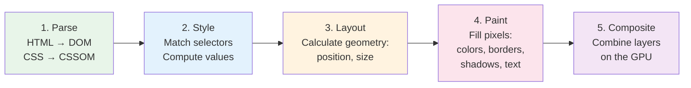
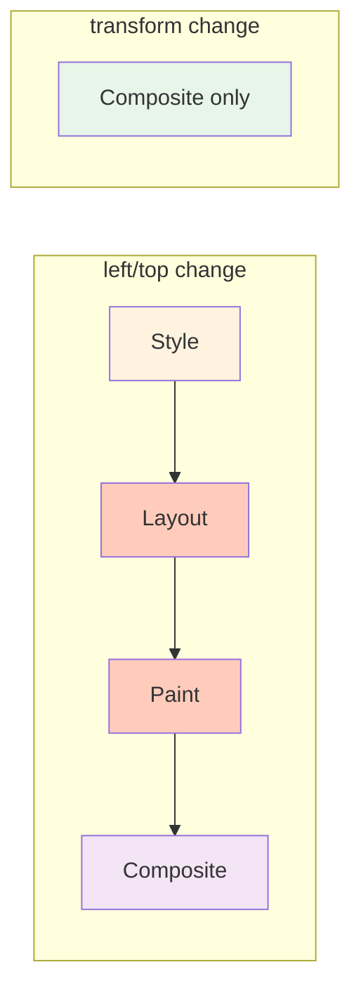

## Why Should I Care?

When you drag a window across this desktop, the browser must update the screen at 60 frames per second — that's 16.6ms per frame to do *all* the work. Understanding the rendering pipeline tells you exactly why `transform: translate()` is used for window position instead of `left`/`top`, why the CRT scanline overlay uses `pointer-events: none`, and why `will-change: transform` is added only during active drag.

Every CSS property you change triggers a different amount of work in the pipeline. Knowing which properties are cheap and which are expensive is the difference between smooth 60fps interactions and visible jank.

## The Five Stages

The browser rendering pipeline converts your HTML, CSS, and JavaScript into pixels on screen through five stages:



### Stage 1: Parse

The browser parses HTML into the **DOM tree** and CSS into the **CSSOM** (CSS Object Model). These are combined into the **render tree** — a tree of only visible elements with their computed styles.

### Stage 2: Style Calculation

For each element in the render tree, the browser resolves which CSS rules apply (selector matching), cascades conflicting rules, and computes final values. This is where `inherit`, `em`, `%`, and `var()` resolve to concrete pixel values.

### Stage 3: Layout (Reflow)

The browser calculates the **exact position and size** of every element. This is the most expensive stage for interactive changes because modifying one element's geometry can cascade to its siblings, children, and even unrelated elements.

Properties that trigger layout: `width`, `height`, `top`, `left`, `padding`, `margin`, `display`, `position`, `font-size`, `border-width`.

### Stage 4: Paint

The browser fills in pixels — drawing text, colors, borders, shadows, backgrounds, and images. Paint creates a list of draw commands for each layer.

Properties that trigger paint (but not layout): `color`, `background-color`, `background-image`, `box-shadow`, `border-color`, `outline`, `visibility`.

### Stage 5: Composite

The browser takes painted layers and combines them on the GPU. This is the cheapest step because the GPU is optimized for this exact operation — moving and blending pre-painted bitmaps.

Properties that only trigger composite: **`transform`**, **`opacity`**. These are the "free" properties.

## Why Transform Is "Free"

When you change `transform: translate(x, y)`, the browser skips stages 2–4 entirely. The element is already painted as a layer bitmap on the GPU. The compositor just moves that bitmap to a new position — no style calculation, no layout, no repaint.

This is exactly why windows in this project use `transform: translate()` for position:

```typescript
// In Window.tsx
style={{
  transform: `translate(${props.window.x}px, ${props.window.y}px)`,
  // NOT: left: `${props.window.x}px`, top: `${props.window.y}px`
}}
```

With `left`/`top`, every frame during drag would trigger layout → paint → composite. With `transform`, it's composite only — roughly 100× less work per frame.



## Layers and Layer Promotion

The compositor works with **layers** — independent bitmaps that can be transformed and blended without affecting other layers. Not every element gets its own layer. The browser promotes elements to their own layer when:

1. **`will-change: transform`** or **`will-change: opacity`** is set
2. A CSS `transform` or `opacity` animation is active
3. The element has 3D transforms (`transform: translate3d()`)
4. The element is a `<video>`, `<canvas>`, or uses WebGL
5. The element overlaps another composited layer (implicit promotion)

### The will-change Pattern in This Project

In `Window.tsx`, `will-change` is applied only during active drag:

```typescript
const handleDragStart = (e: PointerEvent): void => {
  // ...
  const windowEl = target.closest('.win-container') as HTMLElement | null;
  if (windowEl) {
    windowEl.style.willChange = 'transform'; // Promote to own layer
  }
};

const handleDragEnd = (e: PointerEvent): void => {
  // ...
  const windowEl = target.closest('.win-container') as HTMLElement | null;
  if (windowEl) {
    windowEl.style.willChange = 'auto'; // Release the layer
  }
};
```

Why not leave `will-change` on permanently? Because every promoted layer consumes GPU memory. A layer stores a bitmap of the element at its rendered size. With 8 open windows at 640×480, that's 8 × 640 × 480 × 4 bytes ≈ 10MB of GPU memory for layers that aren't being animated. On mobile devices with limited GPU memory, this can cause the browser to *de-promote* other layers, actually making things slower.

## The CRT Frame: Compositor-Friendly Effects

The CRT monitor frame in `src/components/desktop/styles/crt-monitor.css` demonstrates compositor-friendly design. The overlays (scanlines, vignette, glass reflection) use properties that avoid layout and paint:

```css
.crt-scanlines {
  position: absolute;
  inset: 0;
  pointer-events: none;        /* Doesn't intercept clicks */
  z-index: 999;
  background: repeating-linear-gradient(
    to bottom,
    transparent 0px,
    transparent 2px,
    rgba(0, 0, 0, 0.035) 2px,
    rgba(0, 0, 0, 0.035) 4px
  );
}
```

The `background` is set once and never changes — no runtime style recalculation. The `pointer-events: none` ensures mouse events pass through to the desktop below, so the overlays have zero impact on interactivity.

The layering uses `z-index` within an absolutely-positioned stacking context. The glass, scanlines, and vignette are separate elements rather than pseudo-elements on the same node, which allows the browser to cache each as an independent layer.

## Stacking Contexts and z-index

A **stacking context** is an independent z-axis scope. Elements in a stacking context are layered relative to each other, not to elements outside the context. Stacking contexts are created by:

- `position: relative/absolute/fixed` + `z-index` (not `auto`)
- `opacity` < 1
- `transform` (any non-`none` value)
- `will-change: transform` or `will-change: opacity`

In the window manager, every window creates a stacking context via `transform: translate()`. This means each window's internal z-ordering (title bar above content, resize handles above everything) is independent of other windows. A z-index of 999 inside one window doesn't interfere with another window's stacking.

## DevTools: Seeing the Pipeline

Chrome DevTools' Performance panel shows exactly which pipeline stages run for each frame:

1. **Performance tab → Record** → interact with the page → **Stop**
2. Look at the **Main** thread flame chart for: Recalculate Style, Layout, Paint, Composite
3. Each green block is composite (fast), each purple block is layout (slow)

The **Layers** panel (`More tools → Layers`) shows all promoted layers and their memory cost. You can see which windows have their own layer during drag.

The **Rendering** tab can enable "Paint flashing" (green rectangles on repainted areas) and "Layout shift regions" — essential for finding unnecessary repaints.

## What Goes Wrong Without This Knowledge

### Common Mistake: Animating `width`/`height`

```css
/* ❌ Triggers layout on every frame */
.window { transition: width 0.3s, height 0.3s; }

/* ✅ Animate transform instead */
.window { transition: transform 0.3s; }
```

Animating `width` triggers layout → paint → composite on every frame. For a smooth 60fps transition, you need each frame to complete in 16.6ms. Layout alone can take 10-20ms for a complex page.

### Common Mistake: Reading Layout After Writing

```typescript
// ❌ Forces synchronous layout (layout thrashing)
element.style.width = '100px';     // Write (schedules layout)
const height = element.offsetHeight; // Read (forces immediate layout!)
element.style.width = '200px';     // Write (schedules ANOTHER layout)
const width = element.offsetWidth;  // Read (forces ANOTHER immediate layout!)

// ✅ Batch reads and writes
const height = element.offsetHeight; // Read
const width = element.offsetWidth;   // Read (uses cached layout)
element.style.width = '100px';      // Write
element.style.height = '50px';      // Write (batched)
```

Reading layout properties (`offsetHeight`, `getBoundingClientRect()`, `clientWidth`) after writing style properties forces the browser to perform layout synchronously — a "forced synchronous layout" or "layout thrashing." SolidJS's fine-grained updates avoid this naturally: each reactive expression only writes to the specific DOM property it's responsible for.

## What If We'd Done It Differently?

If windows used `position: absolute; left: ${x}px; top: ${y}px` instead of `transform: translate()`, every drag frame would trigger:

1. **Style recalculation** — resolve the new `left`/`top` values
2. **Layout** — recalculate the window's position (and potentially sibling positions if they have `position: relative`)
3. **Paint** — repaint the affected region
4. **Composite** — combine layers

On a complex desktop with CRT overlays, multiple windows, and a taskbar, this could easily exceed the 16.6ms frame budget, causing dropped frames during drag. The `transform` approach skips steps 1–3, keeping each frame well within budget.
