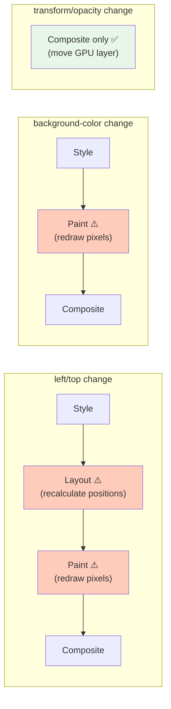

## Why Should I Care?

The difference between smooth 60fps window dragging and janky, stuttering movement comes down to one CSS property choice: `transform: translate()` vs `left`/`top`. This isn't a micro-optimization — it's the difference between the browser recomputing the [layout](https://csstriggers.com/) of every element on the page vs. moving a pre-painted bitmap on the GPU. Understanding the compositor pattern explains why certain CSS properties are "free" to animate, why `will-change` exists, and how to use Chrome DevTools to diagnose rendering performance (see [GPU-accelerated compositing in Chrome](https://www.chromium.org/developers/design-documents/gpu-accelerated-compositing-in-chrome/)).

## Layout vs Paint vs Composite

When you change a CSS property, the browser goes through the [rendering pipeline](/learn/concepts/browser-rendering-pipeline):



- **Layout** (`left`, `top`, `width`, `height`, `margin`, `padding`) — Recalculates positions of elements. Most expensive.
- **Paint** (`background`, `color`, `box-shadow`, `border-color`) — Redraws pixels. Medium cost.
- **Composite** (`transform`, `opacity`) — Moves/blends existing GPU layers. Cheapest — done entirely on the GPU.

## Why transform: translate() for Windows

Every window on the desktop uses `transform: translate(x, y)` instead of CSS `left`/`top` for position. From `src/components/desktop/Window.tsx`:

```typescript
style={{
  // Maximized: uses top/left/width/height (only changes once)
  // Normal: uses transform (changes 60x/sec during drag)
  ...(isFullScreen()
    ? { top: '0', left: '0', width: '100%', height: '...' }
    : {
        width: `${props.window.width}px`,
        height: `${props.window.height}px`,
        transform: `translate(${props.window.x}px, ${props.window.y}px)`,
      }),
}}
```

During drag, only `transform` changes — the compositor moves the window's pre-painted [layer](https://developer.chrome.com/docs/devtools/layers) on the GPU. The browser skips Style, Layout, and Paint entirely:

| Frame budget: 16.6ms | `left`/`top` | `transform` |
|---|---|---|
| Style recalculation | ~0.5ms | Skipped |
| Layout | ~2-10ms (depends on page complexity) | Skipped |
| Paint | ~1-5ms | Skipped |
| Composite | ~0.5ms | ~0.5ms |
| **Total** | **~4-16ms** | **~0.5ms** |

With 8 open windows and CRT overlay effects, the `left`/`top` approach could easily exceed the 16.6ms frame budget, causing dropped frames. `transform` keeps each frame well within budget.

## Layers and GPU Promotion

The compositor works with **layers** — independent bitmaps stored in [GPU memory](https://developer.chrome.com/blog/inside-browser-part3). Not every element gets its own layer (that would exhaust GPU memory). Elements are promoted to layers when:

1. **`will-change: transform`** or `will-change: opacity`
2. A CSS `transform` or `opacity` animation is active
3. 3D transforms (`translate3d`, `rotate3d`)
4. `<video>`, `<canvas>`, or WebGL elements
5. Overlapping another composited layer (implicit promotion)

## The will-change Pattern

[`will-change`](https://developer.mozilla.org/en-US/docs/Web/CSS/will-change) tells the browser to promote an element to its own layer **before** you start animating it. In `Window.tsx`, it's applied only during active drag:

```typescript
const handleDragStart = (e: PointerEvent): void => {
  // ... setup ...
  const windowEl = target.closest('.win-container') as HTMLElement | null;
  if (windowEl) {
    windowEl.style.willChange = 'transform'; // ← Promote to GPU layer
  }
};

const handleDragEnd = (e: PointerEvent): void => {
  // ... cleanup ...
  const windowEl = target.closest('.win-container') as HTMLElement | null;
  if (windowEl) {
    windowEl.style.willChange = 'auto'; // ← Release the GPU layer
  }
};
```

### Why Not Leave will-change On Permanently?

Every promoted layer consumes [GPU memory](https://web.dev/articles/animations-guide). A layer stores a bitmap at the element's rendered size:

```
One window at 640×480 at 2x DPR:
  1280 × 960 × 4 bytes/pixel = ~4.9 MB

Eight windows = ~39 MB of GPU memory for layers alone
```

On mobile devices with limited GPU memory, permanent `will-change` on all windows could cause the browser to de-promote other layers or even trigger software rendering — making things *slower*.

The pattern is: promote before animation, demote after. This is standard practice and matches Chrome's internal optimization advice.

## The CRT Frame: Compositor-Friendly Overlays

The CRT monitor frame in `src/components/desktop/styles/crt-monitor.css` demonstrates compositor-friendly design. The overlay effects use static properties that never change after initial render:

```css
.crt-scanlines {
  position: absolute;
  inset: 0;
  pointer-events: none;  /* Click-through — doesn't intercept events */
  z-index: 999;
  background: repeating-linear-gradient(
    to bottom,
    transparent 0px, transparent 2px,
    rgba(0, 0, 0, 0.035) 2px, rgba(0, 0, 0, 0.035) 4px
  );
}
```

Key choices:
- **`pointer-events: none`** — The overlay doesn't intercept mouse/touch events. Desktop interaction works through the overlay as if it weren't there.
- **Static `background`** — Set once, never animated. No per-frame cost.
- **Separate elements** — Each effect (scanlines, vignette, glass) is a separate DOM element, allowing the browser to cache each as an independent layer.
- **`z-index` stacking** — The overlays stack above the desktop content (z-index 997-999) but below window drag interactions.

## DevTools: Diagnosing Compositor Issues

### Layers Panel

Chrome DevTools → More tools → **Layers** shows all composited layers:
- Each layer's size, memory cost, and reason for promotion
- During window drag, you should see the dragged window as a separate layer
- After drag ends, the layer should merge back (if `will-change` is removed)

### Paint Flashing

Chrome DevTools → Rendering → **Paint flashing** highlights repainted areas in green:
- During window drag with `transform`: no green flashing on the window (no repaint!)
- During window drag with `left`/`top`: the window and possibly surrounding areas flash green every frame

### Performance Panel

Record a drag operation and look at:
- **Compositor** lane: should show compositing work only (no Layout or Paint)
- **Main thread**: should show minimal work per frame (just the pointer event handler + store update)

## Comparison: transform vs left/top vs Web Animations API

| Approach | Thread | Performance | Complexity |
|---|---|---|---|
| `transform: translate()` | Compositor (GPU) | Best — skip Layout/Paint | Low — just update a CSS property |
| `left`/`top` | Main thread → GPU | Poor — triggers Layout | Low — but jank risk |
| Web Animations API | Compositor (GPU) | Best — declarative | Medium — requires animation setup |
| `element.animate()` | Compositor (GPU) | Best — WAAPI with JS control | Medium |

For drag operations (continuous, user-driven), `transform` is the right choice — it's updated synchronously from the pointer event handler and composited on the next frame. The Web Animations API is better for predetermined animations (transitions, keyframes) but awkward for user-driven interaction.

## What If We'd Done It Differently?

If windows used `position: absolute; left: ${x}px; top: ${y}px`:

1. Every drag frame triggers **layout** — the browser recalculates the window's position
2. If other elements depend on the window's position (unlikely here, but common in general layouts), they're recalculated too
3. The affected region is **repainted** — pixels are redrawn
4. Then **composited** — layers are combined

On a page with CRT overlays (multiple full-screen pseudo-elements), 8 open windows, and a taskbar, layout recalculation alone could take 5-10ms — eating into the 16.6ms frame budget and causing visible jank on lower-end devices.
