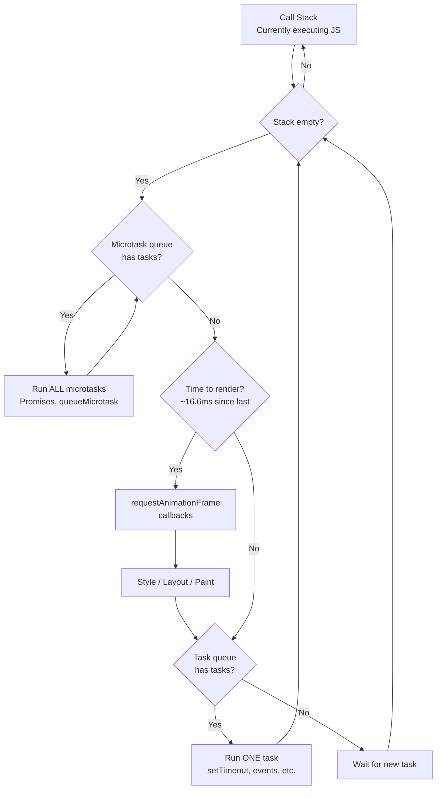
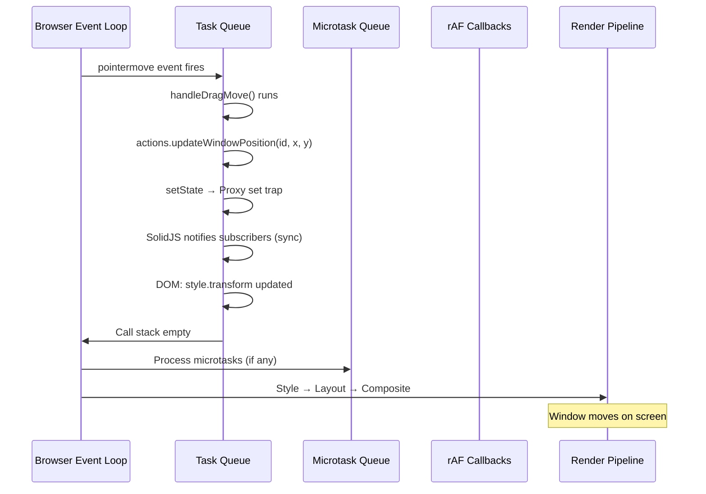

## Why Should I Care?

Every frame of smooth window dragging, every reactive update in the desktop store, every `requestAnimationFrame` call in the Snake game — all of these are scheduled through the event loop. If you don't understand the event loop, you can't reason about *when* your code runs, *why* animations sometimes stutter, or *how* SolidJS batches multiple signal updates into a single DOM update.

The event loop is the execution model of the browser. Everything — user input, network responses, timers, rendering — goes through it. Mastering it is the difference between writing UI code that works and understanding *why* it works.

## The Mental Model

JavaScript is [single-threaded](https://developer.mozilla.org/en-US/docs/Glossary/Thread): only one piece of code runs at a time. The [event loop](https://developer.mozilla.org/en-US/docs/Web/JavaScript/Event_loop) is the mechanism that decides *which* piece of code runs next. Think of it as a conveyor belt at an airport — items (tasks) get placed on the belt, and a single worker (the JS engine) processes them one at a time.



## The Three Queues

### 1. The Call Stack

The currently executing JavaScript. Function calls push frames onto the stack; returns pop them off. The event loop can't do anything else until the stack is empty.

```typescript
function a() { b(); }
function b() { c(); }
function c() { console.log('deep'); }
a();
// Stack: a → b → c → (log) → pop c → pop b → pop a → empty
```

### 2. The Task Queue (Macrotasks)

Tasks queued by the browser for later execution. Each event loop iteration processes **one** task from this queue:

- `setTimeout` / `setInterval` callbacks
- DOM events (click, keydown, pointermove)
- `MessageChannel` / `postMessage`
- I/O callbacks (fetch response, WebSocket message)

### 3. The Microtask Queue

Microtasks are processed **exhaustively** after each task and before rendering. All pending microtasks run before the browser can paint:

- Promise `.then()` / `.catch()` / `.finally()` callbacks
- `queueMicrotask()` calls
- `MutationObserver` callbacks

This distinction matters enormously for reactivity.

## Why Microtasks Matter for Reactivity

SolidJS batches reactive updates synchronously within the current execution context. When you call `setState` multiple times in a row, all changes are collected and dependents are notified in one pass — no intermediate renders:

```typescript
// In desktop-store.ts — openWindow batches multiple changes
setState(produce((s) => {
  s.windows[id] = newWindow;      // Add window
  s.windowOrder.push(id);         // Update order
  s.nextZIndex += 1;              // Bump z-index
  s.startMenuOpen = false;        // Close start menu
}));
// All four changes → one reactive notification pass → one DOM update
```

If SolidJS used `setTimeout` for batching (task queue), the browser might render an intermediate frame showing the window without the taskbar button, or with the start menu still open. Synchronous batching avoids this: all changes apply before the browser gets a chance to render.

Promise-based code, however, splits across microtask boundaries:

```typescript
// Each await creates a microtask boundary
async function loadTerminal() {
  const { Terminal } = await import('@xterm/xterm');  // Microtask boundary
  const { FitAddon } = await import('@xterm/addon-fit'); // Another boundary
  // By now, SolidJS has already processed setIsLoaded(true) reactivity
  // and the browser may have painted a frame
}
```

This is exactly what happens in `TerminalApp.tsx` — the dynamic imports are awaited, creating microtask boundaries. SolidJS handles each reactive update as it occurs, and the browser renders between awaits. This is why the terminal shows a loading state first, then the terminal canvas — the loading state renders during the await.

## requestAnimationFrame and the Render Cycle

`requestAnimationFrame` (rAF) callbacks run right *before* the browser paints, typically at 60fps (~16.6ms intervals). This is where animation logic should live.

In `Snake.tsx`, the game loop uses rAF:

```typescript
function gameLoop(timestamp: number): void {
  if (!isRunning) return;

  if (timestamp - lastTick >= state.tickInterval) {
    lastTick = timestamp;
    if (!(state.paused || state.gameOver)) {
      updateGameState();
    }
  }

  const ctx = canvasRef?.getContext('2d');
  if (ctx) {
    renderGame(ctx, state);
  }

  animationId = requestAnimationFrame(gameLoop);
}
```

The game logic (`updateGameState`) runs inside the rAF callback. The canvas rendering (`renderGame`) also runs here, ensuring the canvas is drawn just before the browser composites the frame. This gives the smoothest possible animation.

Compare this to using `setInterval`:

```typescript
// ❌ setInterval doesn't sync with the browser's render cycle
setInterval(gameLoop, 16); // Might fire AFTER the browser already painted
```

`setInterval` fires as a macrotask. If it runs right after the browser painted, the game update won't be visible until the *next* frame — adding up to 16ms of latency. rAF guarantees the callback runs right before paint.

## Window Drag: A Full Event Loop Trace

When you drag a window across the desktop, here's exactly what happens in each frame:



The key insight: SolidJS updates the DOM *synchronously* within the pointermove handler. By the time the browser reaches the render step, the `transform` property already has the new value. There's no scheduling delay — the update is visible in the very next frame.

## What Goes Wrong: Long Tasks

If a task takes longer than 16ms, the browser can't render during that time. The result: **jank** — a visible stutter in animations and interactions.

```
Frame budget: 16.6ms
├── pointermove handler:     2ms  ← fine
├── React reconciliation:   30ms  ← blocks rendering for 2 frames!
└── SolidJS signal update:   0.1ms ← fine
```

This is one reason SolidJS's fine-grained updates matter for the window manager. React's VDOM diffing is a potentially long synchronous task. SolidJS's direct DOM updates are O(1) — they take the same time regardless of how many components exist.

## Common Timing Pitfalls

### Promise.resolve() vs setTimeout(0)

```typescript
setTimeout(() => console.log('task'), 0);
Promise.resolve().then(() => console.log('microtask'));
// Output: "microtask", "task"
// Microtasks always drain before the next task
```

### Starvation

If microtasks keep queueing more microtasks, the browser can never reach the render step:

```typescript
// ❌ Infinite microtask loop — page freezes
function loop() {
  queueMicrotask(loop);
}
loop(); // Browser never renders again
```

### rAF Scheduling

`requestAnimationFrame` fires once per frame. If you need to do something *after* the browser renders, use a double-rAF or `requestAnimationFrame` + `setTimeout(0)`:

```typescript
// Run after next paint
requestAnimationFrame(() => {
  setTimeout(() => {
    // Browser has painted the previous frame
    fitAddon.fit(); // Now we know the container's rendered dimensions
  }, 0);
});
```

This pattern appears in `TerminalApp.tsx` — the fit addon needs the container's actual dimensions, which are only available after the browser has laid out and painted the element.

## Broader Context

The event loop is specified in the [HTML Living Standard](https://html.spec.whatwg.org/multipage/webappapis.html#event-loops), not the ECMAScript spec. JavaScript-the-language defines the microtask queue (for Promises), but the task queue, rendering steps, and rAF are browser APIs.

Node.js has its own event loop (based on libuv) with different phases: timers → I/O callbacks → idle → poll → check → close callbacks. The concepts are similar, but the ordering differs. Web workers also have event loops but no rendering step.

Understanding the event loop is foundational to understanding every performance optimization in web development — from `will-change` hints (compositor thread) to web workers (separate event loop) to `requestIdleCallback` (run during idle periods between frames).
