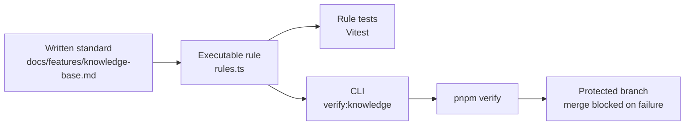

## Why Should I Care?

A checklist in a document is a promise. A quality gate is a promise with teeth. The difference matters because humans and agents both forget: someone renames a knowledge article, forgets to update `relatedConcepts`, and the broken link lives quietly until a reader hits it. An executable gate makes that mistake loud during `pnpm verify`.

This project now treats learning content like code. Markdown is still pleasant to write, but the shape around it is validated by scripts, unit tests, and production-build e2e checks.

## The Mental Model: Standards as Code



The written standard still matters. It explains intent, tradeoffs, and what "good" means. But any rule that can be evaluated deterministically should become code. The audit can check that a prerequisite exists. It cannot judge whether an explanation has soul. The quality gate should automate the first category so humans can spend attention on the second.

## How It Works Here

`package.json` defines the gate:

```json
"verify:knowledge": "node --experimental-strip-types scripts/audit-knowledge.ts",
"verify": "biome check . && astro check && vitest run --passWithNoTests --exclude 'tests/e2e/**' && pnpm verify:knowledge"
```

That order gives each tool a clear job:

| Gate | What it catches |
|---|---|
| `biome check .` | Formatting and lint rules |
| `astro check` | Astro and TypeScript type errors |
| `vitest run` | Unit-level logic regressions |
| `pnpm verify:knowledge` | Knowledge graph and Architecture Explorer contract errors |
| `pnpm test:e2e` | Production-build UI, hydration, iframe, responsive, and visual regressions |

The knowledge audit is intentionally small. `scripts/audit-knowledge.ts` loads input, calls rules, formats a report, and sets `process.exitCode`. The rules live in `scripts/knowledge-audit/rules.ts` so they can be tested without terminal plumbing.

## Why Zod Is Not Enough

Astro content collections already validate frontmatter in `src/content.config.ts`. That gives you schema guarantees:

- `category` is one of the allowed categories
- `externalReferences` is an array of structured objects
- `exercises` have question, answer, and type fields

But schema validation does not know the rest of the repository. It can say "`diagramRef` is a string." It cannot say "that string points to a node in `architecture-data.ts`." It can say "`module` is a string." It cannot say "that string is one of the ids in `src/content/knowledge/modules.ts`." That is why the audit loader collects articles, modules, architecture nodes, and architecture edges into one in-memory graph before the rules run.

## What Counts as an Executable Gate?

A good gate has three properties:

1. **Deterministic**: same input, same output. Link resolution and graph cycles are deterministic. "This paragraph is boring" is not.
2. **Fast enough to run locally**: if developers avoid it, it stops protecting the system.
3. **Actionable output**: the error should name the broken subject and the rule that failed.

This is why `formatKnowledgeAuditReport()` prints lines like:

```text
- [bad-diagram-ref] architecture/overview: architecture/overview uses diagramRef "missing-node", but no architecture node has that id.
```

The message tells you what broke, where it broke, and what relationship to repair.

## Before and After

Before this feature, knowledge quality was mostly social:

- Read `AGENTS.md`
- Remember v1 standards
- Remember v2 standards
- Remember reliability plan notes
- Manually inspect graph links

After this feature, the process is layered:

- Read the canonical standard in `docs/features/knowledge-base.md`
- Run `pnpm verify:knowledge` for graph integrity
- Run `pnpm verify` before commit
- Run `pnpm test:e2e` for `/learn`, Library, Architecture Explorer, responsive behavior, and visual snapshots

The social layer remains, but it has a mechanical floor.

## Broader Context

This is the same idea behind continuous integration and required status checks. CI is valuable because integration problems appear close to the commit that caused them. Protected branches are valuable because they turn a team rule into a merge rule. Visual regression tests are valuable because a layout mistake becomes a diff instead of a surprise in production.

The knowledge audit applies that engineering habit to documentation. Documentation is not exempt from entropy. It just needs different tests.

## What Goes Wrong Without Executable Gates

The dangerous failure mode is confidence without evidence. A feature doc says every new article has prerequisites, exercises, and graph links. The author believes it. The reviewer skims it. The site builds because every field has the right type. But the Architecture Explorer points to an old slug and the learner gets a dead end.

Executable gates do not replace judgment. They make the boring promises enforceable so judgment can focus on teaching quality, architecture fit, and whether the article actually helps someone think better.

## How to Build Your Own Quality Gate

The pattern is transferable to any project that maintains structured content:

1. **Define the contract** — What must be true about every piece of content? In this project: every article has exercises, prerequisites resolve, diagram refs point to real nodes. Write these as code, not comments.
2. **Make it a pure function** — Each rule takes structured input and returns a list of issues. No file I/O, no side effects in the rule itself. Loading data and reporting results are separate concerns.
3. **Wire it into CI** — The gate only works if it runs automatically. [GitHub Actions](https://docs.github.com/en/actions) or any CI system can run `pnpm verify:knowledge` as a required check on every PR.
4. **Distinguish severity** — Some violations are errors (broken references that crash the UI) and some are warnings (style issues that degrade quality). Only errors should block merges; warnings should be tracked and fixed on a cadence.
5. **Keep the audit fast** — The knowledge audit runs in under a second. If a quality gate takes minutes, developers will skip it. Pure functions over in-memory data are fast; spawning browsers or calling APIs is slow.

The broader insight: [executable specifications](https://martinfowler.com/bliki/SpecificationByExample.html) beat written guidelines because they can't be accidentally ignored. Every team has a document that says "always do X" and nobody does X. Turn X into a test and it gets done.

## Connection to Testing Philosophy

Quality gates and test suites serve the same purpose: they make promises verifiable. The difference is scope. A unit test verifies one function's behavior. An [E2E test](https://playwright.dev/docs/intro) verifies a user journey. A quality gate verifies a structural invariant across an entire content corpus.

This project uses all three: [Vitest](https://vitest.dev/) for audit rule logic, Playwright for visual and interaction testing, and the knowledge audit for cross-article graph integrity. Each layer catches what the others can't — unit tests don't verify broken prerequisite links, and graph audits don't verify that a window renders correctly.
