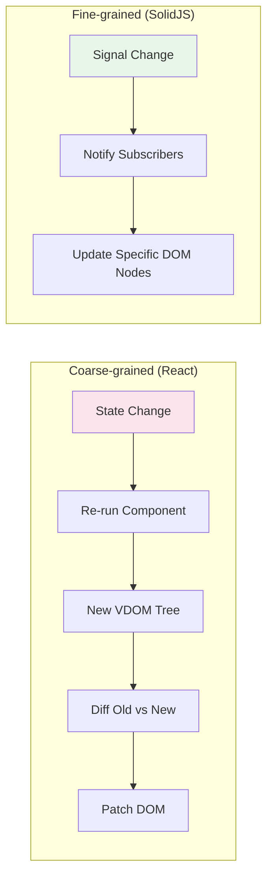
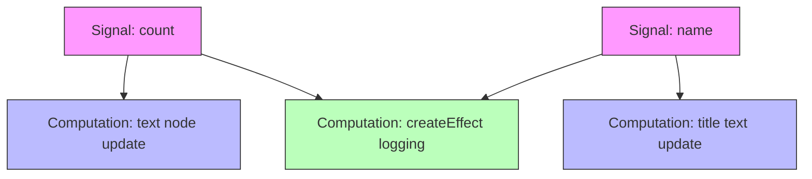

## Why Should I Care?

When you drag a window across this desktop, the browser updates the screen at 60 frames per second. Each frame, only one thing changes: the CSS `transform` of the dragged window. The taskbar doesn't re-render. Other windows don't re-render. The start menu doesn't re-render. Only the specific DOM property that reads the window's `x` and `y` coordinates updates.

This surgical precision isn't manual optimization — it's the default behavior of SolidJS's fine-grained reactivity system. Understanding it explains why the window manager feels responsive, why there's no `React.memo` or `useMemo` anywhere in the codebase, and why SolidJS was chosen over React for this project.

## The Core Mechanism

In [fine-grained reactivity](https://www.solidjs.com/guides/reactivity), the system tracks **which specific values** each piece of UI depends on, and updates **only those pieces** when the values change. No tree walking, no diffing, no reconciliation.

Compare to coarse-grained approaches:
- **React**: "This component's state changed → re-run the entire component function → diff the old and new [virtual DOM](https://legacy.reactjs.org/docs/faq-internals.html) → patch the real DOM"
- **SolidJS**: "This signal changed → run only the specific DOM update expression that reads it"



## Signals: The Foundation

A [signal](https://dev.to/ryansolid/building-a-reactive-library-from-scratch-1i0p) is a reactive value with automatic dependency tracking:

```typescript
const [count, setCount] = createSignal(0);
```

- `count()` — reads the value AND subscribes the current tracking context
- `setCount(1)` — sets the value AND notifies all subscribers

The key insight: when SolidJS compiles JSX, each expression becomes a separate "computation" — an independently-subscribable unit:

```tsx
<span>{count()}</span>
// Compiles roughly to:
// 1. Create a Text node
// 2. Create a computation that reads count() and updates the Text node
// 3. The computation auto-subscribes to count's signal
```

### The Subscription Graph

Every reactive expression creates an edge in a dependency graph:



When `count` changes, only C1 and C3 re-execute. C2 is untouched because it doesn't read `count`. This tracking is automatic — you never specify dependencies manually.

## Automatic Dependency Tracking: Step by Step

Here's exactly what happens when SolidJS encounters a reactive expression:

1. **SolidJS sets a global "current listener"** — the computation being executed
2. **Your code reads a signal** — `count()` is called
3. **The signal's getter records the current listener** — adds it to its subscriber set
4. **The expression finishes** — SolidJS clears the current listener
5. **Later, when the signal changes** — `setCount(1)` iterates the subscriber set and re-runs each computation

This is the [Observer pattern](/learn/concepts/observer-pattern) with automatic subscription management. You never call `subscribe()` or `watch()` — the system infers dependencies from what you read.

## Effects and Memos

### createEffect — Side Effects

Runs whenever its tracked dependencies change:

```typescript
createEffect(() => {
  console.log('Count is:', count()); // Re-runs when count changes
});
```

### createMemo — Derived Values

A derived signal that caches its result and only recomputes when dependencies change:

```typescript
const doubled = createMemo(() => count() * 2);
// doubled() is a signal — other computations can subscribe to it
```

Memos are important for avoiding redundant computation. If multiple expressions need `count() * 2`, a memo computes it once and shares the result.

## How This Powers the Desktop

In `src/components/desktop/store/desktop-store.ts`, the desktop store uses SolidJS's `createStore` — which extends reactivity to nested objects via [JavaScript Proxies](/learn/concepts/javascript-proxies):

```typescript
const [state, setState] = createStore<DesktopState>({
  windows: {
    'browser-1': { x: 100, y: 50, title: 'CV', zIndex: 10 },
    'terminal-1': { x: 200, y: 100, title: 'Terminal', zIndex: 11 },
  },
  startMenuOpen: false,
});
```

Reading `state.windows['browser-1'].x` tracks only that specific path. When a drag operation updates it:

```typescript
actions.updateWindowPosition('browser-1', 250, 150);
// Internally: setState(produce(s => { s.windows['browser-1'].x = 250; ... }))
```

SolidJS updates **only** the `transform` style of browser-1's DOM element. The terminal window doesn't re-render. The taskbar doesn't re-render. Only the CSS transform changes.

## Cleanup and Disposal

When a component unmounts (e.g., a window closes), all its computations must be cleaned up — otherwise they'd continue subscribing to signals and running effects for a component that no longer exists.

SolidJS handles this through **ownership scoping**: every computation is created within a scope (the component function, an effect, etc.). When the scope is disposed, all computations within it are automatically unsubscribed.

```typescript
// Window closes → component scope disposes
// → all effects and memos created in the component are cleaned up
// → their subscriptions are removed from signal subscriber sets
// → no memory leaks, no phantom updates
```

SolidJS's `onCleanup()` hook runs when the current scope is disposed:

```typescript
onCleanup(() => {
  resizeObserver?.disconnect();
  fitAddonInstance?.dispose();
  terminalInstance?.dispose();
});
```

This appears in `TerminalApp.tsx` — when the terminal window closes, the ResizeObserver, FitAddon, and Terminal instances are cleaned up.

## The Diamond Problem: Glitch-Free Propagation

A potential issue in reactive systems: if computation C depends on both A and B, and both change simultaneously, C might see an inconsistent state (A has changed, B hasn't yet). This is called a **glitch**.

```
Signal A ─┐
           ├──→ Computation C (reads A + B)
Signal B ─┘
```

SolidJS solves this with **synchronous, batched propagation**: when multiple signals change in one `produce()` callback, all updates are collected and propagated in topological order. C runs once, seeing both new values.

```typescript
// In openWindow — multiple signals change atomically
setState(produce((s) => {
  s.windows[id] = newWindow;    // Changes windows
  s.windowOrder.push(id);       // Changes windowOrder
  s.nextZIndex += 1;            // Changes nextZIndex
  s.startMenuOpen = false;      // Changes startMenuOpen
}));
// Computations that read any of these values run ONCE after all changes
```

## Comparison: The Reactivity Family

Fine-grained reactivity isn't unique to SolidJS. It has a lineage:

| Framework | Year | Mechanism | Granularity |
|---|---|---|---|
| **Knockout.js** | 2010 | Observables | Per-observable |
| **MobX** | 2015 | Proxy/Object.defineProperty | Per-property |
| **Vue 2** | 2016 | Object.defineProperty | Per-property (with caveats) |
| **Vue 3** | 2020 | Proxy | Per-property |
| **SolidJS** | 2021 | Signals + Proxy stores | Per-expression |
| **Preact Signals** | 2022 | Signals | Per-signal |
| **Angular Signals** | 2023 | Signals | Per-signal |

SolidJS's innovation isn't the reactive primitive (signals are decades old) — it's the integration with JSX compilation. By making each JSX expression an independent computation, SolidJS achieves per-expression granularity: not per-component (React), not per-property (Vue), but per-DOM-binding.

## What If We'd Done It Differently?

Without fine-grained reactivity, the window manager would need manual optimization:

```tsx
// React version — needs memoization to avoid full tree re-renders
const Window = React.memo(({ window }) => {
  // This function re-runs on every state change unless memoized
  return <div style={{ transform: `translate(${window.x}px, ${window.y}px)` }} />;
});

// SolidJS version — no memoization needed
function Window(props) {
  // This function runs ONCE. The style expression tracks props.window.x automatically.
  return <div style={{ transform: `translate(${props.window.x}px, ${props.window.y}px)` }} />;
}
```

With React, you'd need `React.memo` on the Window component, `useMemo` for the style object, and possibly `useCallback` for event handlers — all to prevent the entire window tree from re-rendering during drag. With SolidJS, the surgical update is the default behavior.
