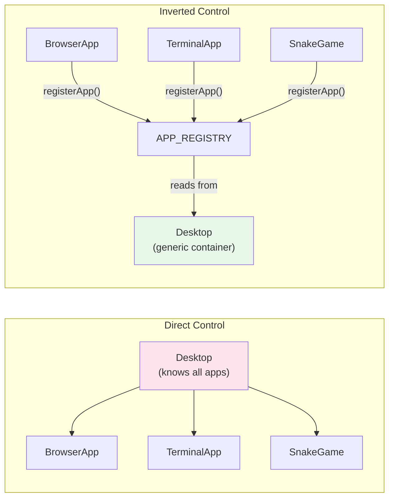
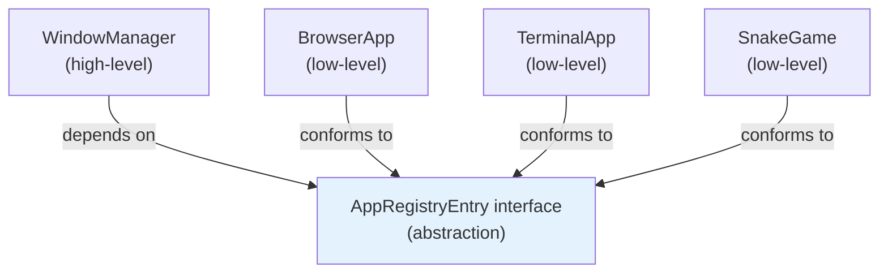

## Why Should I Care?

Inversion of Control (IoC) is the design principle that makes the app registry work. Without it, adding a new app would require editing 4-5 files across the codebase. With it, you create a component, call `registerApp()`, and everything works — following the [SOLID principles](https://en.wikipedia.org/wiki/SOLID). Understanding [IoC](https://martinfowler.com/bliki/InversionOfControl.html) explains not just this project's extensibility, but the architecture of frameworks ([Express middleware](https://expressjs.com/en/guide/using-middleware.html), React hooks), plugin systems ([VS Code extension anatomy](https://code.visualstudio.com/api/get-started/extension-anatomy), webpack plugins), and why "the framework calls you" instead of "you call the framework."

## The Traditional Way: Direct Control

In a direct-dependency approach, the desktop would import every app and decide what to render:

```typescript
// Desktop.tsx — knows about every app (tightly coupled)
import { BrowserApp } from './BrowserApp';
import { TerminalApp } from './TerminalApp';
import { SnakeGame } from './SnakeGame';

function renderApp(id: string) {
  if (id === 'browser') return <BrowserApp />;
  if (id === 'terminal') return <TerminalApp />;
  if (id === 'snake') return <SnakeGame />;
  // Must edit this switch for every new app!
}
```

The control flow is: **Desktop calls apps**. The desktop controls which apps exist, how they're rendered, and when they're loaded. Adding a new app means editing this file.

## The Inverted Way: Apps Register Themselves

With inversion of control, the direction flips:



Apps declare themselves to the registry. The desktop reads from the registry:

```typescript
// WindowManager.tsx — doesn't know about specific apps
const AppComponent = resolveAppComponent(windowState.app);
return <Dynamic component={AppComponent} />;
```

Now the control flow is: **Apps provide themselves to the framework**. The desktop is a generic container. Adding a new app never requires editing the desktop.

## IoC vs DI vs Service Locator — They're Different Things

These terms are often confused. They're related but distinct:

### Inversion of Control (IoC) — The Principle

IoC is the *direction* of dependency. Instead of your code calling library functions, the framework calls your code. This is sometimes called the ["Hollywood Principle"](https://en.wikipedia.org/wiki/Hollywood_principle): *Don't call us, we'll call you.*

In this project: apps don't call `desktop.addApp(this)`. The desktop calls `APP_REGISTRY[id].component` when it needs to render an app. The registry is the intermediary that inverts the dependency direction.

### [Dependency Injection](https://martinfowler.com/articles/injection.html) (DI) — One IoC Technique

DI provides dependencies from outside rather than having code create them:

```typescript
// Without DI: Window creates its own state
function Window() {
  const store = new DesktopStore(); // ← creates dependency internally
}

// With DI: Window receives state from context
function Window() {
  const [state, actions] = useDesktop(); // ← receives dependency
}
```

SolidJS's `useDesktop()` is a form of dependency injection — the store is created by `DesktopProvider` and injected into any component that calls the hook. The component doesn't know how the store was created or where it lives.

### Service Locator — Another IoC Technique

A service locator is a central registry that other code queries:

```typescript
// APP_REGISTRY is a service locator
const component = APP_REGISTRY[appId]?.component;
```

The `APP_REGISTRY` in `src/components/desktop/apps/registry.ts` is literally a service locator — a key-value map that any consumer can query to find a registered service (app component). The registry pattern is a specific application of the service locator pattern.

## The Framework vs Library Distinction

IoC is what separates a *framework* from a *library*:

- **Library**: You call it. `const result = marked.parse(markdown)` — you control when and how parsing happens.
- **Framework**: It calls you. `registerApp({ component: MyApp })` — the framework decides when and how to render your component.

The desktop system is a micro-framework: it provides lifecycle management (open/close/focus/minimize), rendering infrastructure (Window chrome, Suspense), and discovery mechanisms (registry). Apps plug into this framework rather than calling it.

## Real-World Examples Beyond This Project

### Express Middleware

```javascript
app.use(cors());         // Register middleware
app.use(bodyParser());   // Register middleware
app.get('/api', handler); // Register route handler
// Express decides when to call these — you don't call Express
```

### React Hooks

```typescript
function Counter() {
  const [count, setCount] = useState(0);  // Register state
  useEffect(() => {                       // Register effect
    document.title = `Count: ${count}`;
  }, [count]);
  // React decides when to run the effect — you don't call React
}
```

### VS Code Extensions

```json
// package.json — declare what the extension provides
{
  "contributes": {
    "commands": [{ "command": "myExt.doThing", "title": "Do Thing" }],
    "languages": [{ "id": "mylang", "extensions": [".ml"] }]
  }
}
```

VS Code discovers extensions, loads them, and calls their `activate()` function. The extension declares capabilities; VS Code decides when to invoke them.

### Webpack Plugins

```javascript
module.exports = {
  plugins: [
    new HtmlWebpackPlugin(),  // Register plugin
    new MiniCssExtractPlugin(), // Register plugin
  ],
};
// Webpack calls plugin hooks at the right build stages
```

The pattern is always the same: **registration** (declare capabilities) → **discovery** (the framework finds registrations) → **invocation** (the framework calls at the right time).

## SOLID Connection: Dependency Inversion Principle

IoC is closely related to the Dependency Inversion Principle (the "D" in SOLID):

> High-level modules should not depend on low-level modules. Both should depend on abstractions.

In this project:
- **High-level module**: `WindowManager.tsx` — renders windows with app components
- **Low-level modules**: `BrowserApp`, `TerminalApp`, `SnakeGame` — specific apps
- **Abstraction**: `AppRegistryEntry` interface + `APP_REGISTRY`

`WindowManager` depends on the `AppRegistryEntry` interface, not on `BrowserApp` or `TerminalApp`. Apps depend on the same interface (they conform to it via `registerApp()`). Neither depends on the other. Both depend on the abstraction.



## What Goes Wrong Without IoC

Without IoC, the desktop would have **direct dependencies** on every app:

```typescript
// Desktop.tsx imports every app
import { BrowserApp } from './BrowserApp';     // Direct dependency
import { TerminalApp } from './TerminalApp';   // Direct dependency
import { SnakeGame } from './games/Snake';      // Direct dependency
```

Consequences:
1. **Adding an app** requires editing `Desktop.tsx` (or `WindowManager.tsx`)
2. **Removing an app** requires editing the same files
3. **Lazy loading** requires per-app `if` statements
4. **Testing** the desktop requires importing every app
5. **Build** — changing any app potentially invalidates the desktop's chunk

With IoC, the desktop only depends on the registry interface. Apps can be added, removed, or changed without touching desktop code.
