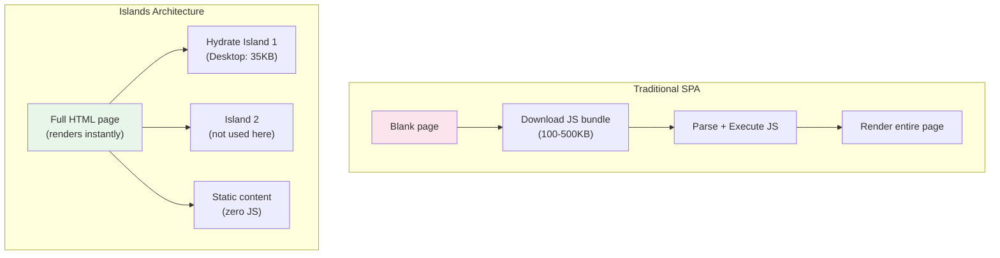
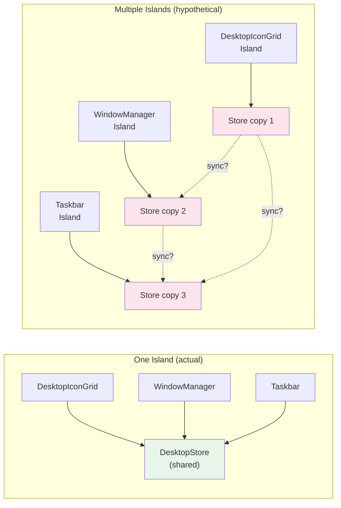

## Why Should I Care?

Most web frameworks force a choice: either your entire page is a JavaScript application (SPA), or it's entirely static HTML. Islands architecture breaks this dichotomy — the page is mostly static HTML with isolated "islands" of interactivity that hydrate independently. This means the browser renders content immediately (static HTML is fast), and JavaScript only loads for the parts that actually need it.

In this project, understanding islands explains why the desktop is a single SolidJS component, why the `/learn/*` pages ship zero framework JavaScript, and why the site loads fast despite having a full window manager.

## The Concept

In traditional SPAs (Create React App, Vite + React), the entire page is JavaScript-rendered. The browser downloads a JS bundle, parses it, executes it, and then generates HTML. Until that's done, users see nothing.

In islands architecture, the page is server-rendered static HTML with isolated "islands" of interactivity:



Each island:
- **Hydrates independently** — doesn't block other islands or static content
- **Can use a different framework** — one island could be React, another Svelte
- **Only ships JavaScript for interactive parts** — static content has zero JS overhead

## Why One Island?

This site has exactly **one** island: `<Desktop client:load />` in `src/pages/index.astro`. Why not split it into multiple?

### The Shared State Problem

The desktop requires coordinated state: windows, taskbar, and icons all need access to the same `DesktopStore`. Multiple islands would mean separate SolidJS instances that **cannot share reactive context**.



With multiple islands, you'd need:
- A **message bus** for cross-island communication
- **Serialization** of reactive state into messages
- **Synchronization logic** to keep stores consistent
- **Race condition handling** when updates arrive out of order

This is complex, fragile, and defeats the purpose. The entire desktop is interactive — there's no "static gap" between islands that would justify splitting them.

### A Concrete Failure Scenario

Imagine the icons and window manager are separate islands. User double-clicks "Terminal" icon:

1. Icons island calls `openWindow('terminal')` on its local store
2. Icons island emits a `window-opened` event
3. Event is serialized and dispatched to the WindowManager island
4. WindowManager receives the event... but when? Before or after the next render?
5. User sees: icon responds instantly, but the window appears 50-100ms later
6. Taskbar (third island) receives the event even later — button appears with a visible delay

With one island, step 2-5 collapse into a single synchronous reactive update — icon click → store update → window appears → taskbar updates, all in one frame.

## Astro Hydration Directives

Astro controls when islands hydrate with `client:*` directives:

| Directive | When it Hydrates | Use Case |
|---|---|---|
| `client:load` | Immediately on page load | Interactive content that must work immediately (our Desktop) |
| `client:idle` | When the browser is idle | Lower-priority interactive widgets |
| `client:visible` | When the element scrolls into view | Below-the-fold interactive content |
| `client:media` | When a media query matches | Mobile-only or desktop-only interactions |
| *(none)* | Never (static HTML only) | Content that doesn't need JavaScript |

We use `client:load` because the desktop must be interactive immediately — there's no useful static state to show first. The `<noscript>` fallback provides an alternative for users without JavaScript.

## Islands vs SPAs vs MPAs

| Architecture | JavaScript Shipped | Initial Load | Interactivity | Navigation |
|---|---|---|---|---|
| **SPA** (React, Vue) | Everything | Slow (JS must execute first) | Full page is interactive | Client-side routing |
| **MPA** (plain HTML) | None/minimal | Fast (static HTML) | Limited or none | Full page reloads |
| **Islands** (Astro) | Only for interactive parts | Fast (static HTML + targeted JS) | Where needed | Full page reloads (or View Transitions) |
| **Partial Hydration** (Qwik) | Progressively, on interaction | Very fast (zero JS until click) | Where needed, on demand | Client-side routing |

This project is an interesting case: the main page (`/`) is essentially a full-page SPA inside a single island. But the `/learn/*` pages are pure MPAs — zero JavaScript (except the Mermaid rendering script). Astro lets you mix both approaches in one site.

## The Serialization Boundary

Islands have a **serialization boundary** — data passed from Astro (server) to an island (client) must be serializable as HTML attributes or JSON. You can't pass functions, class instances, or reactive objects across this boundary.

In this project, the serialization happens through `<script type="application/json">` tags:

```astro
<!-- index.astro -->
<Desktop client:load />
<script type="application/json" id="cv-data" set:html={JSON.stringify(cvData)} />
```

The Desktop island doesn't receive data as props. Instead, it reads the JSON from the DOM at runtime (`document.getElementById('cv-data')`). This avoids the serialization boundary entirely — the data is plain JSON, and the island reads it like any other DOM operation.

## Framework Comparison

| Framework | Islands? | Hydration Strategy | JS Framework |
|---|---|---|---|
| **Astro** | Yes (native) | Selective (`client:*` directives) | Any (React, Solid, Svelte, Vue) |
| **Fresh** (Deno) | Yes | Similar to Astro | Preact only |
| **Qwik** | Partial hydration | Resumability (no hydration cost) | Qwik (custom) |
| **Next.js** | Server Components | Full page hydration + RSC | React only |
| **Remix** | No | Full page hydration | React only |
| **Nuxt** | No | Full page hydration | Vue only |

Astro's islands are framework-agnostic — you could use React for one island and SolidJS for another on the same page. This flexibility was important during development: the project started with SolidJS but could theoretically migrate individual components to another framework.

## The /learn/* Pages: Zero-Island Content

The knowledge base pages (`/learn/*`) demonstrate the other end of the islands spectrum — fully static pages with no SolidJS island:

```astro
<!-- /learn/[...slug].astro -->
<LearnLayout title={entry.data.title}>
  <article>
    <Content />
    <!-- Rendered Markdown — pure HTML -->
  </article>
</LearnLayout>
```

These pages ship zero framework JavaScript. The only client-side script is a small Mermaid renderer that converts code blocks to SVG diagrams. The entire reading experience works without JavaScript (diagrams just show as raw Mermaid syntax).

This is progressive enhancement by architecture: static HTML for reading, JavaScript only for the interactive desktop experience.
