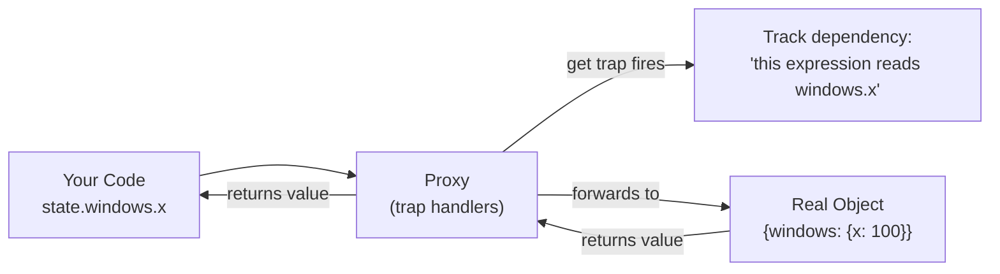
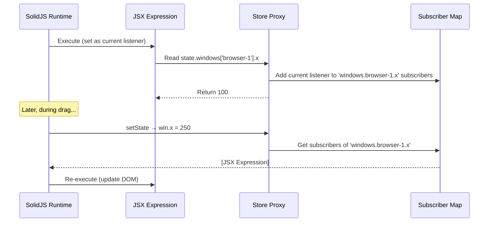

## Why Should I Care?

JavaScript Proxies are the mechanism that makes SolidJS stores feel like plain objects while secretly tracking every property access. When you write `state.windows['browser-1'].x` in a component, you're not reading from a normal object — you're triggering a Proxy trap that subscribes that specific expression to future changes of that exact property path. Without Proxies, fine-grained reactivity on nested objects would require either manual subscription calls or a completely different API.

Understanding Proxies explains why SolidJS stores track at the property level, why Vue 3 is faster than Vue 2, and why certain JavaScript patterns (like spreading a store into a plain object) silently break reactivity.

## The Mental Model

Think of a Proxy as a **transparent wrapper** around an object. You interact with it like a normal object — read properties, set values, delete keys — but every operation passes through customizable *trap handlers* that can intercept, modify, or log the operation before it reaches the real object.



## How Proxies Work

The `Proxy` constructor takes a target object and a handler with trap functions:

```typescript
const handler = {
  get(target, property, receiver) {
    console.log(`Reading ${String(property)}`);
    return Reflect.get(target, property, receiver);
  },
  set(target, property, value, receiver) {
    console.log(`Writing ${String(property)} = ${value}`);
    return Reflect.set(target, property, value, receiver);
  },
};

const data = { x: 100, y: 200 };
const proxy = new Proxy(data, handler);

proxy.x;       // Logs: "Reading x" → returns 100
proxy.y = 300; // Logs: "Writing y = 300" → sets data.y to 300
```

The `Reflect` API mirrors each Proxy trap, providing the default behavior. This is important: you almost always want to call `Reflect.get` / `Reflect.set` inside your traps to preserve normal object semantics while adding your custom logic.

### Available Traps

Proxies can intercept 13 fundamental operations:

| Trap | Intercepts | Use Case |
|---|---|---|
| `get` | Property reads | Dependency tracking |
| `set` | Property writes | Change notification |
| `has` | `in` operator | Reactive `if ('key' in obj)` |
| `deleteProperty` | `delete obj.key` | Reactive deletion |
| `ownKeys` | `Object.keys()`, `for...in` | Reactive iteration |
| `apply` | Function calls | Proxy-wrapped functions |
| `construct` | `new` operator | Factory interception |

For reactivity systems, `get` and `set` are the critical traps.

## How SolidJS Stores Use Proxies

SolidJS's `createStore` wraps your state object in nested Proxies. Each property access through a Proxy `get` trap registers a **dependency** in the current reactive scope (effect, memo, or JSX expression). Each mutation through a `set` triggers notifications to all dependents of that specific path.

Here's the conceptual model of what happens in this project's desktop store:

```typescript
// In desktop-store.ts
const [state, setState] = createStore<DesktopState>({
  windows: {
    'browser-1': { x: 100, y: 50, title: 'CV', zIndex: 10 },
    'terminal-1': { x: 200, y: 100, title: 'Terminal', zIndex: 11 },
  },
  startMenuOpen: false,
});
```

When `Window.tsx` renders the browser window's position:

```tsx
// Inside Window.tsx — reading props.window.x
style={{ transform: `translate(${props.window.x}px, ${props.window.y}px)` }}
```

The Proxy `get` trap fires for `window.x` and `window.y`, registering this JSX expression as a subscriber of those specific paths. When a drag operation calls:

```typescript
setState(produce((s) => {
  const win = s.windows['browser-1'];
  if (win) {
    win.x = 250;  // Proxy set trap fires → notifies x subscribers
    win.y = 150;  // Proxy set trap fires → notifies y subscribers
  }
}));
```

Only the CSS `transform` expression for `browser-1` re-evaluates. The terminal window's transform doesn't recompute. The taskbar doesn't recompute. The start menu doesn't recompute.

## The Reactivity Tracking Mechanism

The tracking works through a global "current listener" variable. When SolidJS runs an effect or JSX expression, it sets itself as the current listener. Any Proxy `get` trap that fires during execution adds the current listener to that property's subscriber set:



This is automatic — you never call `subscribe()` or `watch()`. The Proxy traps detect *what you read* and subscribe you automatically.

## Comparison: Three Generations of Reactivity

| Generation | Mechanism | Framework | Granularity |
|---|---|---|---|
| **Dirty checking** | Poll all values on a timer/digest cycle | AngularJS (1.x) | All bound values checked every cycle |
| **Object.defineProperty** | Define getters/setters on existing properties | Vue 2 | Per-property, but can't detect new properties or array mutations |
| **Proxy** | Intercept all operations including new properties | SolidJS, Vue 3 | Per-property, including dynamic keys and deletions |

`Object.defineProperty` (Vue 2's approach) requires walking the entire object at initialization and defining getters/setters on every property. It can't detect when a new property is added (`this.newProp = value` is not reactive) or when an array is mutated by index (`arr[5] = value` doesn't trigger). These are well-known Vue 2 gotchas.

Proxies solve both problems: the `get`/`set` traps intercept all property access dynamically, including properties that don't exist yet. This is why SolidJS stores handle dynamic window IDs naturally — when `openWindow` adds `windows['terminal-2']` to the store, any component iterating `windowOrder` and reading from `windows` picks it up automatically.

## Edge Cases and Gotchas

### Destructuring Breaks Reactivity

```typescript
// ❌ WRONG — loses reactivity
const { x, y } = state.windows['browser-1'];
// x and y are now plain numbers, not proxy-wrapped reads

// ✅ CORRECT — preserves reactivity
const win = state.windows['browser-1'];
// Access win.x and win.y in JSX (through the proxy)
```

When you destructure, JavaScript reads the properties once (triggering `get` traps), extracts the primitive values, and assigns them to local variables. Those local variables are plain numbers — they're no longer connected to the Proxy. Future changes to the store won't update them.

This is why SolidJS components access `props.window.x` directly rather than destructuring window properties at the top of the component.

### Spreading Removes the Proxy

```typescript
// ❌ Loses reactivity — creates a plain object copy
const plainWindow = { ...state.windows['browser-1'] };

// ✅ Access through the store proxy
const win = state.windows['browser-1'];
```

The spread operator reads every property (triggering `get` traps for all of them), then copies the values into a new plain object. The new object has no Proxy wrapper.

### Proxy Identity

A Proxy and its target are different objects:

```typescript
const target = { a: 1 };
const proxy = new Proxy(target, {});
proxy === target; // false
```

SolidJS handles this internally, but it's why you should always access store state through the returned `state` object, never keep a direct reference to the underlying data.

## What If We'd Done It Differently?

Without Proxies, SolidJS would need a more explicit API for nested state — something like:

```typescript
// Hypothetical non-Proxy API
const x = store.get('windows', 'browser-1', 'x'); // Explicit path
store.set(['windows', 'browser-1', 'x'], 250);    // Explicit path
```

This is essentially what MobX 4 and earlier required. Proxies let you write `state.windows['browser-1'].x` — natural JavaScript property access — while the framework does the tracking behind the scenes. The developer experience improvement is enormous for deeply nested state like the desktop store's `windows` map.

## Browser Support and Performance

Proxies are available in all modern browsers (Chrome 49+, Firefox 18+, Safari 10+, Edge 12+). They cannot be polyfilled — the ES5 `Proxy` polyfills only support a subset of traps. This is one reason SolidJS does not support IE11.

Performance-wise, Proxy property access is slightly slower than direct property access (benchmarks show ~2-5x slower for raw get/set). However, in a UI framework, the property access cost is negligible compared to DOM operations. The net effect is positive: Proxies enable surgical DOM updates that avoid far more expensive work (diffing, re-rendering).
