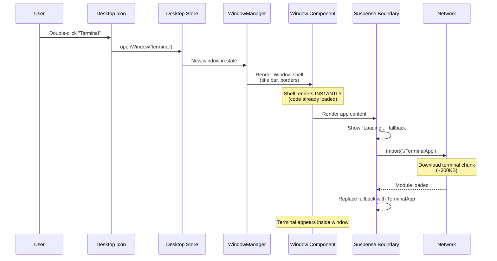
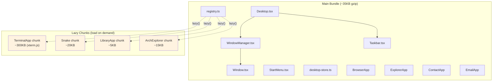

## Why Should I Care?

xterm.js is ~300KB. If it loaded on page startup, the desktop would take seconds to become interactive — even for users who never open the terminal. Code splitting solves this: heavy code is extracted into separate chunks that load on demand, keeping the initial bundle at ~35KB. Understanding this pattern explains why the window shell renders instantly (its code is already loaded) while the app content shows a loading indicator (its chunk is downloading).

## The Problem: Bundle Bloat

Without [code splitting](https://developer.mozilla.org/en-US/docs/Glossary/Code_splitting), every `import` at the top of a file adds to the main bundle — the code that downloads before the page is usable:

```typescript
// ❌ All of these load on page startup
import { TerminalApp } from './TerminalApp';   // +300KB (xterm.js)
import { SnakeGame } from './games/Snake';      // +20KB
import { LibraryApp } from './library/LibraryApp'; // +5KB
import { ArchitectureExplorer } from './architecture-explorer/ArchitectureExplorer'; // +15KB
// Main bundle: ~35KB (desktop) + 340KB (apps) = ~375KB
```

Time to interactive would increase from <1.5s to potentially 3-4s on mobile connections.

## The Solution: Dynamic import() + lazy()

Heavy apps are wrapped in [`lazy()`](https://docs.solidjs.com/reference/component-apis/lazy) in `src/components/desktop/apps/app-manifest.ts`:

```typescript
const TerminalApp = lazy(() =>
  import('./TerminalApp').then(m => ({ default: m.TerminalApp }))
);
const SnakeGame = lazy(() =>
  import('./games/Snake').then(m => ({ default: m.SnakeGame }))
);
```

This tells the bundler ([Vite/Rollup](https://vite.dev/guide/features.html#async-chunk-loading-optimization)) to split each app and its dependencies into a separate chunk file. The chunk only downloads when the user first opens the app.

## How It Works at Runtime



The key insight: the **window shell** (title bar, borders, minimize/maximize/close buttons) appears **instantly** because it's part of `Window.tsx`, which is in the main bundle. Only the **content area** shows a loading indicator while the app chunk downloads.

## Chunk Boundaries in This Project



Light apps (BrowserApp, ExplorerApp, EmailApp, ContactApp) are imported directly — they're small enough that code splitting would add overhead (extra network request) without meaningful bundle size benefit.

## How Rollup/Vite Decide Chunk Boundaries

The bundler creates a new chunk at every `import()` call:

```typescript
// Static import — bundled with the importing file
import { registerApp } from './registry';

// Dynamic import — new chunk boundary
const module = await import('./TerminalApp');
```

Vite/Rollup also creates shared chunks for dependencies used by multiple lazy chunks. If both TerminalApp and Snake imported the same utility library, that library would be extracted into a shared chunk loaded by both.

## The Suspense Boundary

SolidJS's `<Suspense>` component shows a fallback while lazy components load. In `WindowManager.tsx`, every app is wrapped in Suspense:

```typescript
<Window window={win}>
  <Suspense fallback={<LoadingFallback />}>
    {AppComponent ? <Dynamic component={AppComponent} {...(win.appProps ?? {})} /> : null}
  </Suspense>
</Window>
```

`LoadingFallback` is a simple centered "Loading..." message. Because it's inside the `<Window>` shell, the user sees a familiar window with loading content — not a blank screen or an abstract spinner.

### Suspense Placement Strategy

The Suspense boundary is per-window, not per-desktop. This means:
- Opening a lazy app shows loading **in that window only** — other windows are unaffected
- Opening a non-lazy app (BrowserApp) shows no loading indicator at all
- Multiple lazy apps can load simultaneously in separate windows

## The Waterfall Problem and Preloading

Lazy loading has a tradeoff: the first time a user opens a lazy app, there's a network fetch. If the app has nested lazy imports, you get a **waterfall**:

```
Frame 1:  Download TerminalApp chunk ──────→
Frame 2:                                     Download xterm.js ──────→
Frame 3:                                                              Download addon-fit ──→
```

Vite mitigates this with **async chunk loading optimization**: when a chunk is requested, Vite also fetches its static imports in parallel. So xterm.js and addon-fit would load simultaneously, not sequentially.

For predicted user paths, you could use `<link rel="modulepreload">` to start downloading chunks before the user clicks:

```html
<!-- Preload terminal chunk if you expect users to open the terminal -->
<link rel="modulepreload" href="/assets/TerminalApp-abc123.js" />
```

This project doesn't currently preload any chunks — the lazy loading latency is acceptable for the use case.

## The AGENTS.md Rule

From `AGENTS.md`:

> xterm.js, games, WASM modules must always be behind dynamic `import()` / SolidJS `lazy()`. Never import them at the top level of any file that loads on page startup. The window shell renders immediately; the body shows a loading indicator via `<Suspense>`.

This is a hard rule, not a suggestion. It protects the critical path (~35KB) from accidental bloat. A single top-level `import` of xterm.js would increase the initial bundle by ~300KB — nearly 10× the current size.

## What Goes Wrong Without Code Splitting

| Metric | With Code Splitting | Without |
|---|---|---|
| Initial bundle | ~35KB gzip | ~375KB gzip |
| Time to interactive | <1.5s (3G) | ~4s (3G) |
| First terminal open | ~1s delay (chunk download) | Instant (already loaded) |
| Users who never open terminal | Save ~300KB download | Waste ~300KB download |

The tradeoff is a one-time delay when first opening a lazy app. After the chunk is cached by the browser, subsequent opens are instant.

## Beyond This Project: Advanced Patterns

### Route-Based Splitting

Frameworks like Next.js and Remix automatically split by route — each page is a separate chunk. Astro does this too: each `.astro` page produces its own HTML file with only the JavaScript it needs.

### Component-Based Splitting

What this project does — splitting by component. SolidJS's `lazy()` and React's `React.lazy()` both wrap dynamic imports in a component API.

### Module Federation

Webpack 5's Module Federation allows sharing modules between independently deployed applications — useful for micro-frontends but overkill for this project.

### Import Maps

Browser-native import maps (`<script type="importmap">`) allow resolving bare specifiers like `import 'solid-js'` without a bundler. Combined with native ESM, this could eventually eliminate the need for bundling entirely during development.
