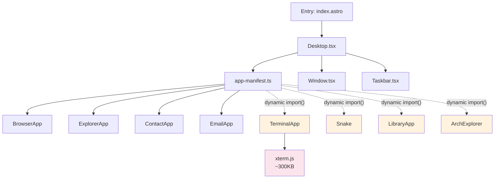

## Why Should I Care?

Every `import` statement in the codebase is a decision about what code loads when. The wrong import strategy can ship 300KB of terminal emulator code to users who never open the terminal. The right strategy loads only the code needed for the initial desktop shell (~35KB), then fetches heavy apps on demand.

Understanding module systems explains why `lazy(() => import('./TerminalApp'))` works, why [tree-shaking](https://developer.mozilla.org/en-US/docs/Glossary/Tree_shaking) removes unused code, why [Vite](https://vite.dev/guide/why.html) serves individual files during development but bundled chunks in production, and why `import.meta.env` behaves differently from `process.env`.

## The Evolution: Three Eras of JavaScript Modules

### Era 1: No Modules (1995–2009)

Early JavaScript had no module system. Scripts shared a single global scope via `<script>` tags:

```html
<script src="utils.js"></script>    <!-- defines window.utils -->
<script src="app.js"></script>      <!-- uses window.utils -->
```

Problems: namespace collisions, implicit ordering dependencies, no way to specify dependencies declaratively. Libraries used the "IIFE module pattern" to avoid global pollution.

### Era 2: CommonJS (2009–present in Node.js)

Node.js introduced `require()` and `module.exports` — synchronous, runtime module loading:

```javascript
// math.js
module.exports = { add: (a, b) => a + b };

// app.js
const math = require('./math');
math.add(1, 2);
```

CommonJS works well for server-side code (files are on disk, `require` is fast). But it's fundamentally **dynamic** — the module specifier can be a variable, and `require` can appear inside `if` blocks. This makes static analysis (and therefore tree-shaking) difficult.

### Era 3: ES Modules (2015–present)

[ES Modules](https://developer.mozilla.org/en-US/docs/Web/JavaScript/Guide/Modules) (ESM) are the language-level module system, designed for static analysis:

```typescript
// math.ts
export const add = (a: number, b: number) => a + b;
export const subtract = (a: number, b: number) => a - b;

// app.ts
import { add } from './math';  // Static — the string is a literal
add(1, 2);
```

Key properties of ESM:
- **Static** — `import` declarations must be at the top level. The import specifier must be a string literal. This lets tools analyze the dependency graph at build time.
- **Async** — In browsers, modules are fetched over the network. The module graph is resolved before execution.
- **Live bindings** — Imported values are references, not copies. If the exporting [module](https://hacks.mozilla.org/2018/03/es-modules-a-cartoon-deep-dive/) changes a value, the importing module sees the change.

## How Bundlers Use the Import Graph

This project uses **Vite** (which uses **Rollup** under the hood for production builds). Here's what the bundler does:



1. **Static imports** (solid lines) are bundled into the main chunk — code that loads on page startup.
2. **Dynamic imports** (dotted lines) become **chunk boundaries** — separate files loaded on demand.

### Tree-Shaking

Because ESM imports are static, [Rollup](https://rollupjs.org/introduction/#tree-shaking) can determine at build time which exports are actually used. Unused exports are removed ("tree-shaken"):

```typescript
// If app-manifest.ts only imports registerApp and getDesktopApps from registry.ts,
// then getStartMenuCategories is removed from the bundle if nothing else uses it.
```

Tree-shaking only works with ESM. CommonJS's `require()` is dynamic — the bundler can't prove which exports are used.

### Chunk Splitting

When Rollup encounters `import()` (dynamic import), it creates a new chunk:

```typescript
// In app-manifest.ts
const TerminalApp = lazy(() =>
  import('./TerminalApp').then(m => ({ default: m.TerminalApp }))
);
```

This produces a separate chunk file (e.g., `TerminalApp-a1b2c3.js`) containing `TerminalApp.tsx` and all its dependencies (xterm.js, xterm-addon-fit). The chunk is only fetched when `import()` is evaluated — when the user opens the terminal.

## Dynamic import(): The Runtime Boundary

`import()` is the bridge between static analysis and runtime loading. It looks like a function call, but it's actually syntax — a special form the language recognizes:

```typescript
// Static import — resolved at build time, bundled
import { registerApp } from './registry';

// Dynamic import — resolved at runtime, separate chunk
const module = await import('./TerminalApp');
const TerminalApp = module.TerminalApp;
```

Dynamic `import()` returns a Promise that resolves to the module's namespace object. SolidJS's `lazy()` wraps this pattern for components:

```typescript
const TerminalApp = lazy(() =>
  import('./TerminalApp').then(m => ({ default: m.TerminalApp }))
);
```

`lazy()` returns a component that, when first rendered, triggers the dynamic import. Until the import resolves, the nearest `<Suspense>` boundary shows its fallback.

## Vite: Development vs Production

Vite uses different strategies for each mode:

### Development: Native ESM

During `pnpm dev`, Vite serves individual ES [module](https://v8.dev/features/modules) files over HTTP. The browser's native ESM loader resolves imports by making HTTP requests:

```
Browser: GET /src/components/desktop/Desktop.tsx
Vite:    Transform TSX → JS, serve as ESM
Browser: Sees import from './Window.tsx'
Browser: GET /src/components/desktop/Window.tsx
```

No bundling, no chunk creation. Files are transformed on-demand and cached. This makes dev server startup nearly instant, regardless of project size.

### Production: Rollup Bundle

During `pnpm build`, Vite uses Rollup to bundle everything:
- All static imports → single main chunk (+ CSS chunk)
- Each dynamic import → separate chunk
- Tree-shaking removes unused exports
- Minification reduces file size
- Content hashing in filenames enables long-term caching

## import.meta.env: The Build-Time Trap

Vite replaces `import.meta.env` references at build time with literal values. This is a source transform — Vite finds the string `import.meta.env.SOME_VAR` in your code and replaces it with the actual value:

```typescript
// Source code:
const key = import.meta.env.RESEND_API_KEY;

// After Vite build (if RESEND_API_KEY="sk_123" during build):
const key = "sk_123";

// After Vite build (if RESEND_API_KEY is not set during build):
const key = "";  // 💥 Empty string baked in forever!
```

This is why server-side code in `src/pages/api/contact.ts` uses `process.env.RESEND_API_KEY` instead — it reads the actual environment variable at runtime, not a build-time substitution.

## What Goes Wrong Without Code Splitting

If every app were statically imported in `app-manifest.ts`:

```typescript
// ❌ All apps in the main bundle
import { TerminalApp } from './TerminalApp';   // +300KB (xterm.js)
import { SnakeGame } from './games/Snake';      // +20KB
import { LibraryApp } from './library/LibraryApp'; // +5KB
import { ArchitectureExplorer } from './architecture-explorer/ArchitectureExplorer'; // +15KB
```

The main bundle would grow from ~35KB to ~375KB. Every user would download the terminal emulator code even if they never open the terminal. Time to interactive would increase from <1.5s to potentially 3-4s on mobile connections.

With dynamic imports, the initial bundle stays at ~35KB. The 300KB xterm.js chunk only loads when (and if) the user opens the terminal.

## Broader Context

Module systems and bundling are part of a broader evolution in web architecture:

- **HTTP/2 multiplexing** made serving many small files viable (reducing the need for bundling in development)
- **Import maps** allow browsers to resolve bare specifiers (`import 'solid-js'`) without a bundler
- **Module federation** (webpack 5) enables sharing modules between independently deployed applications
- **Deno and Bun** support URL imports, bypassing package managers entirely

The trend is toward less build tooling, not more. Vite's dev mode (native ESM) and potential future adoption of import maps point toward a future where bundling is a production optimization, not a development requirement.
