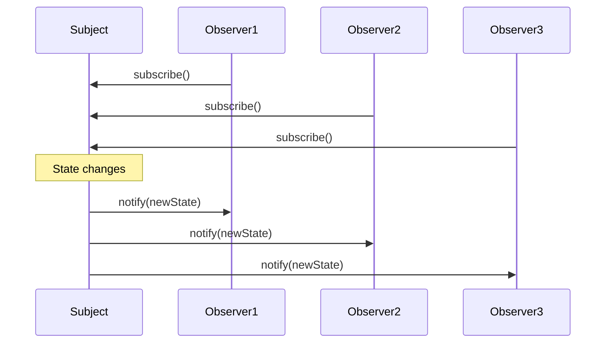
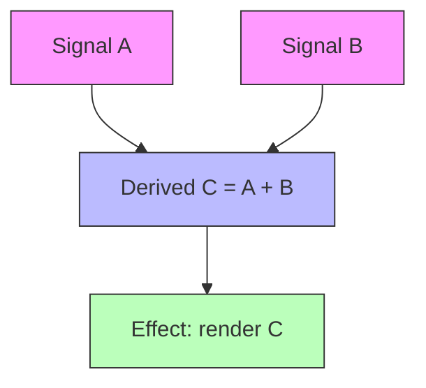

## Why Should I Care?

Every interactive UI faces the same fundamental problem: when data changes, the screen needs to update. The Observer pattern is the oldest and most battle-tested solution to this problem — and if you understand it, you'll understand why SolidJS signals feel like a natural evolution rather than magic.

The Observer pattern is the conceptual root of DOM events, Node.js EventEmitters, RxJS Observables, Vue's reactivity, and SolidJS signals. Learning it once gives you a mental model that transfers across every reactive system you'll encounter.

## The Core Idea

The Observer pattern establishes a **one-to-many dependency** between objects: when one object (the *subject*) changes state, all its dependents (the *observers*) are notified and updated automatically.



Think of it like a newspaper subscription. You don't check the newsstand every morning — the publisher (subject) delivers the paper to every subscriber (observer) automatically. If you cancel your subscription, you stop receiving deliveries. The publisher doesn't need to know *what* you do with the newspaper; it just delivers.

## The Gang of Four Origins

The Observer pattern was formalized in the 1994 book *Design Patterns: Elements of Reusable Object-Oriented Software* by the "Gang of Four" (Gamma, Helm, Johnson, Vlissides). Their original formulation defined two interfaces:

```
Subject
  - attach(observer)
  - detach(observer)
  - notify()

Observer
  - update(subject)
```

The subject maintains a list of observers. When its state changes, it iterates the list and calls `update()` on each. The key insight: **the subject doesn't know what its observers are or what they do**. This decouples the data source from its consumers.

## Evolution: From Pattern to Platform Primitive

The Observer pattern didn't stay locked in OOP textbooks. It evolved through several generations:

### Generation 1: DOM Events (1990s)

The browser's event system is Observer in action. `addEventListener` is `attach()`, `removeEventListener` is `detach()`, and `dispatchEvent` is `notify()`:

```typescript
button.addEventListener('click', handleClick);  // subscribe
button.removeEventListener('click', handleClick); // unsubscribe
button.dispatchEvent(new Event('click'));         // notify
```

Every DOM element is a subject. Every event handler is an observer.

### Generation 2: EventEmitters (2009+)

Node.js generalized the pattern into `EventEmitter` — a reusable subject base class:

```typescript
emitter.on('data', handler);    // subscribe
emitter.off('data', handler);   // unsubscribe
emitter.emit('data', payload);  // notify
```

This is the backbone of Node.js streams, HTTP servers, and socket communication.

### Generation 3: Observables and Streams (2012+)

RxJS and reactive extensions added *operators* — the ability to transform, filter, and combine notification streams before they reach observers. This gave rise to reactive programming as a paradigm.

### Generation 4: Reactive Signals (2010s–present)

SolidJS, Vue 3, Preact Signals, and Angular Signals take the Observer pattern to its logical conclusion: **automatic dependency tracking**. You don't manually subscribe or unsubscribe. The system tracks which observers read which subjects and manages subscriptions automatically.

```typescript
// SolidJS — no explicit subscribe/unsubscribe
const [count, setCount] = createSignal(0);

createEffect(() => {
  console.log(count()); // Automatically subscribes by reading count()
});
// When the effect's scope is disposed, it automatically unsubscribes
```

## How This Powers the Desktop

In `src/components/desktop/store/desktop-store.ts`, the entire desktop store is one big subject, and every component that reads from it is an observer:

```typescript
const [state, setState] = createStore<DesktopState>({
  windows: {},
  windowOrder: [],
  nextZIndex: 10,
  startMenuOpen: false,
  selectedDesktopIcon: null,
  isMobile: false,
});
```

When you drag a window and call `actions.updateWindowPosition(id, newX, newY)`, the store (subject) notifies only the specific DOM expression in `Window.tsx` that reads `props.window.x` and `props.window.y` (observer). The Taskbar doesn't re-render. Other windows don't re-render. The StartMenu doesn't re-render.

This surgical precision is the Observer pattern with automatic dependency tracking — the system knows exactly which observers depend on which piece of state because SolidJS tracks the reads at runtime.

## What Goes Wrong Without It

Without the Observer pattern, you're left with two bad options:

1. **Polling** — Every component checks for changes on a timer. Wasteful, laggy, and scales terribly with the number of components.

2. **Direct coupling** — The store explicitly calls each consumer when state changes: `taskbar.update()`, `windowManager.update()`, `startMenu.update()`. Adding a new consumer means editing the store. This is the "shotgun surgery" anti-pattern that the app registry was specifically designed to avoid.

The Observer pattern decouples the producer from the consumers. The store doesn't know that `Window.tsx` exists. It just holds state and notifies whoever is listening.

## The "Diamond Problem" in Reactive Graphs

One gotcha with Observer-based reactivity: if observer C depends on both A and B, and both A and B change in the same update, C might be notified twice — once for A's change and once for B's change. Worse, the first notification sees an inconsistent state where A has changed but B hasn't yet.

This is called a **glitch**. SolidJS solves it with synchronous, topologically-ordered propagation: all changes are batched and observers are notified in dependency order, so C only runs once and sees a consistent state.



If both A and B change simultaneously, SolidJS ensures C is computed once (with both new values), and D runs once. No glitches, no double renders.

## What If We'd Done It Differently?

If the desktop used React instead of SolidJS, you'd still be using the Observer pattern — but at a higher level. React's `useState` is a subject, and the component function is the observer. The difference is granularity: React re-runs the entire component function (coarse-grained), while SolidJS re-runs only the specific expression that reads the changed value (fine-grained).

For a desktop with dozens of windows being dragged at 60fps, coarse-grained re-rendering would require extensive `React.memo` and `useMemo` optimization. SolidJS's fine-grained Observer implementation makes this automatic.

## Broader Connections

The Observer pattern is one instance of the broader principle of **loose coupling** — keeping components independent so changes in one don't cascade through the system. It's closely related to:

- **Publish/Subscribe** — A variant where observers subscribe to *topics* rather than specific subjects, often with a message broker in between.
- **Mediator pattern** — The SolidJS store acts as a mediator between state mutations and UI updates.
- **Dependency Injection** — Another form of decoupling, where dependencies are provided rather than imported directly (see the app registry's IoC pattern).

Understanding Observer gives you a foundation for understanding all of these.
