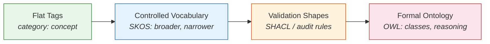
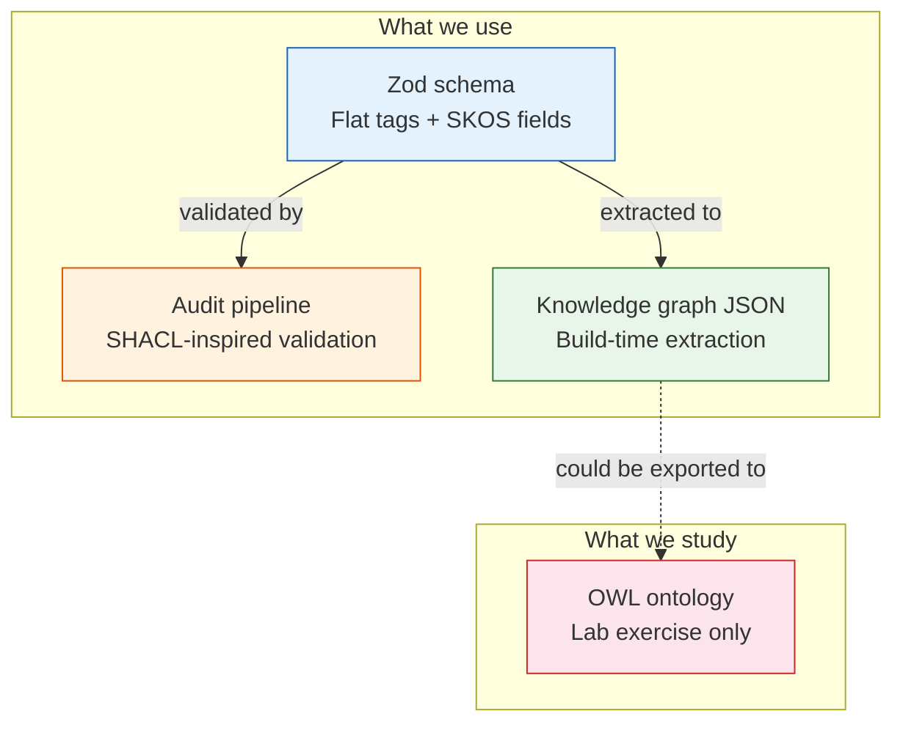

## Why Should I Care?

Every knowledge base makes choices about how formally to represent its concepts. Choose too little structure, and your system silently accumulates contradictions — broken links, circular hierarchies, orphan terms that nobody can find. Choose too much, and you spend weekends configuring [Protégé](https://protege.stanford.edu/) and debugging OWL reasoner output for a system with 50 articles that could have been a folder of Markdown files.

The playground-platform knowledge base is a living example of this tradeoff. It started with flat Markdown frontmatter, added [SKOS-inspired vocabulary fields](https://www.w3.org/TR/skos-reference/) (`prefLabel`, `altLabels`, `broader`, `narrower`), built a [validation pipeline](https://martinfowler.com/bliki/SelfTestingCode.html) inspired by SHACL constraint shapes, and generates an explicit knowledge graph at build time. It deliberately stopped short of OWL — but understanding *why* it stopped there requires understanding the full spectrum.

This article walks you through that spectrum. By the end, you'll be able to look at any knowledge management system and identify its formality level, its gaps, and whether moving up (or down) would actually help.

## The Formality Spectrum

Knowledge representation sits on a spectrum from informal to rigorous. Each level adds capabilities but also adds cost — tooling complexity, maintenance burden, and cognitive overhead. The [Ontology Development 101 guide](https://protege.stanford.edu/publications/ontology_development/ontology101.pdf) from Stanford describes this progression in detail.



### Level 1: Flat Tags

The simplest representation: each article has a `category` string and a `technologies` array. No hierarchy, no relationships between terms.

```yaml
# What flat tags can express
category: concept
technologies: [solidjs, typescript]
```

**What you get:** filtering and grouping. You can show "all concept articles" or "all articles about SolidJS."

**What you lose:** no way to express that "Fine-Grained Reactivity" is a specific kind of "Observer Pattern," or that understanding "JavaScript Proxies" is required before reading about "Reactivity." Every article is an island. The knowledge base in its earliest form looked exactly like this — articles with category tags and nothing else.

### Level 2: Controlled Vocabulary (SKOS)

[SKOS (Simple Knowledge Organization System)](https://www.w3.org/TR/skos-reference/) is a W3C standard for organizing concepts into hierarchies with labels and relationships. The playground-platform adopted SKOS-inspired fields in the article schema:

```yaml
# What SKOS vocabulary adds
prefLabel: "Fine-Grained Reactivity"
altLabels: ["reactive programming", "signal-based reactivity"]
broader: [concepts/observer-pattern]
narrower: []
conceptScheme: playground-platform
```

**What you get:** term management. `prefLabel` gives each concept a canonical name. `altLabels` capture synonyms so search and discovery work regardless of which name a learner uses. `broader`/`narrower` create a concept hierarchy that tells the learner "this is a specific case of that." `conceptScheme` scopes the vocabulary to a project, preparing for cross-project content.

The SKOS data model, as described in the [SKOS Reference](https://www.w3.org/TR/skos-reference/), defines these relationships formally using RDF. Our implementation adopts the semantics — hierarchical organization, label management — without requiring RDF infrastructure.

**What you lose:** SKOS itself has no validation capability. If you write `broader: [concepts/nonexistent-article]`, SKOS has no opinion — it's a data model, not a constraint system. If you create a cycle where A is broader than B, and B is broader than A, SKOS won't complain. You need the next level for that.

### Level 3: Validation Shapes (SHACL-Inspired)

[SHACL (Shapes Constraint Language)](https://www.w3.org/TR/shacl/) defines constraints that RDF data must satisfy. The playground-platform's [audit pipeline](https://docs.astro.build/en/guides/content-collections/) (`pnpm verify:knowledge`) is directly inspired by SHACL shapes — it defines structural rules that every article must pass:

```typescript
// From packages/knowledge-engine/src/audit/rules.ts
// This is conceptually a SHACL NodeShape for articles:
//   "Every non-lab article must have ≥2 exercises"
//   "Every article must have ≥1 learning objective"
//   "Prerequisites must not form cycles"
//   "Related concept links must resolve to existing articles"
```

**What you get:** automated structural validation. The audit pipeline catches broken links, prerequisite cycles, missing exercises, and orphan articles at build time. It's the difference between "we agreed on quality standards" and "the CI pipeline enforces quality standards." The `cs-fundamentals/graph-validation` article covers the specific graph algorithms (DFS cycle detection, set-based endpoint validation) that make this work.

**What you lose:** validation shapes check structure but don't reason about meaning. The audit can verify that `broader: [concepts/observer-pattern]` points to an existing article, but it can't infer that if Fine-Grained Reactivity is narrower than Observer Pattern, then Observer Pattern should list Fine-Grained Reactivity in its `narrower` field. That kind of inference requires the next level.

### Level 4: Formal Ontology (OWL)

[OWL 2 (Web Ontology Language)](https://www.w3.org/TR/owl2-overview/) is the W3C standard for formal ontologies. It adds class hierarchies, property characteristics, cardinality restrictions, and — crucially — automated reasoning. The [OWL 2 Primer](https://www.w3.org/TR/owl2-primer/) introduces these capabilities through a running example.

```xml
<!-- From diagrams/ontology/knowledge-base.owl -->
<owl:Class rdf:about="#Concept">
    <rdfs:subClassOf rdf:resource="#KnowledgeArticle"/>
</owl:Class>

<owl:ObjectProperty rdf:about="#relatedTo">
    <rdf:type rdf:resource="http://www.w3.org/2002/07/owl#SymmetricProperty"/>
</owl:ObjectProperty>

<!-- Disjointness: an article can't be both a Concept and a Lab -->
<rdf:Description>
    <rdf:type rdf:resource="http://www.w3.org/2002/07/owl#AllDisjointClasses"/>
    <owl:members rdf:parseType="Collection">
        <rdf:Description rdf:about="#Concept"/>
        <rdf:Description rdf:about="#Lab"/>
        <!-- ... -->
    </owl:members>
</rdf:Description>
```

**What you get:** formal semantics with inference. Mark `relatedTo` as symmetric once, and the [HermiT reasoner](http://www.hermit-reasoner.com/) automatically infers the inverse. Declare categories as disjoint, and the reasoner flags any article classified as both Concept and Lab. Add property restrictions ("every Lab must have at least one prerequisite"), and the reasoner identifies labs that violate them. [Owlready2](https://owlready2.readthedocs.io/) lets you manipulate these ontologies programmatically in Python.

**What you lose:** OWL requires Java for reasoning, XML for serialization, and a conceptual model (description logic) that takes time to learn. For a knowledge base with fewer than 100 articles and simple relationships, the cost-benefit ratio is poor. The automated inferences OWL provides are valuable when your knowledge base has thousands of interrelated terms and a wrong relationship has real consequences — think medical terminologies, not learning articles.

## Where the Playground-Platform Sits

The knowledge base uses **levels 1 through 3** and deliberately stops before level 4:

| Mechanism | Level | Where |
|-----------|-------|-------|
| `category`, `technologies` arrays | Flat tags | Schema (`schema.ts`) |
| `prefLabel`, `altLabels`, `broader`, `narrower` | SKOS vocabulary | Schema (`schema.ts`) |
| `prerequisites` cycle detection, broken-link checks | Validation shapes | Audit rules (`rules.ts`) |
| OWL class hierarchy, reasoner | Formal ontology | Lab exercise only (`knowledge-base.owl`) |

This is the right level for the current system. The [SKOS Reference](https://www.w3.org/TR/skos-reference/) vocabulary provides enough structure for concept hierarchy and term management. The audit pipeline provides enough validation to catch structural errors. OWL's automated reasoning would add value only if the knowledge base grew to thousands of articles with complex cross-domain relationships — and even then, the cost of maintaining a parallel OWL representation alongside Markdown frontmatter might not justify it.



## When to Move Up (or Down) the Spectrum

The formality spectrum is not a ladder where higher is better. Each level has a sweet spot:

**Stay at flat tags** when you have fewer than 20 items, relationships are simple (just "related" or "not related"), and one person maintains everything. Adding vocabulary management to a 10-article FAQ is overhead with no payoff.

**Move to SKOS** when you need term management — synonyms, hierarchies, multiple names for the same concept — or when multiple people contribute content and need shared vocabulary. The SKOS data model is lightweight: it's just additional frontmatter fields, not a new system.

**Add validation shapes** when content quality matters and you can't rely on manual review. If broken links, missing prerequisites, or structural violations cause real problems (readers hit dead ends, learning paths are broken), automated validation pays for itself immediately. This is where most software documentation and learning systems should aim.

**Adopt OWL** when automated reasoning would discover facts you can't feasibly maintain by hand, when consistency checking prevents real harm (medical, legal, safety domains), or when you need to integrate multiple independently-maintained knowledge bases. The [OWL 2 Overview](https://www.w3.org/TR/owl2-overview/) describes three profiles (EL, QL, RL) that trade expressivity for computational tractability — even within OWL, choosing the right subset matters. See the foundational [Ontology Development 101](https://protege.stanford.edu/publications/ontology_development/ontology101.pdf) guide for a structured methodology for building ontologies when you do reach this level.

## The Open-World Assumption: OWL's Most Surprising Property

One property of OWL consistently surprises engineers coming from database or schema-validation backgrounds: the [open-world assumption](https://www.w3.org/TR/owl2-primer/). In a database, if a row doesn't have a value for a column, that value is NULL — it doesn't exist. In a schema validator, if a required field is missing, that's an error. In OWL, if a fact isn't stated, it's **unknown** — neither true nor false.

This means you cannot express "every Lab must have exactly one module assignment" as an OWL constraint the way you'd express it in Zod or SHACL. In OWL, a Lab without a module isn't invalid — it just hasn't been assigned yet. The reasoner won't flag it. This is why the playground-platform uses the audit pipeline (closed-world, SHACL-inspired) for structural validation and explores OWL only as a learning exercise. The [OWL 2 Primer](https://www.w3.org/TR/owl2-primer/) explains this distinction thoroughly in its opening sections.

## Practical Takeaways

1. **Most knowledge management systems need levels 1–3, not 4.** SKOS vocabulary + validation shapes cover 90% of practical needs. OWL is for the 10% where automated reasoning matters.

2. **The levels are cumulative.** Each level builds on the previous one. You can't benefit from OWL reasoning without first having the clean vocabulary that SKOS provides.

3. **Validation shapes (level 3) deliver the highest ROI for software projects.** They're cheap to implement (a build script), fast to run (milliseconds), and catch real problems (broken links, cycles, missing content).

4. **OWL's value is proportional to (number of terms) × (relationship complexity) × (cost of errors).** A medical ontology with 50,000 terms and life-safety implications? OWL is essential. A learning system with 50 articles and "nice to have" relationships? SKOS + audit rules are sufficient.

5. **Try the lab.** Abstract understanding of ontology engineering is shallow. Build the OWL ontology in [Protégé](https://protege.stanford.edu/), run the reasoner, and see what it infers. The `labs/build-a-tiny-ontology` article walks you through the process hands-on.
