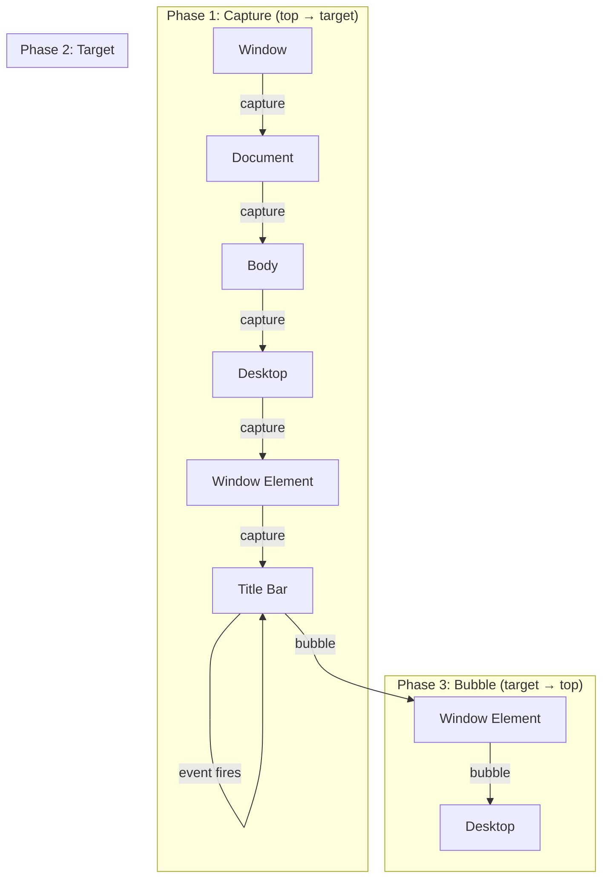

## Why Should I Care?

Every drag operation on the desktop — window dragging, window resizing — depends on pointer events with capture. Without pointer capture, moving the mouse quickly causes the cursor to leave the title bar element, and the drag breaks. Without pointer events (using mouse events instead), you'd need separate handlers for touch, mouse, and stylus input. Understanding this API explains why the window manager handles all input types with one set of handlers and why drag never "sticks" or "drops" unexpectedly.

## The Fast-Mouse Problem

Without pointer capture, drag operations break when the user moves the mouse quickly:

```mermaid
sequenceDiagram
    participant User
    participant Title as Title Bar Element
    participant Other as Other Element (desktop, iframe...)
    participant WM as Window Manager

    User->>Title: pointerdown (start drag)
    WM->>WM: isDragging = true

    Note over User: User moves mouse quickly

    User->>Other: pointermove (cursor left title bar!)
    Note over Title: ❌ Title bar doesn't receive this event
    Note over WM: ❌ Drag handler doesn't run
    Note over WM: Window freezes in place

    User->>Other: pointerup
    Note over WM: ❌ Drag end never fires on title bar
    Note over WM: isDragging stuck as true!
```

The cursor physically leaves the title bar element. From that point, all pointer events fire on whatever element is now under the cursor — the desktop background, another window, or an iframe. The drag handler, which listens on the title bar, stops receiving events.

## The Solution: Pointer Capture

`element.setPointerCapture(pointerId)` locks all subsequent pointer events to that element, regardless of where the pointer actually is on screen:

```mermaid
sequenceDiagram
    participant User
    participant Title as Title Bar Element
    participant WM as Window Manager
    participant Store as Desktop Store

    User->>Title: pointerdown
    Title->>Title: setPointerCapture(e.pointerId)
    WM->>WM: isDragging = true
    WM->>Store: focusWindow(id)

    Note over User: User moves mouse anywhere (even off-screen!)

    User->>Title: pointermove (captured!)
    WM->>Store: updateWindowPosition(id, newX, newY)

    User->>Title: pointermove (captured!)
    WM->>Store: updateWindowPosition(id, newX, newY)

    User->>Title: pointerup (captured!)
    Title->>Title: releasePointerCapture(e.pointerId)
    WM->>WM: isDragging = false
```

From `src/components/desktop/Window.tsx`:

```typescript
const handleDragStart = (e: PointerEvent): void => {
  if (state.isMobile) return;       // No drag on mobile
  if (e.button !== 0) return;       // Left button only
  if (props.window.isMaximized) return; // Can't drag maximized windows

  const clicked = e.target as HTMLElement;
  if (clicked.closest('.title-bar-controls')) return; // Don't drag from buttons

  const target = e.currentTarget as HTMLElement;
  target.setPointerCapture(e.pointerId);  // ← Lock events to this element
  isDragging = true;
  dragOffsetX = e.clientX - props.window.x;
  dragOffsetY = e.clientY - props.window.y;

  actions.focusWindow(props.window.id);

  // Promote to GPU layer for smooth animation
  const windowEl = target.closest('.win-container') as HTMLElement | null;
  if (windowEl) windowEl.style.willChange = 'transform';
};
```

## Event Propagation: Capture → Target → Bubble

DOM events propagate in three phases:



Pointer capture bypasses this model: captured events go directly to the capturing element, regardless of which element is actually under the cursor. This means:
- No event delegation issues during drag
- No accidentally triggering other elements' handlers
- No worry about which element is "under" the cursor

## Why Pointer Events, Not Mouse Events?

Pointer events unify mouse, touch, and stylus input into one API:

| Pointer Event | Mouse Equivalent | Touch Equivalent | Pen Equivalent |
|---|---|---|---|
| `pointerdown` | `mousedown` | `touchstart` | `mousedown` (synthetic) |
| `pointermove` | `mousemove` | `touchmove` | `mousemove` (synthetic) |
| `pointerup` | `mouseup` | `touchend` | `mouseup` (synthetic) |
| `pointercancel` | — | `touchcancel` | — |

Each pointer event has a `pointerType` property (`"mouse"`, `"touch"`, `"pen"`) and a `pointerId` that uniquely identifies the pointer. Multi-touch gives each finger a different ID.

The killer feature: **pointer capture has no equivalent in the mouse or touch API**. `setPointerCapture` works across all input types — mouse, touch, and stylus — with one API.

## Touch vs Mouse vs Pen Differences

The pointer events API abstracts input differences, but some differences leak through:

| Property | Mouse | Touch | Pen |
|---|---|---|---|
| `pointerId` | Always 1 | Unique per finger | Unique per pen |
| `pressure` | 0 or 0.5 | 0 to 1 (force) | 0 to 1 (pressure) |
| `width` / `height` | 1 | Contact area size | Tip size |
| `tiltX` / `tiltY` | 0 | 0 | Pen angle |
| Implicit capture | No | Yes (touchstart) | No |

**Implicit pointer capture**: touch events implicitly capture the pointer to the element that received `touchstart`. This is why touch-based drag "just works" even without explicit `setPointerCapture` — but explicit capture is still recommended for consistency.

## Coalesced Events for High-Frequency Input

At 60fps, the browser fires at most one `pointermove` per frame. But the input device may report movement at 120Hz, 240Hz, or higher. The "lost" events between frames are accessible via `getCoalescedEvents()`:

```typescript
const handleDragMove = (e: PointerEvent): void => {
  if (!isDragging) return;

  // For drawing apps, you'd use coalesced events:
  // const events = e.getCoalescedEvents();
  // for (const ce of events) { drawPoint(ce.clientX, ce.clientY); }

  // For window drag, we only care about the latest position:
  let newX = e.clientX - dragOffsetX;
  let newY = e.clientY - dragOffsetY;
  // ... bounds clamping ...
  actions.updateWindowPosition(props.window.id, newX, newY);
};
```

For window drag, only the latest position matters (the window jumps to the cursor). For a drawing app, every intermediate point matters (to avoid gaps in the stroke). The Snake game doesn't use coalesced events either — it only cares about the last direction pressed.

## Drag and Resize: Mutual Exclusion

In `Window.tsx`, both drag and resize use pointer capture, but they're mutually exclusive:

- **Resize**: triggered by `pointerdown` on the invisible 6px edge zones around the window
- **Drag**: triggered by `pointerdown` on the title bar

Resize handlers call `e.stopPropagation()`, preventing the event from reaching the title bar's drag handler. If you start resizing, you can't accidentally start dragging:

```typescript
const handleResizeStart = (edge: ResizeEdge, e: PointerEvent): void => {
  e.preventDefault();
  e.stopPropagation();  // ← Prevents drag handler from firing
  const target = e.currentTarget as HTMLElement;
  target.setPointerCapture(e.pointerId);
  isResizing = true;
  // ...
};
```

## What Goes Wrong Without Pointer Events

Using `mousedown`/`mousemove`/`mouseup` instead of pointer events:

1. **No capture API** — You'd need to attach `mousemove` to `document` instead of the title bar, leading to global event handler cleanup issues
2. **Separate touch handling** — You'd need duplicate handlers for `touchstart`/`touchmove`/`touchend`
3. **No implicit multi-touch support** — Mouse events don't distinguish between fingers
4. **iOS Safari quirks** — Touch events have platform-specific behaviors (300ms delay, scroll interference) that pointer events abstract away

The pointer events API was specifically designed for these use cases — the W3C specification explicitly mentions drag operations and drawing applications as primary motivators.
