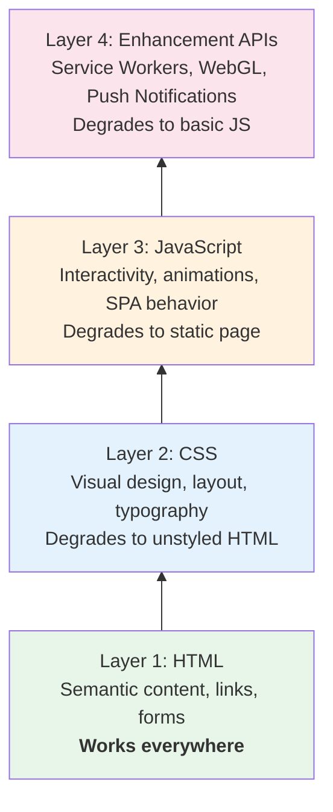
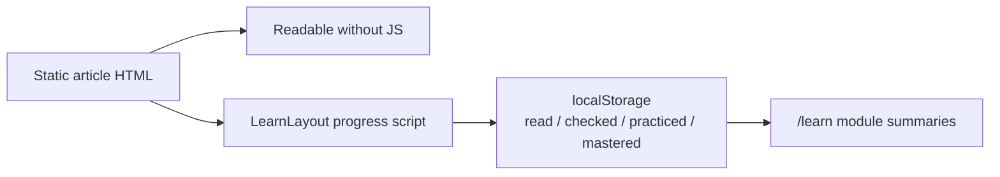

## Why Should I Care?

[Progressive enhancement](https://developer.mozilla.org/en-US/docs/Glossary/Progressive_Enhancement) is the principle that the core content of a website should be accessible to everyone, regardless of their browser capabilities, network conditions, or whether JavaScript is enabled (see [Understanding Progressive Enhancement](https://alistapart.com/article/understandingprogressiveenhancement/) for a thorough introduction). It's the reason search engines can index your content, [screen readers](https://developer.mozilla.org/en-US/docs/Web/Accessibility/ARIA) can read it, and users on slow connections see *something* before the full experience loads.

In this project, progressive enhancement isn't bolted on as an afterthought — [Astro's static-first architecture](https://docs.astro.build/en/basics/rendering/) makes it the default. The CV content, knowledge articles, and download links all work without a single byte of JavaScript. The interactive desktop is an enhancement layer on top.

## The Layer Cake Mental Model

Think of a website as a layer cake. Each layer adds richness, but the cake is edible at every level:



Each layer is optional. Remove JavaScript → the site still works. Remove CSS → the content is still readable. This is the opposite of "graceful degradation" (build the full experience, then try to handle failures), because the baseline is guaranteed to work.

## Progressive Enhancement in This Project

### The `<noscript>` Baseline

In `src/pages/index.astro`, there's an explicit fallback for users without JavaScript:

```html
<noscript>
  <div style="max-width: 800px; margin: 40px auto; padding: 20px;">
    <h1>Dmytro Lesyk — CV</h1>
    <p>This site requires JavaScript for the interactive desktop experience.
       Here are direct links:</p>
    <ul>
      <li><a href="/downloads/cv.pdf">Download CV (PDF)</a></li>
      <li><a href="/downloads/cv.docx">Download CV (DOCX)</a></li>
      <li><a href="mailto:dmitriylesik@gmail.com">Contact via Email</a></li>
    </ul>
  </div>
</noscript>
```

Without JavaScript: the user gets a clean HTML page with direct links to the CV files and a mailto link. The core purpose of the site — letting someone read and download a CV — is fully served.

With JavaScript: the `<Desktop client:load />` island hydrates, replacing the simple page with the full Win95 desktop experience.

### The Knowledge Base: Zero-JS Reading

The `/learn/*` routes are the best example of progressive enhancement in this project. They're fully static pages rendered at build time:

```
src/pages/learn/index.astro       → static HTML index
src/pages/learn/[...slug].astro   → static HTML articles
```

These pages use `LearnLayout.astro` — a reading-optimized layout separate from the desktop. They contain:
- Semantic HTML (`<article>`, `<nav>`, `<h1>`–`<h6>`, `<ul>`, `<a>`)
- CSS for layout and typography
- A Mermaid script for diagram rendering (enhancement)
- A `localStorage` progress script for read, checked, practiced, and mastered stages (enhancement)

Without JavaScript: every article is fully readable. Links work. Navigation works. The only missing pieces are enhancements: Mermaid diagram rendering and mastery progress controls.

With JavaScript: Mermaid diagrams are rendered as SVGs, article visits are marked as `read`, exercise answers can advance an article to `checked`, labs can be marked `practiced`, and the learner can deliberately mark an article `mastered`.

### Mastery Progress as Progressive Enhancement

The progress model is a good example of restraint. It stores state in the browser under `kb-learning-progress`, not on a server:



The core content does not depend on this script. If `localStorage` is unavailable, the reader loses progress badges but not the article. That is the progressive-enhancement test: remove the enhancement, and the primary purpose still works.

### Static Files: No JS Required

The CV download links (`public/downloads/cv.pdf`, `public/downloads/cv.docx`) are plain `<a href download>` links. The browser's native download behavior handles everything. No JavaScript, no fetch, no client-side PDF generation.

### The CV Data: Pre-rendered HTML

The CV content pipeline is progressively enhanced by architecture:

1. **HTML layer** — The CV HTML is serialized in a `<script type="application/json">` tag in the page source. Search engines can see it. Accessibility tools can parse it.
2. **JavaScript layer** — The `BrowserApp` component reads this JSON and renders it in a styled Win95 window with a fake toolbar, photo header, and section navigation.

If JavaScript fails, the raw JSON is in the page source (not ideal for reading, but the `<noscript>` fallback covers this with direct PDF/DOCX links).

## Astro: Progressive Enhancement by Architecture

Astro's design philosophy aligns with progressive enhancement:

1. **Static by default** — Pages are prerendered to HTML. No JavaScript unless you explicitly add it with `client:*` directives.
2. **Islands architecture** — JavaScript is scoped to specific interactive components, not the entire page.
3. **Content collections** — Content is Markdown, rendered to semantic HTML at build time.
4. **Zero JS by default** — An Astro page with no `client:*` directives ships zero JavaScript.

Compare this to a pure SPA (Create React App, Vite + React):
- SPA: blank page → download JS → parse JS → render content. Without JS: nothing.
- Astro: full HTML page → optionally enhance with JS. Without JS: full content.

## What Goes Wrong Without Progressive Enhancement

### The White Screen of Nothing

SPAs that render entirely in JavaScript show a blank page until the JS bundle downloads, parses, and executes. On a slow 3G connection, this can take 5-10 seconds. On a corporate proxy that blocks certain CDN domains, it can be permanent.

### The SEO Black Hole

Search engine crawlers historically struggle with JavaScript-rendered content. While Google's crawler executes JavaScript, other search engines (Bing, DuckDuckGo) may not, or may have reduced crawl budgets for JS-heavy pages.

### The Accessibility Gap

Screen readers work best with semantic HTML that's present in the initial page source. JavaScript-rendered content may not be announced correctly, especially if ARIA attributes are added dynamically.

## The Tradeoff: Interactivity vs. Accessibility

This project makes a deliberate tradeoff: the interactive desktop experience *requires* JavaScript. You can't drag windows, open apps, or use the terminal without it. This is acknowledged — the `<noscript>` fallback provides an alternative path to the same content.

The principle isn't "everything must work without JS." It's "the *core content* must be accessible without JS, and everything else is an enhancement." For a CV site, the core content is the CV itself — and that's available as a direct PDF download.

## [Progressive Enhancement](https://www.youtube.com/watch?v=xIxDJof7xxQ) vs. Graceful Degradation

These terms are often confused:

| | Progressive Enhancement | Graceful Degradation |
|---|---|---|
| **Starting point** | Basic, working experience | Full, rich experience |
| **Direction** | Add features for capable browsers | Remove features for limited browsers |
| **Philosophy** | Content first, decoration second | Decoration first, fallbacks second |
| **Failure mode** | Missing enhancements (acceptable) | Broken experience (frustrating) |

This project uses progressive enhancement: the HTML/CSS foundation works, and JavaScript adds the desktop metaphor on top. If it used graceful degradation, the desktop would be built first, and fallbacks would be patched in when things break — a more fragile approach.

## Broader Context

Progressive enhancement connects to several deeper web principles:

- **Semantic HTML** — Using the right elements (`<a>`, `<button>`, `<form>`) means built-in behavior without JavaScript
- **The Rule of Least Power** — Use the least powerful language that gets the job done (HTML > CSS > JS)
- **[Resilient](https://resilientwebdesign.com/) Web Design** — Jeremy Keith's book argues that the web's core strength is its resilience to failure, and progressive enhancement embraces this
- **Core Web Vitals** — Google's performance metrics (LCP, FID, CLS) all reward pages that render meaningful content quickly — exactly what progressive enhancement delivers
