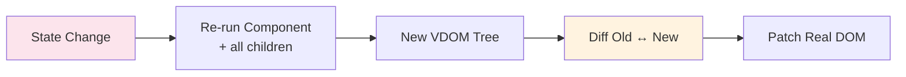
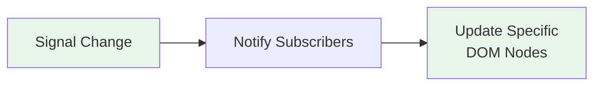
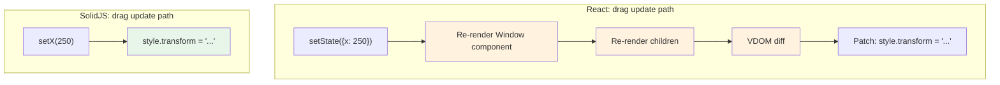

## Why Should I Care?

The choice between signals and virtual DOM isn't just a framework preference — it determines how much work the browser does on every state change. For a desktop window manager that updates window positions at 60fps during drag, this difference is the gap between smooth interaction and visible jank. Understanding both approaches lets you choose the right tool for the job and predict how your UI will perform under load.

## The Virtual DOM Approach (React)

[React](https://react.dev/) re-runs your component function on every state change, producing a new virtual DOM tree. It then **[diffs](https://legacy.reactjs.org/docs/reconciliation.html)** the old and new trees to figure out what actually changed in the real DOM:



**Advantages:** Simple mental model — your component is a pure function of state. Easy to reason about, easy to debug.

**Disadvantages:** The diff is work. Every state change re-runs the entire component function and all its children (unless you manually add `React.memo`, `useMemo`, `useCallback`). The VDOM itself is a data structure in memory that must be allocated and garbage collected.

### Side-by-Side: React Update Trace

```typescript
// React: what happens when count changes
function Counter() {
  const [count, setCount] = useState(0);
  console.log('Component re-rendered'); // Runs EVERY TIME count changes
  return (
    <div>
      <span>{count}</span>           {/* Re-evaluated */}
      <span>Static text</span>       {/* Also re-evaluated (same result) */}
      <ChildComponent />             {/* Also re-rendered (unless memoized) */}
    </div>
  );
}
```

React's reconciler walks the entire subtree, comparing the new VDOM to the old. Even though only `count` changed, every element in the component is re-evaluated. React is smart enough to skip the actual DOM update for `<span>Static text</span>` (the VDOM node hasn't changed), but the *comparison work* still happens.

## The Signals Approach (SolidJS)

[SolidJS](https://www.solidjs.com/guides/reactivity) runs your component function **once** — at mount time. Each reactive expression in JSX becomes a direct DOM subscription. When a signal changes, only the subscribed DOM nodes update:



### Side-by-Side: SolidJS Update Trace

```typescript
// SolidJS: what happens when count changes
function Counter() {
  const [count, setCount] = createSignal(0);
  console.log('Component mounted'); // Runs ONCE
  return (
    <div>
      <span>{count()}</span>         {/* This expression re-runs */}
      <span>Static text</span>       {/* Never touched again */}
      <ChildComponent />             {/* Never re-rendered */}
    </div>
  );
}
```

Only the `{count()}` expression re-evaluates — a single Text node update. No component function re-execution, no VDOM diff, no tree walking. The work is proportional to what *actually changed*, not to the size of the component tree.

## The Performance Implications for This Project

The desktop has dozens of reactive values updating simultaneously during interaction:

| Interaction | Updates per second | Values changing |
|---|---|---|
| Window drag | 60 (every frame) | x, y position of one window |
| Focus change | 1 | zIndex of focused window, nextZIndex |
| Open window | 1 | windows map, windowOrder, nextZIndex, startMenuOpen |
| Resize | 60 | x, y, width, height of one window |

With **React**, dragging a window at 60fps would re-render the Window component 60 times per second. Each re-render executes the entire component function, creates a new VDOM subtree, diffs it against the previous one, and patches the DOM. Without careful memoization, the entire `WindowManager` and its children would re-render too — every open window, every taskbar button, potentially the entire desktop tree.

With **SolidJS**, dragging a window at 60fps updates exactly one CSS `transform` value 60 times per second. The update is a direct DOM property change — no component re-execution, no VDOM, no diff. The cost is O(1) regardless of how many windows are open.



## When VDOM Actually Wins

Signals aren't universally better. VDOM approaches have advantages in specific scenarios:

1. **Large structural changes** — If the entire UI structure changes (switching between completely different views), VDOM's diffing efficiently determines the minimal set of DOM operations. Signals would need to tear down and recreate many subscriptions.

2. **Server components (React Server Components)** — The VDOM model extends naturally to server rendering where components return serializable trees. SolidJS doesn't have an equivalent of RSC.

3. **Developer tooling** — React's component model enables time-travel debugging, component profiling, and dev tools that show the full render tree. Signal-based systems are harder to inspect because there's no "render" to profile.

4. **Ecosystem size** — React's VDOM model has 10+ years of libraries, patterns, and community knowledge.

## The Third Way: Compiled Reactivity (Svelte)

Svelte takes a different approach: the compiler analyzes your code and generates imperative DOM updates at build time. No runtime VDOM library, no runtime signal tracking:

```svelte
<script>
  let count = 0;
  // Svelte compiler detects this is reactive
</script>
<span>{count}</span>
<!-- Compiles to: if count changed, textNode.data = count -->
```

Svelte achieves similar performance to SolidJS signals but through compile-time analysis rather than runtime tracking. The tradeoff: Svelte requires a custom file format (`.svelte`), while SolidJS uses standard JSX/TSX.

For this project, SolidJS was chosen because:
- First-class Astro integration (`@astrojs/solid-js`)
- JSX syntax (familiar to React developers)
- Fine-grained stores for nested state (`createStore` + `produce`)
- Smaller runtime (~7KB vs Svelte's ~2KB — both negligible)

## What Goes Wrong Without Signals

Without fine-grained reactivity, the window manager would need extensive manual optimization:

```tsx
// React: every component in the drag path needs memoization
const Window = React.memo(({ window }) => {
  const style = useMemo(
    () => ({ transform: `translate(${window.x}px, ${window.y}px)` }),
    [window.x, window.y]
  );
  return <div style={style}>{/* ... */}</div>;
});

const WindowManager = React.memo(({ windows }) => {
  return windows.map(win => <Window key={win.id} window={win} />);
});
```

Every component needs `React.memo`. Every derived value needs `useMemo`. Every callback needs `useCallback`. Miss one and you get a performance cliff — one un-memoized component causes the entire subtree to re-render.

SolidJS eliminates this entire class of optimization work. The performance is correct by default.
