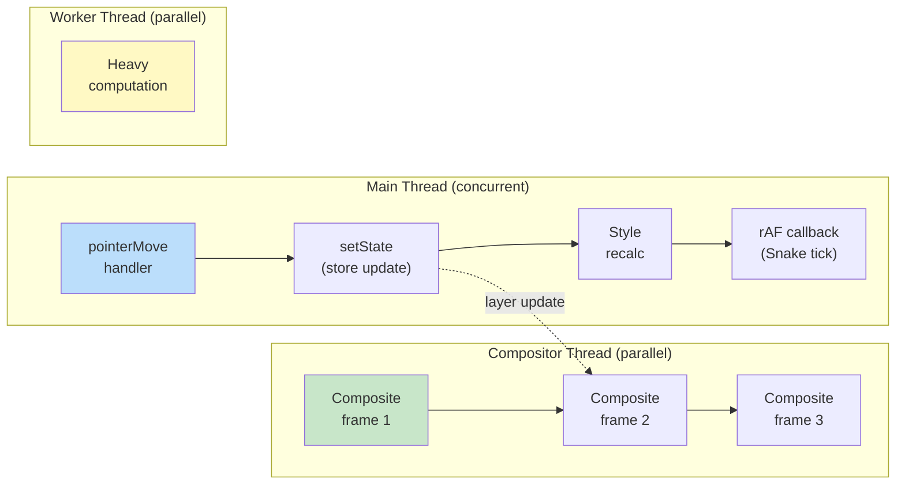

## Why Should I Care?

Drag a window across this desktop while the terminal loads xterm.js in the background. The window follows your cursor smoothly at 60fps. How? JavaScript is single-threaded — it can only do one thing at a time. If it's busy loading a module, how can it also track your mouse and update the window position?

The answer involves multiple concurrency mechanisms working together: the [event loop](https://developer.mozilla.org/en-US/docs/Web/JavaScript/Event_loop) scheduling JavaScript work in slices, the [compositor thread](https://developer.chrome.com/blog/inside-browser-part3) moving GPU layers independently of JavaScript, and [`requestAnimationFrame`](https://developer.mozilla.org/en-US/docs/Web/API/Window/requestAnimationFrame) synchronizing updates with the display refresh. Understanding these concurrency models explains why some UI interactions stay smooth under load and others freeze — and how to architect code that stays responsive.

## Concurrency vs. Parallelism

These terms are often confused:

- **Concurrency**: Dealing with multiple tasks by interleaving them. One worker, many tasks, switching between them. The event loop is concurrent — it handles click events, network responses, and timers by processing them in order.
- **Parallelism**: Doing multiple tasks simultaneously. Multiple workers, each doing a task at the same time. Web Workers are parallel — they run JavaScript on actual separate OS threads.

JavaScript's main thread is **concurrent but not parallel**. It handles many things (events, timers, promises, rendering) but only one at a time. The browser as a whole uses parallelism: the compositor thread, network threads, GPU process, and Web Workers all run in parallel with the main thread.



## The Single-Threaded Event Loop

JavaScript's concurrency model is the **event loop** — a single thread that pulls tasks from queues and executes them one at a time:

1. Execute the current task (a click handler, a timer callback, a promise continuation)
2. When the call stack is empty, drain the microtask queue (Promises, queueMicrotask)
3. If it's time for a frame (~16.6ms at 60Hz), run rAF callbacks, then style/layout/paint
4. Pull the next task from the task queue

This model has a critical implication: **if any task takes too long, everything else waits**. A 100ms computation blocks all event handling, animation, and rendering for 100ms. The user sees jank — a frozen UI.

### How the Desktop Stays Responsive

Window dragging generates rapid `pointermove` events. Each event handler in `Window.tsx` runs quickly:

```typescript
const handleDragMove = (e: PointerEvent): void => {
  if (!isDragging) return;
  let newX = e.clientX - dragOffsetX;
  let newY = e.clientY - dragOffsetY;
  // Boundary clamping...
  actions.updateWindowPosition(props.window.id, newX, newY);
};
```

This handler does minimal work: arithmetic, boundary checks, one store update. It completes in microseconds, leaving the main thread free for the next event. SolidJS's fine-grained reactivity means the store update only triggers one DOM mutation (updating the `transform` style) — no tree diffing, no re-rendering.

The discipline is: **keep event handlers fast**. Do the minimum work, return control to the event loop.

## The Compositor Thread

The browser's compositor thread is the secret weapon for smooth animations. It runs on a separate OS thread from JavaScript and handles:

- Assembling GPU layers into the final frame
- Applying `transform` and `opacity` changes without main thread involvement
- Scrolling (in many cases) independently of JavaScript

When the desktop uses `transform: translate(x, y)` for window positioning, the compositor can move the window's GPU layer without triggering layout or paint on the main thread:

```
Main Thread:        [handler] [handler] [handler]
                         ↓         ↓         ↓
                    (update transform style)
                         
Compositor Thread:  [composite] [composite] [composite] [composite]
                    frame 1     frame 2     frame 3     frame 4
```

The compositor operates at the display refresh rate (typically 60Hz). Even if the main thread is briefly busy, the compositor can continue displaying the last known state — or even extrapolate transform animations that were declared via CSS transitions.

### What the Compositor Can't Optimize

Not all CSS properties are compositor-friendly. Properties that affect layout (`left`, `top`, `width`, `height`, `margin`) force the main thread to recalculate positions of other elements. Properties that affect paint (`background-color`, `box-shadow`, `border-radius`) require the main thread to repaint the layer's texture.

Only `transform` and `opacity` (and `filter` in some cases) can be handled entirely by the compositor. This is why the codebase uses `will-change: transform` during active drag — it hints the browser to promote the window to its own GPU layer:

```typescript
// Window.tsx — during drag start
windowEl.style.willChange = 'transform';

// During drag end
windowEl.style.willChange = '';
```

The `will-change` is added during drag and removed after — because permanently promoted layers consume GPU memory.

## Web Workers: True Parallelism

When computation genuinely can't be broken into small chunks, Web Workers provide parallel execution:

```typescript
// Main thread
const worker = new Worker('heavy-task.js');
worker.postMessage({ data: largeDataset });
worker.onmessage = (e) => {
  // Result arrives asynchronously, main thread stayed responsive
  updateUI(e.data.result);
};
```

Workers run in a separate thread with their own event loop. They communicate with the main thread via `postMessage` — a structured clone that copies data between threads. They cannot access the DOM, window object, or shared JavaScript variables.

This codebase doesn't currently use Web Workers, but they'd be the solution for CPU-intensive features like:
- Parsing large Markdown files client-side
- Running WASM games (chess AI, physics simulations)
- Image processing for a hypothetical Paint app

### SharedArrayBuffer: Shared Memory

For high-performance parallelism, `SharedArrayBuffer` allows multiple threads to access the same memory without copying. Combined with `Atomics` for synchronization, it enables patterns similar to traditional multi-threaded programming. This is how WASM-based games achieve near-native performance — the game logic runs in a Worker with shared memory for the frame buffer.

## Concurrency Patterns in Practice

### Pattern 1: Chunked Work

Break a long task into small pieces, yielding to the event loop between chunks:

```typescript
async function processLargeArray(items: Item[]): Promise<void> {
  const CHUNK_SIZE = 100;
  for (let i = 0; i < items.length; i += CHUNK_SIZE) {
    const chunk = items.slice(i, i + CHUNK_SIZE);
    processChunk(chunk);
    // Yield to event loop — let rendering and events happen
    await new Promise(resolve => setTimeout(resolve, 0));
  }
}
```

### Pattern 2: Debounce Expensive Updates

Don't react to every event — batch them:

```typescript
// Instead of updating on every keystroke
input.addEventListener('input', debounce(handleSearch, 300));
```

### Pattern 3: rAF Throttling

Synchronize visual updates with the display refresh rate:

```typescript
let rafId: number | null = null;
function onPointerMove(e: PointerEvent): void {
  latestX = e.clientX;
  latestY = e.clientY;
  if (!rafId) {
    rafId = requestAnimationFrame(() => {
      updatePosition(latestX, latestY);
      rafId = null;
    });
  }
}
```

The desktop's drag handling doesn't need this pattern because SolidJS's batched reactivity already coalesces rapid store updates efficiently — but it's the classic solution in vanilla JS or React.

## Deeper Rabbit Holes

- **`scheduler.yield()`**: A new browser API (Chrome 129+) that explicitly yields to the event loop with higher priority than `setTimeout(0)`. It lets you break long tasks into chunks without losing priority in the task queue.
- **Atomics.wait / Atomics.notify**: Low-level synchronization primitives for SharedArrayBuffer. They enable mutex-like patterns between Web Workers. Used heavily in Emscripten-compiled C/C++ code running in WASM.
- **OffscreenCanvas**: Allows canvas rendering in a Web Worker. A future desktop feature (e.g., a fractal viewer or ray tracer) could render complex graphics without blocking the main thread.
- **Actor model**: An alternative concurrency model where isolated actors communicate via messages — essentially what Web Workers implement. Erlang and Elixir use this natively. `postMessage` between Workers is the browser's version.
- **Thread-per-tab in Chrome**: Each browser tab runs in a separate OS process (not just thread), with its own main thread, compositor, and GPU process. This is why one tab crashing doesn't take down others — process isolation provides fault tolerance, not just parallelism.
