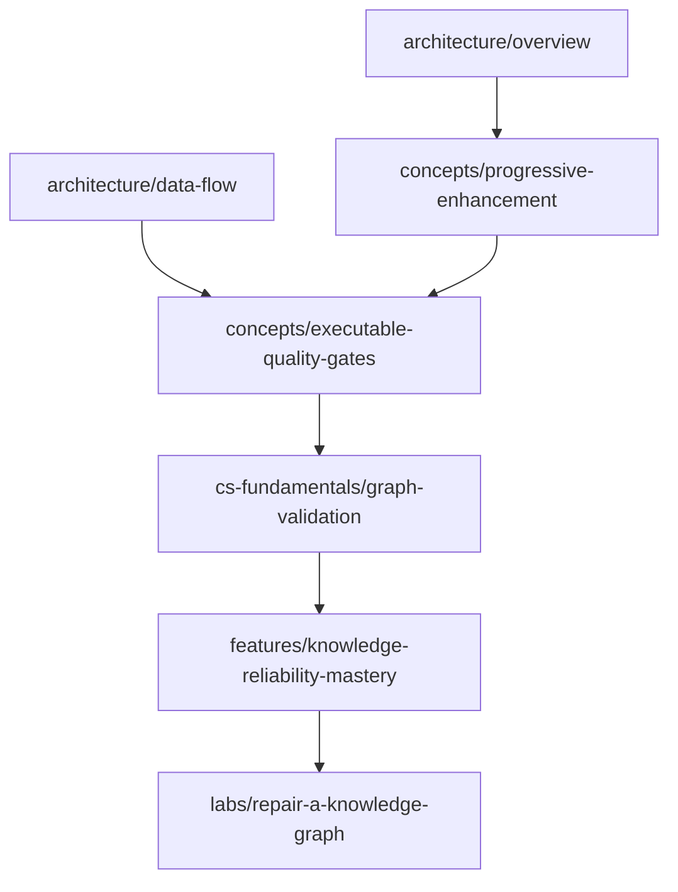
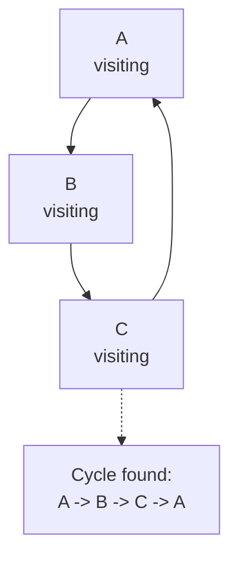

## Why Should I Care?

Broken links are graph bugs. A prerequisite cycle is a graph bug. An Architecture Explorer edge pointing to a missing node is a graph bug. Once you see documentation as a graph instead of a pile of files, you can use the same algorithms behind package managers, build systems, spreadsheets, and compilers to keep it coherent.

This codebase now has two important graphs: the learning graph under `src/content/knowledge/` and the visual architecture graph in `architecture-data.ts`. The knowledge audit validates both.

## The Graph Mental Model

A graph is a set of nodes connected by edges. In this project:

| Graph idea | Codebase example |
|---|---|
| Node | A knowledge article id like `architecture/data-flow` |
| Directed edge | A prerequisite from one article to another |
| Endpoint | `edge.from` and `edge.to` in `architecture-data.ts` |
| DAG | The prerequisite graph should be directed and acyclic |
| Cycle | Article A requires B, B requires C, C requires A |



This should be a DAG: a directed acyclic graph. "Directed" means prerequisites have a direction. "Acyclic" means you can eventually reach a starting point. If a beginner article requires an advanced article that requires the beginner article, the curriculum has no entry point.

## Endpoint Validation

The simplest graph validation is endpoint checking. Every architecture edge must point from an existing node to an existing node. In `rules.ts`, this starts with a set:

```ts
function collectNodeIds(nodes: readonly ArchitectureNode[]): Set<string> {
  return new Set(nodes.map((node) => node.id));
}
```

Then each edge is checked:

```ts
const missingEndpoints = [edge.from, edge.to].filter((nodeId) => !nodeIds.has(nodeId));
```

This is the hash-map lesson from `cs-fundamentals/hash-maps-and-lookup` in action. Building the set costs O(V), where V is the number of nodes. Checking all edges costs O(E), where E is the number of edges. Total: O(V + E).

Without the set, the naive approach is:

```ts
for (const edge of edges) {
  nodes.some((node) => node.id === edge.from);
  nodes.some((node) => node.id === edge.to);
}
```

That is O(V * E). It is fine for a tiny graph, but it trains the wrong instinct. The endpoint relation is exactly what sets are for.

## Cycle Detection

Prerequisites are different from related concepts. Related concepts can point in loops because they are exploratory links. Prerequisites cannot. A prerequisite answers "what should I know first?" If the answer eventually points back to the original article, the curriculum is impossible to follow.

The audit uses depth-first search with three states:

- **unvisited**: the article has not been checked yet
- **visiting**: the article is on the current recursion stack
- **visited**: the article and its prerequisites are already known safe

In code, those states are represented by two sets:

```ts
const visited = new Set<string>();
const visiting = new Set<string>();
```

When DFS enters an article, it adds it to `visiting`. When DFS leaves safely, it removes it from `visiting` and adds it to `visited`. If DFS reaches an article that is already in `visiting`, it found a back edge into the current path, which means there is a cycle.



This is the same core idea used by topological sorting. A topological order exists only when a directed graph has no directed cycles. Package installers, task runners, spreadsheet recalculation engines, and compilers all need versions of this check.

## Duplicate Reporting

Cycles are easy to over-report. The cycle `A -> B -> C -> A` can be discovered starting from A, B, or C. The audit avoids duplicate noise with `canonicalCycleKey()`, which rotates the cycle into a stable key before adding it to `reportedCycles`.

That is a user-experience decision disguised as an algorithm detail. A validation tool should produce enough information to fix the issue, not a wall of repeated symptoms.

## Graph Contracts vs Renderer Details

`architecture-data.ts` still includes `x`, `y`, `width`, and `height` because the current SVG renderer needs coordinates. But the audit focuses on renderer-agnostic correctness:

- node ids are unique
- node categories are from the documented enum
- edge endpoints resolve
- edge types are from the documented enum
- `knowledgeSlug` values point to articles
- article `diagramRef` values point to nodes

Those rules will still matter if Architecture Explorer v2 moves to Cytoscape, LikeC4, ELK, React Flow, or another renderer. Coordinates are presentation. Node ids and edges are the data contract.

## What Goes Wrong Without Graph Validation

Graphs fail in ways that look small but break trust:

- A renamed article leaves stale prerequisites behind.
- A diagram node opens a missing `/learn` route.
- A new Architecture Explorer edge references a node that was removed.
- A curriculum module accidentally becomes circular.
- Duplicate node ids cause one visual node to shadow another in lookup maps.

The bug is not "documentation has a typo." The bug is "the graph no longer describes a coherent system." Once you name it that way, the fix becomes straightforward: parse the graph, validate the graph, fail the build when the graph lies.
