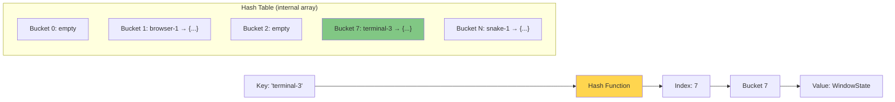
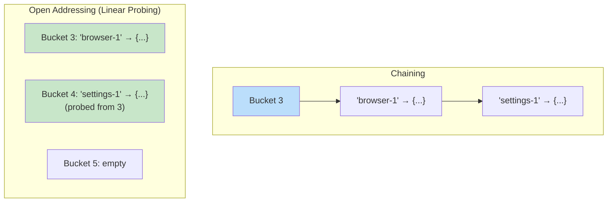

## Why Should I Care?

You click a window in the taskbar. The desktop store needs to find that window's state — its position, size, z-index, whether it's minimized. There might be 3 windows open, or 15. The lookup needs to be instant, every time, because it happens on every click, every drag frame, every keyboard shortcut.

In `src/components/desktop/store/types.ts`, the answer is one line:

```typescript
windows: Record<string, WindowState>;
```

That `Record<string, WindowState>` is a hash map. It's the reason `state.windows['terminal-3']` runs in constant time whether there are 2 windows or 200. Understanding hash maps — how they work, when they break, and why JavaScript objects are secretly hash maps — is foundational to understanding how keyed data flows through this entire application.

## What Is a Hash Map?

A [hash map](https://en.wikipedia.org/wiki/Hash_table) (also called hash table, dictionary, or associative array) stores key-value pairs with O(1) average-case lookup, insertion, and deletion. The trick: instead of searching through items to find a key, it computes a **hash function** on the key to jump directly to the storage location.



The hash function converts the key string into an array index. To look up `'terminal-3'`, the map computes `hash('terminal-3')`, gets an index (say 7), and goes directly to bucket 7. No scanning. No comparison with other keys. Just arithmetic and one memory access.

### The Big-O Story

| Operation | Average Case | Worst Case |
|---|---|---|
| Lookup | O(1) | O(n) |
| Insert | O(1) | O(n) |
| Delete | O(1) | O(n) |

The worst case happens when many keys **collide** — hash to the same bucket. Good hash functions and proper table sizing make collisions rare, keeping the amortized cost at O(1).

## Collision Handling

When two keys hash to the same index, a collision occurs. Two main strategies exist:

**Chaining** — each bucket holds a linked list (or small array) of entries. Colliding keys go into the same list. Lookup scans the short list at the target bucket. Most textbook implementations use this.

**Open addressing** — on collision, probe other buckets using a deterministic sequence (linear probing, quadratic probing, double hashing). V8's internal hash tables use a variant of this for memory efficiency.



The **load factor** (entries / buckets) determines when the table resizes. Typical threshold: 0.75. When exceeded, the table doubles in size and rehashes all entries — an O(n) operation, but amortized over many inserts it averages O(1) per insert.

## Hash Maps in This Codebase

### The Window Store

The core state structure in `src/components/desktop/store/desktop-store.ts`:

```typescript
const [state, setState] = createStore<DesktopState>({
  windows: {},
  windowOrder: [],
  nextZIndex: 10,
  // ...
});
```

`windows` is a hash map from window ID to `WindowState`. Every window operation is a direct property access:

```typescript
// O(1) — direct hash lookup
const win = state.windows[id];

// Compare with an array approach:
// O(n) — linear scan
const win = state.windowsArray.find(w => w.id === id);
```

The `windowOrder` array complements the map: it tracks z-order (which window is on top). The map provides fast lookup by ID; the array provides ordered iteration. This is a common pattern — **use a map for keyed access, an array for ordered traversal**.

### The App Registry

`APP_REGISTRY` in `src/components/desktop/apps/registry.ts` is another hash map:

```typescript
export const APP_REGISTRY: Record<string, AppRegistryEntry> = {};

export function registerApp(entry: AppRegistryEntry): void {
  APP_REGISTRY[entry.id] = entry;
}
```

When you type `open browser` in the terminal, the command handler does `APP_REGISTRY['browser']` — O(1) lookup from the user's string input to the app definition. Without a hash map, you'd scan every registered app comparing IDs.

## JavaScript Objects as Hash Maps

In JavaScript, plain objects (`{}`) and `Map` are both hash maps, but they work differently under the hood.

**Plain objects** — V8 uses **[hidden classes](https://v8.dev/blog/fast-properties)** (also called "shapes" or "maps" internally) for objects with known property sets. When properties are added in a consistent order (like the `WindowState` interface), V8 creates a hidden class that maps property names to fixed memory offsets — even faster than hash lookup. But when objects have many dynamic keys added and deleted (like `state.windows` where window IDs come and go), V8 switches to **dictionary mode** — a true hash table.

**[Map](https://developer.mozilla.org/en-US/docs/Web/JavaScript/Reference/Global_Objects/Map) objects** — always use a hash table internally. They support any key type (not just strings), preserve insertion order, have a `.size` property, and are optimized for frequent additions and deletions.

For this codebase, plain objects win because:
1. SolidJS's `createStore` wraps objects in Proxies for reactivity tracking — it expects plain objects
2. TypeScript's `Record<K, V>` type provides strong typing for object property access
3. Window IDs are always strings, so no need for non-string keys

## Performance: When Hash Maps Lose

Hash maps aren't always the answer:

- **Small collections (< ~10 items)**: Linear scan through an array can beat hash lookup due to CPU cache locality. The array elements sit in contiguous memory; the hash table has pointer indirection.
- **Ordered iteration**: Hash maps don't guarantee order. The `windowOrder` array exists precisely because `Object.keys(state.windows)` doesn't reflect z-order.
- **Memory overhead**: Each hash table entry carries overhead (hash values, pointers, load factor headroom). For simple indexed data, an array is more memory-efficient.
- **Pathological hash collisions**: If all keys hash to the same bucket, every operation degrades to O(n). JavaScript engines use strong hash functions to prevent this, but algorithmic denial-of-service attacks have exploited weak hash functions in web servers.

## Deeper Rabbit Holes

- **Perfect hashing**: When the key set is known in advance (like the fixed set of app IDs), a perfect hash function maps each key to a unique slot with zero collisions. Compilers use this for keyword tables.
- **Consistent hashing**: Used in distributed systems to minimize key redistribution when nodes are added or removed. Relevant if you ever build a distributed version of the window manager.
- **Bloom filters**: A probabilistic data structure built on hash functions. It can tell you "definitely not in the set" or "probably in the set" — useful for caches and spell checkers.
- **V8 hidden classes**: V8's optimization for objects with predictable shapes. When you define `WindowState` as an interface and all windows have the same properties, V8 creates a hidden class that makes property access as fast as a struct field offset in C.
