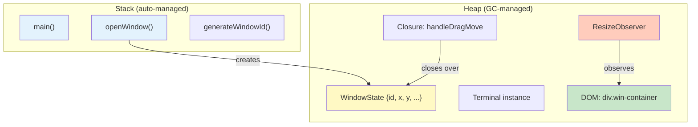
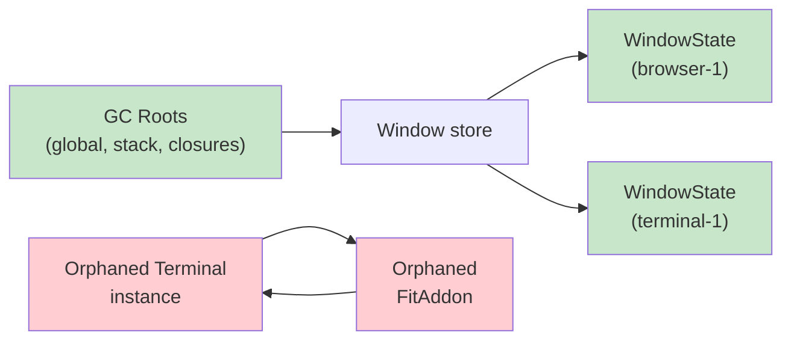

## Why Should I Care?

Every time you open a terminal window on this desktop, the app creates a `Terminal` instance from xterm.js, a `ResizeObserver` watching the container, and a `FitAddon` that recalculates dimensions. Every time you close that window, all of those resources need to be freed. If they aren't, opening and closing windows repeatedly would consume more and more memory until the tab crashes.

In `src/components/desktop/apps/TerminalApp.tsx`, three lines prevent this:

```typescript
onCleanup(() => {
  resizeObserver?.disconnect();
  fitAddonInstance?.dispose();
  terminalInstance?.dispose();
});
```

Understanding *why* these lines are necessary — and what happens without them — requires understanding how JavaScript manages [memory](https://developer.chrome.com/docs/devtools/memory-problems). This isn't just theory: memory leaks are one of the most common production bugs in long-running single-page applications, and they're invisible until they crash the browser tab.

## How JavaScript Memory Works

[JavaScript manages memory automatically](https://developer.mozilla.org/en-US/docs/Web/JavaScript/Memory_management). You allocate by creating objects (`{}`), arrays (`[]`), closures, DOM nodes — and the engine decides when to free them. There's no `malloc`/`free`, no `delete` keyword for memory (JavaScript's `delete` removes object properties, it doesn't free memory).

The lifecycle is:
1. **Allocate** — creating a value reserves memory
2. **Use** — reading/writing the value
3. **Free** — the [garbage collector](https://gchandbook.org/) reclaims memory when the value is no longer reachable

### The Heap and the Stack

JavaScript uses two memory regions:

- **Stack**: For primitive values and function call frames. Fast, automatically managed by the call stack. When a function returns, its frame is popped — no GC needed.
- **Heap**: For objects, arrays, closures, DOM nodes. This is where the garbage collector operates. Objects on the heap persist as long as something references them.



## Mark-and-Sweep: The Core Algorithm

V8 (Chrome's JavaScript engine) uses **mark-and-sweep** garbage collection:

1. **Start from roots** — global object, current call stack, active closures, registered callbacks
2. **Mark phase** — trace all references from roots, marking every reachable object
3. **Sweep phase** — scan the heap, free every object that wasn't marked

An object is garbage if and only if no chain of references from any root can reach it. This handles circular references correctly — if two objects reference each other but nothing else references either, both are unreachable and get collected.



In this diagram, the green objects are reachable from GC roots and survive. The red objects form a cycle but are unreachable — they get collected.

### Generational Collection

V8 divides the heap into two generations:

- **Young generation (nursery)**: Small (~1-8 MB). Newly allocated objects go here. Collected frequently with a fast **Scavenge** algorithm (semi-space copying). Most objects die young — a drag handler's temporary coordinate object, a short-lived array from `.map()`.
- **Old generation**: Larger. Objects that survive multiple young-gen collections are "promoted" here. Collected less often with a full **mark-sweep-compact** cycle.

This is the **generational hypothesis** at work: most objects are short-lived. By collecting the nursery frequently and cheaply, V8 avoids scanning the entire heap every time.

## Closures: The Memory Retention Mechanism

A closure captures variables from its enclosing scope. As long as the closure is reachable, those variables can't be garbage collected:

```typescript
// From Window.tsx — simplified
function Window(props: WindowProps): JSX.Element {
  let isDragging = false;
  let dragOffsetX = 0;
  let dragOffsetY = 0;

  const handleDragMove = (e: PointerEvent): void => {
    if (!isDragging) return;
    let newX = e.clientX - dragOffsetX;
    // ...
  };
  // handleDragMove closes over isDragging, dragOffsetX, dragOffsetY
  // These variables live as long as handleDragMove is reachable
}
```

The `handleDragMove` closure retains `isDragging`, `dragOffsetX`, `dragOffsetY`, `props`, `state`, and `actions`. When the component mounts, these closures are attached as event listeners to DOM elements. When the component unmounts and DOM elements are removed, the closures become unreachable (no element references them) and can be collected — *if* no other reference keeps them alive.

## Common Memory Leak Patterns

### 1. Uncleared Timers and Intervals

```typescript
// LEAK: setInterval never cleared
onMount(() => {
  setInterval(() => {
    setState('clock', new Date());
  }, 1000);
});
// The interval's callback closure retains setState and the component scope
// Even after unmount, the interval fires forever
```

Fix: `onCleanup(() => clearInterval(id))`.

### 2. Unremoved Event Listeners

```typescript
// LEAK: global listener never removed
onMount(() => {
  window.addEventListener('resize', handleResize);
});
// handleResize closure retains component variables
```

Fix: `onCleanup(() => window.removeEventListener('resize', handleResize))`.

The desktop store in `src/components/desktop/store/desktop-store.ts` does this correctly:

```typescript
mediaQuery.addEventListener('change', handleChange);
onCleanup(() => mediaQuery.removeEventListener('change', handleChange));
```

### 3. Detached DOM Trees

When a component unmounts, SolidJS removes its DOM nodes from the document. But if JavaScript still references those nodes (via a variable, a closure, or a map), they become **detached DOM nodes** — not visible, not in the document, but consuming memory.

The TerminalApp is especially vulnerable because xterm.js creates its own DOM structure inside the container. Without `terminalInstance.dispose()`, xterm's internal DOM nodes would remain in memory even after SolidJS removes the outer container.

### 4. Accumulating Store Data

```typescript
// Potential leak: window state never removed from store
actions.closeWindow = (id) => {
  // If this only hides the window but doesn't delete the WindowState...
  setState('windows', id, 'isMinimized', true);
  // ...the WindowState object accumulates forever
};
```

The actual implementation properly deletes the state:

```typescript
setState(produce((s) => {
  delete s.windows[id];
  s.windowOrder = s.windowOrder.filter((wid) => wid !== id);
}));
```

## WeakRef and WeakMap: GC-Friendly References

Sometimes you need to reference an object without preventing its collection. JavaScript provides:

- **WeakMap**: Keys are held weakly — if nothing else references the key, the entry is automatically removed. Useful for attaching metadata to DOM nodes without preventing their collection.
- **WeakRef**: A reference that doesn't prevent GC. You must check if the referent is still alive with `.deref()`.
- **FinalizationRegistry**: Register a callback that runs when an object is collected. Useful for cleanup of external resources tied to JS object lifecycle.

```typescript
// Hypothetical: tracking window metrics without preventing GC
const metrics = new WeakMap<HTMLElement, { dragCount: number }>();

// When the DOM element is removed and GC'd,
// the metrics entry is automatically cleaned up
```

## The onCleanup Pattern

SolidJS's [`onCleanup()`](https://docs.solidjs.com/reference/lifecycle/on-cleanup) is the framework-level solution to memory management in reactive components. It runs when the current reactive scope is disposed — which happens when a component unmounts, an effect re-runs (cleaning up the previous run), or a conditional branch changes.

```typescript
// TerminalApp.tsx — the critical cleanup
onCleanup(() => {
  resizeObserver?.disconnect();   // Stop observing (removes browser reference)
  fitAddonInstance?.dispose();    // Free xterm addon resources
  terminalInstance?.dispose();    // Free xterm DOM nodes and buffers
});
```

The pattern: every `onMount` that creates external resources needs a corresponding `onCleanup` that destroys them. Every `addEventListener` needs a `removeEventListener`. Every `setInterval` needs a `clearInterval`. This isn't SolidJS-specific — React has `useEffect` cleanup returns, Vue has `onUnmounted`, [Svelte has `onDestroy`](https://svelte.dev/docs/svelte/legacy-lifecycle-hooks). The principle is universal: **components must clean up after themselves because the garbage collector can't know about external resource registrations**.

## Deeper Rabbit Holes

- **Concurrent marking in V8**: V8 marks objects on a background thread while your JavaScript runs on the main thread. This reduces GC pauses from tens of milliseconds to under a millisecond — critical for 60fps animations like window dragging.
- **Incremental GC**: Instead of one big pause, V8 breaks marking into small increments interleaved with your code. Each increment does a few milliseconds of work, then yields.
- **Orinoco**: V8's [garbage collector](https://v8.dev/blog/trash-talk), named after the Orinoco River. It combines generational, incremental, concurrent, and parallel techniques. Understanding it helps interpret Chrome DevTools' Performance panel "Minor GC" and "Major GC" events.
- **ArrayBuffer and WebAssembly memory**: Large typed arrays and WASM linear memory are allocated outside the normal JS heap. The GC tracks them for accounting but doesn't move them. If the desktop ever adds WASM games, this becomes relevant for memory budgeting.
