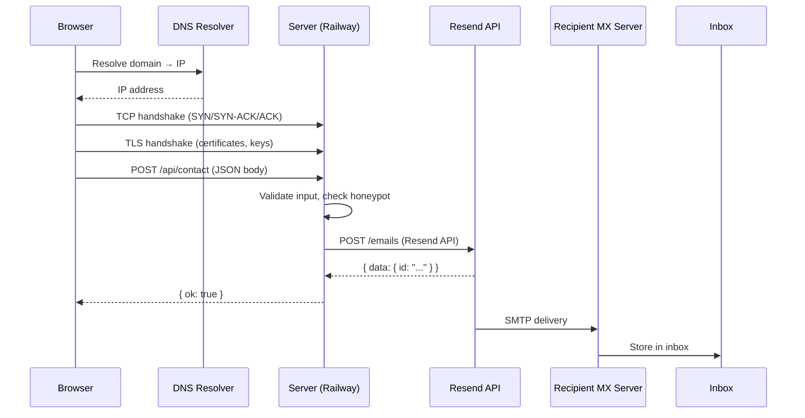

## Why Should I Care?

Click "Send" on the contact form of this CV website. In the next 2-3 seconds, your message travels from the browser through at least six protocol layers, crosses the internet to a Railway server, bounces to the Resend API, gets converted to an email, passes through SMTP servers, and arrives in an inbox. If any link in this chain breaks — a DNS failure, a TLS certificate issue, a misconfigured environment variable — the message is lost.

The contact form endpoint in `src/pages/api/contact.ts` is 95 lines of code. But those 95 lines sit on top of decades of networking protocols. Understanding the full request lifecycle — not just "fetch sends a request" — explains why the code handles errors the way it does, why environment variables matter, and what the Network tab in DevTools actually shows you.

## The HTTP Request Lifecycle

When the contact form calls `fetch('/api/contact', ...)`, here's the complete path:



### Step 1: DNS — Resolving the Name

Before the browser can send a single byte, it needs to know *where* to send it. DNS (Domain Name System) translates the human-readable domain name to an IP address.

DNS is a distributed hierarchy:
1. **Browser cache**: Already visited this domain? Use the cached IP.
2. **OS cache**: The operating system maintains its own DNS cache.
3. **Recursive resolver**: Your ISP's (or Cloudflare's 1.1.1.1, Google's 8.8.8.8) resolver queries the hierarchy.
4. **Root → TLD → Authoritative**: The resolver asks root servers (`.`), then TLD servers (`.com`), then the domain's authoritative nameserver for the final IP.

For the contact form, DNS is typically a non-event: the browser already resolved the domain when loading the page. The cached IP is reused for the API call. You'll see "DNS Lookup: 0ms" in DevTools for same-origin requests.

### Step 2: TCP — Reliable Connection

TCP (Transmission Control Protocol) establishes a reliable, ordered connection between browser and server via the **three-way handshake**:

1. **SYN**: Browser → Server: "I want to connect"
2. **SYN-ACK**: Server → Browser: "OK, I acknowledge"
3. **ACK**: Browser → Server: "Confirmed, let's go"

This costs one round trip. On a 50ms latency connection, that's 50ms before any data flows. HTTP/2 and HTTP/3 improve this — HTTP/3 uses QUIC (over UDP) which combines the connection and encryption handshakes into a single round trip.

TCP also handles **reliability**: if a packet is lost, it retransmits. If packets arrive out of order, TCP reassembles them. This is why HTTP works reliably even on lossy networks — TCP abstracts away the chaos of the internet.

### Step 3: TLS — Encryption

For HTTPS (which Railway enforces), a TLS handshake follows the TCP connection:

1. **ClientHello**: Browser sends supported cipher suites and a random number
2. **ServerHello**: Server chooses a cipher suite, sends its certificate
3. **Certificate verification**: Browser checks the certificate against its trusted CA (Certificate Authority) list
4. **Key exchange**: Both sides derive shared encryption keys using Diffie-Hellman or similar

After [TLS](https://developer.mozilla.org/en-US/docs/Web/Security/Transport_Layer_Security), all data is encrypted. An attacker sniffing the network sees encrypted bytes, not the JSON body with the sender's email address. This is especially important for the contact form — it transmits names and email addresses.

### Step 4: HTTP — The Application Protocol

Finally, the browser sends the actual HTTP request:

```
POST /api/contact HTTP/1.1
Host: cv.example.com
Content-Type: application/json
Origin: https://cv.example.com

{"name":"Alice","email":"alice@example.com","subject":"Hello","message":"..."}
```

On the server, Astro's Node.js adapter receives the request and routes it to `src/pages/api/contact.ts`:

```typescript
export const POST: APIRoute = async ({ request }) => {
  let body: ContactBody;
  try {
    body = (await request.json()) as ContactBody;
  } catch {
    return new Response(JSON.stringify({ ok: false, error: 'Invalid JSON' }), {
      status: 400,
    });
  }
  // Validate, then call Resend...
};
```

The endpoint validates the input (required fields, email format, honeypot), then makes its own HTTP request to the Resend API.

## The Server-to-Resend Hop

The contact endpoint creates a Resend client and calls the email send API:

```typescript
const resend = new Resend(apiKey);
const { error } = await resend.emails.send({
  from: `CV Contact <${fromEmail}>`,
  to: toEmail,
  replyTo: email,
  subject: `[CV Contact] ${subject}`,
  html: `<p><strong>From:</strong> ${name} (${email})</p><hr/>${message}`,
  text: `From: ${name} (${email})\n\n${plainText}`,
});
```

This is server-to-server HTTP. The Resend SDK makes a `POST https://api.resend.com/emails` request with the API key in the `Authorization` header. The full path: Railway server → DNS → Resend's load balancer → Resend's API server → response back to Railway.

**Critical detail**: The API key comes from `process.env['RESEND_API_KEY']`, not `import.meta.env`. Vite inlines `import.meta.env` at build time. In the Docker build (CI), secrets aren't available, so `import.meta.env.RESEND_API_KEY` would become an empty string in the built JavaScript. `process.env` reads from the actual runtime environment — the one Railway configures when the container starts.

## Email Delivery: Beyond HTTP

Once Resend accepts the API call, the email enters the SMTP (Simple Mail Transfer Protocol) pipeline:

1. **Resend's outbound servers** compose the email with proper headers (DKIM signature, SPF alignment, MIME formatting)
2. **DNS MX lookup**: Resend queries the recipient domain's MX (Mail Exchanger) records to find which server handles their email
3. **SMTP delivery**: Resend connects to the recipient's MX server and transfers the message via SMTP (port 25 or 587)
4. **Spam filtering**: The recipient's server checks SPF (is Resend authorized to send for this domain?), DKIM (is the signature valid?), and DMARC (does the domain policy allow this?)
5. **Inbox storage**: If everything passes, the email is stored and the recipient sees it

This entire pipeline happens asynchronously after the API response. The Resend API returns `{ data: { id: "..." } }` immediately — it doesn't wait for email delivery. That's why the endpoint checks `error` in the response (API-level failures) but can't check whether the email actually reached the inbox.

## The Error Handling Chain

The contact endpoint handles errors at every layer:

```typescript
// Layer 1: JSON parsing (network/client errors)
try { body = await request.json(); }
catch { return Response(400, 'Invalid JSON'); }

// Layer 2: Input validation (application logic)
if (!name || !email || !subject || !message)
  return Response(400, 'All fields required');

// Layer 3: Server configuration (deployment errors)
if (!apiKey || !toEmail || !fromEmail)
  return Response(500, 'Server configuration error');

// Layer 4: Resend API errors (third-party service)
const { error } = await resend.emails.send({...});
if (error) return Response(500, 'Failed to send email');
```

Note that the Resend SDK does **not** throw on API errors — it returns `{ data, error }`. This is explicitly called out in the codebase guidelines. A common bug would be wrapping the send call in try/catch and missing the `error` field entirely.

## DNS in Detail

DNS is a hierarchical, distributed database. Every domain name is a path through this tree:

```
. (root)
├── com
│   ├── example
│   │   └── cv (A record → 12.34.56.78)
│   └── resend
│       └── api (A record → ...)
├── org
└── dev
```

Key record types:
- **A / AAAA**: Maps domain to IPv4/IPv6 address
- **CNAME**: Alias pointing to another domain name
- **MX**: Mail exchanger — which server handles email for this domain
- **TXT**: Arbitrary text — used for SPF, DKIM, domain verification

DNS responses have a **TTL** (Time To Live) — the browser caches the result for that duration. Short TTLs (60s) allow fast failover; long TTLs (86400s) reduce DNS lookup latency. Railway sets TTLs appropriate for their load balancer infrastructure.

## Deeper Rabbit Holes

- **HTTP/2 multiplexing**: Multiple requests share a single TCP connection, eliminating head-of-line blocking at the HTTP level. If the contact form and a CSS file load simultaneously, they're interleaved on one connection.
- **HTTP/3 and QUIC**: Built on UDP instead of TCP. Combines the TCP and TLS handshakes into one round trip (0-RTT for returning visitors). Eliminates TCP-level head-of-line blocking. Railway supports HTTP/3.
- **Certificate Transparency (CT) logs**: Public append-only logs of all issued TLS certificates. Browsers check CT logs to detect misissued certificates — if a CA issues a fraudulent cert for your domain, CT logs make it publicly visible.
- **DNSSEC**: Cryptographic signatures on DNS records that prevent forgery. Without DNSSEC, a man-in-the-middle can return a fake IP address for a domain name (DNS spoofing).
- **Email authentication (SPF/DKIM/DMARC)**: SPF lists which IP addresses can send email for a domain. DKIM cryptographically signs email headers so the recipient can verify they weren't tampered with. DMARC tells recipients what to do when SPF/DKIM fail. Resend handles all three, which is why it can deliver to Gmail without landing in spam.
