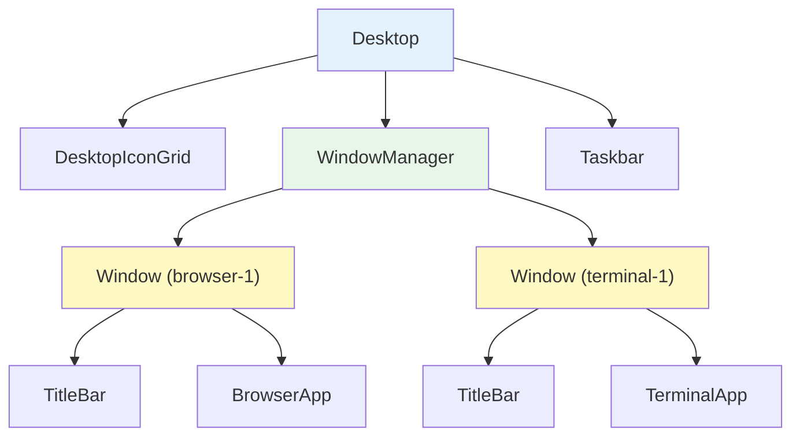
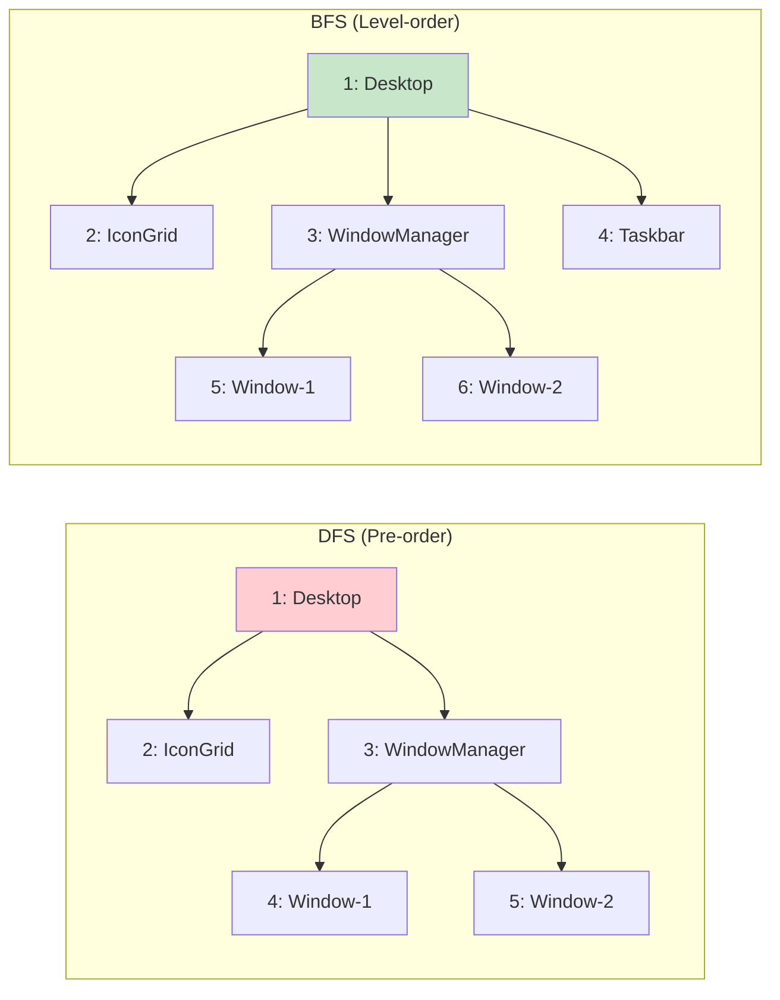

## Why Should I Care?

When you right-click inside a window on this desktop, the browser needs to figure out *which* window you clicked. It doesn't search every element on the page — it walks up the DOM tree from the click target using `closest('.win-container')`. When SolidJS renders the window list, it traverses the [component](https://docs.solidjs.com/concepts/components/basics) tree from `Desktop` down through `WindowManager` to each `Window`. When the browser paints the screen, it traverses the render tree to calculate layout.

Trees are everywhere in frontend development. The [DOM](https://developer.mozilla.org/en-US/docs/Web/API/Document_Object_Model) is a tree. The component hierarchy is a tree. The CSS selector engine traverses trees. Understanding tree structures and [traversal algorithms](https://en.wikipedia.org/wiki/Tree_traversal) isn't abstract computer science — it's the mental model you need to reason about how every click, render, and layout calculation actually works (see [Introduction to Algorithms (CLRS)](https://mitpress.mit.edu/9780262046305/introduction-to-algorithms/)).

## Trees: The Core Abstraction

A tree is a hierarchical data structure where each node has zero or more children, and every node except the root has exactly one parent. No cycles, no multiple parents.



Key terminology:
- **Root**: The topmost node (`Desktop` in the component tree, `<html>` in the DOM)
- **Leaf**: A node with no children (a text node, a button)
- **Depth**: Distance from root to node. Root has depth 0.
- **Height**: Longest path from node to a leaf. Leaves have height 0.
- **Subtree**: A node and all its descendants. Each `Window` component is the root of its own subtree.

## Two Ways to Walk a Tree

Every tree algorithm boils down to visiting nodes in some order. The two fundamental strategies:

### Depth-First Search (DFS)

Go deep before going wide. From the root, visit a child, then that child's child, all the way to a leaf, then backtrack and visit the next sibling.

Three flavors for binary trees (generalized for n-ary trees):
- **Pre-order**: Visit node, then children. DOM document order uses this.
- **In-order**: Visit left child, node, right child. Used for BST sorted traversal.
- **Post-order**: Visit children, then node. Used for cleanup/disposal (SolidJS disposes children before parent scope).

### Breadth-First Search (BFS)

Go wide before going deep. Visit all nodes at depth 0, then depth 1, then depth 2, and so on. Uses a queue.



**DFS** is natural for recursive structures — and components are recursive. A component renders its children, which render their children. The call stack itself acts as the traversal stack.

**BFS** is useful when you care about proximity to the root — finding the nearest ancestor matching a condition, or rendering layers in z-order.

## Trees in This Codebase

### The DOM Tree and `closest()`

In `src/components/desktop/Window.tsx`, click handling uses upward DOM traversal:

```typescript
const handleDragStart = (e: PointerEvent): void => {
  const clicked = e.target as HTMLElement;
  if (clicked.closest('.title-bar-controls')) return;
  // ...
  const windowEl = target.closest('.win-container') as HTMLElement | null;
};
```

[`Element.closest(selector)`](https://developer.mozilla.org/en-US/docs/Web/API/Element/closest) walks the **ancestor chain** — from the clicked element up through parents toward the document root. It's a linear walk up one branch of the tree, not a full traversal. The DOM spec defines it as: "return the first ancestor (or self) that matches the selector."

This is the browser's built-in tree navigation. Every [DOM](https://dom.spec.whatwg.org/#traversal) node has a `parentElement` reference, making upward traversal O(d) where d is the depth. The desktop's DOM is shallow — typically 5-8 levels from a button inside a window to the root — so `closest()` is effectively instant.

### The Component Tree

The SolidJS component hierarchy forms a tree:

```
Desktop
├── DesktopProvider (no DOM output — context only)
│   ├── CrtMonitorFrame
│   ├── DesktopIconGrid
│   ├── WindowManager
│   │   └── For each window:
│   │       └── Window
│   │           ├── TitleBar
│   │           └── Suspense
│   │               └── Dynamic (app component)
│   └── Taskbar
```

But this component tree doesn't map 1:1 to the DOM tree. `DesktopProvider` adds no DOM element — it only establishes a SolidJS context scope. `For` adds no wrapper element — it directly inserts/removes child DOM nodes. This divergence between component tree and DOM tree is important: when you inspect the DOM in DevTools, you see the physical tree; when you read the source code, you see the logical component tree.

### WindowManager's Iteration

`WindowManager` in `src/components/desktop/WindowManager.tsx` iterates the window list:

```typescript
const openWindows = (): WindowState[] => {
  return state.windowOrder
    .map((id) => state.windows[id])
    .filter((w): w is WindowState => w !== undefined);
};

return (
  <For each={openWindows()}>
    {(win: WindowState) => <Window window={win}>...</Window>}
  </For>
);
```

This is flat iteration (the window list is an array), but the result is a tree: each `Window` becomes a subtree in the DOM with title bar, body, resize handles, and app content as descendants.

### Event Bubbling: Implicit Tree Traversal

When you click a button inside a window, the browser dispatches the event through three phases — all tree traversals:

1. **Capture phase**: DFS from root to target (downward)
2. **Target phase**: The clicked element handles the event
3. **Bubble phase**: Walk from target back up to root (upward)

The `handleDragStart` in `Window.tsx` listens during the bubble phase (the default). When a click on a title-bar button bubbles up to the title bar's `onPointerDown`, the handler checks `clicked.closest('.title-bar-controls')` to determine if the click originated from a control button — using tree traversal to make a decision about tree-structured UI.

## Tree Algorithms You Use Without Knowing

- **`querySelector` / `querySelectorAll`**: DFS pre-order traversal of the DOM, matching each node against the CSS selector.
- **`document.getElementById`**: Technically a hash map lookup (browsers index IDs), not a tree traversal. That's why it's faster.
- **CSS selector matching**: The browser matches selectors right-to-left. For `.window .title-bar`, it first finds all `.title-bar` elements, then walks up each one's ancestor chain checking for `.window`. Upward ancestor walk, not downward search.
- **Layout calculation**: The browser traverses the render tree to compute box positions. Some properties (like `width: 50%`) require a top-down pass; others (like auto height from content) require bottom-up. The browser does multiple passes.
- **Garbage collection**: The GC traverses the object graph (which is a general graph, not strictly a tree) from roots to find reachable objects. More on this in [Memory Management and GC](/learn/cs-fundamentals/memory-management-and-gc).

## Tree Complexity

| Operation | Time | Notes |
|---|---|---|
| DFS traversal | O(n) | Visit every node once |
| BFS traversal | O(n) | Visit every node once |
| `closest()` ancestor walk | O(d) | d = depth of starting element |
| Binary search tree lookup | O(log n) average | O(n) if tree is unbalanced |
| DOM `getElementById` | O(1) | Hash map, not tree search |

The key insight: traversing an entire tree is always O(n) — you must visit every node. But if you're searching for one node, the tree's structure determines whether you can skip subtrees (BST: O(log n)) or must visit everything (unsorted tree: O(n)).

## Deeper Rabbit Holes

- **Red-black trees / AVL trees**: Self-balancing binary search trees that guarantee O(log n) operations. Used internally by database indexes and `std::map` in C++. JavaScript doesn't expose balanced trees natively, but `Map` iteration order is guaranteed by insertion order (not tree-sorted order).
- **Trie (prefix tree)**: A tree where each edge is a character. Used for autocomplete and IP routing tables. If the terminal's command matching needed prefix search (`op` → `open`), a trie would be the data structure.
- **Abstract Syntax Trees (AST)**: The compiler/bundler parses your JSX into an AST — a tree — then transforms it. SolidJS's compiler walks the JSX AST to generate the fine-grained reactive bindings. Every JSX expression becomes a node in the AST that gets compiled to a DOM creation call.
- **Virtual DOM as tree diffing**: React's reconciliation algorithm diffs two virtual DOM trees. This is an O(n) heuristic algorithm (true tree diff is O(n³)). SolidJS avoids this entirely by not having a virtual DOM — another reason to understand trees and their algorithmic costs.
