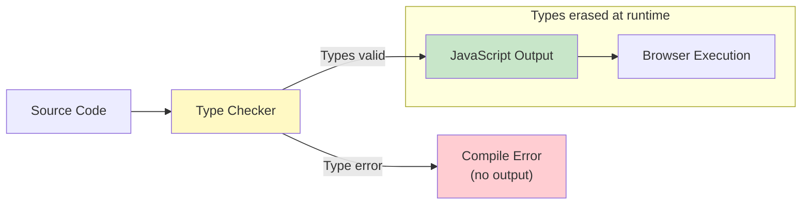

## Why Should I Care?

Open `src/components/desktop/store/types.ts`. You'll see 66 lines of TypeScript interfaces and type definitions that describe every window, every app registration, every action the desktop can perform. Zero lines of runtime code — just types. Delete them all, and the application still runs identically. So why do they exist?

Because they catch bugs *before* the code runs. When you write `actions.openWindow(42)` instead of `actions.openWindow('browser')`, TypeScript flags it instantly — `42` isn't a `string`. When you add a new property to `WindowState` but forget to update the `produce()` call in the store, TypeScript shows you exactly where the mismatch is. The type system is a machine-checked specification of how the application's data structures connect.

Understanding type systems — what they can prove, what they can't, and the tradeoffs TypeScript makes — is essential for working in any typed codebase.

## What Is a Type System?

A type system assigns types to program expressions and enforces rules about how types can interact. Its job: **reject programs that would cause certain errors at runtime, without running the program**.



TypeScript's type system is:
- **Static**: Checked at compile time, not runtime
- **Structural**: Compatibility based on shape, not name
- **Gradual**: You can mix typed and untyped code (`any` opts out)
- **Erased**: Types are removed during compilation — zero runtime overhead

## Structural vs. Nominal Typing

The fundamental divide in type system design:

**Nominal typing** (Java, C#, Rust): Two types are compatible only if they have the same *name* (or an explicit inheritance/implementation relationship). Even if `WindowState` and `AppConfig` have identical fields, they're incompatible unless one explicitly extends the other.

**Structural typing** (TypeScript, Go interfaces): Two types are compatible if they have the same *shape* — the same properties with compatible types. If an object has `id: string`, `title: string`, and all other required fields of `AppRegistryEntry`, it IS an `AppRegistryEntry` — no `implements` keyword needed.

```typescript
// These are structurally compatible in TypeScript
interface Point2D { x: number; y: number; }
interface Coordinate { x: number; y: number; }

const p: Point2D = { x: 10, y: 20 };
const c: Coordinate = p; // ✅ Works — same shape
```

TypeScript chose structural typing because JavaScript is structurally typed at runtime — duck typing. "If it has the right properties, it works." TypeScript formalizes this existing JavaScript idiom.

### Where This Matters in the Codebase

The `registerApp()` function in `src/components/desktop/apps/registry.ts` accepts an `AppRegistryEntry`:

```typescript
export function registerApp(entry: AppRegistryEntry): void {
  APP_REGISTRY[entry.id] = entry;
}
```

Each app file creates an object literal matching the `AppRegistryEntry` shape. No `class BrowserApp implements AppRegistryEntry` — just an object with the right properties. Structural typing makes this registration pattern lightweight: define the interface once, and any object matching the shape is accepted.

## Generics: Parameterized Types

Generics let you write type-safe code that works with multiple types:

```typescript
// Record<K, V> is a generic utility type
// It creates an index signature: { [key: K]: V }
windows: Record<string, WindowState>;    // string keys → WindowState values
```

Without generics, you'd need separate types for each mapping:

```typescript
// Without generics — repetitive, error-prone
interface StringToWindowState { [key: string]: WindowState; }
interface StringToAppEntry { [key: string]: AppRegistryEntry; }
interface StringToCommandHandler { [key: string]: CommandHandler; }

// With generics — one type, parameterized
Record<string, WindowState>
Record<string, AppRegistryEntry>
Record<string, CommandHandler>
```

### Generic Constraints

Generics can be constrained to specific shapes:

```typescript
// From SolidJS's createStore — simplified
function createStore<T extends object>(initialState: T): [Store<T>, SetStoreFunction<T>];
```

`T extends object` means `T` must be an object type — you can't call `createStore(42)`. This is a **bounded generic**: the type parameter has an upper bound. The store function works with any object shape while ensuring the state and setter types stay synchronized.

### Zod: Runtime Types from Schema

The content configuration in `src/content.config.ts` uses Zod schemas that serve double duty — runtime validation AND compile-time types:

```typescript
const knowledge = defineCollection({
  schema: z.object({
    title: z.string(),
    category: z.enum(['architecture', 'concept', 'technology', 'feature', 'lab', 'cs-fundamentals']),
    exercises: z.array(z.object({
      question: z.string(),
      type: z.enum(['predict', 'explain', 'do', 'debug']).default('explain'),
      answer: z.string(),
    })).default([]),
  }),
});
```

Zod infers TypeScript types from schemas: `z.string()` → `string`, `z.enum([...])` → union literal type, `z.array(z.object({...}))` → array of objects. One schema definition, two guarantees: runtime validation (Markdown frontmatter is correct) and compile-time type safety (code accessing frontmatter fields gets autocomplete and error checking).

## Type Narrowing: Refining Types Through Control Flow

TypeScript tracks how conditions narrow types:

```typescript
// state.windows[id] might be undefined (index signature)
const win = state.windows[id];
// Type: WindowState | undefined

if (!win) return;
// After this guard, TypeScript knows win is WindowState

// Now safe to access .x, .y, .title
actions.updateWindowPosition(win.id, win.x + 10, win.y);
```

This is **control flow analysis** — TypeScript follows the logic of `if`, `switch`, `typeof`, `instanceof`, and truthiness checks to narrow types within branches. The type changes based on *where* in the code you are.

### Discriminated Unions

A powerful pattern for type-safe state management:

```typescript
// Hypothetical action types (pattern used in many state management libraries)
type DesktopAction =
  | { type: 'OPEN_WINDOW'; appId: string }
  | { type: 'CLOSE_WINDOW'; windowId: string }
  | { type: 'MOVE_WINDOW'; windowId: string; x: number; y: number };

function reduce(action: DesktopAction): void {
  switch (action.type) {
    case 'OPEN_WINDOW':
      // TypeScript knows: action has appId (string), NOT windowId
      openWindow(action.appId);
      break;
    case 'MOVE_WINDOW':
      // TypeScript knows: action has windowId, x, y
      moveWindow(action.windowId, action.x, action.y);
      break;
  }
}
```

The shared `type` property (the discriminant) lets TypeScript narrow the union in each `case` branch. This is how Redux-style stores achieve type safety — and why TypeScript's union types are more expressive than traditional class hierarchies for modeling state.

## The Tradeoff: Soundness vs. Pragmatism

TypeScript is deliberately **unsound** — it has known holes where the type system doesn't catch runtime errors:

```typescript
// Unsound: type assertion (you're telling TS "trust me")
const x = someValue as WindowState; // No runtime check

// Unsound: index signatures return T, not T | undefined (by default)
const win = state.windows['nonexistent']; // Type says WindowState, runtime says undefined
```

This is a design choice. A fully sound type system (like Rust's) rejects more valid programs. TypeScript prioritizes developer productivity: it catches 95% of bugs while staying compatible with JavaScript's dynamic patterns. The `strict` and `noUncheckedIndexedAccess` compiler options tighten the rules — this codebase enables `strictest` via Astro's config, maximizing safety.

## Deeper Rabbit Holes

- **Branded types**: Simulating nominal typing in TypeScript. Create a `type WindowId = string & { __brand: 'WindowId' }` to prevent accidentally passing a regular string as a window ID. Used when structural compatibility is too loose.
- **Conditional types**: `T extends U ? X : Y` — types that branch on a condition. Powers utility types like `Exclude<T, U>`, `Extract<T, U>`, and `ReturnType<T>`. Essential for library authors.
- **Template literal types**: `type EventName = \`on${Capitalize<string>}\`` — types that match string patterns. TypeScript can check that your event name strings follow a naming convention.
- **The Curry-Howard correspondence**: A deep connection between type systems and mathematical logic. Every type is a proposition, every program is a proof. `WindowState` isn't just a data shape — it's a statement that "windows with these properties exist." TypeScript's type checker is essentially a theorem prover.
- **Effect systems**: A frontier of type system research where types track not just data shapes but also side effects (I/O, exceptions, state mutations). Languages like Koka and research extensions to Haskell explore this. TypeScript has no effect system — `void` return type doesn't mean "no side effects."
