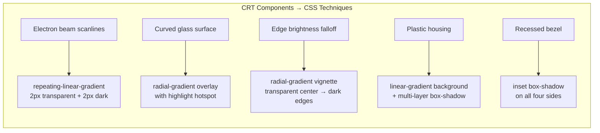

## Why Should I Care?

The CRT monitor frame is the most visually complex component in the project, yet it's built entirely with CSS — no images, no canvas, no WebGL. It recreates a physical CRT monitor around the desktop using gradients, box-shadows, pseudo-elements, and careful layering. Understanding how it works teaches you advanced CSS techniques that go far beyond layout: how to simulate physical depth, how layered overlays interact with `pointer-events`, and which CSS properties are "free" (handled by the GPU compositor) versus expensive (triggering layout recalculation).

## How Real CRT Displays Worked

A [CRT (Cathode Ray Tube)](https://en.wikipedia.org/wiki/Cathode-ray_tube) display fires an electron beam at a phosphor-coated glass screen. The beam sweeps left-to-right, top-to-bottom, row by row (hence "scanlines"). Three electron guns (red, green, blue) aim through a shadow mask to hit the correct phosphor dots. The glass front curves outward, and the beam is brighter in the center than at the edges (causing a natural vignette effect).



The CSS in `crt-monitor.css` maps each physical property of a CRT to a CSS technique.

## Component Structure

`CrtMonitorFrame.tsx` is a thin SolidJS wrapper that wraps `{props.children}` (the desktop) in the CRT housing:

```typescript
// src/components/desktop/CrtMonitorFrame.tsx
export function CrtMonitorFrame(props: CrtMonitorFrameProps): JSX.Element {
  return (
    <div class="crt-monitor">
      <div class="crt-body">
        <div class="crt-body__vent" />
        <div class="crt-bezel">
          <div class="crt-screen">{props.children}</div>
          <div class="crt-glass" />
          <div class="crt-scanlines" />
          <div class="crt-vignette" />
        </div>
        <div class="crt-chin">
          {/* buttons, badge, power LED */}
        </div>
      </div>
      <div class="crt-stand__neck" />
      <div class="crt-stand__base" />
    </div>
  );
}
```

The overlay elements (`crt-glass`, `crt-scanlines`, `crt-vignette`) are **layered above the screen content** with `position: absolute` and increasing `z-index` values. They create the visual effects without touching the desktop's DOM tree.

## CSS Techniques Deep Dive

### Scanlines — `repeating-linear-gradient`

Real CRTs display visible horizontal lines where the electron beam doesn't illuminate. The CSS emulates this with a 4px repeating gradient: 2px transparent, 2px semi-transparent dark:

```css
.crt-scanlines {
  position: absolute;
  inset: 0;
  pointer-events: none;
  z-index: 999;
  background: repeating-linear-gradient(
    to bottom,
    transparent 0px, transparent 2px,
    rgba(0, 0, 0, 0.035) 2px, rgba(0, 0, 0, 0.035) 4px
  );
}
```

The `0.035` opacity is critical — too high and text becomes unreadable, too low and the effect is invisible. This value was tuned to be perceptible on close inspection while keeping content legible.

### Glass Reflection — Stacked `radial-gradient`

A real CRT has a convex glass surface that reflects overhead light. Three layered gradients simulate this:

```css
.crt-glass {
  background:
    /* Primary highlight hotspot — overhead light */
    radial-gradient(ellipse at 40% 15%,
      rgba(255,255,255, 0.08) 0%, transparent 45%),
    /* Secondary softer reflection */
    radial-gradient(ellipse at 65% 25%,
      rgba(255,255,255, 0.03) 0%, transparent 40%),
    /* Edge curvature shading */
    radial-gradient(ellipse at 50% 50%,
      transparent 60%, rgba(0,0,0, 0.06) 100%);
}
```

The offset positions (`40% 15%`, `65% 25%`) create an asymmetric reflection that suggests the light source is above and slightly left — matching how most room lighting works.

### Vignette — Radial Gradient Darkening

CRT brightness falls off toward the edges because the electron beam travels farther to reach the corners. A [`radial-gradient`](https://developer.mozilla.org/en-US/docs/Web/CSS/gradient/radial-gradient) from transparent to dark creates this:

```css
.crt-vignette {
  background: radial-gradient(
    ellipse at 50% 50%,
    transparent 55%,
    rgba(0, 0, 0, 0.3) 100%
  );
}
```

### Monitor Body — Multi-Layer Box-Shadow for Depth

The plastic housing uses layered `box-shadow` to create physical depth:

```css
.crt-body {
  box-shadow:
    0 12px 40px rgba(0,0,0, 0.45),  /* Ambient shadow */
    0 4px 12px rgba(0,0,0, 0.2),    /* Closer shadow */
    inset 0 2px 1px rgba(255,255,255, 0.4),  /* Top highlight */
    inset 0 -2px 1px rgba(0,0,0, 0.1),       /* Bottom edge */
    inset 2px 0 1px rgba(255,255,255, 0.15),  /* Left highlight */
    inset -2px 0 1px rgba(0,0,0, 0.05);       /* Right shadow */
}
```

Six shadows combine to create a convincing 3D plastic surface with top-left lighting. The `inset` shadows create the highlight/shadow illusion on the housing itself; the non-inset shadows create the drop shadow on the desk surface.

### Bezel — Recessed Frame

The bezel (dark frame around the screen) uses deep `inset box-shadow` to appear recessed into the plastic body:

```css
.crt-bezel {
  box-shadow:
    inset 0 4px 10px rgba(0,0,0, 0.8),
    inset 0 -2px 6px rgba(0,0,0, 0.4),
    inset 3px 0 8px rgba(0,0,0, 0.5),
    inset -3px 0 8px rgba(0,0,0, 0.5);
}
```

## `pointer-events: none` — The Critical Property

Every overlay (`crt-glass`, `crt-scanlines`, `crt-vignette`) sets [`pointer-events: none`](https://developer.mozilla.org/en-US/docs/Web/CSS/pointer-events). Without this, the overlays would intercept all mouse events — you couldn't click on windows, drag title bars, or interact with any desktop element. The desktop content sits in `crt-screen` with a lower `z-index`, but `pointer-events: none` makes the higher-z overlays transparent to interaction.

## Performance Analysis

Are four full-screen overlay layers expensive? Not really, because of **which CSS properties** they use:

| Property | Triggers | Cost |
|---|---|---|
| `background` (gradients) | Paint only | Low — compositor handles it |
| `box-shadow` | Paint only | Low — cached after first paint |
| `opacity` | Composite only | Near-zero — GPU handles it |
| `pointer-events` | No visual cost | Zero — event routing only |

None of these trigger **layout** (the expensive step). The overlays are painted once and composited by the GPU on every frame. They don't change after initial render, so the browser caches them as texture layers. The only scenario where they'd cost performance is if the viewport resized frequently (forcing repaint of the gradients), but even then, `repeating-linear-gradient` is one of the cheapest gradient types.

## Mobile: Hide Everything

Below 768px, the CRT frame is entirely hidden:

```css
@media (max-width: 768px) {
  .crt-monitor { padding: 0; background: none; }
  .crt-body { border-radius: 0; box-shadow: none; background: none; }
  .crt-glass, .crt-scanlines, .crt-vignette { display: none; }
  .crt-chin, .crt-stand__neck, .crt-stand__base { display: none; }
}
```

On mobile, the desktop fills the entire screen with no decorative chrome. The CRT effect is a desktop-only aesthetic — on a phone, it would waste precious screen real estate and the small screen would make scanlines distractingly visible.

## CSS Variables for Tweakability

The entire effect is controlled by CSS custom properties:

```css
:root {
  --crt-shell-color: #d5cdbe;
  --crt-scanline-opacity: 0.035;
  --crt-reflection-opacity: 0.08;
  --crt-vignette-opacity: 0.3;
  --crt-shadow-strength: 0.45;
}
```

Changing `--crt-scanline-opacity` from `0.035` to `0.1` makes the scanlines dramatically more visible. Setting `--crt-vignette-opacity` to `0` removes the edge darkening. These variables make it possible to tune the effect without hunting through 300+ lines of CSS.
