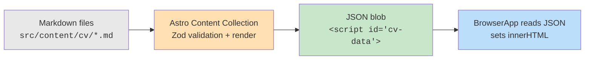

## Why Should I Care?

The CV viewer looks like the simplest component in the project — it just shows some HTML in a scrollable window. But it demonstrates a powerful pattern: **build-time content serialization**. The CV Markdown never touches the client as Markdown. It's rendered to HTML at build time by [Astro's content collections](https://docs.astro.build/en/guides/content-collections/), serialized as JSON into the page, and read by a [SolidJS](https://www.solidjs.com/) component that does nothing but set [`innerHTML`](https://developer.mozilla.org/en-US/docs/Web/API/Element/innerHTML). Zero runtime content processing, zero Markdown parser in the bundle, zero cost to the user.

## The Build-Time Serialization Pipeline

The CV content follows a four-stage pipeline, with all heavy work happening at build time:



**Stage 1: Markdown files.** Each CV section is a separate Markdown file in `src/content/cv/` with frontmatter defining `title` and `order`.

**Stage 2: Astro processes the collection.** In `src/content.config.ts`, the `cv` collection uses a `glob` loader and a Zod schema. At build time, Astro renders each Markdown file to HTML and validates the frontmatter:

```typescript
// src/content.config.ts
const cv = defineCollection({
  loader: glob({ pattern: '**/*.md', base: './src/content/cv' }),
  schema: z.object({
    title: z.string(),
    order: z.number(),
  }),
});
```

**Stage 3: Serialization into the page.** `src/pages/index.astro` sorts the sections by `order`, extracts the rendered HTML, and serializes the result as a JSON `<script>` tag:

```astro
<!-- src/pages/index.astro -->
<script is:inline type="application/json" id="cv-data"
  set:html={JSON.stringify(cvData)} />
```

This JSON blob becomes part of the static HTML — it's embedded in the page at build time, not fetched at runtime.

**Stage 4: Client reads and displays.** The `loadCvData()` function in `cv-data.ts` parses the JSON:

```typescript
// src/components/desktop/apps/cv-data.ts
export function loadCvData(): CvSection[] {
  const el = document.getElementById('cv-data');
  if (!el?.textContent) return [];
  try {
    return JSON.parse(el.textContent) as CvSection[];
  } catch {
    return [];
  }
}
```

`BrowserApp` calls this in `onMount` and renders each section using `innerHTML`:

```typescript
sections().map((section: CvSection) => (
  <div class="browser-section" innerHTML={section.html} />
))
```

## Why innerHTML Is Safe Here

Using `innerHTML` is normally a security red flag — it's the classic XSS vector. But in this specific case, it's safe because:

1. **The HTML is generated at build time** from trusted Markdown files in the repository. There's no user input in the pipeline.
2. **The content comes from a JSON blob** embedded in the page by Astro's build process, not from a network request or user-controlled source.
3. **The Markdown → HTML conversion** is handled by Astro's Markdown renderer (using remark/rehype), which produces sanitized HTML.

The critical invariant is: the CV content pipeline has **no user input**. If this ever changed — say, if CV sections could be edited through a CMS — the `innerHTML` approach would need to be replaced with a sanitizer.

## The Retro Browser Aesthetic

The BrowserApp is styled to evoke Netscape Navigator and early Internet Explorer:

- **Disabled navigation buttons** — Back, Forward, Reload, Home are rendered but disabled. There's nowhere to navigate, but they're essential to the 1990s browser look.
- **Fake address bar** — Shows `http://cv.local/dmytro-lesyk`, reinforcing the illusion that you're browsing a personal homepage from the late '90s.
- **Photo header** — A profile photo and contact info sit above the CV content, styled like the personal homepages of that era.
- **98.css status bar** — The bottom `<div class="status-bar">` with "Document: Done" uses 98.css's built-in status bar styling.

All visual elements use 98.css classes (`status-bar`, `status-bar-field`, `button`) — the custom CSS in `browser-app.css` handles only layout (flexbox arrangement, toolbar spacing, viewport scrolling).

## PDF and DOCX Exports

The CV is also available as downloadable files via the Export CV window (`ExplorerApp`). These are pre-built static files in `public/downloads/`, generated by `pnpm generate-cv` (which uses Chrome headless for PDF and pandoc for DOCX). The BrowserApp doesn't handle exports — that's a separate app following the single-responsibility principle.

## What If We'd Used Runtime Markdown?

If the BrowserApp parsed Markdown at runtime (using, say, `marked` or `remark`), the cost would be:

- **~30-50KB** extra JavaScript for a Markdown parser
- **Parsing time** on every page load (or at least on every window open)
- **Runtime errors** from malformed Markdown would surface in the user's browser, not at build time

The build-time approach catches errors during `pnpm build`, ships zero extra code, and makes the viewer's runtime code trivially simple — it's just `innerHTML`.
