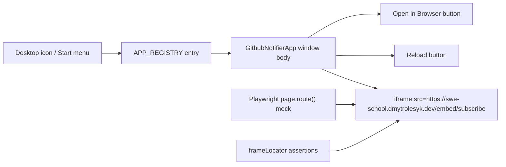

## Why Should I Care?

`Github Notifier` is a small feature with a surprisingly useful lesson: not every desktop app in this project should behave like a fully integrated local app. Some apps are best treated as **foreign browsing contexts** that the desktop can host, frame, and open, but not inspect or control internally. The browser gives us `<iframe>` as the primitive for that job, and MDN describes an iframe as a nested browsing context with its own document and navigation history ([MDN iframe docs](https://developer.mozilla.org/en-US/docs/Web/HTML/Reference/Elements/iframe)). That is exactly what this feature wraps: a remote subscription UI at `https://swe-school.dmytrolesyk.dev/embed/subscribe` shown inside a Win98 window.

The implementation is interesting because it sits at the intersection of three different boundaries:

1. The **app registry boundary**: one `registerApp()` call makes the feature appear across the desktop shell.
2. The **browser security boundary**: the desktop page can embed the remote app, but it cannot treat that remote DOM as if it were local code because of the same-origin policy ([MDN](https://developer.mozilla.org/en-US/docs/Glossary/Same-origin_policy), [web.dev](https://web.dev/articles/same-origin-policy)).
3. The **testing boundary**: CI should verify *our* wrapper, not the uptime or markup stability of a service hosted elsewhere, so the tests intercept the iframe request before navigation and fulfill it with stable HTML ([Playwright Mock APIs](https://playwright.dev/docs/mock)).

## The Shape Of The Feature



The code path is intentionally short:

- `src/components/desktop/apps/app-manifest.ts` registers the app with `id: 'github-notifier'`, title, icon, default size, and singleton behavior.
- `src/components/desktop/apps/GithubNotifierApp.tsx` renders the toolbar, the read-only address field, the iframe, and the status bar.
- `tests/e2e/helpers.ts` mocks the external embed URL for deterministic tests.

That short path is the point. A registry-driven platform should let simple apps stay simple.

## Registry Integration: One Entry, Many Surfaces

The most important architectural fact about this feature is what it **does not** modify. We did not touch `Desktop.tsx`, `WindowManager.tsx`, `Taskbar.tsx`, or `StartMenu.tsx`. The whole desktop shell learns about the feature from one registry entry:

```typescript
registerApp({
  id: 'github-notifier',
  title: 'Github Notifier',
  icon: '/icons/github_notifier_icon.png',
  component: GithubNotifierApp,
  desktop: true,
  startMenu: true,
  startMenuCategory: 'Programs',
  singleton: true,
  defaultSize: { width: 460, height: 420 },
  minSize: { width: 360, height: 320 },
});
```

That is the same extensibility model taught in [the app registry article](/learn/architecture/app-registry): register once, then let the rest of the system *discover* the app instead of hand-wiring it everywhere. `Github Notifier` is a good demonstration that the registry pattern is not only for local tools like Snake or Terminal. It also works for hosted experiences, as long as the registered component honors the platform’s window contract.

## Why This Is Not Another LibraryApp

The closest existing app is `LibraryApp`, which also renders an iframe. But `LibraryApp` is same-origin: it points at `/learn/*`, so the host page can inspect the iframe location, update history, and replace the address bar with the document’s current path. That design depends on the browser allowing parent-page script access to the embedded page.

`GithubNotifierApp` cannot do that safely or reliably because the embedded page lives on another origin. The same-origin policy restricts how one origin can interact with another ([MDN](https://developer.mozilla.org/en-US/docs/Glossary/Same-origin_policy)). web.dev phrases the rule in the way that matters most here: cross-origin embedding is usually allowed, but cross-origin reading is blocked ([web.dev same-origin policy](https://web.dev/articles/same-origin-policy)). So the wrapper keeps the contract deliberately narrow:

- render the iframe
- reload the iframe by remounting it
- display the canonical URL in a read-only field
- let the user open the remote page in a real browser tab

That last button uses `window.open(EMBED_URL, '_blank', 'noopener,noreferrer')`. MDN notes that `window.open()` loads a resource into a new browsing context, and that `noopener` severs `Window.opener` while `noreferrer` also suppresses the `Referer` header ([MDN window.open](https://developer.mozilla.org/en-US/docs/Web/API/Window/open)). In other words: the escape hatch is intentionally one-way. The remote page gets its own tab without a live handle back into the desktop host.

## The Iframe Contract

`GithubNotifierApp.tsx` uses a plain iframe because that is the correct primitive for hosting a complete remote HTML document. MDN’s iframe reference is useful here for two reasons. First, it defines the element as its own browsing context, which is why the embedded notifier can carry its own title, form controls, and navigation state ([MDN iframe docs](https://developer.mozilla.org/en-US/docs/Web/HTML/Reference/Elements/iframe)). Second, the same reference documents `referrerpolicy`, including `strict-origin-when-cross-origin`, which is the explicit policy this wrapper sets for the embed request ([MDN iframe referrerpolicy](https://developer.mozilla.org/en-US/docs/Web/HTML/Reference/Elements/iframe)).

The app deliberately does **not** add a sandbox attribute. Sandboxing can be a strong tool, but it also changes what the embedded page is allowed to do: opening new tabs, submitting forms, and executing scripts can all be restricted depending on the token set ([MDN iframe sandbox](https://developer.mozilla.org/en-US/docs/Web/HTML/Reference/Elements/iframe)). Because the remote notifier is meant to be interactive and to offer its own normal web behavior, this wrapper currently relies on the remote page being well-behaved and frameable rather than imposing sandbox constraints from the host.

## Why The Tests Mock The Remote Page

This feature is a perfect example of why executable quality gates matter. If the smoke test opened the live embed page every run, a failure could mean any of these:

- the desktop app is broken
- the DNS lookup failed
- the remote service is down
- the remote markup changed
- the remote server stopped allowing frames

That is too many meanings for one test failure. Playwright’s network mocking guide recommends setting up `page.route()` before navigation so a test can intercept a request and fulfill it with known data ([Playwright Mock APIs](https://playwright.dev/docs/mock)). Our helper follows that exact seam for `https://swe-school.dmytrolesyk.dev/embed/subscribe`, and the smoke test then uses `page.frameLocator()` to assert on the heading and form controls inside the iframe. Playwright documents `FrameLocator` as the API for entering an iframe and locating elements within it ([Playwright FrameLocator](https://playwright.dev/docs/next/api/class-framelocator)).

The subtle but important point is this: **Playwright can inspect the cross-origin frame even though the page’s own JavaScript cannot.** Browser automation runs outside the app’s JS sandbox. That lets the test verify the embedded UI honestly while the production code still respects the same-origin boundary.

## The Real Lesson

`Github Notifier` is not impressive because it has a lot of code. It is impressive because it shows restraint. The app registry gives us the extension point. The browser gives us an iframe. The security model tells us what *not* to touch. And Playwright gives us a test seam that isolates host behavior from a remote dependency. When all four pieces line up, a small feature stays small without becoming fragile.
