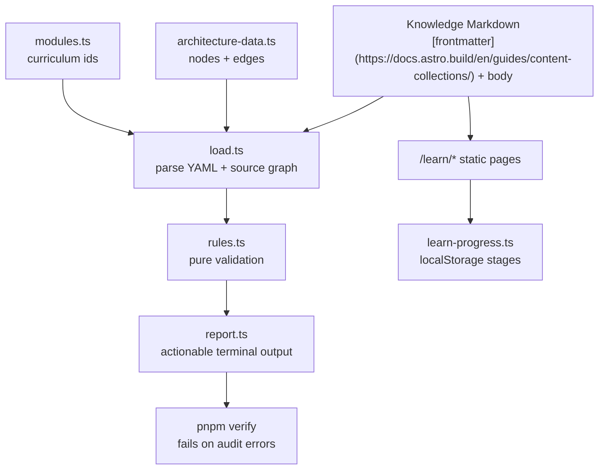

## Why This Matters

The knowledge base is only useful if it stays trustworthy. A stale article, a broken prerequisite, or a diagram node that links nowhere teaches the wrong lesson at exactly the moment the reader is trying to build a mental model. This feature turns the learning system into a self-checking artifact: the content still lives as Markdown, but the repo now has [executable rules](https://martinfowler.com/bliki/SelfTestingCode.html) that verify the graph around it. Scripts run via [Node.js type stripping](https://nodejs.org/api/typescript.html#type-stripping), and [Playwright visual snapshots](https://playwright.dev/docs/test-snapshots) catch UI regressions.

It also makes progress more honest. Reading an article is not the same thing as practicing it. The [staged mastery model](https://www.supermemo.com/en/blog/twenty-rules-of-formulating-knowledge) keeps that distinction visible without adding accounts, a database, or a quiz engine.

## The Reliability Loop



The important move is separation. `scripts/knowledge-audit/load.ts` knows how to read files and import TypeScript data. `scripts/knowledge-audit/rules.ts` knows only about in-memory articles, modules, nodes, and edges. That makes the hard part testable with Vitest while the CLI remains thin.

The audit currently checks reference integrity and graph shape: related concepts must resolve, prerequisites must resolve, modules must exist, diagram refs must point to architecture nodes, architecture edges must point to real endpoints, node categories and edge types must stay inside the documented contract, and prerequisite cycles are rejected.

## Staged Mastery

`src/scripts/learn-progress.ts` stores one local record per article:

```ts
type MasteryStage = 'read' | 'checked' | 'practiced' | 'mastered';
```

The page marks an article as `read` on load. Opening an exercise answer or clicking the Checked button advances it to `checked`. Labs and do-style exercises can be marked `practiced`. `mastered` stays a deliberate self-assessment button.

That choice matters. A system that automatically marks a page as complete after a visit is convenient, but it lies. This codebase is supposed to teach engineering judgment, so it should preserve friction where friction means "pause and prove you understand."

The implementation is [progressive enhancement](https://developer.mozilla.org/en-US/docs/Glossary/Progressive_Enhancement). `/learn` pages are static Astro HTML first. If JavaScript fails, the article, prerequisites, source files, and external references remain readable. If JavaScript runs, `LearnLayout.astro` imports the progress module, renders the tracker, and updates module summaries from [`localStorage`](https://developer.mozilla.org/en-US/docs/Web/API/Web_Storage_API).

## Library and Architecture Explorer Stay Connected

The Architecture Explorer is a visual map, but the Library is the actual reading surface. Before this feature, opening a second node could focus the existing singleton Library window without navigating it. The fix is small but architectural:

- `openWindow('library', extraProps)` now merges `extraProps` into the existing singleton window.
- `LibraryApp` watches `props.initialUrl` and navigates its iframe when the prop changes.
- iframe `load` events synchronize the toolbar address and history for same-origin `/learn` navigation.

This keeps the desktop shell simple. The store still has no knowledge-specific state; it only preserves the generic `appProps` channel that any singleton app can use.

## What Goes Wrong Without This Feature

Without the audit, a renamed article can silently break prerequisites. Without graph validation, Architecture Explorer can render an edge whose endpoint does not exist. Without staged progress, the learner sees a completion percentage that rewards opening tabs more than doing exercises. Without e2e coverage, a production-only hydration issue on `/learn` or a Library iframe bug can slip through unit tests.

The feature does not make the system perfect. It does make the failure modes visible, fast, and local. That is the difference between documentation that decays and a learning system that can be trusted over time as the codebase evolves and new articles are added.
