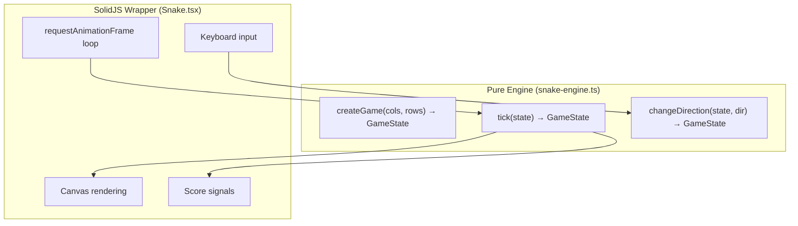

## Why Should I Care?

The Snake game is the cleanest example of **separation of concerns** in the entire project. The game engine is a [pure function](https://en.wikipedia.org/wiki/Pure_function) — `tick(state) → newState` — with zero DOM, zero framework, zero side effects. The SolidJS wrapper handles rendering and input. This separation makes the engine trivially testable (22 unit tests, all pure function calls) and reusable in any framework. Understanding this pattern teaches you how to build game logic that doesn't rot when your UI framework changes.

## The Two-Layer Architecture



### The Pure Engine (`snake-engine.ts`)

Every function in the engine is a **pure function** — same input, same output, no side effects. The game state is a plain object:

```typescript
// src/components/desktop/apps/games/snake-engine.ts
export interface GameState {
  cols: number;
  rows: number;
  snake: Point[];
  food: Point;
  direction: Direction;
  score: number;
  gameOver: boolean;
  paused: boolean;
  tickInterval: number;
}
```

The core loop is `tick()`, which takes the current state and returns a new state:

```typescript
export function tick(state: GameState): GameState {
  if (state.paused || state.gameOver) return state;

  const head = state.snake[0];
  const nextHead = getNextHead(head, state.direction);

  // Wall collision
  if (collidesWithWall(nextHead, state.cols, state.rows))
    return { ...state, gameOver: true };

  // Self collision
  if (collidesWithSnake(nextHead, state.snake))
    return { ...state, gameOver: true };

  // Food check — grow or move
  const ateFood = nextHead.x === state.food.x && nextHead.y === state.food.y;
  const newSnake = ateFood
    ? [nextHead, ...state.snake]             // Grow: keep tail
    : [nextHead, ...state.snake.slice(0, -1)]; // Move: drop tail

  return { ...state, snake: newSnake, /* updated score, food, speed */ };
}
```

The collision detection is grid-based — no bounding box math or pixel-level checks. A wall collision is `point.x < 0 || point.x >= cols`. A self collision is `snake.some(s => s.x === point.x && s.y === point.y)`. Simple, correct, and O(n) where n is the snake length.

Direction changes reject 180° reversals (you can't go from `right` to `left` immediately):

```typescript
export function changeDirection(state: GameState, direction: Direction): GameState {
  if (OPPOSITES[direction] === state.direction) return state;
  return { ...state, direction };
}
```

### The SolidJS Wrapper (`Snake.tsx`)

The wrapper handles everything the engine doesn't: canvas rendering, timing, keyboard input, and the game-over dialog.

## The Game Loop

The game uses [`requestAnimationFrame`](https://developer.mozilla.org/en-US/docs/Web/API/Window/requestAnimationFrame) with a **variable timestep** — the loop runs at the display's refresh rate (typically 60fps), but game logic only advances when enough time has elapsed:

```typescript
function gameLoop(timestamp: number): void {
  if (!isRunning) return;

  if (timestamp - lastTick >= state.tickInterval) {
    lastTick = timestamp;
    if (!(state.paused || state.gameOver)) {
      updateGameState(); // calls tick()
    }
  }

  const ctx = canvasRef?.getContext('2d');
  if (ctx) renderGame(ctx, state);

  animationId = requestAnimationFrame(gameLoop);
}
```

The `tickInterval` starts at 150ms and decreases by 5ms for every food eaten (minimum 80ms). This means the snake speeds up as your score increases — a classic Snake difficulty curve. The rendering always runs at display refresh rate, so movement looks smooth even at low tick rates.

This is not a fixed timestep (where physics runs at a constant rate regardless of frame time) — it's a simpler model where one tick equals one game step. For a grid-based game like Snake where the snake moves one cell per tick, this works perfectly. A fixed timestep would matter more for physics simulations where accuracy depends on consistent time steps.

## Canvas Rendering

The render function is straightforward [Canvas 2D API](https://developer.mozilla.org/en-US/docs/Web/API/Canvas_API/Tutorial):

```typescript
function renderGame(ctx: CanvasRenderingContext2D, state: GameState): void {
  // Clear
  ctx.fillStyle = COLORS.black;
  ctx.fillRect(0, 0, width, height);

  // Food
  ctx.fillStyle = COLORS.red;
  ctx.fillRect(state.food.x * CELL_SIZE, state.food.y * CELL_SIZE, CELL_SIZE, CELL_SIZE);

  // Snake
  for (let i = 0; i < state.snake.length; i++) {
    const segment = state.snake[i];
    ctx.fillStyle = i === 0 ? COLORS.green : COLORS.darkGreen;
    ctx.fillRect(segment.x * CELL_SIZE, segment.y * CELL_SIZE, CELL_SIZE, CELL_SIZE);
  }
}
```

Each frame: clear the canvas (`fillRect` with black), draw the food (red square), draw each snake segment (bright green head, dark green body). The coordinate system maps grid positions to pixel positions with `* CELL_SIZE` (15px per cell).

The canvas is created with `image-rendering: pixelated` CSS, so the blocky cells look intentionally retro rather than blurry.

## Keyboard Handling and Capture

Arrow keys map to directions via a lookup table:

```typescript
const KEY_MAP: Record<string, Direction> = {
  ArrowUp: 'up', ArrowDown: 'down',
  ArrowLeft: 'left', ArrowRight: 'right',
};
```

The `handleKeyDown` function calls `e.preventDefault()` on arrow keys to prevent the browser from scrolling the page or the window body. Space and P toggle pause.

Like the terminal, the Snake game uses `captureKeyboard: true` in its registry entry (though this is set on the container div's `tabIndex` and `onKeyDown` rather than through the global desktop handler, since the game's keyboard handling is self-contained within its focused div).

## The Game-Over Dialog

When the game ends, a 98.css-styled window appears as an overlay:

```tsx
<div class="window" style={{ width: '250px' }}>
  <div class="title-bar">
    <div class="title-bar-text">Game Over</div>
  </div>
  <div class="window-body">
    <p>Game Over! Score: {score()}</p>
    <button onClick={resetGame}>OK</button>
  </div>
</div>
```

This is a window-within-a-window — it uses 98.css's window classes to create a dialog box that looks like a native Win98 message box, complete with title bar and OK button. It's positioned with `position: absolute` and a semi-transparent backdrop.

## Testability

Because the engine is pure functions, the test file (`snake-engine.test.ts`) is 22 tests that exercise the logic without any DOM, canvas, or framework:

```typescript
test('snake moves right by default', () => {
  const game = createGame(10, 10);
  const next = tick(game);
  expect(next.snake[0].x).toBe(game.snake[0].x + 1);
});

test('cannot reverse direction', () => {
  const game = createGame(10, 10); // starts moving right
  const turned = changeDirection(game, 'left');
  expect(turned.direction).toBe('right'); // rejected
});
```

No mocking, no setup, no teardown. This is the payoff of separating pure logic from framework integration.
