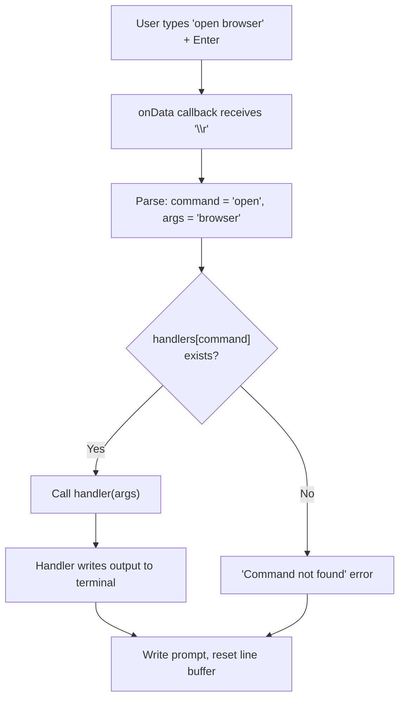

## Why Should I Care?

The Terminal is the most architecturally interesting feature in the project. It bridges the gap between a real terminal emulator (xterm.js renders a GPU-accelerated canvas, processes ANSI escape codes, handles cursor positioning) and a simple REPL (commands are JavaScript functions, not spawned processes). Understanding how it works teaches you about command dispatch patterns, keyboard event routing, the terminal abstraction model, and why lazy loading is non-negotiable for heavy dependencies.

## Command Handler Architecture

The terminal uses a **command map pattern** — a flat object mapping command names to handler functions:



In `TerminalApp.tsx`, the handler map is created by `createCommandHandlers()`:

```typescript
// src/components/desktop/apps/TerminalApp.tsx
function createCommandHandlers(
  terminal, writeLine, writePrompt, actions,
): Record<string, CommandHandler> {
  return {
    help: () => writeLine(HELP_TEXT),
    about: () => writeLine(ASCII_BANNER),
    clear: () => { terminal.clear(); writePrompt(); },
    cv: (args) => handleCvCommand(args, writeLine),
    open: (args) => handleOpenCommand(args, writeLine, actions),
  };
}
```

Adding a new command means adding one entry to this map. The handler receives the argument string and a `writeLine` function for output — it never touches xterm.js directly. This is [inversion of control](/learn/concepts/inversion-of-control): the framework (terminal input loop) calls your code (command handlers), not the other way around.

## How Input Processing Works

xterm.js fires an `onData` callback with processed character data. The handler in `TerminalApp.tsx` implements a line editor:

| Input | Char Code / Sequence | Action |
|---|---|---|
| Printable character | `≥ 32` | Append to `currentLine`, echo to terminal |
| Enter | `\r` | Submit `currentLine` to command handler, reset buffer |
| Backspace | `127` | Remove last char from `currentLine`, move cursor back with `\b \b` |
| Ctrl+C | `3` | Print `^C`, clear `currentLine`, show new prompt |
| Arrow keys | `\x1b[A/B/C/D` | Ignored (no command history) |

The `\b \b` sequence for backspace is a classic terminal trick: `\b` moves the cursor left, space overwrites the character, `\b` moves left again. This erases the character visually without needing to redraw the line.

## Terminal → Desktop Integration

The `open` command demonstrates how the terminal reaches into the desktop store:

```typescript
function handleOpenCommand(target, writeLine, actions): void {
  const app = APP_REGISTRY[target];
  if (app) {
    actions.openWindow(app.id);
    writeLine(`Opening ${app.title}...`);
  } else {
    const available = Object.keys(APP_REGISTRY).join(', ');
    writeLine(`Unknown app: "${target}"`);
    writeLine(`Available: ${available}`);
  }
}
```

The handler receives `actions` (the desktop store's action methods) through the closure created by `createCommandHandlers`. It looks up the app in `APP_REGISTRY` and calls `actions.openWindow()` — the same function that the desktop icons and start menu use. The terminal is just another way to trigger the same actions.

The `cv` command reads from the same JSON data blob used by `BrowserApp`:

```typescript
function handleCvCommand(args, writeLine): void {
  const sections = loadCvData();
  // ... iterate and writeLine() each section
}
```

`loadCvData()` parses the `<script id="cv-data">` JSON — the same function, the same data, reused across features.

## Keyboard Capture

When the terminal window is focused, keyboard events must go to xterm.js, not the desktop. The terminal's registry entry declares this:

```typescript
registerApp({ id: 'terminal', captureKeyboard: true, /* ... */ });
```

In `Desktop.tsx`, the `handleKeyDown` function checks this flag on the topmost window before processing desktop shortcuts like Escape-to-close-start-menu:

```typescript
const handleKeyDown = (e: KeyboardEvent): void => {
  const topWindow = topId ? state.windows[topId] : undefined;
  if (topWindow) {
    const appEntry = APP_REGISTRY[topWindow.app];
    if (appEntry?.captureKeyboard) return; // Yield to xterm.js
  }
  // ... handle desktop shortcuts
};
```

This is a clean separation: the desktop doesn't know about xterm.js internals, and xterm.js doesn't know about desktop shortcuts. The `captureKeyboard` flag in the registry is the contract between them.

## Lazy Loading: 300KB Behind a Dynamic Import

xterm.js and its addons are approximately 300KB parsed JavaScript. The desktop's critical path is under 35KB. Loading xterm.js eagerly would nearly 10× the initial bundle for a feature many users might never open.

The lazy boundary in `app-manifest.ts`:

```typescript
const TerminalApp = lazy(() =>
  import('./TerminalApp').then((m) => ({ default: m.TerminalApp }))
);
```

Even the xterm.js CSS is lazy-loaded — it's imported inside `onMount`, not at the top level:

```typescript
onMount(async () => {
  const [{ Terminal }, { FitAddon }] = await Promise.all([
    import('@xterm/xterm'),
    import('@xterm/addon-fit'),
  ]);
  await import('@xterm/xterm/css/xterm.css');
  // ... initialization
});
```

The window shell (title bar, borders) renders immediately via `<Suspense>`. The user sees a "Loading terminal..." message for the brief moment the chunk is downloading.

## Comparison to a Real Shell

| Aspect | Bash | Our Terminal |
|---|---|---|
| Execution model | Fork + exec processes | Call JavaScript functions |
| I/O | stdin/stdout/stderr streams | `writeLine()` function |
| Filesystem | Real FS access | JSON data blobs |
| History | Arrow keys + `~/.bash_history` | Not implemented |
| Pipes / redirection | `cmd1 \| cmd2 > file` | Not supported |
| Tab completion | File/command completion | Not implemented |
| Environment | `$PATH`, `$HOME`, etc. | Fixed command registry |

The terminal is architecturally a **REPL** (Read-Eval-Print Loop), not a shell. The `C:\Users\guest>` prompt is a thematic choice that reinforces the Windows 98 aesthetic — it doesn't imply DOS-level capabilities.
