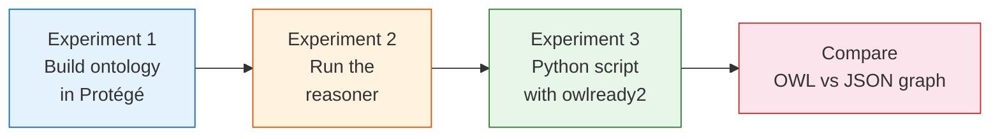

## Why This Lab Exists

Reading about ontology engineering teaches you vocabulary. Building an [ontology](https://www.w3.org/TR/owl2-overview/) teaches you tradeoffs. In this lab you will model the playground-platform's own knowledge base as an OWL ontology — the same articles, prerequisites, and categories you already know from the Markdown frontmatter — but expressed in a formal language that a [reasoner](http://www.hermit-reasoner.com/) can process. You will then ask: what does the reasoner discover that the JSON graph doesn't? And critically: is that discovery worth the complexity?

This lab connects directly to the [ontology engineering concept article](../concepts/ontology-engineering), which explains the formality spectrum from flat tags to OWL. Here you experience level 4 (formal ontology) firsthand, having already worked with levels 1–3 in the [graph validation](../cs-fundamentals/graph-validation) and [executable quality gates](../concepts/executable-quality-gates) articles. The [OWL 2 Primer](https://www.w3.org/TR/owl2-primer/) provides the theoretical foundation for everything we build here, and the [Ontology Development 101](https://protege.stanford.edu/publications/ontology_development/ontology101.pdf) guide from Stanford walks through the methodology for larger projects.



## Setup

### Install Protégé

[Protégé](https://protege.stanford.edu/) is a free, open-source ontology editor from Stanford. It's the standard tool for building OWL ontologies.

1. Download from [https://protege.stanford.edu/](https://protege.stanford.edu/)
2. Install and launch — it's a Java application, so you need a JRE

Alternatively, use the web version at [https://webprotege.stanford.edu/](https://webprotege.stanford.edu/) (requires a free account).

### Install owlready2

[Owlready2](https://owlready2.readthedocs.io/) is a Python package for manipulating OWL ontologies programmatically. It includes the HermiT reasoner.

```bash
pip install owlready2
```

Verify the installation:

```bash
python3 -c "import owlready2; print(f'owlready2 {owlready2.VERSION}')"
```

You also need Java for the reasoner (HermiT is written in Java):

```bash
java -version   # any version ≥8 works
```

### Examine the starting point

Before building anything, look at what the knowledge base already has. The article schema uses [SKOS-inspired vocabulary fields](https://www.w3.org/TR/skos-reference/) for concept hierarchy management:

```bash
# The JSON knowledge graph (generated at build time)
cat src/data/knowledge-graph.json | python3 -m json.tool | head -50

# The Zod schema with SKOS fields
grep -A 5 "prefLabel\|broader\|narrower" packages/knowledge-engine/src/schema.ts

# A sample article's frontmatter showing SKOS fields
head -20 src/content/knowledge/concepts/fine-grained-reactivity.md
```

## Experiment 1: Build an Ontology in Protégé

### DO

Open Protégé and create a new ontology. Set the IRI to:

```
http://playground-platform.dev/ontology/knowledge-base
```

**Step 1: Create the class hierarchy.**

In the "Classes" tab, create these classes under `owl:Thing`:

```
owl:Thing
  ├── KnowledgeArticle
  │   ├── Architecture
  │   ├── Concept
  │   ├── CSFundamentals
  │   ├── Feature
  │   ├── Lab
  │   └── Technology
  ├── CurriculumModule
  └── Difficulty
```

**Step 2: Add disjointness.**

Select all six category subclasses (Architecture, Concept, CSFundamentals, Feature, Lab, Technology) and make them disjoint. In Protégé: select a class → "Description" panel → "Disjoint With" → add the others.

This tells the reasoner: an article cannot be both a Concept and a Lab.

**Step 3: Create object properties.**

In the "Object Properties" tab, create:

| Property | Domain | Range | Characteristics |
|----------|--------|-------|-----------------|
| `hasPrerequisite` | KnowledgeArticle | KnowledgeArticle | — |
| `relatedTo` | KnowledgeArticle | KnowledgeArticle | **Symmetric** |
| `belongsToModule` | KnowledgeArticle | CurriculumModule | **Functional** |
| `moduleRequires` | CurriculumModule | CurriculumModule | — |

Mark `relatedTo` as **Symmetric** (in Protégé: Object Properties → select `relatedTo` → check "Symmetric" in the Characteristics panel). Mark `belongsToModule` as **Functional** (each article belongs to at most one module).

**Step 4: Create data properties.**

| Property | Domain | Range |
|----------|--------|-------|
| `hasDifficulty` | KnowledgeArticle | xsd:string |
| `estimatedMinutes` | KnowledgeArticle | xsd:integer |
| `wordCount` | KnowledgeArticle | xsd:integer |

**Step 5: Create individuals.**

In the "Individuals" tab, create at least these representing real articles from the knowledge base:

| Individual | Type | Module | Prereqs |
|------------|------|--------|---------|
| FineGrainedReactivity | Concept | ModuleReactivity | — |
| ObserverPattern | Concept | ModuleReactivity | — |
| JavaScriptProxies | Concept | ModuleReactivity | FineGrainedReactivity |
| GraphValidation | CSFundamentals | ModuleLearningSystem | — |
| ExecutableQualityGates | Concept | ModuleLearningSystem | — |
| SolidJS | Technology | ModuleReactivity | — |
| BreakReactivityLab | Lab | ModuleReactivity | FineGrainedReactivity, SolidJS |
| RepairGraphLab | Lab | ModuleLearningSystem | GraphValidation, ExecutableQualityGates |
| IslandsArchitecture | Concept | ModuleFoundation | — |

Set `relatedTo` links between:
- FineGrainedReactivity ↔ ObserverPattern
- FineGrainedReactivity ↔ JavaScriptProxies
- GraphValidation ↔ ExecutableQualityGates
- IslandsArchitecture ↔ SolidJS

**Step 6: Save the ontology.**

Save as RDF/XML format to `diagrams/ontology/knowledge-base.owl`.

> **Shortcut:** The repository already includes a pre-built version of this ontology at `diagrams/ontology/knowledge-base.owl`. You can open it in Protégé instead of building from scratch, but building it yourself teaches the mechanics of ontology construction.

### OBSERVE

With the ontology open in Protégé, examine:

1. **The class hierarchy** in the "Classes" tab. How does it compare to the `category` enum in `packages/knowledge-engine/src/schema.ts`?
2. **The individuals** in the "Individuals" tab. Click on FineGrainedReactivity — what properties does it have?
3. **The "relatedTo" property** — look at the property assertions for FineGrainedReactivity. You asserted `relatedTo ObserverPattern`. Does the inverse show up on ObserverPattern? (Not yet — we need the reasoner for that.)

### EXPLAIN

The OWL ontology expresses the same information as the Markdown frontmatter — categories, prerequisites, related concepts — but in a machine-readable formal language. The key differences you should notice:

1. **Explicit class hierarchy.** In Markdown, `category: concept` is a string tag. In OWL, `Concept` is a class that is a subclass of `KnowledgeArticle`. This lets you query "all KnowledgeArticles" and get Concepts, Labs, Technologies, etc. automatically.

2. **Disjointness is declared, not assumed.** Nothing in the Markdown schema prevents an article from having `category: concept` AND being treated as a lab. In OWL, the disjointness axiom makes this formally impossible.

3. **Property characteristics are formal.** Marking `relatedTo` as symmetric isn't just documentation — it's an axiom the reasoner will use.

## Experiment 2: Run the Reasoner

### DO

In Protégé, run the [HermiT reasoner](http://www.hermit-reasoner.com/):

1. Menu: **Reasoner → HermiT**
2. Menu: **Reasoner → Start reasoner** (or **Synchronize reasoner**)

Watch the output in the log panel at the bottom.

After reasoning, switch to the "Inferred" view:
- In the "Classes" tab, look for any inferred subclass relationships (shown in different color)
- Click on ObserverPattern in "Individuals" and look at its `relatedTo` assertions — now look at the "Inferred" panel

### OBSERVE

1. **Symmetry inference.** You asserted `FineGrainedReactivity relatedTo ObserverPattern`. The reasoner now shows `ObserverPattern relatedTo FineGrainedReactivity` as an inferred fact. Similarly for all other `relatedTo` links.

2. **Consistency.** The reasoner found no inconsistencies — all your individuals are consistent with the class disjointness and property constraints. (If you accidentally made an individual both a Concept and a Lab, the reasoner would flag it.)

3. **Not much else.** The reasoner didn't discover any dramatic new facts. It confirmed symmetry and consistency, but it didn't reclassify any individuals or infer new types.

### EXPLAIN

The reasoning result is deliberately underwhelming. This is the core insight of the lab.

For a small, manually curated knowledge base, the reasoner's main value is **consistency checking** — confirming that your assertions don't contradict each other. The symmetry inference is convenient (you only need to assert `relatedTo` in one direction), but our JSON knowledge graph also handles this at build time.

Where reasoning becomes valuable:

- **Scale.** With 10,000+ terms and complex property chains, manual consistency checking is impossible. A reasoner can check millions of implicit relationships in seconds.
- **Classification.** If you defined `AdvancedArticle ≡ KnowledgeArticle and (estimatedMinutes some xsd:integer[≥ 30])`, the reasoner would automatically classify BreakReactivityLab (45 min) as an AdvancedArticle. Automatic classification is powerful when you have complex, overlapping criteria.
- **Cross-ontology integration.** When merging two independently-built knowledge bases, a reasoner can detect conflicts and infer cross-references that neither base explicitly stated.

## Experiment 3: Python Script with owlready2

### DO

Run the provided experiment script:

```bash
python3 scripts/owl-experiment.py
```

If owlready2 isn't installed yet:

```bash
pip install owlready2
python3 scripts/owl-experiment.py
```

Now examine the script source to understand what it does:

```bash
# Read the script
cat scripts/owl-experiment.py
```

The script performs five operations:
1. Loads the OWL file from `diagrams/ontology/knowledge-base.owl`
2. Prints the class hierarchy
3. Lists all individuals grouped by class
4. Runs the HermiT reasoner and checks for inconsistencies
5. Executes a SPARQL query to find all Concept articles and their modules

### OBSERVE

Compare the script's output with two things:

**1. The Protégé view.** The class hierarchy and individuals should match what you saw in the GUI. The programmatic access gives you the same information but in a form you can integrate into build scripts.

**2. The JSON knowledge graph.** Open `src/data/knowledge-graph.json` and compare:

```bash
# JSON graph nodes
cat src/data/knowledge-graph.json | python3 -c "
import json, sys
g = json.load(sys.stdin)
for n in g.get('nodes', [])[:10]:
    print(f\"  {n.get('id', '?'):<40} category={n.get('category', '?')}\")
"
```

The JSON graph has the same articles and relationships, but without formal semantics. It can't answer "is this graph consistent?" or "what facts are implicitly true?" — it just stores what the build script extracted from frontmatter.

### EXPLAIN

The Python script demonstrates that OWL ontologies are programmatically accessible, not just Protégé documents. [Owlready2](https://owlready2.readthedocs.io/) treats OWL classes and individuals as Python objects, making ontology manipulation feel natural to a Python developer.

The practical question is: **would you use this in production for the knowledge base?** For the playground-platform, the answer is no. The [build script](https://nodejs.org/api/typescript.html#type-stripping) (`scripts/build-knowledge-graph.ts`) that extracts the JSON graph runs in milliseconds with zero external dependencies. The owlready2 script requires Python, Java, and an OWL file that must be kept in sync with the Markdown frontmatter. The JSON graph is the right tool for this system's scale and complexity.

But you now know how to reach for OWL when a project genuinely needs it — and more importantly, how to recognize when it doesn't.

## What You've Learned

| Experiment | Key Insight |
|-----------|-------------|
| 1: Build in Protégé | OWL class hierarchies and property characteristics formalize what the Markdown schema leaves implicit |
| 2: Run the reasoner | For small, manually curated knowledge bases, the reasoner confirms consistency but rarely discovers surprising new facts |
| 3: Python + owlready2 | OWL is programmatically accessible, but the toolchain overhead is significant compared to JSON graph extraction |

The overarching lesson: **formality is a tool, not a goal.** The playground-platform stops at level 3 (SKOS + validation shapes) because the cost of level 4 (OWL + reasoning) exceeds its value at this scale. If the knowledge base grew to thousands of cross-referenced terms, or if the cost of an inconsistency were higher than "a learner hits a dead link," the calculus would change.

## Cleanup

This lab creates no changes to the main project. The OWL file (`diagrams/ontology/knowledge-base.owl`) and Python script (`scripts/owl-experiment.py`) are already committed as learning artifacts. No branches to delete, no temporary files to remove.

If you installed owlready2 in a virtual environment, deactivate it:

```bash
deactivate  # if using venv
```
