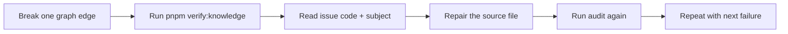

## Why This Lab Exists

You do not really understand a quality gate until you have broken it on purpose. This lab turns the knowledge audit into a debugging exercise: you will create three controlled graph failures, read the audit output, repair each one, and verify that the repo returns to a clean state.

This is safe if you do it on a temporary branch and clean up at the end.



## Setup

Start from a clean working tree.

```bash
git status --short
git switch -c lab/repair-knowledge-graph
pnpm verify:knowledge
```

The audit should print `Knowledge audit passed with 0 issues.` If it does not, stop and repair the real issue before doing this lab.

## Experiment 1: Break a Related Concept

**DO:**

1. Open `src/content/knowledge/architecture/overview.md`
2. In `relatedConcepts`, add a temporary value:

```yaml
  - concepts/does-not-exist
```

3. Run:

```bash
pnpm verify:knowledge
```

**OBSERVE:** The audit reports `missing-related-concept`. The subject is `architecture/overview`, and the message names `concepts/does-not-exist`.

**EXPLAIN:** Astro's schema can validate that `relatedConcepts` is an array of strings. It cannot validate that every string points to another article. The audit loads all article ids into a set, then checks each relationship against that set.

**REPAIR:** Remove `concepts/does-not-exist`, save the file, and run:

```bash
pnpm verify:knowledge
```

The audit should pass again.

## Experiment 2: Break a Diagram Reference

**DO:**

1. In `src/content/knowledge/architecture/overview.md`, change:

```yaml
diagramRef: "desktop"
```

to:

```yaml
diagramRef: "missing-diagram-node"
```

2. Run:

```bash
pnpm verify:knowledge
```

**OBSERVE:** The audit reports `bad-diagram-ref` for `architecture/overview`.

**EXPLAIN:** `diagramRef` is the bridge from an article to Architecture Explorer. The current SVG renderer needs coordinates, but the audit only cares about the renderer-agnostic contract: an article's diagram ref must match a node id in `architecture-data.ts`.

**REPAIR:** Restore `diagramRef: "desktop"` and rerun `pnpm verify:knowledge`.

## Experiment 3: Create a Prerequisite Cycle

**DO:**

1. Open `src/content/knowledge/concepts/executable-quality-gates.md`
2. Add this temporary prerequisite:

```yaml
  - labs/repair-a-knowledge-graph
```

3. Run:

```bash
pnpm verify:knowledge
```

**OBSERVE:** The audit reports `prerequisite-cycle`. The path should include `concepts/executable-quality-gates`, `cs-fundamentals/graph-validation`, `features/knowledge-reliability-mastery`, `labs/repair-a-knowledge-graph`, and then back to `concepts/executable-quality-gates`.

**EXPLAIN:** Related links can be circular, but prerequisites cannot. If a reader must complete the lab before reading the quality-gates concept, and the lab itself requires the feature article that requires graph validation that requires quality gates, the curriculum has no valid starting point.

**REPAIR:** Remove the temporary lab prerequisite from `concepts/executable-quality-gates.md` and rerun the audit.

## Experiment 4: Break an Architecture Edge

**DO:**

1. Open `src/components/desktop/apps/architecture-explorer/architecture-data.ts`
2. Find the edge from `knowledge-collection` to `knowledge-audit`
3. Temporarily change `to: 'knowledge-audit'` to:

```ts
to: 'missing-audit-node'
```

4. Run:

```bash
pnpm verify:knowledge
```

**OBSERVE:** The audit reports `broken-edge-endpoint` and names the missing endpoint.

**EXPLAIN:** This is pure graph validation. The edge list is only valid if every `from` and `to` endpoint exists in the node list. The renderer may choose how to draw the edge, but it should never receive impossible graph data.

**REPAIR:** Restore `to: 'knowledge-audit'` and rerun the audit.

## Cleanup

Return to the original branch and delete the lab branch:

```bash
git switch -
git branch -D lab/repair-knowledge-graph
```

If you made the edits directly on a feature branch, use `git diff` to inspect the temporary changes and remove only the lab edits. Do not use a destructive reset if you have unrelated work in progress.

## Wrap-Up

You repaired four graph failures:

1. A missing article link
2. A missing Architecture Explorer diagram node
3. A prerequisite cycle
4. A broken architecture edge endpoint

The pattern is the same every time: read the issue code, identify the graph relation it describes, repair the source of truth, and rerun the audit. That is the daily workflow this reliability layer is designed to teach.
