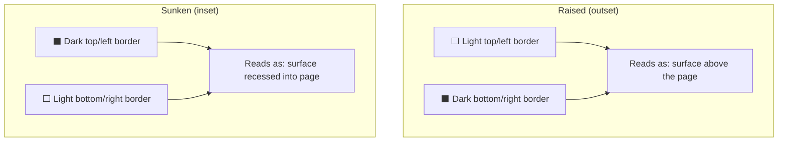

## Why Should I Care?

Building a convincing retro UI sounds like a pixel-art exercise, but 98.css reveals something deeper: Windows 98's entire visual language was built from a handful of CSS-level primitives — `border-style: outset/inset`, one-pixel box shadows, and two-tone color pairs. Understanding how 98.css recreates this teaches you how visual depth perception works in flat screens and why modern "flat design" was a deliberate reaction to these exact techniques.

## How 98.css Creates Depth

The signature Windows 98 look — raised buttons, sunken inputs, chiseled window frames — comes from a single trick: **asymmetric borders that simulate light from the top-left**. Light-colored borders on top and left simulate a highlight; dark borders on bottom and right simulate a shadow. Your eye reads this as a 3D surface.



98.css implements this primarily through `border-style: outset` and `border-style: inset`, supplemented with multi-layer `box-shadow` for the double-border effects that Windows 98 used on window frames. A typical 98.css button has:

- An `outset` border for the raised 3D appearance
- A `:active` state that flips to `inset`, making the button look "pressed"
- Focus styles with a dotted inner outline (the classic Win98 focus rectangle)

This is pure CSS — no images, no SVG, no JavaScript. The entire library is a single CSS file (~10KB uncompressed) with no runtime dependencies.

## What 98.css Styles

98.css provides styling for standard HTML elements and semantic class-based components:

| Element | Usage | Technique |
|---|---|---|
| **Windows** | `<div class="window">` with `.title-bar`, `.title-bar-text`, `.title-bar-controls` | Nested outset/inset borders + navy gradient title bar |
| **Buttons** | Plain `<button>` elements | `border-style: outset`, `:active` flips to `inset` |
| **Text inputs** | Plain `<input type="text">` | `border-style: inset` (sunken field) |
| **Select boxes** | Plain `<select>` | Custom dropdown arrow via background SVG |
| **Status bars** | `<div class="status-bar">` with `.status-bar-field` | Inset border per field |
| **Tree views** | `<ul role="tree">` | Dotted connector lines, expand/collapse arrows |
| **Tabs** | Tab strip with `.tab` items | Outset tabs, the active tab "connects" to content |
| **Progress bars** | `<div role="progressbar">` | Segmented blue blocks inside an inset track |

The key design principle: **98.css styles semantic HTML**. Buttons are `<button>`, inputs are `<input>`, trees use ARIA roles. You don't add special framework-specific classes to get the look — you write accessible HTML and 98.css handles the visual.

## The Rule: 98.css Is Law

The project enforces a strict boundary:

> *Do not write custom CSS for any element 98.css already styles. Use the 98.css semantic classes. Custom CSS is only for layout positioning.*

This rule exists for three reasons:

1. **Consistency.** 98.css applies the same border widths, colors, and shadow depths everywhere. Custom button styles would break the illusion.
2. **Accessibility.** 98.css includes focus outlines, proper `:active` states, and contrast ratios that work. Overriding these risks losing accessible defaults.
3. **Maintainability.** When 98.css updates, your overrides might conflict. By not fighting the library, upgrades are painless.

Custom CSS in this project handles only **layout** — desktop grid positioning, taskbar fixed to the bottom, window `transform: translate()` for drag, and the CRT monitor frame effects. Nothing visual that 98.css already covers.

## How It's Used in This Project

In `Window.tsx` and `TitleBar.tsx`, the window chrome is built entirely from 98.css classes:

```tsx
// src/components/desktop/TitleBar.tsx — uses 98.css classes
<div class="title-bar">
  <div class="title-bar-text">{title}</div>
  <div class="title-bar-controls">
    <button aria-label="Minimize" />
    <button aria-label="Maximize" />
    <button aria-label="Close" />
  </div>
</div>
```

No custom CSS needed — 98.css styles the title bar gradient, the button icons (via pseudo-elements), the raised/active states, and even the inactive window dimming. The `<button>` elements inside `.title-bar-controls` automatically get the minimize/maximize/close icons based on their `aria-label` attributes.

Status bars follow the same pattern:

```tsx
<div class="status-bar">
  <p class="status-bar-field">Document: Done</p>
</div>
```

The inset border, the font, the spacing — all handled by 98.css.

## Accessibility Implications

98.css's commitment to semantic HTML means it's more accessible than most UI libraries:

- **Focus styles are always visible.** The dotted focus rectangle is a Win98 design feature, not an afterthought. Every interactive element gets one.
- **Button states are clear.** Raised → pressed → focused states are visually distinct through the 3D border changes.
- **Color contrast.** The Win98 palette (navy title bars on gray backgrounds, black text on white inputs) meets WCAG AA contrast ratios for the primary text elements.

However, the gray backgrounds and some decorative elements don't always meet AAA contrast. The Win98 aesthetic constrains the palette — darkening the grays would break the visual authenticity.

## Alternatives and Why 98 Was Chosen

| Library | Era | Key Difference |
|---|---|---|
| **98.css** | Windows 98 | Minimal, CSS-only, actively maintained |
| **XP.css** | Windows XP | Fork of 98.css with XP Luna theme, larger |
| **7.css** | Windows 7 | Aero glass effects, more complex, uses gradients heavily |

98.css was chosen for three reasons:

1. **Simplicity.** The Windows 98 aesthetic is built from basic border tricks. XP's Luna theme and Windows 7's Aero glass require more complex CSS (gradients, opacity, blur) that would compete with the CRT monitor frame effects.
2. **Size.** 98.css is ~10KB uncompressed. XP.css and 7.css are larger because they need more sophisticated effects.
3. **Recognition.** Windows 98 is the most universally recognized "retro computer" aesthetic. It's the version people picture when they think "old Windows."

## Under the Hood: CSS Custom Properties

98.css uses CSS custom properties for its color palette, making it theoretically themeable:

```css
:root {
  --surface: #c0c0c0;          /* The classic gray */
  --button-highlight: #ffffff;  /* Top/left border */
  --button-shadow: #808080;     /* Bottom/right border */
  --window-frame: #0a0a0a;     /* Outer border */
}
```

The 3D illusion comes from pairing `--button-highlight` (top-left) with `--button-shadow` (bottom-right) on every raised surface, and reversing them for sunken surfaces. Change these four values and the entire desktop shifts aesthetic — though in practice, the Win98 colors are the point.
