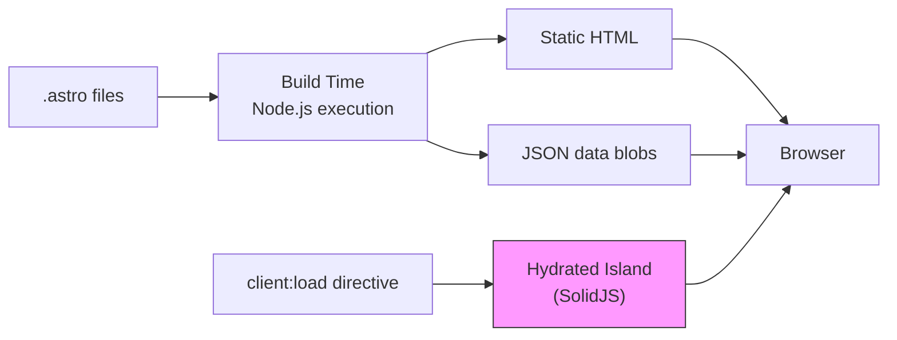

## Why Should I Care?

Most web frameworks make you choose: either you build a static site and give up interactivity, or you build a single-page app and ship hundreds of kilobytes of JavaScript for what is mostly static content. Astro rejects the binary. It renders static HTML at build time and lets you **opt in** to JavaScript where you need it — component by component. For a CV/portfolio site that's 95% content and 5% interactive desktop, this is the ideal architecture.

## How Astro Works

Astro is a build-time framework. `.astro` files are templates that execute at build time (or on the server for SSR routes) to produce HTML. The frontmatter between the `---` fences is Node.js code that runs at build time — fetching data, processing collections, computing values. The template below renders to HTML. **Zero JavaScript ships to the client by default.**



The key insight is that Astro treats JavaScript as an explicit opt-in. An `.astro` component with no `client:*` directive ships zero JS. Only components explicitly marked with a client directive (`client:load`, `client:idle`, `client:visible`, etc.) become interactive "islands" that hydrate on the client.

## Content Collections

Astro's content collections turn a directory of Markdown files into a typed, validated data source. In `src/content.config.ts`, we define two collections:

```typescript
// src/content.config.ts
const cv = defineCollection({
  loader: glob({ pattern: '**/*.md', base: './src/content/cv' }),
  schema: z.object({
    title: z.string(),
    order: z.number(),
  }),
});

const knowledge = defineCollection({
  loader: glob({ pattern: '**/*.md', base: './src/content/knowledge' }),
  schema: z.object({
    title: z.string(),
    category: z.enum(['architecture', 'concept', 'technology', 'feature']),
    summary: z.string(),
    difficulty: z.enum(['beginner', 'intermediate', 'advanced']).optional(),
    relatedConcepts: z.array(z.string()).default([]),
    // ... more fields
  }),
});
```

The `glob` loader (Astro's content layer v2 pattern) scans the filesystem at build time. Zod schemas validate every frontmatter field — a malformed article fails the build, not the user's browser. This catches errors like a misspelled category or a missing required title before deployment.

The `cv` collection feeds the CV viewer; the `knowledge` collection powers the learning system. Both are consumed at build time in `.astro` pages and serialized into the HTML:

```astro
<!-- src/pages/index.astro -->
<script is:inline type="application/json" id="cv-data"
  set:html={JSON.stringify(cvData)} />
<script is:inline type="application/json" id="knowledge-index"
  set:html={JSON.stringify(knowledgeEntries)} />
```

This pattern — build-time Markdown → Zod validation → JSON blob in the page — means **zero runtime Markdown processing**. The client reads pre-built JSON. No Markdown parser in the bundle.

## File-Based Routing

Astro maps filesystem structure to URL paths:

```
src/pages/
├── index.astro            → /           (desktop)
├── cv-print/index.astro   → /cv-print   (print-friendly CV)
├── api/contact.ts         → /api/contact (SSR endpoint)
└── learn/
    ├── index.astro        → /learn      (knowledge index)
    └── [...slug].astro    → /learn/*    (knowledge articles)
```

The `[...slug].astro` file is a dynamic route that uses `getStaticPaths()` to generate one page per knowledge article at build time. Every article URL is a static HTML file — no server-side rendering on request.

## Hybrid Rendering: Static by Default, SSR When Needed

Astro 6 with the `@astrojs/node` adapter defaults to **prerendering** (static HTML generation). This is the `hybrid` mode — every page is static unless it explicitly opts out:

```typescript
// src/pages/api/contact.ts
export const prerender = false; // This route needs SSR
```

In this project, only `/api/contact` needs SSR because it reads `process.env` secrets at runtime and calls the Resend API. Every other page — the desktop, the CV print view, every knowledge article — is static HTML served from disk. This gives you the best of both worlds: CDN-cacheable static pages with the ability to have dynamic server endpoints where needed.

## The Single Island

```astro
<!-- src/pages/index.astro -->
<Desktop client:load />
```

This one line is the entire client-side JavaScript entry point. `client:load` tells Astro to hydrate the `Desktop` SolidJS component immediately on page load. Every other interactive element — windows, taskbar, start menu, terminal, snake game — lives inside this single component tree.

Why not multiple islands? Because all desktop components share state (the window store). Multiple islands would mean multiple separate SolidJS runtimes with no shared context, forcing you to use browser-level communication (events, localStorage) to coordinate between, say, the taskbar and the window manager. A single island gets shared state for free through SolidJS context.

## The Adapter System

```javascript
// astro.config.mjs
export default defineConfig({
  adapter: node({ mode: 'standalone' }),
  integrations: [solidJs()],
});
```

The `@astrojs/node` adapter produces a standalone Node.js server (`dist/server/entry.mjs`) that serves static files and handles SSR routes. The `'standalone'` mode means the server handles everything — no separate static file server needed. In production, Railway runs `node dist/server/entry.mjs` directly.

Astro supports other adapters (Vercel, Cloudflare, Netlify, Deno) — you swap the adapter and the build output changes to match the platform. The application code stays the same.

## Build Output

After `astro build`, the `dist/` directory contains:

| Path | Contents |
|---|---|
| `dist/client/` | Static assets: CSS, JS chunks, images, fonts |
| `dist/server/entry.mjs` | Node.js server entry point |
| `dist/server/pages/` | Prerendered HTML pages |

The JS chunks in `dist/client/` are the code-split SolidJS island. Vite (Astro's bundler) creates separate chunks for lazy-loaded components — the terminal, snake game, and architecture explorer each get their own chunk that loads on demand.

## Comparison to Other Frameworks

| Feature | Astro | Next.js | Remix |
|---|---|---|---|
| Default output | Static HTML | Server-rendered | Server-rendered |
| JS shipped | Zero (opt-in) | Full React runtime | Full React runtime |
| UI framework | Any (Solid, React, Vue, Svelte) | React only | React only |
| Content collections | Built-in with Zod | Third-party (contentlayer, etc.) | Manual |
| Best for | Content-heavy + some interactivity | Full apps | Full apps |

For a portfolio/CV site, Astro's strengths align perfectly: most pages are pure content (no JS needed), one page has rich interactivity (one island), and the content pipeline (Markdown → typed collections → HTML) is a first-class feature, not a bolt-on.

## Gotchas

**`import.meta.env` is inlined at build time.** Vite replaces all `import.meta.env.VAR` references with their literal values during the build. This means server-side secrets (like `RESEND_API_KEY`) must use `process.env['VAR']` in SSR endpoints — otherwise they become empty strings in Docker builds where secrets aren't available at build time. This is the single most common deployment bug in the project.

**Content collection schema changes require a restart.** If you modify the Zod schema in `content.config.ts`, the Astro dev server needs a full restart to pick up the changes. Hot reload doesn't cover schema changes.

**`set:html` is intentional.** Astro escapes HTML by default in templates. The `set:html` directive opts out of escaping, which is necessary for injecting pre-rendered content. It's safe here because the HTML is generated at build time from trusted Markdown — there's no user input in the pipeline.
