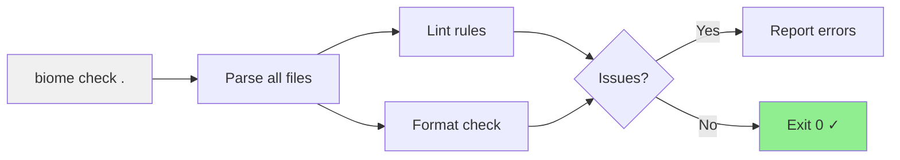

## Why Should I Care?

Linting and formatting seem like housekeeping, but in a project where every PR runs through CI, a slow lint step compounds. ESLint + Prettier configurations are famously complex — plugin conflicts, parser options, overlapping rules, and a cold start that can take 10+ seconds on medium codebases. [Biome](https://biomejs.dev/) replaces both tools with a single Rust binary that lints and formats in under a second. Understanding the project's Biome configuration tells you what code standards are enforced, what's auto-fixable, and where the sharp edges are.

## One Tool, Two Jobs

Biome combines linting (finding bugs and enforcing patterns) and formatting (consistent style) in a [single tool](https://biomejs.dev/). The project's `package.json` scripts reflect this:

```json
{
  "lint": "biome check .",
  "lint:fix": "biome check --write .",
  "verify": "pnpm prebuild && biome check . && astro check && vitest run ..."
}
```

`biome check` runs both the linter and formatter in a single pass. There's no separate `format` command needed because `check` validates formatting conformance and `check --write` fixes both formatting and auto-fixable lint issues.

The speed difference matters for developer experience. Biome is written in Rust and [parses, analyzes, and formats files in parallel](https://biomejs.dev/blog/annoucing-biome/) using multiple CPU cores. On this codebase, `biome check .` completes in under 200ms. An equivalent ESLint + Prettier setup would take 5-10 seconds.



## Configuration: biome.json

The project's `biome.json` configures both formatting and linting in one file. Here's the structure with the key decisions explained:

### Formatter Settings

```json
{
  "formatter": {
    "indentStyle": "space",
    "indentWidth": 2,
    "lineWidth": 100,
    "lineEnding": "lf"
  }
}
```

These are project-wide defaults: 2-space indentation, 100-character line width (wider than Prettier's default 80, which reduces artificial line breaks in TypeScript generics), and Unix line endings enforced regardless of OS.

### Linter Rule Categories

Biome organizes [lint rules](https://biomejs.dev/linter/rules/) into categories. The project enables `recommended: true` as a baseline and then customizes individual rules:

**Style rules** enforce code patterns:
- `noDefaultExport: off` — Astro pages and config files require default exports
- `useExplicitLengthCheck: error` — write `array.length > 0` instead of `if (array.length)`
- `useThrowNewError: error` — always `throw new Error()`, never `throw "string"`

**Complexity rules** prevent overly tangled code:
- `noExcessiveCognitiveComplexity: error` — functions must stay below a complexity threshold
- `useSimplifiedLogicExpression: error` — simplify boolean logic when possible

**Performance rules** prevent bundle bloat:
- `noBarrelFile: error` — no `index.ts` re-export files that defeat [tree-shaking](https://developer.mozilla.org/en-US/docs/Glossary/Tree_shaking)
- `noNamespaceImport: error` — no `import * as X` patterns

**Correctness rules** have key overrides:
- `noNodejsModules: off` — the project uses Node.js APIs in scripts and SSR endpoints
- `useImportExtensions: off` — Vite resolves extensions at build time

**Suspicious rules** catch likely bugs:
- `noConsole: warn` — flags `console.log` as a warning (allowed in scripts, suspicious in components)
- `noEvolvingTypes: error` — prevents `let x = []` where TypeScript infers `any[]`

### The Nursery Trap

Biome's [nursery category](https://biomejs.dev/linter/rules/#nursery) contains experimental rules that can change behavior between minor versions. The project uses exactly one nursery rule:

```json
{
  "nursery": {
    "useExplicitType": "error"
  }
}
```

This requires explicit return type annotations on exported functions. It's cherry-picked because the project values explicit types for API boundaries. But the project **never** sets `nursery.recommended: true` — doing so would mean any Biome minor update could introduce new errors without code changes, breaking CI unpredictably.

## How Biome Fits in the Pipeline

The `pnpm verify` command runs Biome as the first check after the prebuild step:

```
prebuild (knowledge graph) → biome check . → astro check → vitest → verify:knowledge
```

If Biome fails, subsequent steps don't run. This ordering is intentional — formatting and lint errors are the cheapest to fix, so they fail fast. `astro check` runs the TypeScript type checker (slower), and tests run last (slowest).

In CI (`.github/workflows/ci.yml`), the same `pnpm verify` command runs as a single step, so the pipeline catches Biome issues before they reach type checking or tests.

## Auto-Fixing vs Manual Fixes

`biome check --write` can automatically fix:
- **Formatting** — indentation, line width, semicolons, trailing commas
- **Import sorting** — Biome sorts imports deterministically
- **Safe lint fixes** — removing unused imports, simplifying boolean expressions, adding `new` to `throw Error()`

It cannot auto-fix:
- **Missing type annotations** (`useExplicitType`) — requires understanding function semantics
- **Cognitive complexity** — requires restructuring logic
- **Barrel file violations** — requires rearchitecting module exports

The distinction matters: run `pnpm lint:fix` to clean up formatting before committing, but expect some lint errors to require manual thought.

## Biome Ignore Comments

When a Biome rule conflicts with a legitimate pattern, the project uses ignore comments with mandatory explanations:

```typescript
// biome-ignore lint/complexity/useLiteralKeys: TS strict requires bracket notation for index signatures
const port: string = process.env['PLAYWRIGHT_PORT'] ?? '4321';
```

The format is `biome-ignore <rule>: <reason>`. The reason is not optional — bare `biome-ignore` comments without explanations are themselves a code smell. The project uses these sparingly, primarily for the `useLiteralKeys` / `noPropertyAccessFromIndexSignature` interaction where TypeScript strictness and Biome's preference conflict.

## Gotchas

**Biome doesn't replace `astro check`.** Biome handles linting and formatting but doesn't type-check TypeScript. Type checking is done by `astro check` (which runs `tsc`). Both must pass — they catch different classes of errors.

**Schema version matters.** The `$schema` URL in `biome.json` pins a specific Biome version's schema for editor autocompletion. If you upgrade Biome, update the schema URL to match, or editors may show false warnings for valid config.

**Biome doesn't understand `.astro` files fully.** While Biome can format and lint TypeScript inside `.astro` frontmatter, it treats the template section differently from dedicated `.ts`/`.tsx` files. Some rules may not apply inside Astro template expressions. The project relies on `astro check` for full `.astro` validation.
