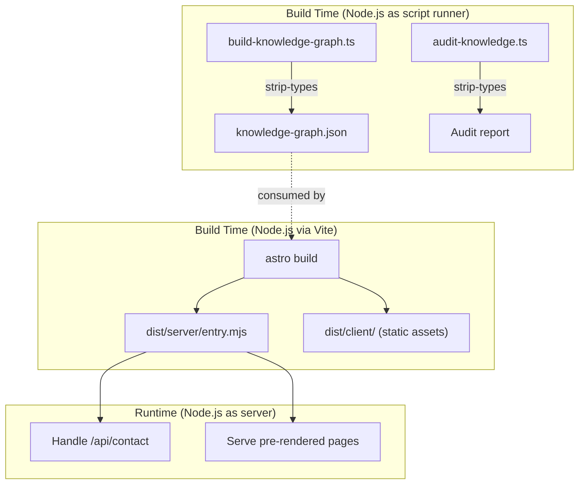

## Why Should I Care?

[Node.js](https://nodejs.org/en/docs) appears in two very different roles in this project, and confusing them causes real bugs. It's the **build-time script runner** that processes knowledge articles, generates the knowledge graph, and runs the audit pipeline — all using native TypeScript execution with [no compilation step](https://nodejs.org/en/learn/typescript/run-natively). And it's the **SSR [runtime](https://github.com/nodejs/node)** that handles server-side rendered pages and API endpoints in production. Understanding which role Node.js plays at each point tells you whether to use `process.env` or `import.meta.env`, whether to import from `node:` builtins or browser APIs, and why some TypeScript features work in scripts but not in components.

## Role 1: Script Runner with Type Stripping

The project's build scripts are TypeScript files executed directly by Node.js:

```json
{
  "prebuild": "node --experimental-strip-types scripts/build-knowledge-graph.ts",
  "verify:knowledge": "node --experimental-strip-types scripts/audit-knowledge.ts",
  "generate-cv": "node --experimental-strip-types scripts/generate-cv.ts"
}
```

The [`--experimental-strip-types`](https://nodejs.org/api/typescript.html) flag tells Node.js to remove TypeScript syntax before executing the file as JavaScript. This is not compilation — there's no `.js` output file, no `outDir`, no intermediate step. Node.js reads the `.ts` file, strips type annotations, and feeds the resulting JavaScript directly to the V8 engine.


This approach has real constraints. Type stripping is syntactic only — it removes characters from the source text. Constructs that require code generation don't work:

```typescript
// ✅ Works — type annotation is removed, value unchanged
const count: number = 42;

// ✅ Works — interface is removed entirely
interface Article { title: string; body: string; }

// ❌ Fails — enum generates runtime code
enum Category { Architecture, Concept }

// ❌ Fails — namespace generates an IIFE
namespace Utils { export function parse() {} }
```

The project avoids all unsupported constructs. Enums are replaced with [Zod enums](https://zod.dev/?id=zod-enums) or `as const` objects. Namespaces are replaced with ES modules. Parameter properties (`constructor(private name: string)`) are avoided in favor of explicit property declarations.

## Role 2: SSR Runtime (Astro + Node Adapter)

In production, Node.js runs the [Astro application](https://docs.astro.build/en/guides/on-demand-rendering/) via the `@astrojs/node` adapter:

```bash
node dist/server/entry.mjs
```

This serves pre-rendered static pages (the default in Astro's hybrid mode) and handles SSR endpoints like the contact API. The Dockerfile's final stage runs this command:

```dockerfile
CMD ["node", "dist/server/entry.mjs"]
```

In this role, Node.js receives HTTP requests, routes them through Astro's request handler, and returns responses. The `/api/contact` endpoint runs as a Node.js request handler, with access to the full Node.js API including `process.env` for runtime environment variables.

## The `process.env` vs `import.meta.env` Trap

This is the most dangerous gotcha in the project, and it stems from Node.js playing both roles:

| Access Pattern | Resolved When | Works For |
|---|---|---|
| `import.meta.env.PUBLIC_*` | Build time (Vite inlines) | Client-side public values |
| `import.meta.env.SECRET` | Build time (Vite inlines) | **Nothing** in Docker/CI — empty string |
| `process.env['SECRET']` | Runtime (Node.js reads) | Server-side secrets |

[Vite replaces](https://vite.dev/guide/env-and-mode) ALL `import.meta.env` references at build time with their literal values. If `RESEND_API_KEY` isn't in the environment during `pnpm build` (which it isn't in Docker), it becomes an empty string permanently baked into the JavaScript output. `process.env` is read at runtime by Node.js, so it correctly accesses container environment variables.

The project rule: **server-side endpoints use `process.env['VAR']`** for secrets, **client-side code uses `import.meta.env.PUBLIC_*`** for public values. Mixing them up compiles fine but fails silently in production.

## ES Modules Throughout

The project uses ES modules exclusively — no CommonJS. The `package.json` declares `"type": "module"`, meaning all `.js` and `.ts` files are treated as [ES modules by Node.js](https://nodejs.org/api/esm.html):

```json
{ "type": "module" }
```

This means:
- `import`/`export` syntax everywhere, no `require()`
- `__dirname` and `__filename` don't exist — use `import.meta.url` with `fileURLToPath()`
- Import specifiers need explicit extensions in Node.js context (`.ts` for scripts)

The scripts demonstrate the ESM pattern for file path resolution:

```typescript
import { dirname, resolve } from 'node:path';
import { fileURLToPath } from 'node:url';

const __dirname = dirname(fileURLToPath(import.meta.url));
const projectRoot = resolve(__dirname, '..');
```

This pattern is necessary because `import.meta.url` returns a `file://` URL, not a filesystem path. The `fileURLToPath` utility from the `node:url` module converts it.

## The Node.js Engine Requirement

The project pins `"node": ">=22.12.0"` in `package.json`'s `engines` field. This isn't arbitrary — Node.js 22.6.0 [introduced type stripping](https://nodejs.org/en/blog/release/v22.6.0), and subsequent releases improved its reliability. The 22.12.0 minimum ensures stable type stripping behavior, proper `.ts` import resolution, and the full set of ESM features the project depends on.

The Dockerfile uses `node:24-slim` for the production image, which is well above this minimum. Locally, the project expects developers to use [nvm](https://github.com/nvm-sh/nvm) or similar to manage Node.js versions matching the engine requirement.

## How Node.js Fits the Build Pipeline



The prebuild step (knowledge graph generation) runs first via Node.js type stripping. Its output (`knowledge-graph.json`) is consumed by the Astro build. Then Astro (using Vite + Node.js) compiles the full application. Finally, in production, Node.js runs the compiled server entry point.

## Gotchas

**Scripts and components use different import resolution.** Scripts use explicit `.ts` extensions (`import { foo } from './bar.ts'`) because Node.js ESM requires them. Components use extensionless imports (`import { foo } from './bar'`) because Vite resolves extensions at build time. Don't mix the patterns — it causes confusing module-not-found errors.

**`node:` prefix is required for builtins.** The project uses `import { readFile } from 'node:fs/promises'` instead of `from 'fs/promises'`. The `node:` prefix makes it explicit that you're importing a Node.js builtin, not a npm package with the same name. Biome's `noNodejsModules` rule is disabled specifically because the project legitimately uses Node.js APIs.

**Type stripping doesn't validate types.** Running `node --experimental-strip-types script.ts` does NOT type-check. It just removes type syntax. A script with type errors will run fine (or crash at runtime if the logic is wrong). Type checking happens separately via `astro check` or direct `tsc` invocation.
