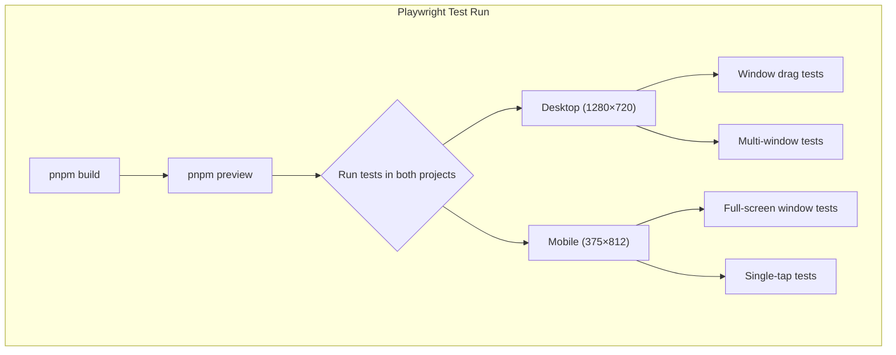

## Why Should I Care?

Unit tests verify that functions return correct values. But can a user actually drag a window? Does the desktop render correctly on a phone? Does the SolidJS island hydrate without errors after a production build? These questions can only be answered by a real browser running against real built output. [Playwright](https://playwright.dev/docs/intro) provides this by automating Chromium (and optionally Firefox/WebKit) to interact with the application exactly as a user would — clicking, dragging, typing, and visually comparing screenshots.

## Two-Viewport Strategy

The project tests at exactly two viewports, matching the application's responsive breakpoint:

| Project | Device | Viewport | Behavior |
|---|---|---|---|
| `desktop` | Desktop Chrome | 1280×720 | Draggable windows, multi-window, desktop grid |
| `mobile` | Pixel 5 | 375×812 | Full-screen windows, no drag, single-tap opens |

The 768px breakpoint drives the application's `isMobile` signal. Below it, the desktop switches to mobile mode: windows are full-screen, drag is disabled, and only one window is visible at a time. Testing both viewports ensures the same components behave correctly in both modes.



Tests that only make sense in one viewport skip on the other. A window drag test is meaningless on mobile (drag is disabled), and a mobile-specific full-screen test is irrelevant on desktop:

```typescript
test('should drag window to new position', async ({ page, browserName }, testInfo) => {
  // Skip on mobile — drag is disabled
  if (testInfo.project.name === 'mobile') {
    test.skip();
    return;
  }
  // ... desktop-only drag test
});
```

## Configuration

The Playwright configuration in [`tests/e2e/playwright.config.ts`](https://playwright.dev/docs/test-configuration) defines the test environment:

```typescript
export default defineConfig({
  testDir: '.',
  fullyParallel: false,
  forbidOnly: !!process.env['CI'],
  retries: process.env['CI'] ? 1 : 0,
  workers: 1,
  reporter: process.env['CI'] ? 'github' : 'list',
  use: {
    baseURL: `http://localhost:${e2ePort}`,
    trace: 'on-first-retry',
  },
  // ... projects and webServer
});
```

Key decisions:

**`workers: 1`** — Tests run sequentially because the desktop app has global state that would cause race conditions under parallel execution.

**`retries: 1` in CI only** — Flaky tests get one retry in CI (where network conditions vary) but zero retries locally (where flakiness should be investigated immediately).

**`trace: 'on-first-retry'`** — [Playwright Trace Viewer](https://playwright.dev/docs/trace-viewer-intro) records a full trace (screenshots, DOM snapshots, network requests) only when a test fails and retries. This provides debugging data without the overhead of tracing every successful test.

**`forbidOnly: true` in CI** — Prevents accidentally committing `test.only()` that would skip other tests.

## Testing Against Production Builds

The [`webServer`](https://playwright.dev/docs/test-webserver) configuration ensures tests run against a production build, not the development server:

```typescript
webServer: {
  command: `pnpm build && pnpm preview --port ${e2ePort}`,
  port: Number(e2ePort),
  reuseExistingServer: !process.env['CI'],
  cwd: repoRoot,
},
```

This is critical for catching:
- **Hydration mismatches** — where server-rendered HTML doesn't match what SolidJS produces on the client
- **Build-time environment variable issues** — where `import.meta.env` values are inlined incorrectly
- **Missing lazy-loaded chunks** — where dynamic imports reference files that weren't included in the build
- **CSS/asset path errors** — where the production build's asset hashing breaks references

## Visual Regression Testing

Playwright's [visual comparison](https://playwright.dev/docs/test-snapshots) feature captures screenshots and compares them against reference images:

```typescript
await expect(page).toHaveScreenshot('desktop-initial.png', {
  maxDiffPixelRatio: 0.01,
});
```

The project stores reference screenshots with platform suffixes:
- `desktop-initial-darwin.png` — macOS reference
- `desktop-initial-linux.png` — Linux/CI reference

Font rendering, anti-aliasing, and sub-pixel positioning differ between operating systems, making cross-platform pixel-perfect comparison impossible. Platform-specific snapshots acknowledge this reality instead of fighting it.

### Updating Snapshots

When UI changes are intentional (not regressions), reference screenshots need updating:

```bash
# Update all snapshots locally
pnpm test:e2e:update

# In CI (for PRs): add the "update snapshots" label
# The CI job runs on Ubuntu and commits updated Linux snapshots back to the PR
```

The CI workflow has a label-gated job that regenerates Linux snapshots. This avoids the common problem where developers on macOS can't produce the Linux reference screenshots that CI needs.

## Writing E2E Tests

Tests follow the [Playwright best practice](https://playwright.dev/docs/best-practices) of using user-visible locators:

```typescript
import { test, expect } from '@playwright/test';

test('should open terminal from start menu', async ({ page }) => {
  await page.goto('/');
  
  // Click the Start button
  await page.getByRole('button', { name: /start/i }).click();
  
  // Click Terminal in the start menu
  await page.getByText('Terminal').click();
  
  // Verify the terminal window appeared
  await expect(page.locator('.window').filter({ hasText: 'Terminal' }))
    .toBeVisible();
});
```

Locators use roles, text, and semantic attributes — not CSS selectors or test IDs. This makes tests resilient to implementation changes and readable as user stories.

## CI Integration

E2E tests run as a separate CI job that depends on the `verify` job passing first:

```
verify (lint + typecheck + unit tests) → e2e (Playwright against production build)
```

This ordering ensures that cheap checks run first. If linting or types fail, the expensive E2E build + test cycle is skipped entirely. Both jobs must pass before a PR can be merged — the branch protection rules on `main` require both `verify` and `e2e` checks.

## Gotchas

**Tests are slower than you think.** Each `pnpm test:e2e` run builds the production app, starts a preview server, launches a browser, and runs tests sequentially. Budget 2-3 minutes locally, longer in CI. Don't run E2E tests in a tight feedback loop — use Vitest for logic, E2E only for integration verification.

**`reuseExistingServer` is local-only.** Locally, if a preview server is already running on the configured port, Playwright reuses it. In CI, it always builds fresh. This means local runs after the first are faster, but you must remember to rebuild if you changed application code.

**Snapshot tests are inherently fragile.** Any visual change — a new icon, a shifted pixel, a different default window position — breaks visual regression tests. Use them judiciously for critical UI states, not for every test. The project's `maxDiffPixelRatio` tolerance allows minor rendering differences.
