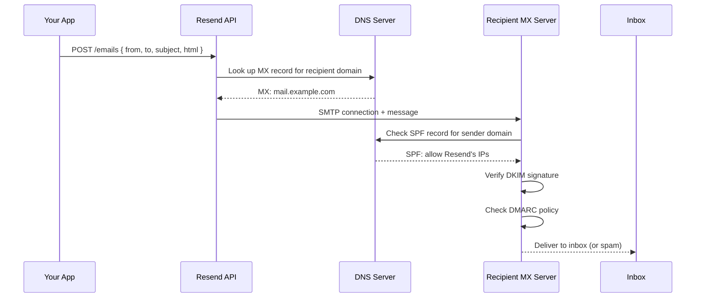

## Why Should I Care?

Email looks simple — you fill out a form, hit send, message arrives. But between "send" and "arrives" lies a gauntlet of DNS lookups, authentication protocols, reputation scoring, and spam filtering that kills most messages from unknown servers. Resend abstracts this entire stack into one HTTP call. Understanding what it hides teaches you why "just use `sendmail`" is never the right answer for production web apps.

## How Email Delivery Actually Works

When you send an email, it doesn't travel directly to the recipient's inbox. It goes through a chain of verification steps:



Three authentication protocols protect against email spoofing:

- **SPF (Sender Policy Framework)** — A DNS TXT record listing which IP addresses are authorized to send email for your domain. When you verify a domain with Resend, you add a record that says "Resend's servers can send on my behalf."
- **DKIM (DomainKeys Identified Mail)** — A cryptographic signature attached to each email. The sending server signs with a private key; the receiving server verifies with a public key published in DNS. Proves the message wasn't tampered with in transit.
- **DMARC (Domain-based Message Authentication, Reporting & Conformance)** — A policy record that tells receiving servers what to do when SPF or DKIM checks fail (reject, quarantine, or accept anyway).

Resend handles SPF/DKIM signing automatically once you verify your domain. Without this, emails from unknown servers go straight to spam — or get rejected entirely.

## How We Use Resend

The contact form flow involves three components:

1. **ContactApp** — A chooser dialog that lets the user pick between email and Telegram
2. **EmailApp** — The actual contact form with name/email/subject/message fields
3. **`/api/contact`** — The server-side endpoint that validates input and calls Resend

The endpoint in `src/pages/api/contact.ts` is the only SSR route in the entire project:

```typescript
// src/pages/api/contact.ts
export const prerender = false; // Must be SSR — reads process.env at runtime

export const POST: APIRoute = async ({ request }) => {
  let body: ContactBody;
  try {
    body = (await request.json()) as ContactBody;
  } catch {
    return new Response(JSON.stringify({ ok: false, error: 'Invalid JSON' }), {
      status: 400,
    });
  }

  // Honeypot check — bot fills hidden "website" field, humans don't
  if (body.website) {
    return new Response(JSON.stringify({ ok: true }), { status: 200 });
  }

  // ... validation ...

  const resend = new Resend(process.env['RESEND_API_KEY']);
  const { error } = await resend.emails.send({
    from: `CV Contact <${fromEmail}>`,
    to: toEmail,
    replyTo: email,
    subject: `[CV Contact] ${subject}`,
    html: `<p><strong>From:</strong> ${name} (${email})</p><hr/>${message}`,
    text: `From: ${name} (${email})\n\n${plainText}`,
  });

  if (error) {
    console.error('[contact] Resend error:', JSON.stringify(error));
    return new Response(
      JSON.stringify({ ok: false, error: 'Failed to send email.' }),
      { status: 500 },
    );
  }

  return new Response(JSON.stringify({ ok: true }), { status: 200 });
};
```

Notice: both `html` and `text` bodies are sent. The `text` fallback ensures email clients that can't render HTML still show a readable message. The `replyTo` field is set to the visitor's email, so replying to the notification goes to the person who contacted you, not to the "from" address.

## Critical Gotcha: process.env, Not import.meta.env

This is the single most dangerous deployment bug in the project. Vite inlines **all** `import.meta.env` values at build time — not just `PUBLIC_*` vars. In a Docker build where secrets aren't available during `pnpm build`, they become empty strings:

```typescript
// ❌ WRONG — becomes '' in Docker builds
const apiKey = import.meta.env.RESEND_API_KEY;

// ✅ CORRECT — read at runtime
const apiKey = process.env['RESEND_API_KEY'];
```

The bracket notation (`process.env['RESEND_API_KEY']`) is required by the project's TypeScript `noPropertyAccessFromIndexSignature` setting. Dot notation would cause a type error.

## Error Handling: No Exceptions

The Resend SDK returns a `{ data, error }` tuple — it does **not** throw exceptions:

```typescript
const { data, error } = await resend.emails.send({ ... });

// ❌ WRONG — Resend doesn't throw
try {
  await resend.emails.send({ ... });
} catch (e) { /* This never fires for API errors */ }

// ✅ CORRECT — check the return value
if (error) {
  console.error('Resend error:', error);
  return errorResponse();
}
```

This is a deliberate API design choice. Thrown exceptions propagate silently if uncaught, potentially crashing the server. Return-value errors force the caller to handle them explicitly. The `try/catch` in our endpoint is only for `request.json()` parsing — which genuinely throws on malformed JSON.

## Anti-Spam: The Honeypot

The contact form includes a hidden `website` field:

```typescript
interface ContactBody {
  name?: string;
  email?: string;
  subject?: string;
  message?: string;
  website?: string; // honeypot
}
```

Bots that scrape forms and fill every field will populate `website`. Human users never see it (it's hidden with CSS). If the field has a value, the endpoint returns `200 OK` (so the bot thinks it succeeded) but silently discards the submission. This is cheaper and simpler than CAPTCHA, though less effective against targeted attacks.

## Domain Matching

The `from` address domain must exactly match your verified Resend domain. If you verified `example.com`, the from address must be `something@example.com`. Using `noreply@otherdomain.com` will fail with an authentication error.

This isn't a Resend limitation — it's an email authentication requirement. SPF and DKIM records are per-domain. Sending from an unverified domain would fail SPF checks at the recipient's mail server.

## Transactional vs Marketing Email

Resend is a **transactional** email service. Transactional emails are triggered by user actions (contact forms, password resets, order confirmations). Marketing emails (newsletters, promotions) are sent in bulk to subscriber lists.

| Aspect | Transactional (Resend) | Marketing (Mailchimp, etc.) |
|---|---|---|
| Trigger | User action | Scheduled campaign |
| Volume | Low (per-user) | High (bulk) |
| Unsubscribe | Not required | Legally required (CAN-SPAM, GDPR) |
| Content | Unique per message | Same for all recipients |
| IP reputation | Shared with other API users | Dedicated IP for volume senders |

This project only sends transactional email — one notification per contact form submission. A marketing email service would be overkill (and would require unsubscribe links, list management, etc.).

## Comparison to Alternatives

| Service | Pricing | Key Difference |
|---|---|---|
| **Resend** | 3,000 free/month | Developer-focused, simple API, React Email support |
| **SendGrid** | 100 free/day | Mature, complex dashboard, marketing features |
| **AWS SES** | $0.10/1000 | Cheapest at scale, complex setup, IAM permissions |
| **Postmark** | 100 free/month | Delivery-focused, fastest delivery times |

Resend was chosen for simplicity: one npm package, one API call, a `{ data, error }` return type. For a personal CV site sending maybe 5 emails per month, the free tier is more than sufficient and the SDK's ergonomics win over SES's configuration complexity.

## Environment Variables

| Variable | Purpose | Access |
|---|---|---|
| `RESEND_API_KEY` | API authentication | `process.env` (runtime) |
| `CONTACT_TO_EMAIL` | Recipient address | `process.env` (runtime) |
| `CONTACT_FROM_EMAIL` | Sender address (must match verified domain) | `process.env` (runtime) |

All three are server-side only and must never be exposed to the client. They're set in Railway's environment variables dashboard and read at runtime by the Node.js server.
