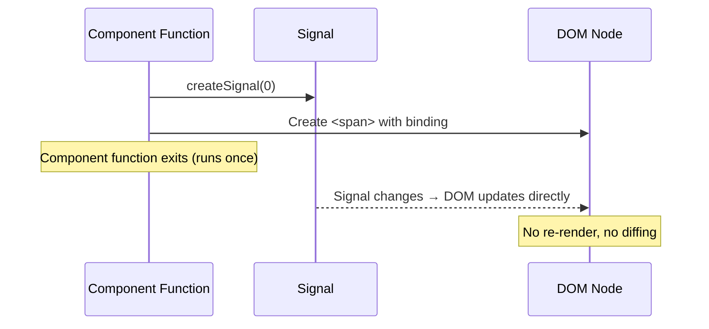

## Why Should I Care?

If you've ever dragged a window across a screen and felt the 30ms lag between your pointer and the title bar catching up, you know that UI framework overhead matters. [SolidJS](https://www.solidjs.com/) is the reason this desktop feels instant — every pixel of a dragged window updates through a direct DOM mutation, not a [virtual DOM diff](https://svelte.dev/blog/virtual-dom-is-pure-overhead) of the entire component tree. Understanding how SolidJS works unlocks the "why" behind every performance decision in this codebase.

## The Mental Model: Components Run Once

The biggest conceptual leap coming from React is this: **SolidJS components are [setup functions](https://www.solidjs.com/tutorial/introduction_basics), not render functions**. A component executes exactly once. What it returns is a real DOM tree with reactive bindings wired in. When state changes, only those specific bindings re-execute — the component function never runs again.



This means every `const` and `let` in a component body is evaluated once, at mount time. If you write `const x = props.name.toUpperCase()` at the top level, that `x` will never change — you've captured a value at creation time, not declared a reactive computation. To track changes, you must access reactive values inside a reactive context: a JSX expression, a `createEffect`, or a `createMemo`.

## Key Primitives

### Signals — The Atom of Reactivity

A signal is a getter/setter pair that notifies subscribers when its value changes. The getter is a function call — `count()`, not `count` — because SolidJS uses this function invocation as the subscription mechanism. When you call `count()` inside a tracking scope (like JSX or an effect), SolidJS records the dependency automatically.

```typescript
const [count, setCount] = createSignal(0);
// count() reads the value AND subscribes the current tracking scope
// setCount(1) writes and notifies all subscribers
```

### Effects — Side Effects That Auto-Track

`createEffect` runs a function and automatically re-runs it whenever any signal read inside changes. This is the [Observer Pattern](/learn/concepts/observer-pattern) with automatic dependency tracking — you never manually subscribe or unsubscribe.

```typescript
createEffect(() => {
  console.log('Count is:', count()); // Re-runs when count changes
});
```

There's a crucial distinction: `createEffect` runs after the DOM has been committed (like React's `useEffect`), while `onMount` runs once when the component first mounts. In `TerminalApp.tsx`, we use `onMount` for one-time initialization of xterm.js, not `createEffect`, because we need setup, not reactivity:

```typescript
// src/components/desktop/apps/TerminalApp.tsx
onMount(async () => {
  const [{ Terminal }, { FitAddon }] = await Promise.all([
    import('@xterm/xterm'),
    import('@xterm/addon-fit'),
  ]);
  // ... one-time initialization, not reactive
});
```

### Stores — Nested Reactive State via Proxies

For complex nested state, SolidJS provides [`createStore`](https://docs.solidjs.com/concepts/stores), which wraps objects in [JavaScript Proxies](/learn/concepts/javascript-proxies) for fine-grained nested tracking. Reading `state.windows[id].x` tracks only that specific property path — changing `state.windows[otherId].y` doesn't trigger an update.

```typescript
// src/components/desktop/store/desktop-store.ts
const [state, setState] = createStore<DesktopState>({
  windows: {},
  windowOrder: [],
  nextZIndex: 10,
  startMenuOpen: false,
  selectedDesktopIcon: null,
  isMobile: mediaQuery?.matches ?? false,
});
```

Nested mutations use `produce()`, which provides an Immer-like mutable API on top of the store's immutable update model:

```typescript
setState(produce((s) => {
  const win = s.windows[id];
  if (win) {
    win.x = newX;
    win.y = newY;
  }
}));
```

This looks like mutation, but `produce()` intercepts the assignments through Proxy traps and converts them into fine-grained notifications. Only subscribers of `windows[id].x` and `windows[id].y` re-execute — nothing else in the entire component tree.

## Control Flow Components

Because components run once, you can't use JavaScript `if` / `for` to conditionally render — those would evaluate at creation time and never update. SolidJS provides reactive control flow components:

| Component | Purpose | Why not just JS? |
|---|---|---|
| `<Show when={...}>` | Conditional rendering | `if/else` at top level runs once |
| `<For each={...}>` | Keyed list rendering | `array.map()` at top level runs once |
| `<Switch>` / `<Match>` | Multi-branch conditionals | `switch` statement runs once |
| `<Index>` | Index-keyed list (fixed items, changing values) | Different update granularity than `<For>` |

`<For>` is keyed by reference — it moves DOM nodes when items reorder, rather than re-creating them. `<Index>` is keyed by index — it updates values in place. For the desktop's window list where windows are identified by unique IDs, `<For>` is the right choice.

## How It's Used: The Single Island

The entire desktop is one SolidJS component tree, hydrated as a single Astro island:

```astro
<!-- src/pages/index.astro -->
<Desktop client:load />
```

`Desktop.tsx` creates the provider that distributes the store via SolidJS context:

```typescript
// src/components/desktop/Desktop.tsx
export default function Desktop(): JSX.Element {
  return (
    <DesktopProvider>
      <DesktopInner />
    </DesktopProvider>
  );
}
```

Every child component — `WindowManager`, `Taskbar`, `DesktopIconGrid`, `Window` — calls `useDesktop()` to access the shared `[state, actions]` tuple. This is React's context pattern, but without the "context change re-renders every consumer" problem, because SolidJS tracks which exact properties each consumer reads.

## Lazy Loading with `lazy()` and `<Suspense>`

Heavy components use SolidJS's `lazy()` for code splitting. In `app-manifest.ts`, the terminal, snake game, knowledge base, and architecture explorer are all lazily imported:

```typescript
// src/components/desktop/apps/app-manifest.ts
const TerminalApp = lazy(() =>
  import('./TerminalApp').then((m) => ({ default: m.TerminalApp }))
);
const SnakeGame = lazy(() =>
  import('./games/Snake').then((m) => ({ default: m.SnakeGame }))
);
```

The `WindowManager` wraps each app body in `<Suspense>` so the window shell renders immediately while the lazy component loads. This keeps the desktop responsive — you see the window frame with a loading indicator, not a blank screen.

## Why SolidJS Over React?

| Dimension | SolidJS | React |
|---|---|---|
| Update mechanism | Direct DOM mutations via signals | Virtual DOM diff + reconciliation |
| Component execution | Once (setup function) | Every render cycle |
| Bundle size | ~7KB gzipped | ~40KB gzipped (React + ReactDOM) |
| Window drag performance | O(1) — only the dragged window's transform updates | O(n) — reconciler walks the tree |
| Astro integration | `@astrojs/solid-js` — first-class | `@astrojs/react` — also first-class |

For this project, the critical factor is **drag performance**. During a window drag, `updateWindowPosition` fires on every pointer move event. With SolidJS, each call mutates the store and only the specific `<div>` with a `transform: translate()` binding updates. With React, each `setState` triggers a re-render of the component and potentially its children, relying on `React.memo` and careful optimization to avoid unnecessary work.

## Gotchas

**Destructuring kills reactivity.** If you write `const { x, y } = props`, you've captured the values at that instant. The reactive connection is severed. Always access `props.x` and `props.y` inside JSX or effects to maintain tracking.

**Early return breaks tracking.** If you read a signal after an early `return`, that dependency won't be tracked. SolidJS can only track signals that are actually called during execution.

**Async in effects needs care.** After an `await`, you're outside the synchronous tracking scope. Any signal reads after the `await` won't be tracked as dependencies. This is why `onMount` (not `createEffect`) is used for async initialization in `TerminalApp.tsx`.
