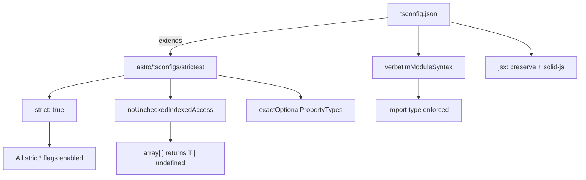

## Why Should I Care?

Every file in this project is [TypeScript](https://www.typescriptlang.org/docs/) — `.ts` for scripts, `.tsx` for SolidJS components, `.astro` for pages and layouts. But TypeScript isn't used in a single way. The same codebase has **two completely different TypeScript execution paths**: Astro's Vite-based compilation for the web app, and Node.js native [type stripping](https://nodejs.org/en/learn/typescript/run-natively) for build scripts. Understanding how each path works — and where TypeScript's guarantees end — is essential for avoiding subtle bugs that the compiler can't catch. [Total TypeScript](https://www.totaltypescript.com/) and the [TypeScript repository](https://github.com/microsoft/TypeScript) are valuable learning resources.

## The Strictest Config

The project's `tsconfig.json` extends [`astro/tsconfigs/strictest`](https://docs.astro.build/en/guides/typescript/#strict), which enables every strict flag TypeScript offers:

```json
{
  "extends": ["./tsconfig.base.json", "astro/tsconfigs/strictest"],
  "compilerOptions": {
    "exactOptionalPropertyTypes": true,
    "noUncheckedIndexedAccess": true,
    "forceConsistentCasingInFileNames": true,
    "verbatimModuleSyntax": true,
    "isolatedModules": true,
    "jsx": "preserve",
    "jsxImportSource": "solid-js"
  }
}
```

The `strictest` preset includes `strict: true` (which enables `strictNullChecks`, `noImplicitAny`, `strictFunctionTypes`, and more), plus additional flags like `noUncheckedIndexedAccess` — meaning every `array[index]` or `record[key]` access returns `T | undefined`, forcing explicit null checks. This is TypeScript's [strict mode](https://www.typescriptlang.org/tsconfig/#strict) taken to its maximum.

The project rule is clear: **if the compiler complains, fix the code — do not loosen the config.** This strictness catches real bugs. For example, `noUncheckedIndexedAccess` prevents a common pattern where `windows[id].x` silently accesses a property on `undefined` when the window ID doesn't exist.



## Two Execution Paths

### Path 1: Astro + Vite (Web Application)

When you run `pnpm build` or `pnpm dev`, [Astro delegates to Vite](https://docs.astro.build/en/guides/typescript/), which uses esbuild to strip types from `.ts` and `.tsx` files as part of its transform pipeline. Vite doesn't type-check — it just removes type syntax at high speed. Type checking is a separate step via `astro check` (which runs `tsc` under the hood).

This path handles all of `src/` — components, pages, layouts, stores, and the content config. SolidJS JSX is compiled by `vite-plugin-solid`, which transforms reactive JSX expressions into direct DOM creation calls. The `jsxImportSource: "solid-js"` in tsconfig tells the compiler to use SolidJS's JSX types instead of React's.

### Path 2: Node.js Type Stripping (Build Scripts)

Scripts in `scripts/` run directly with Node.js using the [`--experimental-strip-types`](https://nodejs.org/en/learn/typescript/run-natively) flag:

```bash
node --experimental-strip-types scripts/audit-knowledge.ts
```

This is a fundamentally different execution path. Node.js doesn't use Vite or esbuild — since Node.js 22, it has [built-in type stripping](https://nodejs.org/en/blog/release/v22.6.0) that removes TypeScript syntax before the V8 engine executes the code. No compilation step, no intermediate `.js` files, no `outDir`.

The key limitation: type stripping is **syntactic removal only**. It removes `: string`, `interface Foo {}`, and `as Type` — anything that's purely type syntax. It cannot handle TypeScript constructs that generate runtime code:

| Construct | Works with strip? | Why |
|---|---|---|
| Type annotations (`: string`) | ✅ | Pure syntax, removed cleanly |
| Interfaces / type aliases | ✅ | Pure syntax |
| `as const` assertions | ✅ | Removed, value unchanged |
| `enum` | ❌ | Generates runtime JavaScript object |
| `namespace` | ❌ | Generates runtime IIFE |
| `const enum` | ❌ | Requires compilation to inline values |
| Parameter properties | ❌ | Requires constructor code generation |

The project avoids all unsupported constructs. Instead of `enum Category { Architecture, Concept }`, it uses a [Zod enum](https://zod.dev/?id=zod-enums): `z.enum(['architecture', 'concept', ...])` — which is a runtime value that also provides type inference.

## Zod: Where Compile-Time Meets Runtime

TypeScript types disappear at runtime — they can't validate data that arrives from outside your code (Markdown files, API requests, environment variables). [Zod](https://zod.dev/) fills this gap by defining schemas that validate at runtime and infer TypeScript types at compile time.

The project's `src/content.config.ts` defines Zod schemas for every content collection. Here's a simplified view of the knowledge article schema:

```typescript
const knowledgeSchema = z.object({
  title: z.string(),
  category: z.enum(['architecture', 'concept', 'technology', 'feature', 'cs-fundamentals', 'lab']),
  technologies: z.array(z.string()).optional(),
  exercises: z.array(exerciseSchema).min(2),
  // ... 20+ fields
});
```

When Astro processes content collections at build time, each Markdown file's frontmatter is validated against this schema. A missing required field or invalid enum value produces a clear error message at build time — not a mysterious runtime crash.

The type inference flows in one direction: `z.infer<typeof knowledgeSchema>` extracts a TypeScript type from the Zod schema, ensuring the compile-time type and runtime validation are always synchronized. You never define the type separately — the schema is the single source of truth.

## TypeScript in Component Code

SolidJS components use TypeScript for props typing, store shape definition, and discriminated unions. The desktop store in `desktop-store.ts` is a good example of TypeScript enabling safe state management:

```typescript
interface DesktopState {
  windows: Record<string, WindowState>;
  windowOrder: string[];
  nextZIndex: number;
  startMenuOpen: boolean;
  selectedDesktopIcon: string | null;
  isMobile: boolean;
}
```

With `noUncheckedIndexedAccess`, accessing `state.windows[id]` returns `WindowState | undefined`, forcing every call site to handle the "window not found" case. This prevents an entire category of bugs where code assumes a window exists.

The app registry uses TypeScript's discriminated unions pattern through Zod-validated manifest types, ensuring that every registered app has the required fields and that the type system catches missing properties at compile time.

## Scripts and the Audit Pipeline

The audit scripts in `scripts/knowledge-audit/` demonstrate TypeScript's value in a non-UI context. The audit pipeline defines typed interfaces for its input, rules, and output:

```typescript
// scripts/knowledge-audit/types.ts
interface KnowledgeAuditInput {
  articles: KnowledgeArticle[];
  modules: CurriculumModule[];
  architectureNodeIds: string[];
}

type AuditSeverity = 'error' | 'warning';

interface KnowledgeAuditIssue {
  severity: AuditSeverity;
  code: AuditRuleCode;
  articleId: string;
  message: string;
}
```

Each audit rule is a pure function: `(input: KnowledgeAuditInput) => KnowledgeAuditIssue[]`. TypeScript ensures every rule returns properly structured issues, and the `AuditRuleCode` union type ensures no rule uses an unregistered code. Adding a new rule requires adding its code to the union — the compiler then flags every switch/match that doesn't handle it.

## Gotchas

**`import.meta.env` is build-time only.** Vite inlines ALL `import.meta.env` values during build — not just `PUBLIC_*` prefixed ones. In Docker/CI where secrets aren't present at build time, they become empty strings. Server-side code must use `process.env` for runtime secrets. This is a [Vite behavior](https://vite.dev/guide/env-and-mode), not a TypeScript issue, but TypeScript doesn't warn about it because both access patterns type-check.

**Type stripping doesn't type-check.** Neither Vite's esbuild transform nor Node.js type stripping actually run the type checker. They just remove type syntax. Type checking only happens when you explicitly run `astro check` or `tsc`. The `pnpm verify` command runs `astro check` as part of its pipeline, but if you skip verification, type errors won't be caught.

**`exactOptionalPropertyTypes` changes fixture design.** With this flag on, `foo?: string` does **not** mean “`foo` may be the string `undefined`.” It means the property may be omitted entirely. This shows up most often in tests and parsed data: if an optional field is missing, omit it from the object instead of writing `foo: undefined`. The payoff is real signal at API and content boundaries, where “missing” and “present but undefined” should not silently collapse into the same thing.
