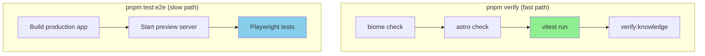

## Why Should I Care?

Every audit rule, every graph extraction function, every pure utility in this project needs tests that run in milliseconds, not seconds. [Vitest](https://vitest.dev/) (see the [Vitest repository](https://github.com/vitest-dev/vitest)) provides this by sharing Vite's transform pipeline — the same tool that builds the web app also runs the tests, with no [configuration](https://vitest.dev/config/) duplication. If you've used Jest, Vitest's API is nearly identical, but the speed difference is dramatic: Vitest's [HMR-based watch mode](https://vitest.dev/guide/why) re-runs only affected tests when a file changes, typically under 100ms.

## How Vitest Fits the Testing Strategy

This project has a **two-tier testing strategy**, and understanding which tier handles what prevents you from writing tests in the wrong place:

| Tier | Tool | What it tests | Speed | Command |
|---|---|---|---|---|
| Unit/Logic | **Vitest** | Pure functions, audit rules, graph extraction, utilities | Fast (ms) | `pnpm test` |
| Integration/UI | **Playwright** | Browser rendering, interactions, hydration, responsive layout | Slow (s) | `pnpm test:e2e` |

Vitest tests answer: "Does this function produce the correct output for a given input?" Playwright tests answer: "Does the user see and experience the right thing in a browser?" following the [Testing Library guiding principles](https://testing-library.com/docs/guiding-principles). The line is clear: if your test needs a DOM, a browser, or visual verification, use Playwright. If it tests logic that takes data in and produces data out, use Vitest.



## Configuration: Zero-Config with Overrides

The project uses Vitest without a dedicated config file. The defaults work because Vitest automatically discovers `.test.ts` files and uses the project's `tsconfig.json` for TypeScript support. The only configuration is in `package.json`:

```json
{
  "test": "vitest run --passWithNoTests --exclude 'tests/e2e/**'"
}
```

Two flags:
- `--passWithNoTests` — exits 0 if no test files are found (prevents CI failure when a branch temporarily has no tests)
- `--exclude 'tests/e2e/**'` — keeps Playwright tests out of Vitest's discovery, since they use a different test API and need a browser

Vitest [shares Vite's config](https://vitest.dev/guide/why) automatically, so it resolves TypeScript imports, handles path aliases, and transforms files the same way the dev server does — no separate `jest.config.js` with duplicate transform settings.

## Anatomy of a Test File

The primary test file in this project is `scripts/knowledge-audit/rules.test.ts`, which tests every audit rule. Here's the pattern:

```typescript
import { describe, expect, it } from 'vitest';
import { auditMinimumWordCount } from './rules.ts';
import type { KnowledgeAuditInput } from './types.ts';

describe('minimum-word-count', () => {
  it('should warn when architecture article is below 1500 words', () => {
    const input: KnowledgeAuditInput = {
      articles: [{
        id: 'architecture/test',
        category: 'architecture',
        body: 'Short body with few words.',
        // ... other required fields
      }],
      modules: [],
      architectureNodeIds: [],
    };
    
    const issues = auditMinimumWordCount(input);
    expect(issues).toHaveLength(1);
    expect(issues[0]?.code).toBe('minimum-word-count');
  });
});
```

The pattern follows [arrange-act-assert](https://vitest.dev/guide/): construct input, call the function, verify output. Test data uses minimal fixtures — only the fields the rule actually inspects, with sensible defaults for the rest.

### Test Helpers

The test file defines helpers that generate valid article objects with overridable fields. This avoids repeating boilerplate across tests:

```typescript
function makeInput(overrides: Partial<KnowledgeArticle>): KnowledgeAuditInput {
  return {
    articles: [{
      id: 'test/article',
      category: 'architecture',
      body: generateValidBody(), // enough words + citations
      ...overrides,
    }],
    modules: [],
    architectureNodeIds: [],
  };
}
```

This pattern keeps tests focused on what varies. If you're testing `auditInlineCitationDensity`, you only override `body` — everything else uses valid defaults.

## What Gets Tested

The audit pipeline is the primary Vitest testing surface in this project:

**Per-rule tests** — Each of the 13 audit rules has at least one test for the failure case and one for the passing case. Tests verify the exact issue code, severity, and message content.

**Boundary tests** — Rules with numeric thresholds are tested at the boundary. For example, `minimum-word-count` is tested with word counts just below and at the minimum for each category.

**Integration test** — The `auditKnowledgeRules` function that orchestrates all rules is tested to ensure it aggregates issues correctly and that no rule throws on edge cases (empty articles, missing optional fields).

The `pnpm verify` command runs Vitest as part of its pipeline, so every PR gets unit test coverage verified alongside linting, type checking, and the knowledge audit.

## Running Tests

```bash
# Run all unit tests once
pnpm test

# Run tests in watch mode (re-runs on file changes)
npx vitest

# Run a specific test file
npx vitest scripts/knowledge-audit/rules.test.ts

# Run tests matching a pattern
npx vitest -t "minimum-word-count"
```

[Watch mode](https://vitest.dev/guide/cli) is Vitest's killer feature for development. It uses Vite's module graph to determine which tests are affected by a file change and re-runs only those tests. Changing `rules.ts` re-runs `rules.test.ts` in under 100ms — fast enough to feel instant.

## Gotchas

**Vitest uses ESM by default.** Unlike Jest (which traditionally uses CommonJS), Vitest runs in [ES module mode](https://vitest.dev/guide/why). This means `import`/`export` syntax, no `require()`, and `__dirname`/`__filename` aren't available (use `import.meta.url` + `fileURLToPath` instead). The project's scripts already use ESM, so this isn't a practical issue, but it matters if you copy patterns from Jest tutorials.

**No browser APIs in Vitest.** Vitest runs in Node.js, not a browser. There's no `document`, no `window`, no `localStorage`. If your test needs browser APIs, either mock them (fragile) or use Playwright (correct). The audit rules are pure functions that operate on data structures, so they don't need browser APIs.

**`--passWithNoTests` is intentional.** Some branches may temporarily have no test files (e.g., content-only changes). Without this flag, Vitest would exit with a non-zero code, failing CI. The flag ensures that "no tests" is a valid state, not an error.
