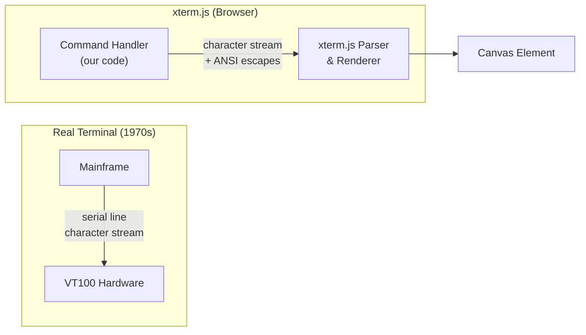

## Why Should I Care?

A terminal emulator in a browser sounds like a novelty, but the engineering inside xterm.js is serious: it implements the same VT100/VT220 escape code parser that real terminals like GNOME Terminal and iTerm2 use, renders to a `<canvas>` element using GPU-accelerated techniques borrowed from game engines, and handles the surprising complexity of keyboard input across operating systems and IME methods. Understanding how xterm.js works teaches you about the terminal abstraction itself — a concept that predates the web by decades and still powers every developer's workflow.

## Terminal Emulation Concepts

A physical terminal was a screen + keyboard connected to a mainframe via serial line. The mainframe sent character streams with embedded **escape codes** — special byte sequences starting with `ESC` (0x1B) — that controlled cursor position, text color, screen clearing, and more. A terminal emulator reproduces this behavior in software.



In a real terminal setup, a **PTY (pseudo-terminal)** sits between the shell process and the terminal emulator, mediating the character stream. In our project, there's no PTY and no server-side shell — instead, `TerminalApp.tsx` implements a client-side command handler that writes directly to the xterm.js instance.

## How xterm.js Renders

xterm.js doesn't use the DOM for rendering characters. Instead, it paints to a `<canvas>` element using one of two renderers:

1. **Canvas renderer** (default) — Uses the Canvas 2D API (`fillText`, `fillRect`) to draw each character cell. Text is measured once per font, then positioned on a character grid.
2. **WebGL renderer** (addon) — Uses WebGL shaders for GPU-accelerated rendering. Significantly faster for large terminals with frequent updates.

This project uses the default canvas renderer, which is sufficient for our use case — we're not streaming continuous output from a build process. The canvas approach means character rendering bypasses the DOM layout engine entirely, avoiding the performance cost of thousands of `<span>` elements that a DOM-based terminal would need.

## The Addon Architecture

xterm.js follows a plugin model where optional features ship as separate npm packages:

| Addon | Package | Purpose |
|---|---|---|
| **FitAddon** | `@xterm/addon-fit` | Auto-sizes terminal grid to container |
| **WebGL** | `@xterm/addon-webgl` | GPU-accelerated rendering |
| **Search** | `@xterm/addon-search` | Find text in terminal buffer |
| **Web Links** | `@xterm/addon-web-links` | Clickable URLs |
| **Image** | `@xterm/addon-image` | Inline image display (iTerm2 protocol) |

We use only `@xterm/addon-fit`:

```typescript
// src/components/desktop/apps/TerminalApp.tsx
const [{ Terminal }, { FitAddon }] = await Promise.all([
  import('@xterm/xterm'),
  import('@xterm/addon-fit'),
]);

const fitAddon = new FitAddon();
terminal.loadAddon(fitAddon);
terminal.open(containerRef);
fitAddon.fit();
```

The FitAddon calculates how many columns and rows fit in the container based on the font size and container dimensions, then calls `terminal.resize(cols, rows)`. A `ResizeObserver` on the container re-fits whenever the window is resized:

```typescript
resizeObserver = new ResizeObserver(() => {
  requestAnimationFrame(() => {
    fitAddon.fit();
  });
});
resizeObserver.observe(containerRef);
```

The `requestAnimationFrame` wrapper ensures the fit runs after the browser has calculated the new container dimensions, avoiding off-by-one sizing issues during rapid resize events.

## Our Custom Command Handler

The interesting architectural choice in this project is that the terminal **doesn't connect to a server shell**. There's no WebSocket, no SSH, no PTY. Instead, `TerminalApp.tsx` implements a client-side command handler using a map of command names to handler functions:

```typescript
// src/components/desktop/apps/TerminalApp.tsx
function createCommandHandlers(
  terminal, writeLine, writePrompt, actions,
): Record<string, CommandHandler> {
  return {
    help: () => writeLine(HELP_TEXT),
    about: () => writeLine(ASCII_BANNER),
    clear: () => { terminal.clear(); writePrompt(); },
    cv: (args) => handleCvCommand(args, writeLine),
    open: (args) => handleOpenCommand(args, writeLine, actions),
  };
}
```

This is the [command pattern](/learn/concepts/inversion-of-control) — each command is a function in a lookup table. Adding a new command means adding one entry to this map. The handler receives the arguments string and a `writeLine` function for output.

The `open` command demonstrates how the terminal integrates with the desktop: it looks up the app in `APP_REGISTRY` and calls `actions.openWindow(app.id)`, reaching directly into the SolidJS store to open a window:

```typescript
function handleOpenCommand(target, writeLine, actions): void {
  const app = APP_REGISTRY[target];
  if (app) {
    actions.openWindow(app.id);
    writeLine(`Opening ${app.title}...`);
  } else {
    const available = Object.keys(APP_REGISTRY).join(', ');
    writeLine(`Unknown app: "${target}"`);
    writeLine(`Available: ${available}`);
  }
}
```

The `cv` command reads from the same JSON data blob (`loadCvData()`) that the CV viewer uses, strips HTML tags to produce plain text, and writes it to the terminal line by line. This reuse of build-time content means the terminal always shows the same CV data as the browser view.

## Keyboard Capture

When a terminal is focused, keyboard events need to go to xterm.js, not the desktop's keyboard handler. The app registry entry declares this:

```typescript
// src/components/desktop/apps/app-manifest.ts
registerApp({
  id: 'terminal',
  captureKeyboard: true,
  // ...
});
```

In `Desktop.tsx`, the keyboard handler checks this flag before processing keys:

```typescript
const handleKeyDown = (e: KeyboardEvent): void => {
  const topId = actions.getTopWindowId();
  const topWindow = topId ? state.windows[topId] : undefined;
  if (topWindow) {
    const appEntry = APP_REGISTRY[topWindow.app];
    if (appEntry?.captureKeyboard) return; // Yield to xterm.js
  }
  // ... handle desktop shortcuts
};
```

xterm.js itself handles input through the `onData` callback, which provides processed character data (not raw key events). The handler in `TerminalApp.tsx` processes this data character by character:

- **Enter** (`\r`) — submit the current line to the command handler
- **Backspace** (char code 127) — delete the last character, move cursor back
- **Ctrl+C** (char code 3) — cancel current input, show `^C`, reset line
- **Arrow keys** (ANSI escape sequences like `\x1b[A`) — ignored (no history)
- **Printable characters** (char code ≥ 32) — append to current line, echo to terminal

## Why Lazy Loading Is Non-Negotiable

xterm.js and its addons weigh approximately 300KB parsed. The desktop's core — window manager, taskbar, icons — is under 35KB. Loading xterm.js eagerly would nearly 10× the critical-path JavaScript for a component most users may never open.

The lazy import in `app-manifest.ts` ensures the terminal chunk only downloads when the user opens the Terminal app:

```typescript
const TerminalApp = lazy(() =>
  import('./TerminalApp').then((m) => ({ default: m.TerminalApp }))
);
```

The window shell renders immediately with a "Loading terminal..." indicator (via `<Suspense>`), then swaps in the terminal canvas once the chunk loads. This is the [lazy loading pattern](/learn/concepts/lazy-loading-and-code-splitting) in action — trading a brief loading state for dramatically faster initial page load.

## Comparison to a Real Shell

| Aspect | Bash (real shell) | Our Terminal |
|---|---|---|
| Execution | Forks processes, pipes I/O | Calls JavaScript functions |
| Filesystem | Real filesystem access | Reads from JSON data blobs |
| History | `~/.bash_history` with arrow key navigation | No history (arrow keys ignored) |
| Pipes / redirection | `cmd1 \| cmd2 > file` | Not supported |
| Environment | `$PATH`, `$HOME`, etc. | None — commands are a fixed registry |
| Tab completion | File/command completion | Not implemented |

The terminal is closer to a **REPL** (Read-Eval-Print Loop) than a shell. It reads a line, evaluates it against a command map, prints the output, and loops. The shell-like prompt (`C:\Users\guest>`) is aesthetic — it reinforces the Windows 98 theme without implying real shell capabilities.

## Gotchas

**The CSS import must be lazy too.** `import('@xterm/xterm/css/xterm.css')` is inside `onMount`, not at the top level. Top-level CSS imports would be bundled into the main stylesheet and loaded on every page, even when the terminal is never opened.

**`ResizeObserver` needs cleanup.** The observer is disconnected in `onCleanup` to prevent memory leaks when the terminal window is closed. Without this, the observer would keep firing for a detached DOM node.

**Canvas doesn't support CSS text selection.** Users can't Ctrl+A to select terminal text the way they would in a DOM-based terminal. xterm.js implements its own selection model (click-drag to select, right-click to copy) which mirrors real terminal behavior but surprises web users who expect browser-native text selection.
